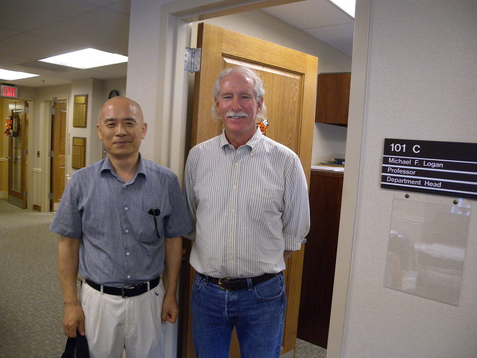

  
로간 교수 연구실 앞에서

미국통신 5[로간 교수와의 만남]

현재 OSU 역사학과 학과장으로 있는 로간[Dr. Michael F. Logan] 교수는 외견상 전형적인 카우보이 스타일의 노신사다. 그러나 직접 만나보고 나서야 황야를 주름잡던 카우보이의 활력보다는 아주 온화면서도 부드럽고 생각이 깊으며 카리스마 넘치는 서구 신사의 기풍을 느끼게 되었다. 무엇보다 맘에 든 것은 그가 구사하는 영어가 매우 느리면서도 정확하다는 것. 그래서 누구보다 대화하기 편하다.

미국으로 떠나오기 전 한국에서 만난 미국인 교수 크리스 선생이 말하기를 ‘오클라호마는 미국 중남부의 시골이므로 대부분의 사람들이 느릿한 그곳 방언을 쓸 것’이라고 나를 안심시켰다. 그러나 실제로 그렇지 않았다. 내가 만난 이곳 사람들[주로 대학에 근무하는 직원들이나 학생들]은 얼마나 빠른 속도로 말들을 뱉어내는지 그들의 말을 따라가기가 벅찬 나날이다. 그런 사람들만 만나다가 로간 교수를 만나면서 비로소 편안함을 느끼게 되었고, 상대방을 피곤하게 하거나 편안하게 하는 데 말하는 방식이 얼마나 중요한 역할을 하는지 비로소 깨닫게 되었다. 한국에서도 나는 크리스 선생에게 자주 ‘제발 말 좀 천천히 하라’고 다그치곤 했는데, 그는 그런 지적을 받을 때만 좀 천천히 하는 척 하다가 잠시 후에 보면 아스팔트길의 오토바이 달리듯 저 혼자 내빼곤 했다. 그런 성향은 요즘 한국의 젊은이들에게서 자주 목격할 수 있다. 특히 여학생들이 모여 수다 떠는 현장을 보고 듣노라면 우리말도 영어 못지않게 요란스럽다는 느낌을 받는다. 우리말이든 영어든 자꾸만 빨라지게 된 것은 아마도 매사 빠름만을 숭상하는 시대의 산물일 것이다. 어쨌든 말하는 방식으로만 따져도 로간 교수는 매력적인 인물임에 틀림없다.

작년 겨울 초청장을 보내온 것을 기점으로 로간 교수와의 접촉은 시작되었다. 내가 보내는 이메일마다 따뜻한 답장을 보내주곤 하던 그의 도타운 자세와 마음이 내 마음을 훈훈하게 했다. 특히 초청장에 담긴 호의는 특별한 면이 있었다. 자기소개서와 이력서, 연구계획서만으로 생면부지의 다른 나라 학자에게 그런 호의를 보여주기는 쉽지 않기 때문이다. 미국사 전공인 로간 교수는 특히 근대 미국의 서부, 도회(都會)지역, 환경 분야 등에 특별한 관심을 갖고 있었다. 그런 관심이 학문적으로 승화되어 <<사막 속의 도시들: 피닉스와 투싼의 환경사>>, <<줄어드는 물길: 산타크루즈강의 환경사>>, <<스프롤 현상 (도시 개발이 근접 미개발 지역으로 확산되는 현상)에 대한 투쟁과 시청: 남서부 지역 도시의 성장에 대한 저항>> 등의 주목할 만한 저서들과 <도시 비평으로서의 탐정소설: 변화하는 장르의 인지(認知)>을 비롯한 많은 논문들이 일관되게 도시개발, 환경파괴 등 현대의 문제적 현상들을 역사적 관점에서 다룬 노작들이다. 말하자면 세계 초강대국 미국의 ‘도시화와 환경보존’이란 이율배반적 어젠더를 역사적 관점에서 다루고 있다는 점에서 늘 좌우 이념적 대립를 유일한 화두로 안고 끙끙대는 우리나라 역사학자들이 귀감으로 삼아야 할 표본일 수 있다는 것이 내 생각이다.

첫 만남에서 우리는 우리 사이에 큰 공감영역 있음을 확인하게 되었다. 나는 OSU 역사학과와 영문학과 교수들을 자주 만남으로써 그들로부터 다양한 비전을 얻고자 한다는 뜻을 강하게 피력했고, 그는 내가 그동안 추구해온 문학 연구 상의 역사적 관점을 알고자 했다. 비록 짧은 기간이지만, 이곳에 체류하는 동안 이곳 패컬티 멤버들과의 많은 대화를 통해 시대와 지역, 분야를 초월하는 ‘보편지(普遍知)’의 탐구에 매진해 볼 것이다. 내가 굳이 영문과 아닌 역사학과를 선택한 것도 바로 그런 이유 때문이다. 최근 로간 교수와의 만남을 통해 바로 그런 가능성을 발견하게 된 것이다.

공유하기

게시글 관리

**백규서옥\_Blog ver.**