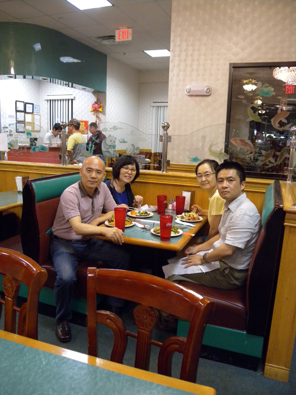

  
공항에 픽업 나온 Du 교수 내외와 함께 스틸워터(Stillwater)의 중국식당에서 저녁을 나누며

  
연구실에서-Du 교수

미국에서 만난 고마운 사람들 1

         Dr. Yongtao Du

나그네가 되어 보면 안다. 사람은 많으나 반겨 주는 사람이 귀하다는 것을. 그래서 객지살이를 경험해본 사람만이 객지살이의 어려움을 알고, 객지에 나온 사람 도울 줄을 안다. 물론 객지살이를 경험했다고 모두 어려운 이들을 돕는 것은 아니다. 무엇보다 따뜻한 마음을 지녀야 하고, 돌고 도는 게 세상의 이치임을 헤아릴 줄 아는 지혜가 있어야 하는데, 그런 마음과 지혜를 갖기란 쉽지 않기 때문이다. 마찬가지로 배고픈 경험을 한 사람만이 배고픈 설움을 안다. 그렇다고 배고팠다가 부자가 된 사람 모두가 배고픈 사람들을 돕는 것은 아니다. 어려운 사람의 처지를 자신의 것으로 바꿔 볼 줄 아는 따스함과 여유, 즉 역지사지(易地思之)의 어짊[仁]을 지닌 사람만이 이런 선행을 실천할 수 있다. 아무나 나그네를 반겨하고 도와줄 수 있는 게 아니다.

\*\*\*

초행길의 오클라호마 공항에 내렸다. 학과 비서 수잔이 보낸 이메일에 Dr. Du가 픽업 나온다고는 했으되, 1시간이 넘는 거리의 공항으로 픽업을 내 보낼 정도면 ‘그저 갓 박사학위를 받은 젊은 강사쯤이겠지’ 지레 생각하고 애당초 OSU의 사이트에 들어가 그가 누구인지 검색해볼 생각조차 하지 않았다.

서로들 약속 시간보다 30분쯤이나 공항 안에서 헤맨 뒤에 만난 그는 젊은 중국인이었다. 다행히 중국사, 동양사, 혹은 아세아 문화라는 공통의 관심사를 갖고 있기에 차를 타고 이동하는 1시간 남짓 동안 우린 많은 이야기들을 나눌 수 있었다. 그는 내가 추정한 것처럼 ‘갓 박사학위를 받은 강사’가 아니었다. 일리노이-어바나(Illinois-Urbana)에서 박사학위를 받고 이 대학에서 ‘동양문명 연구’, ‘동아시아’, ‘역사학 주제론’, ‘세계사 읽기 세미나’ 등을 강의하고 있는 ‘어엿한 부교수’였다.

물론 학과장은 내가 한국인임을 감안하여 중국인인 그에게 픽업을 부탁했을 것이다. 그 부탁을 받은 그는 귀찮은 티 한 점 안 내비치고 직접 차를 몰아 그 먼 길을 달려온 것이었다. 한동안 말을 나누다 보니 우리는 통하는 게 많았다. 사실 우리는 중국에 대하여 그리 호의를 갖고 있지 않았고, 특히 동북공정 등으로 양국의 역사학계가 첨예하게 대립하고 있지만, 미국이라는 바다에서 만난 그 순간 우리는 중국식 표현으로 이미 ‘라오 펑여우(老朋友)’였다.

스틸워터에 도착한 뒤 그는 부인까지 불러내 우리를 중국음식점으로 데려갔다. 같은 중국인인 그 부인은 또 얼마나 아름답고 참한가. 시차에 시달리고 16시간이 넘는 먼 비행길에 지쳐 입맛이 썼지만, 미국식으로 달고 짜게 변한 중국음식을 그리도 맛있게 먹으며 우리에게 권하는 두 교수 부부의 은근한 정을 반찬 삼아 맛있게 먹을 수밖에 없었다.

그 다음날부터 우리를 숙소로 찾아와 부족한 게 없는지 살펴주는 그 부부의 정성이 참으로 감동적이었다. 나 혼자 조용히 생각해 보았다. 중국 땅에서 학부를 마치고 석사와 박사 과정으로 유학 나온 그가 아닌가. 낯도 설고 말도 선 이국땅에서 얼마나 외롭고 고단했을 것인가. 어쩌면 그런 경험이 바로 우리를 바라보며 ‘역지사지’의 동정심으로 발휘된 게 아니었을까. 물론 앞에서 말한 대로 아무리 그런 경험을 갖고 있다 해도 원래 따뜻한 마음이 없다면 불가능한 일이었겠지만. 우리는 이곳 오클라호마의 한촌(寒村/閑村) 스틸워터에 와서 기대하기 어려운 ‘사람들’을 얻기 시작했다. 나그네 생활을 몇 차례 해보았지만, 이 이상 더 큰 횡재(橫財)가 어디에 있을까. 부디 나도 그들에게 ‘횡재’라고 생각되었으면 좋겠다.

공유하기

게시글 관리

**백규서옥\_Blog ver.**