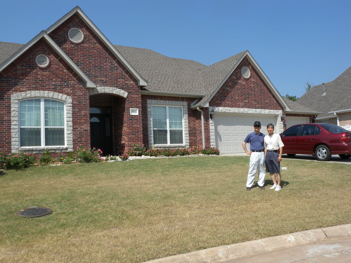
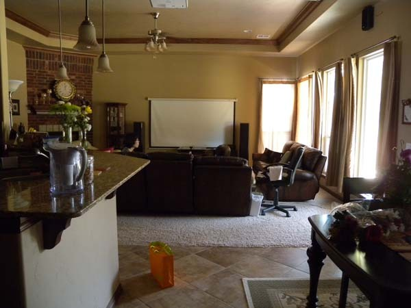
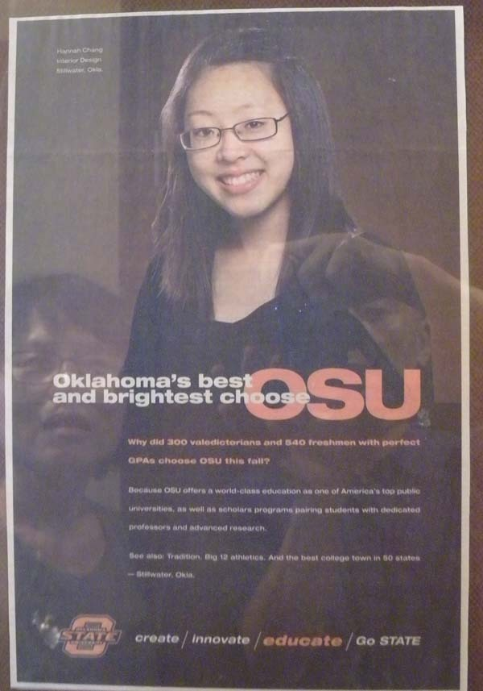
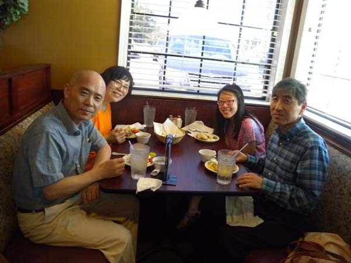

  
장영배 교수 자택 앞에서

  
장영배 교수 댁 거실

  
장영배 교수의 빛나는 따님 혜나 양

  
장영배 교수 부녀와 함께 맛있는 점심을

미국에서 만난 고마운 사람들-2

Dr. Chang, Young-Bae

미국에 도착한 지 3주가 다 되어가는 오늘. 한국에서부터 읽기 시작한 박계영(Kye-Young Park)의 책 <<The Korean American Dream>>을 다 읽었다. 마지막 장을 덮고 나자 그가 만들어 사용한 어구 하나가 ‘뿅!’ 하고 떠올라 눈앞에서 아른거린다. 바로 ‘anjŏng ideology’란 말.

그는 그 말의 동의어로 ‘Establishment, Security, Stability’ 등을 제시했는데, ‘(생활기반의) 구축, 안전, (지속적) 안정성’ 쯤으로 번역될 수 있으리라. 말하자면 미국으로 이민 온 한국인들이 추구하는 ‘안정 이데올로기’란 바로 ‘먹고 사는 방도의 모색, 각종 위해(危害)나 병으로부터 자신과 가족을 지키는 일, 외부의 충격이나 환경의 변화에도 흔들림 없는 기득권의 지속성’ 등이 아메리칸 드림의 핵심이라는 뜻일 것이다.

그러나 이게 어찌 이민들에게서 비로소 시작된 정신이랴. 까마득한 옛날 우리의 조상들은 거친 황야와 강줄기들을 넘어가며 ‘해가 뜨는 동쪽’으로 이동해 왔고, 드디어 한반도에 정착함으로써 정착민으로서의 ‘안정 이데올로기’를 추구해온 것 아닌가. 그러니 어딜 가나 한 곳에 뿌리박고 ‘편안한 삶’을 추구하는 생활 습관은 조상 때부터 시작되어 오늘날의 한국인들에게 일종의 이데올로기로 굳어졌다고 봐야 한다.

남의 땅에서 아예 뿌리박기로 작정하고 떠나 온 이민들 뿐 아니라 우리처럼 단 몇 개월 혹은 1년 동안 머물려고 이 땅에 온 사람들에게도 ‘안정 이데올로기’는 무엇보다 중요한 삶의 철학이다. 더구나 단 시간 내 ‘안정 이데올로기’를 구현해야 하는 단기 체류자들로서는 도착하자마자 시차 적응을 못 해 휘청거리면서도 ‘안정’을 추구하기 위해 백방으로 뛸 수밖에 없는 노릇이다.

\*\*\*

15년 전의 경험으로 미루어, 안정적인 주거, 이동 및 통신수단의 확보 등은 미국 생활에서 가장 긴요하면서도 쉽지 않은 일이었다. 그나마 한국인들이 많아서 한 다리 건너면 아는 사람들이 있는 LA와 달리 드넓은 평원 스틸워터에서 도움을 줄 한국인을 만나기란 쉽지 않았다.

시차로 비몽사몽 하루 이틀 지내면서 우리는 점점 한계에 가까워지기 시작했다. 한국에서 가져 온 비상식량도 밑바닥을 보이기 시작했고, 무엇보다 40도에 육박하는 햇살 아래 걸어 다니면서 무언가를 해결하기가 불가능했다. 그래서 예전에 OSU의 학부생으로부터 한두 번 받은 이메일을 뒤지다가 몇몇 한인 교수의 이름을 발견했고, ‘밑져봐야 본전’이라는 심정으로 그 가운데 한 분인 ‘장영배 교수[OSU 기계공학과])’를 찍어 전화를 드렸다.

간단히 내 소개를 하고나자 그 분이 대뜸 ‘내가 연락을 해야 하는데, 먼저 연락 주셔서 고맙다’고 말씀하시는 게 아닌가. 재미한인들의 상위 1%안에서도 최상위에 위치하는 성공적인 직종이 전문직, 그 가운데서도 성공적인 직종이 미국 대학의 한인 교수들이다. 미국에 온 한국인들로부터 연락 받기를 꺼려하는 사람들이 대개 미국 대학의 한인 교수들이라는 어떤 선배의 귀띔을 기억하고 있던 터라, 내 스스로 그 분들에게 연락하기를 꺼려하고 있었다. 그래서 좀 어안이 벙벙했던 것이 사실이다. 그러나 그 통화를 시작으로 장 교수님은 기꺼이 나서서 우리의 정착을 돕기 시작했다. 장 교수님은 사모님과 함께 우리를 멋진 호숫가의 레스토랑으로 초대하여 점심을 대접해 주셨을 뿐 아니라 수시로 차를 몰고 와서 우리의 시장보기를 도와주셨고, 소개해 주신 한국인 학생의 도움으로 전화를 개통했으며, 결국 몸소 우리를 차에 태우고 에드몬드 시에 가서 자동차를 사게 하심으로써 정착의 대미를 장식하게 되었다.

그 분의 도움으로 자동차를 사는 과정에서 우리는 참 많을 것을 배우게 되었다. 나 같으면 대충 후보차종을 고른 다음 ‘이 차 사는 게 어때요?’라고 권할 법 한데, 그 분은 그러지 않으셨다. 우선 우리로 하여금 사이트를 통해 후보 차종을 몇 개 고르고 조건들을 모두 확인하도록 하신 다음, 다시 각종 사이트들을 알려 주시면서 여러 가지 지표들을 통해 그것들을 세밀히 비교하게 하셨다. 그런 다음 각 차종의 문제점들이 보고되어 있는 다른 사이트를 통해 해당 차종들을 또 한 번 스크린하게 하셨다.

그 과정에서 ‘섣불리 결정하지 마세요’라는 충고를 빈번히 건네시는 것이었다. 차를 사게 하신 것은 물론 보험사까지 꼼꼼하게 챙겨주신 장 교수님. 그 과정에서 성미 급한 나로서는 약간 답답하기도 했지만, 참으로 귀한 가르침이었음을 나중에서야 깨닫게 되었다. 그 가르침이 단순히 차 사는 일에만 국한되는 것이 아니고 인생사 자체의 소중한 지표가 될 수도 있음을 알게 된 것이다. 실력 있고 열정적인 교수로서의 학교생활, 다정다감한 가장으로서의 가정생활, 실천적 목자이자 신도로서의 신앙생활을 성공적으로 해 나가시는 장 교수님 덕에 생면부지의 땅 스틸워터에서 이제 막 시작된 가을과 함께 행복한 나날을 보내게 되었다.

\*\*\*

남을 돕는다는 것. 특히 해외에서 조건 없이 동포를 돕는 일은 아무나 할 수 없다. 평소 닦아 온 신앙의 힘과 ‘사랑의 정신’이 아니라면, 어찌 그런 일이 가능하겠는가.

공유하기

게시글 관리

**백규서옥\_Blog ver.**