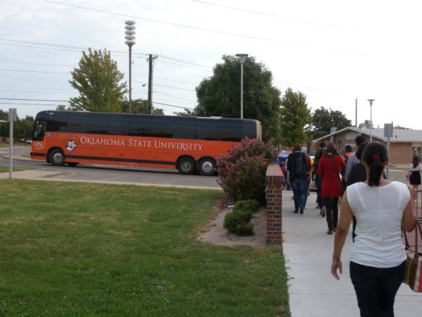  
오클라호마 장터축제에 가기 위해 버스에 오르며

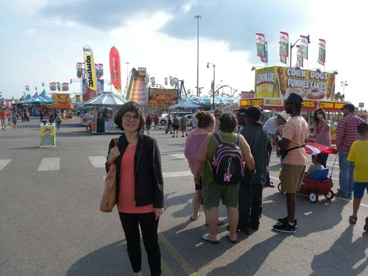  
축제장 입구에서

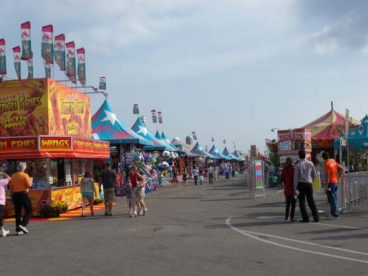  
축제장의 모습

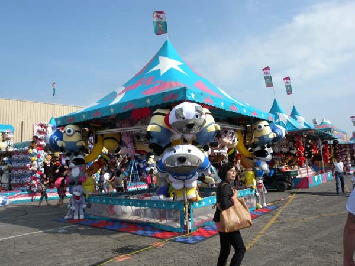  
장난감 부스 옆을 지나며

  
장난감 부스들의 모습

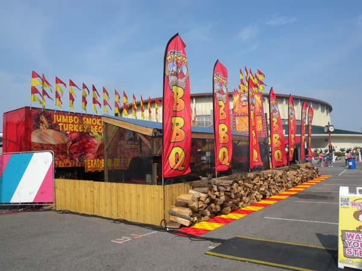  
축제장 입구에서 만난 바비큐장

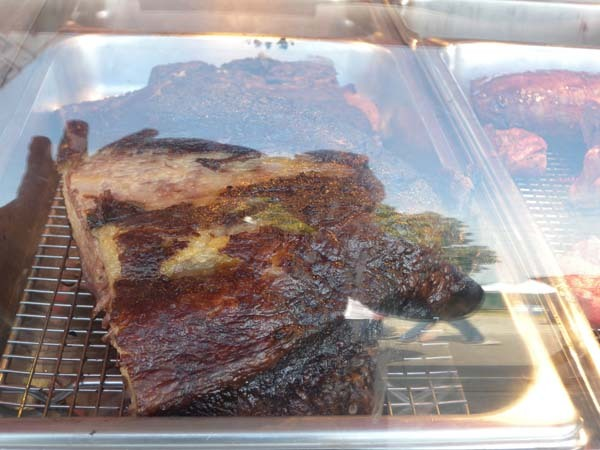  
익어가는 바비큐

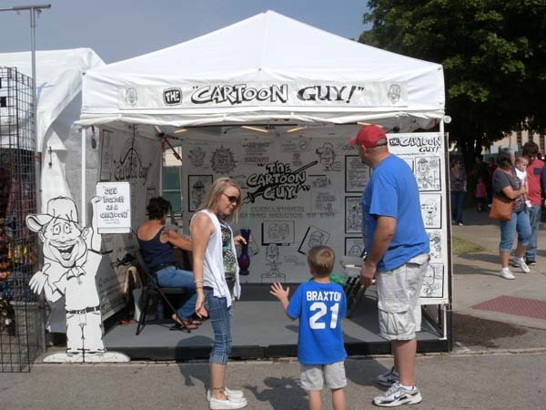  
만화가와 가족들

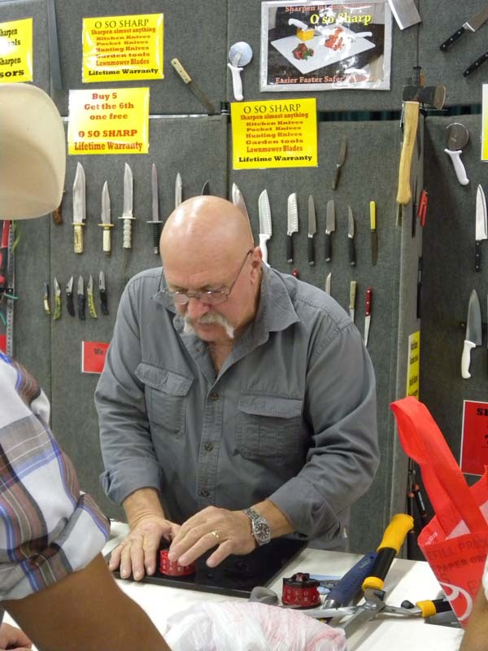  
칼 가는 장인의 포스

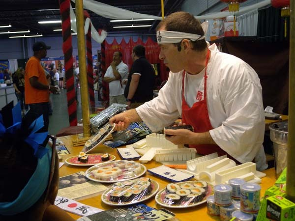  
스시 장인의 맵짠 눈길

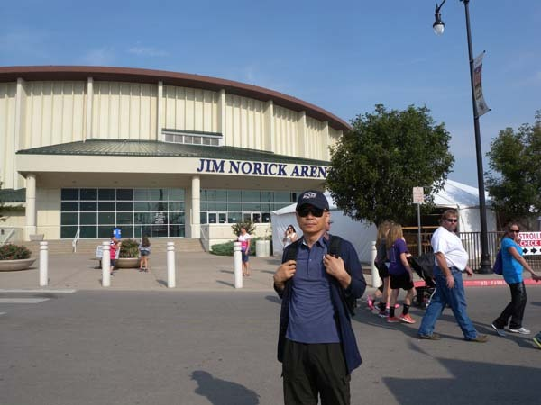  
짐 노릭 경기장 앞에서

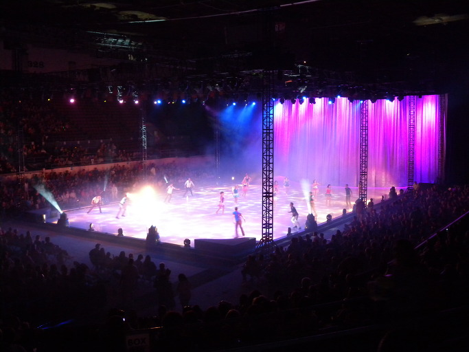  
 노릭 경기장 안에서(Disney on Ice의 한 장면)

  
축제장 안에 설치된 모터쇼의 현대차

문화답사1

오클라호마 스테이트 페어(Oklahoma State Fair)

해외의 어디를 가든 우리의 1차적인 관심 대상은 박물관이나 교회 혹은 성당이었다. 그런 공간에 과거와 현재, 그리고 미래를 이어주는 역사가 고스란히 남아 있기 때문이다. 9월 12일. 우리가 이곳에 도착한 뒤 최근까지 분주히 지내다가 정신을 차리고 보니 벌써 9월도 반 가까이나 흘러 버렸다.

아뿔싸. 이렇게 시간이 빨리 흐른다면 텍사스나 아칸소, 미주리, 캔자스 등 오클라호마 주변 지역들은 고사하고 오클라호마의 문화답사조차 물 건너가는 것 아닌가. 그 때 마침 우리 숙소를 관리하는 OSU의 FRC[Family Resources Center]로부터 입주민들에게 인근의 오클라호마 시에서 열리는 ‘오클라호마 스테이트 페어[Oklahoma State Fair]’를 구경시켜 주겠다는 연락이 왔다. ‘오클라호마 스테이트 페어’란 쉽게 말하여 주(州) 차원의 ‘장터축제’였다.

우리는 ‘박물관, 교회, 혹은 성당’이라는 ‘문화답사 1순위의 원칙’을 깨고 무조건 버스에 올랐다. 지금 살아 움직이는 ‘삶의 문화’를 느끼려면 박물관보다도 그곳이 썩 나은 현장이었다. 토요일 아침 8시 30분에 출발한 버스는 1시간 남짓 달려 축제장에 도착했다. 드넓은 평원의 울긋불긋한 포장들. 어째 낯이 익다 했더니, 바로 우리나라의 무슨 무슨 축제장들, 바로 그 모양새 아닌가.

실제 들어가 살펴보니 각종 먹거리, 아이들 장난감, 놀이기구, 의상, 생활용품, 세계 자동차 쇼 등 종류나 품목들이 다양하고, 한 구석에 아이스링크를 갖춘 큰 경기장[Jim Norick Arena]도 자리 잡고 있었다. 축제장 중앙에 큰 규모의 모터쇼[현대기아자동차의 빛나는 신차들도 큰 자리를 잡고 구경꾼들의 주목을 받고 있었다!]나 아레나에서 열리는 디즈니 아이스 발레단의 공연만 빼고는 여느 우리나라 지역 축제들과 유사한 포맷이었다.

우리나라 축제장에서는 각설이 타령, 뽕짝 등 사람들의 귀가 찢어져라 틀어대는 음악 소리에 혼이 반쯤 날아가는 것이 예사인데, 이곳은 그저 조용하기만 하다는 것이 분명한 차이였다. 김연아의 빙상예술로 한껏 높아진 우리의 눈을 만족시키지는 못했어도 장장 2시간에 걸친 아이스 발레단의 연기 정도가 이 축제를 여느 장터축제들과 구별시키는 효과를 발휘했다고 할 수 있을까.

주민들의 관심을 끌고 그들을 참여시킴으로써 공동체의 결속을 높이는 행사가 축제라면, 오클라호마 주 장터 축제는 비교적 성공적인 듯 했다. 특히 인종의 전시장이라 할 이 나라에서 ‘하나의 미국’이란 기치 아래 수많은 인종들 간의 장벽을 헐고 하나로 묶는 데 장터 축제만큼 효과적인 이벤트는 없는 것으로 보였다. 너른 들판을 꽉 메운 자동차와 인파에 이 사람들이 모두 어디서 모여들었는지 호기심이 생길 만큼 성황이었고, 먹고 입고 타는 모든 것들을 한 곳에 오롯이 모아놓음으로써 주민들에게 현실적인 정보를 제공하는, 말 그대로 ‘장터’였다.

앞에서 말한 것처럼 무엇보다 이채로운 것은 시끄러운 음악소리가 전혀 없이 조용했다는 점, 그 많은 인파와 규모의 축제에 술이 전혀 보이지 않았다는 점은 참으로 부럽고도 희한한 일이었다. 축제라 하면 늘 노래 소리 울려 퍼지고, 이따금 술 취해 싸우거나 야바위판 돌아가는 데 익숙해 있는 백규거사의 눈에 오클라호마 주 페어의 차분한 분위기는 미래 축제의 한 모델로 보였다. 오클라호마가 프로테스탄트 복음주의의 성향이 강한 바이블 벨트(Bible Belt)의 한 축이기 때문일까? 이 점은 이곳에 거주하는 동안 직접 관찰하고 분석해볼 내용이다.

‘축제는 축제답게 떠들썩해야 한다’는 사람도 없지 않겠지만, 이제 목청을 좀 낮추고도 축제의 본령을 구현할 만한 단계가 되지 않았을까. 오클라호마 주 장터축제를 보며 우리 축제의 미래를 생각해 본 하루였다.

공유하기

게시글 관리

**백규서옥\_Blog ver.**