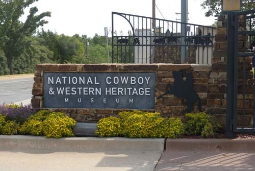  
카우보이 박물관 입구

  
카우보이 박물관 마당

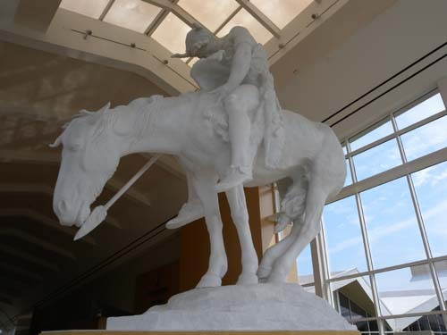  
카우보이 박물관 로비에 있는, James E. Fraser(1876~1953)의 조각작품 <The End of Trail>

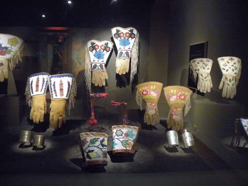  
인디언들의 생활 자수공예

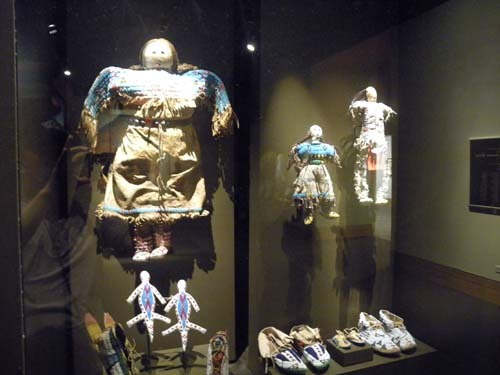  
인디언 아이들이 갖고 놀던 인형들(아이들의 의상을 엿볼 수 있음)

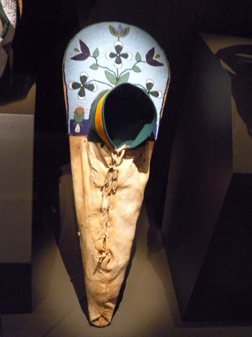  
인디언 아기들을 담아갖고 다니던 휴대용 도구

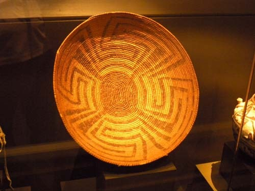  
인디언의 생활공예(식물 줄기로 짠 바구니)

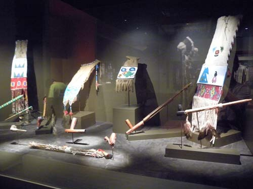  
인디언들의 생활공예  
      
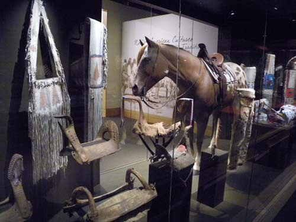  
카우보이들의 마구들

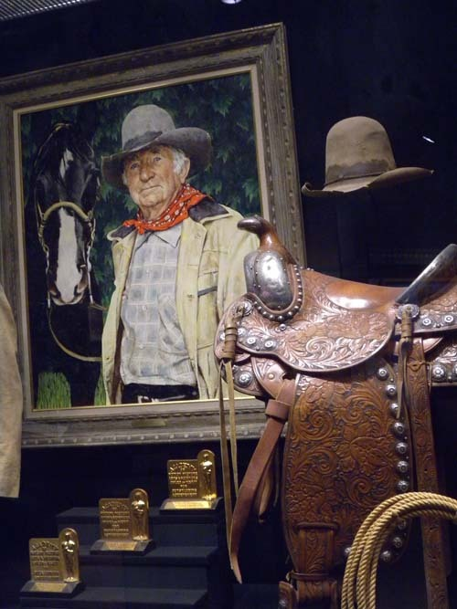  
서부영화에 카우보이로 출연한 배우

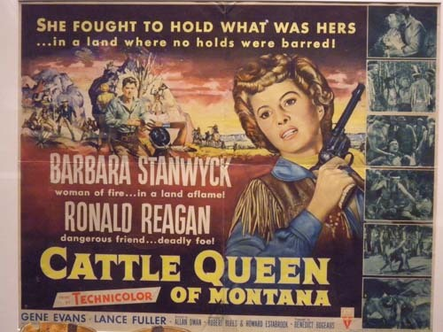  
레이건과 스탠윅이 출연한 서부영화 '몬태나의 캐틀 퀸' 포스터

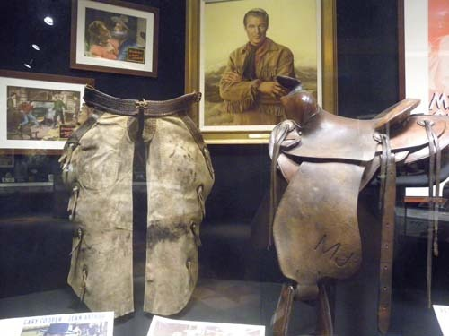  
서부영화에 출연했던 배우와 카우보이 소품들

  
서부영화에 단골로 출연했던 죤 웨인

  
카우보이 모자들

  
카우보이 의상들

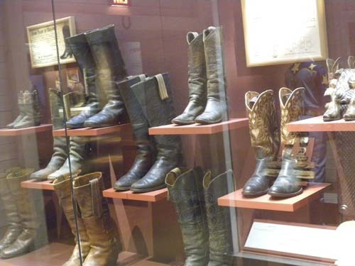  
카우보이 부츠들

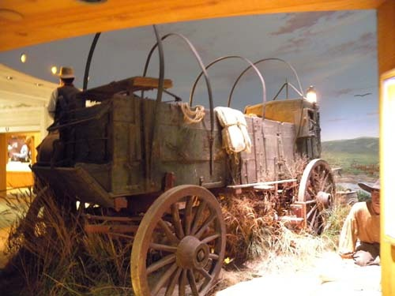  
서부시대의 마차

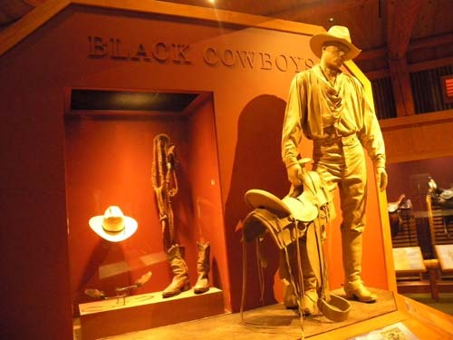  
블랙 카우보이

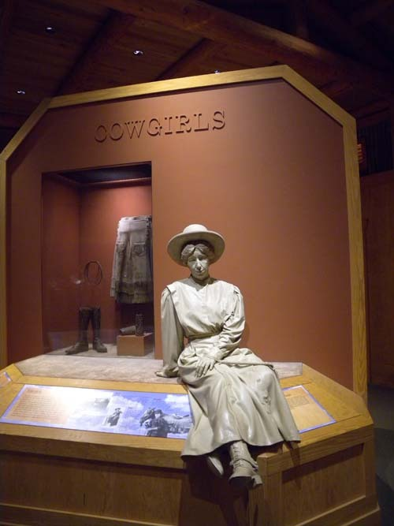  
서부시대 카우걸의 모습

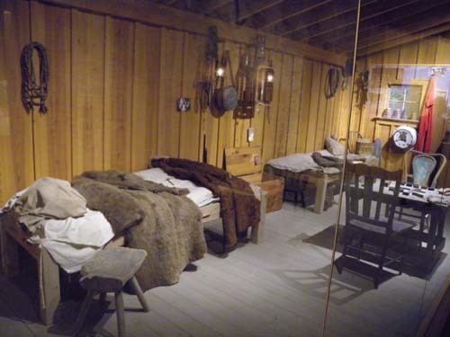  
서부시대 카우보이들의 침실

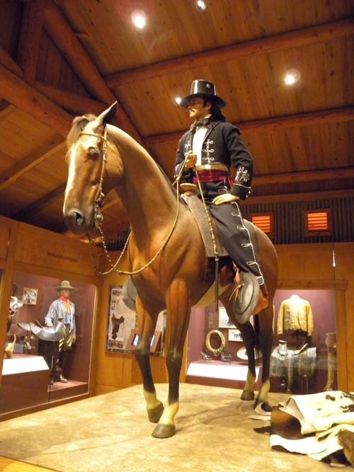  
성장(盛裝)한 카우보이

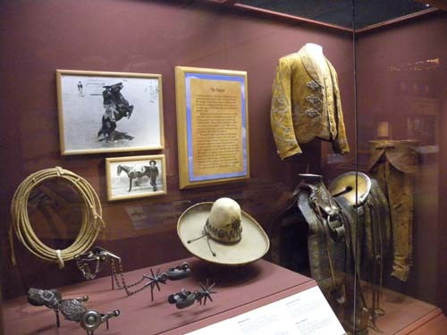  
카우보이의 의상들

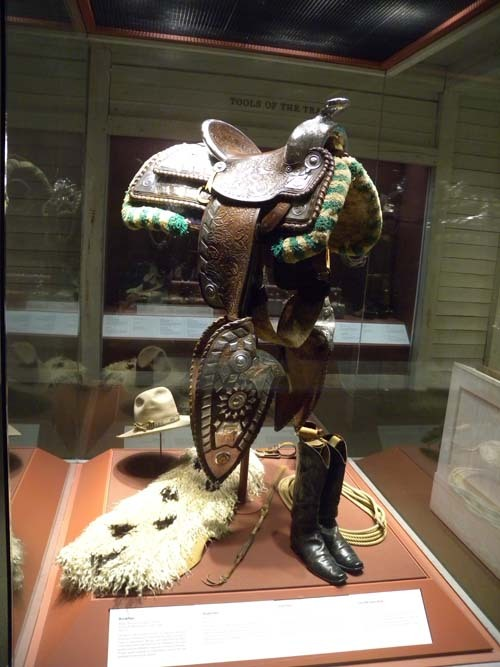  
카우보이의 마구 및 의상

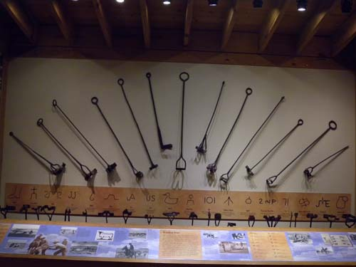  
카우보이의 재산인 소나 말의 등에 찍던 낙인  
  
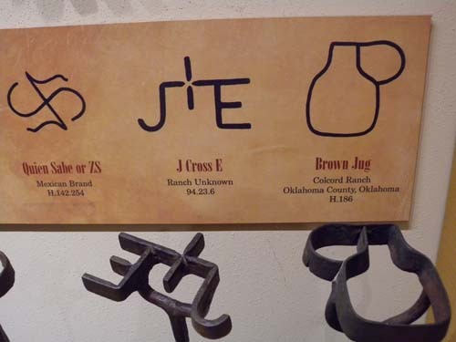  
낙인의 도구와 글자의 뜻

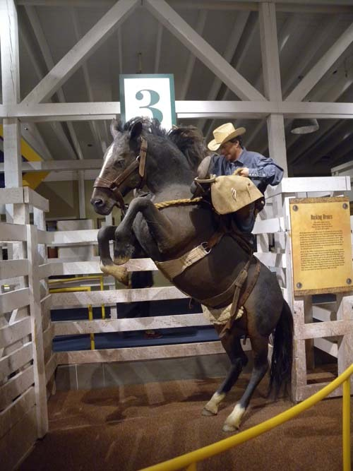  
로데오 경기 모습   
              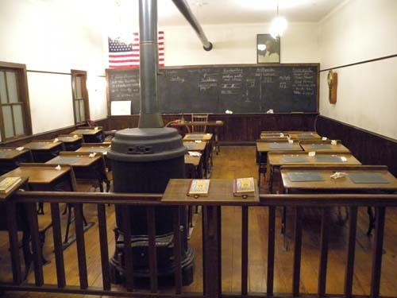   
서부 개척시대 초등학교 교실  
               
    Hollis Randal Williford의 Bronz <The Snake Priest, 1980>

                 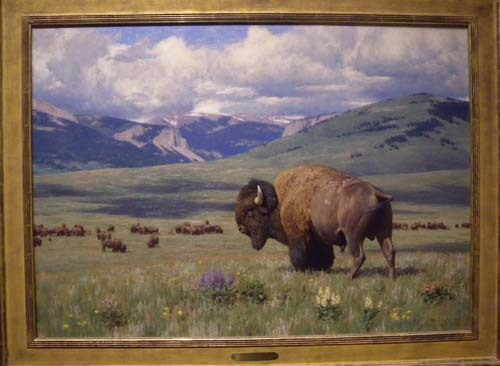  
Tucker Smith의 유화 <The Return of  Summer, 1990>

      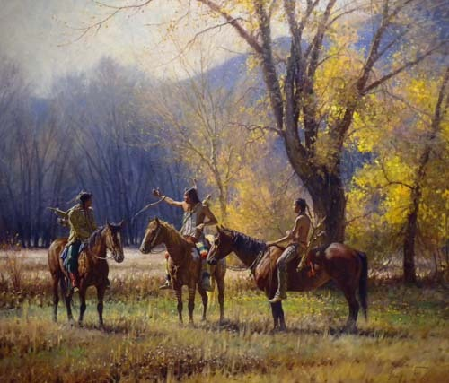  
Martin Grelle의 유화 <Teller of Tales, 2002>

     

           서부 개척시대 미국의 소리

-The National Cowboy & Western Heritage Museum을 보고-

몇 년 전 이스라엘을 여행하면서, 성서에 ‘광야’로 등장하는 사막지대의 한 곳에서 키부츠들을 만났고, 그것들을 통해 그 나라의 저력을 느낀 적이 있다. ‘이스라엘의 미래는 광야에 있다!’는 모토로 몸소 그곳에 들어가 사막을 옥토로 일구다가 생을 마친 초대 총리 벤구리온은 한 사람의 훌륭한 지도자가 한 나라의 흥망을 결정짓는 요인임을 보여주는 생생한 사례였다.

15년 전 캘리포니아를 비롯한 미국 서부의 유서 깊은 도시들과 사람의 손때 묻지 않은 자연을 둘러보면서 미국의 미래가 함축된 역사의 힘을 느낀 적이 있다. 휘황찬란한 동부보다 거칠지만 힘찬 투쟁과 개척의 역사를 안고 있는 서부가 훨씬 발전적인 그들의 미래를 추동하는 기반이었다. 그러나 그 힘과 역사적 의미를 마음으로만 느낄 뿐, 손으로 만져 확인할 수 없는 것이 아쉬웠다.

\*\*\*

지금 우리는 미국의 중남부에 해당하는 오클라호마 주에 와 있다. 지금의 시점에서 보면 중남부이지만, 대서양을 건너온 유럽의 백인들이 ‘서부로! 서부로!’를 외치며 말을 타고 서쪽으로 몰려가던 당시에는 넓게 보아 이 지역 또한 서부의 일부 혹은 서부로 넘어가기 위한 징검다리쯤으로 보였으리라.

미국이 세계 최고 부자의 지위에 오르는 계기가 된 골드러쉬(Gold Rush). 각지의 인디언들과 치열한 싸움을 벌이며 금을 찾아 서부로 몰려가던 장관(壯觀)을, 데쓰밸리(Death Valley) 등에 남아 있는 당시 금광의 유허(遺墟)들을 보며 실감할 수 있었다. 그 서부의 힘을 느낄 수 있는 역사적 시공(時空)이 바로 ‘The National Cowboy & Western Heritage Museum[국립 카우보이 및 서부지역 유산 박물관: 이하 카우보이 박물관으로 약칭]’이었다.

오클라호마를 남북으로 가로지르는 35번 하이웨이와 63번 시내 도로가 교차하는 지점. 기가 막히도록 절묘한 위치의 박물관이었다. 일요일 아침 일찍 스틸워터를 출발,오클라호마 시티의 반즈앤노블 서점에 들러 주변 지역의 지도와 인디언 관련 참고서적들을 산 다음, 아름다운 숲을 끼고 달리는 63번 도로를 따라가자 산뜻한 외관의 카우보이 박물관이 나타났다.

\*\*\*

이스라엘에 벤 구리온이란 영웅이 있어 집단농장 키부츠를 통해 광야를 생명의 공간으로 탈바꿈시켰듯, 광활한 서부를 품고 있는 미국엔 무수한 개척자들, 원주민들과 투쟁하며 서부를 활개치고 다니던 카우보이들, 그리고 그들을 알아 준 선각자 레이놀즈(Chester A. Reynolds)가 있어 미국 정신의 ‘모델하우스’인 카우보이 박물관이 태어날 수 있었다. 따라서 카우보이 박물관은 드넓은 황야 오클라호마의 한복판에 찍은 화룡점정(畵龍點睛) 마침표인 셈이다.

카우보이, 보드빌(vaudeville) 연기자, 익살꾼(humorist), 사회평론가이자 영화배우였던 윌 로저스(Will Rogers)의 기념관[오클라호마 클레어모어(Claremore)시 소재]을 보고 자극을 받은 레이놀즈는 ‘카우보이 명예의 전당’을 세우고자 했다. “나는 항상 자신을 카우보이, 카우보이 작가, 카우보이 익살꾼, 카우보이 배우 등으로 자처한 한 인물을 위해 세운 기념관을 보았는데, 그 ‘윌 로저스 기념관’의 내・외장이 나를 깊이 감동시켰다. 그 때 하나의 생각이 번개처럼 내 마음에 떠올랐다. 서부를 건설하는 데 큰 공헌을 한 다른 많은 카우보이들, 소몰이꾼들, 목축업자들은 어떤가? 왜 이 사람들을 기념하기 위한 명예의 전당은 만들지 않는가?”라는 그의 주장은 얼마나 신선한가? 특정인을 기념하는 일도 중요하지만, 오늘의 서부를 만든 주역은 황야의 먼지와 함께 사라진 수많은 무명의 카우보이들과 개척자들이었음을 그는 간파하고 있었던 것이다.

박물관의 건립을 위한 장정(長征)은 여기서 시작되었다. 일이 성사되기까지 많은 우여곡절들을 겪었지만, 연방정부와 의회 및 각 주정부들까지 적극 나서는 등 거국적인 협조 아래 100만 달러 이상의 거금을 모았고, 각 지역의 경합을 거쳐 현 위치에 멋진 건축물을 세움으로써 1965년 6월, 드디어 개관을 보게 된 것이다. 물론 이 거사의 장본인 레이놀즈는 개관을 보지 못한 채 1958년에 사망했지만, 그의 호소로 결국 힘을 합치게 된 미국은 개척시대의 꿈과 시련을 역사의 그릇에 오롯이 담아 세상 사람들에게 보여 줄 수 있었던 것이다.

\*\*\*

대단한 컬렉션이었다. 카우보이와 목축, 인디언의 삶에 관한 모든 것들은 물론 수많은 서부영화들의 명장면이나 배우들이 생생하게 우리의 눈앞에 서 있었다. 금방이라도 총을 빼고 달려들 듯한 클린트 이스트우드도 죤 웨인도 모두 이곳에선 훌륭한 컬렉션의 한 소품일 뿐이었다. 각종 마구들, 무수한 총기들, 마차들, 인디언의 의상들과 생활용품들, 인디언 화가의 그림들, 재현해 놓은 그 시절의 거리 등 모두 그간 이 땅에서 전개되어 온 역사를 구체적으로 보여주는 증거물들이었다.

지금도 살아 숨 쉬는 그 증거물들을 통해 개척자들과 인디언들이 벌이던 싸움의 현장도, 카우보이들의 힘든 삶도, 로데오 경기의 실감도 모두 미국 정신을 이루어 낸 역사의 바탕임을 알 수 있었다. 물론 지금 미국의 주류는 개척 시대에 원주민들을 대량으로 학살했고, 지금까지 강제이주나 보호구역 지정 등 원주민 정책에 대한 비판도 많았지만, 어쨌든 카우보이 박물관 안에서만큼은 그 모든 것들이 미국정신으로 용해・수렴되고 있음을 분명히 확인할 수 있었다. 갈등과 반목을 하나로 버무려 나갈 수 있게 하는 미국의 에너지가 이곳 ‘국립 카우보이 및 서부지역 유산 박물관’에서 바야흐로 ‘맛있게’ 양성(釀成)되어가고 있었다.

공유하기

게시글 관리

**백규서옥\_Blog ver.**