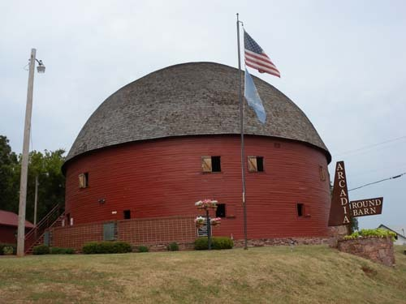
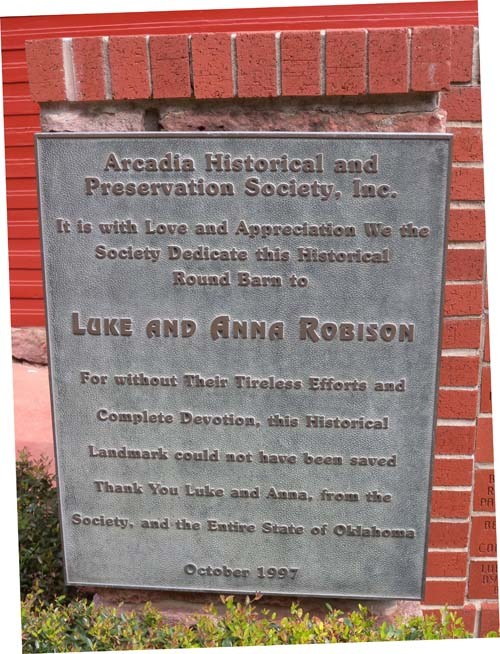
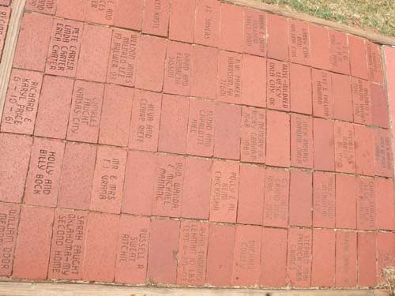
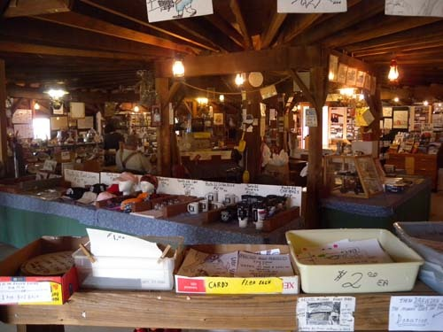
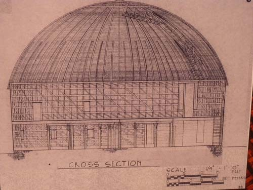
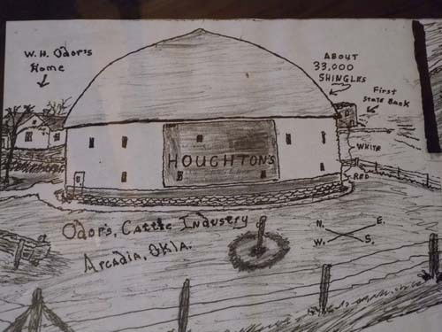
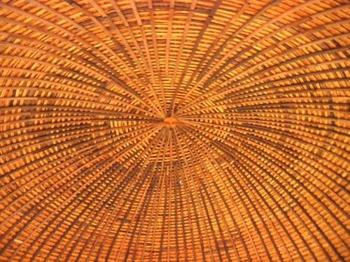
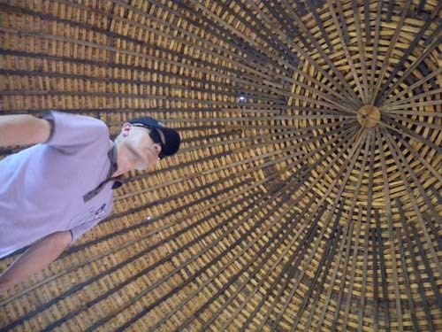

  
가까이에서 잡은 Arcadia Round Barn

  
라운드 반 복원자 로비슨 부부에 대한 감사의 뜻을 담은 헌정 표지판

  
라운드 반 입구의 길에 깔아놓은 기념벽돌들

  
라운드 반 1층의 내부

  
1층에서 목격한 스케치(설계도?)

  
1층에서 발견한 스케치(설계도?)

  
2층에서 올려단 본 천정(모두 목재로 이루어졌음)

  
2층에서 올려다 본 천정

  
좀 멀리서 잡은 라운드 반

길가의 경이로운 옛 건축물

Arcadia Round Barn

2013년 9월 15일 일요일 오후. 카우보이 박물관을 둘러보고 돌아오는 길에 들른 Arcadia Round Barn[아카디아의 둥근 곳집]. 카우보이 박물관을 지도에서 확인하던 차에 그로부터 가까운 곳에 이런 이름의 유적이 있음을 우리는 이미 알게 되었다. 35번 하이웨이에서 66번으로 갈아타고 Arcadia 마을로 들어서자 과연 저 멀리에 둥근 돔이 보이는 것 아닌가. 참으로 기이한 모양이었다. 모양으로 미루어 어쩜 천문대일지도 모른다는 생각에 액셀을 눌러 밟았다. 가까이 가본 즉 천문대는 아니었고, 안을 넓게 만든 그냥 옛날 건축물이었다. 목재만으로 흡사 오늘날의 천문대처럼 둥근 건축물을 만들었다니, 경이로운 일이었다. 안에는 세계 각지의 각종 골동품들이 진열되어 있고, 늙은 판매원 하나가 앉아 있을 뿐, 특이한 모습은 없었다. 2층에 올라가 천정을 바라본 순간 숨이 턱 막혔다. 도대체 어쩌자고 딱딱한 목재를 엿가락 다루듯 구부려 이런 건축물을 만들었단 말인가.

\*\*\*

이 건축물은 1898년 오도[William H. Odor]가 디자인하고 세웠는데, 그는 이 건축물을 세우기 위해 제재소를 세우고 가시 열매를 맺는 이 지역 토종의 상수리나무를 켜서 목재로 만들었다고 한다. 목재들을 켜자마자 아직 물기가 남아 있는 동안 굽어지도록 특별히 고안한 형틀에 묶어놓아 모양을 잡았다.

사람들은 모두 말렸지만, 그는 고집스럽게 자신의 아이디어를 실행에 옮겼다. 아마도 그는 토네이도가 올 때 가축을 피신시키거나 건초를 저장하는 장소로 쓰기도 하고, 마을 사람들이 회동하는 장소로도 쓰이게 될 것이라고 사람들을 설득했던 것 같다. 1903년 윌리엄과 그의 부인 미라 오도는 그들의 땅 일부를 내 놓았고, 벤자민과 사라 뉴커크도 땅을 내 놓아 보탰으며, 인근의 미주리와 캔자스 텍사스주 등을 부추겨 이곳을 지나는 철로를 부설하게 하기도 했다. 그 덕에 이 지역은 주변의 도시들에 면화, 농산물, 가축 등을 공급하는 농업의 중심지로 부상했고, 1920년대 후반에 66번 도로가 Round Barn의 바로 옆을 지나게 됨으로써 결국 이 건축물은 66번 도로 상의 가장 유명한 랜드마크가 된 것이다.

그러나 세월이 흐르면서 주인이 바뀌고, 여러 번 수정을 가하면서 애당초의 완벽한 구조는 손상을 입게 되었으며, 그 원인으로 라운드 반은 아카디아 마을과 함께 몰락하게 되었다. 그러다가 몇 십년 후인 1988년에 지름 60피트의 지붕이 무너졌고, 평가된 보수 비용만 165,000달러가 넘었다.

현직에서 은퇴한 건물 거래업자인 루터 로비슨과 ‘The Over the Hill Gang’이란 이름의 은퇴자 그룹이 돈과 시간, 기술을 도네이션하여 복원에 매달렸다. 그 뿐 아니라 많은 자원봉사자들을 모집하거나 기념 벽돌들을 판매하기도 하고, 길 옆에 자선함을 놓아두는 한편 많은 사람들로부터 설비 혹은 노동을 도네이션 받음으로써 결국 이 거대한 건축물은 복원된 것이다.

\*\*\*

짧은 역사의 미국이지만, 이런 건축물에 숨은 정신은 각별했다. 자연 재해로부터 자신들을 보호하기 위해 아이디어를 내고, 치밀하게 실행하는 모습은 오늘날의 미국을 이룬 중요한 자산일 것이다. 더구나 지금을 살고 있는 후손들이 옛 것을 아무런 생각 없이 부수지 않고 유지하려는 노력 끝에 되살린 이 건축물은 과거와 현재, 그리고 미래가 우리의 삶 속에서 부단히 이어진다는 점을 깨닫고 있다는 국민적 지혜의 증거물이었다. 길 가다가 뜻하지 않게 얻은 소득이었다.

공유하기

게시글 관리

**백규서옥\_Blog ver.**