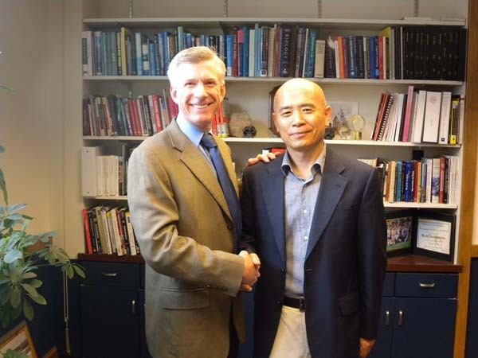

  
대닐로위츠 학장과 첫 대면을 하고

대닐로위츠 학장과의 만남

작년 12월 6일, 풀브라이트에서 연구 기간 동안 체류할 미국 내 기관의 지정을 요구해 왔다. 잠시 고심한 끝에 OSU의 역사학과로 결정했고, 그 학과가 속해있는 ‘College of Arts and Science’의 대닐로위츠[Danilowicz, Bret] 학장에게 이메일을 보냈다.

연구 수혜자로 선정한다는 풀브라이트로부터의 편지와 함께 이력서, 연구활동 경력, 연구업적, 연구계획서 등이 포함된 커리큘럼 바이티(Curriculum Vitae)를 첨부하여 학장의 협조를 부탁드린다는 것이 그 메일의 내용이었다. 메일을 보낸 뒤 만 하루 만에 대닐로위츠 학장은 답장을 보내왔다.

‘우리는 풀브라이트 연구 활동을 위해 당신이 OSU로 오시고자 하는 일을 토의했다는 것, 수혜기간 동안 당신을 모시게 되어 영광이라는 것, 당신을 공식적으로 초청하기 위해 역사과 학과장인 마이클 로간 박사가 초청장을 보내게 된다는 것, 나는 당신으로부터 받은 이메일을 로간 박사에게 포워딩했으므로 구체적인 초청장을 만들기 위해 그가 앞으로 당신과 접촉하게 된다는 것, 그의 초청장이 완성되면 당신에게 발송하기 전에 학장인 나와 대학의 교무처장으로부터 승인을 받게 된다는 것, 그리고 DS 2019를 받기 위해 국제 교육연구소(IIE)와 함께 일을 처리한다는 것’ 등을 상세하게 적은 뒤, ‘당신이 풀브라이트 연구 활동을 위해 이곳에 온 뒤 뵙게 되기를 기대한다’는 인사를 덧붙인 메일이었다. 그 뒤로 몇 번이나 이메일을 주고받았으나, 그 때마다 그의 메일 내용이나 표현은 참으로 정중하면서도 곡진했다.

이곳에서의 생활이 안정될 즈음, 그에게 이메일을 보냈다. 보내자마자 반가움을 가득 담아 답장을 보내왔고, 비서를 통해 날짜와 시간을 정한 다음, 우리는 그의 집무실에서 만났다.

수인사를 나누고 나서 그는 내 귀에 대고, ‘당신의 퍼스트 네임 Kyuick을 어떻게 발음하면 되는가’고 물어보며 호탕하게 웃는 것이었다. 아마도 이메일을 받을 때마다 고심한 듯 했다. 내가 ‘규익이라고 발음하는데, 아마 외국인들은 어려울 것’이라고 대답하곤, 나도 ‘학장님의 라스트 네임 Danilowicz는 그럼 어떻게 발음해야 하느냐’고 물었다. 나도 사실은 그 이름을 발음하기 어려웠기 때문이다. 그 역시 ‘내 이름을 발음하는 것도 보통 어려운 게 아니다’며 직접 발음을 해 주는데, ‘wi’를 동유럽식인 ‘뷔’로 발음하는 것 아닌가.

사실 이곳에 온 뒤 로간 교수에게 그 발음을 물었더니 내가 원래 추정한 대로 ‘대닐로위츠’라 알려 주길래 그렇게 알고 있었는데, 본인은 약간 다르게 발음하는 것이었다. 그 점을 지적하자 학장은 여긴 미국이니 미국식으로 발음해도 괜찮다며 또 한바탕 웃고, 나도 오랜만에 크게 입 벌려 웃고 말았다.

서로간의 이름을 두고 시작된 환담은 커피를 앞에 놓은 채 30여분이나 계속되었다. 주로 한국의 대학제도에 관한 물음, 내 연구계획에 관한 물음, 미국에서의 생활에 대한 물음 등이 핵심이었고, 내가 하기로 되어 있는 특강시간을 알려주면 꼭 참석하겠노라는 약속까지 덧붙이는 것이었다.

그의 전공은 동물학(zoology). 시라큐스 대학 학부에서 생물학을 전공[부전공은 컴퓨터 사이언스]했고, 듀크 대학에서 동물학 박사학위를 받았으며, 조지아남부대학에서 MBA를, Open University에서 교육학 석사학위 등을 받음으로써 다양한 전공으로부터 많은 조예를 갖춘 폭넓은 학자였다. 캐나다 온타리오의 윈저 대학에서 연구생활을 했고, 아일랜드의 더블린 대학교에서 패컬티 멤버로서 부학장직을 역임하기도 했으며, 가장 최근에는 조지아 남부대학교 과학대학의 부학장과 학장직을 수행하기도 한 대학 학문행정의 달인이었다. 뿐만 아니라 이미 1천만 불에 달하는 연구프로젝트로 아이슬란드에서 프랑스령 폴리네시아에 이르는 지역의 연구를 수행한 현장 연구자이기도 했다.

\*\*\*

참 편안했다. 로간 교수보다는 빨랐지만, 정확하여 듣기에 부담 없는 영어를 구사했으며, 웃음이 많고 공감영역이 넓은 신사였다. 학문이나 행정, 연구프로젝트 등 모든 면에서 특출한 경력을 갖춘 대학행정의 책임자답게 인간적인 폭과 깊이를 갖추고 있었으며, 그러면서도 치밀하여 한 치의 허술함도 찾을 수 없었다. 미국 대학들의 경쟁력은 대닐로위츠 학장 같은 인물들을 통해 형성된다는 사실을 깨달으면서 좀 더 분발해야겠다는 자성(自省)을 새삼 하게 되는 요즈음이다.

공유하기

게시글 관리

**백규서옥\_Blog ver.**