길크리스(Gilcrease) 박물관에서 길을 잃다!

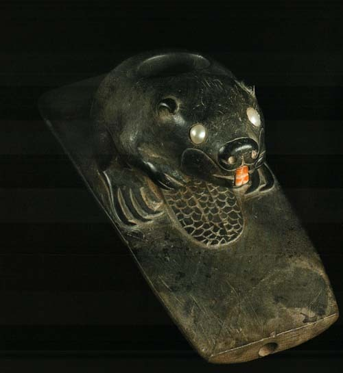  
Beaver effigy pipe, Woodland period

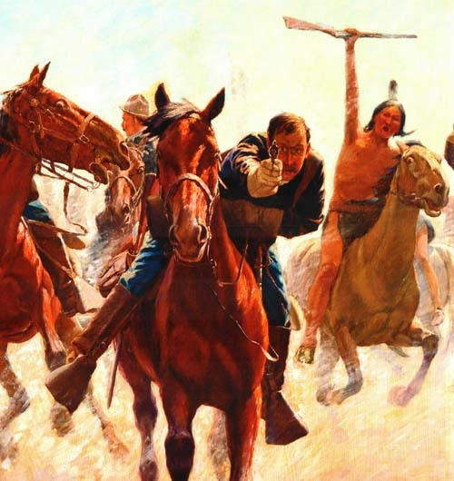  
<Breaking Through the Line> Charles Schreyvoge 작

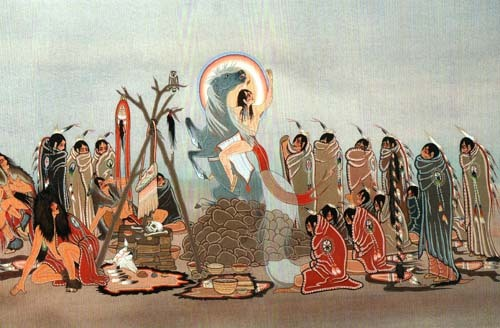  
<Ceremony, Spirit Ascending>, Woody Crumbo작

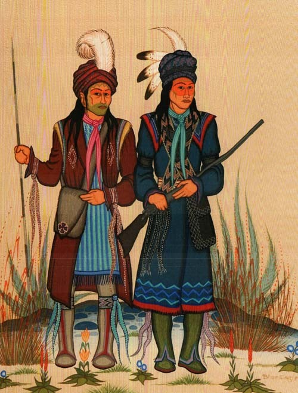  
<Creek Chiefs>, Acee Blue Eagle 작

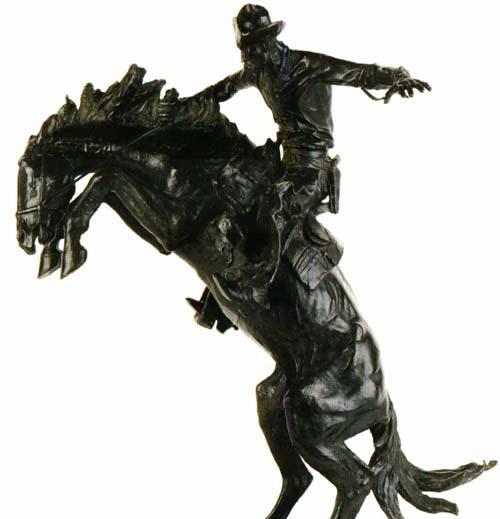  
<George Washington>, Rembrandt Peale 작

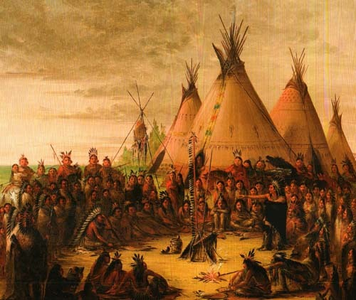  
<Indian Council(Sioux)>, 1847 George Catlin 작

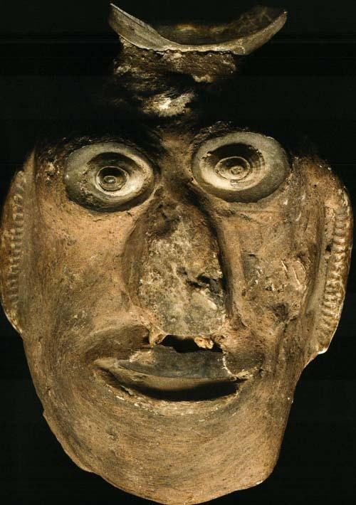  
Mask, Chumash 족

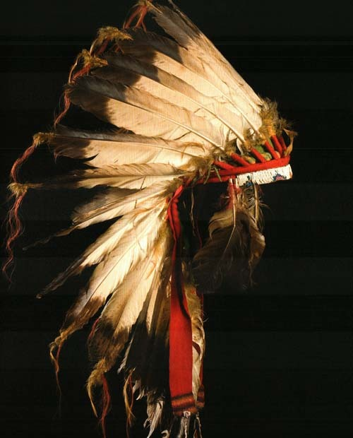  
Moccasins Cheyenne 족, 19th century

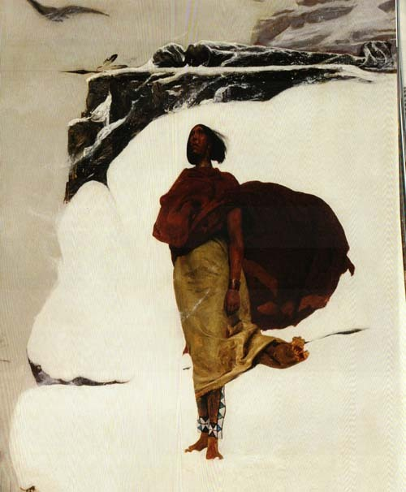  
<Mourning Her Brave>, 1883년 George De Forest 작

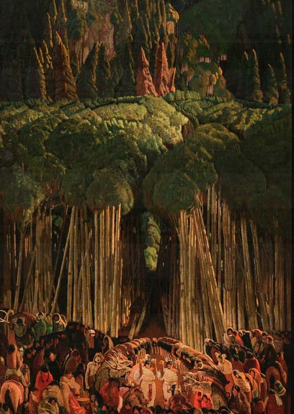  
<Overleaf-Ranchos Church with Indians>, Ernest L. Blumenschein 작

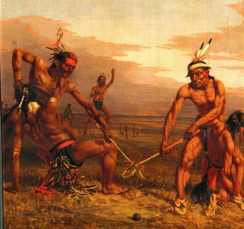  
<Siouxs족의 Playing Ball>, Charles Deas 작

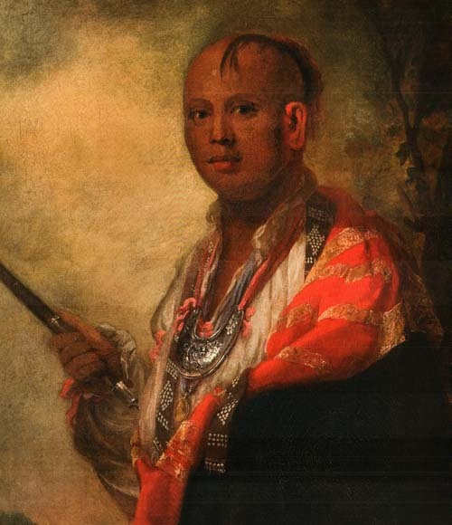  
<Syacust Ukah>, 1762년 Sir Joshua Reynolds 작

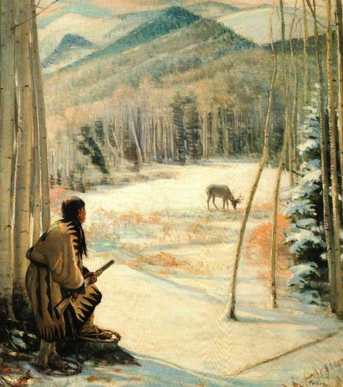  
<Taos Deer Hunter>, Bert G Phillips 작

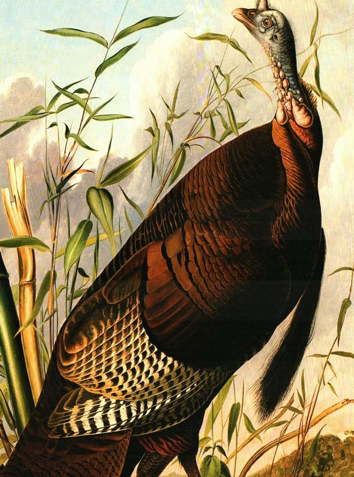  
<The Wild Turkey>, John James Audubon 작

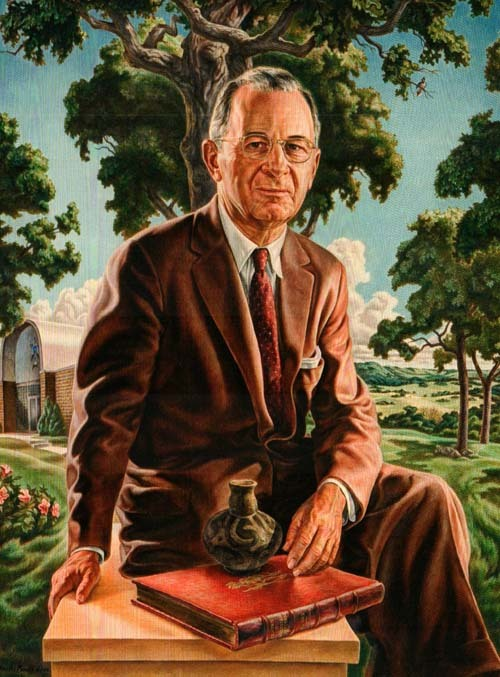  
<Thomas Gilcrease>, Charles Banks Wilson 작

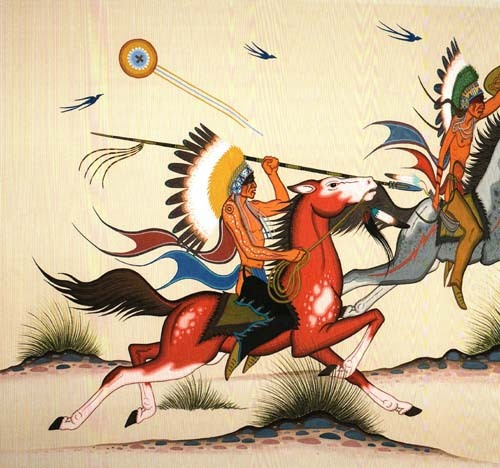  
<Warriors on Horses>, Acee Blue Eagle 작

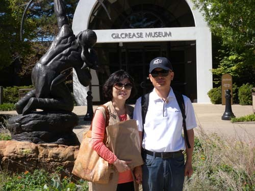  
길크리스 뮤지엄 앞에서

       예술로서의 역사, 역사로서의 예술

-털사(Tulsa)의 길크리스(Gilcrease) 박물관에서 길을 잃다!-

9월 21일 토요일. 아낌없이 쏟아 붓는 햇살이 평원을 달구기 시작할 무렵, 언제부턴가 가보고 싶었던 털사로 길을 떠났다. 대략 한 시간 반 거리라곤 하지만 자동차 몇 대 다니지 않는 드넓은 길임을 감안하면 실제 거리는 우리 생각과 많이 다르리라. 과연 맑은 공기와 화사한 햇살, 끝없이 펼쳐진 평원 위의 짙은 활엽수들이 우리를 매료시켰다. 시내에서는 조심조심하던 미국인들도 가속페달을 눌러 밟는 듯 412번 하이웨이에서는 거칠 것이 없었다.

이 지역에서도 유명한 박물관이 유독 많은 문화도시 털사. 그 가운데서도 우리의 첫 방문처는 인디언 관련 미술품이 가장 많이 소장되어 있다는 길크리스 박물관(Gilcrease Museum)이었다. 인디언 미술품에 대한 호기심 뿐 아니라 일생 모은 콜렉션으로 만든 박물관에 깃들었을 한 인물의 정신을 느껴보고 싶다는 생각이 컸다.

호수 같은 아칸사(Arkansas) 강가의 샌드스프링스(Sandsprings)를 지나고 털사 카운티 경계를 들어서서 잠시 달리다가 한적한 사거리에서 좌회전하면서 ‘길크리스 뮤지엄 로드’로 접어들었다. 그로부터 눈 깜짝하는 사이 좌측 언덕배기에 숨듯이 앉아 있는 뮤지엄을 만났다. 주소는 ‘1400 North Gilcrease Museum Road’. 털사대학에 속한 박물관이 바로 그곳이다.

널찍한 규모도 규모려니와 컬렉션의 양과 질에 놀라 자빠질 뻔 했다. 12,000점의 미술품, 300,000점의 민족지적(民族誌的)・고고학적 유물들, 100,000점의 희귀 서적과 육필 원고 등을 포함, 수를 헤아릴 수 없는 소장품들이 빽빽했다. 누가 미국을 문화의 불모국이라 했던가. 유럽의 건축이나 박물관들에서 느끼는 고색창연함은 아니로되, 이곳만의 잘 보존된 예술과 문화재야말로 쉽게 측량하기 어려운 미국의 힘과 깊이를 잘 보여주는 증거가 아닌가.

이 박물관은 미국의 예술과 역사를 압축적으로 보여준다는 점에서 미국 정신의 산실이었다. ‘미술작품으로 승화된 민족의 서사(敍事, epic)’ 바로 그것이었다. 그 정신의 구현을 가능케 한 것이 바로 이 박물관을 세운 토마스 길크리스(Thomas Gilcrease)라는 인물.

그는 1890년 루이지애나에서 농부의 큰아들로 태어났다. 프랑스 계, 스코틀랜드-아일랜드 계 등으로부터 이어진 그의 부계(父系)와 달리 어머니 엘리자벳은 무스코기(Muscogee)와 크리크(Creek) 등 원주민의 피를 25%쯤 이어받은 인물이었다. 길크리스로서는 자연히 인디언에 대한 관심이나 애착심을 타고 난 셈이었다. 게다가 그가 태어난 몇 개월 후 그의 가족은 인디언 구역의 크리크족 거주지로 이사했으니, 더욱 그럴 수밖에 없었다.

그는 물려받은 13%의 크리크족 피 덕분에 엄청난 땅을 받게 되었는데, 그 가운데는 털사 남쪽 20마일의 160에이커에 달하는 땅도 있었다. 1908년 인디언인 오세이지(Osage) 족 출신의 벨레(Belle Harlow)와 결혼해서 두 아이를 둔 그는 1912년부터 미술품을 사들이기 시작했다. 그로부터 잠시 후 지금의 길크리스 박물관의 중심이 되는 주택을 사들였고, 1922년에는 길크리스 석유회사를 세웠으며, 1941년 곳간과 차고를 예술품 수장고로 리모델링함으로써 길크리스 뮤지엄의 뿌리가 되었다고 한다.

1947년 뉴욕의 수집가 질레트(Gillette Cole) 박사로부터 엄청난 컬렉션을 통째로 사들이고 미술가이자 건축가인 알렉산더 호그(Alexander Hogue)를 고용하여 뮤지엄을 설계하여 그의 소장품들을 전시하게 했으며, 1949년에 ‘미국의 역사와 예술에 관한 토마스 길크리스 연구소’를 세우게 되었다. 그 후 여러 단계의 복잡한 과정을 거쳐 1958년 길크리스 재단은 뮤지엄의 건물과 땅을 털사시티에 기증함으로써 길크리스 뮤지엄은 본격적인 출발을 보게 된 것이다.

\*\*\*

뻐근한 다리를 끌다시피 뮤지엄을 돌아보고 나오면서 그가 1949년에 붙였다는 ‘미국의 역사와 예술에 관한 토마스 길크리스 연구소’란 이름이야말로 이 뮤지엄의 본질을 정확히 드러냈음을 알게 되었다. 우리가 주마간산(走馬看山) 격으로 일별한 많은 작품들은 대부분 실제 삶을 그려낸 극사실주의 미학의 소산들이었기다. 지난주에 들른 오클라호마시티의 ‘카우보이 박물관’에서는 인디언들과 카우보이들의 발밑에서 튀어나온 삶의 파편들을 감상했으나, 지금 이곳 털사의 길크리스 뮤지엄에서는 예술가들의 해석을 거친 삶의 모습들을 확인하게 되었다.

아, 해는 짧고 힘은 달리는데 촘촘하게도 짜여 있는 이 역사와 예술의 숲을 어찌 헤쳐 나갈까? 무정한 길크리스 뮤지엄은 이국의 나그네들에게 한없이 너그럽기도 하고, 한없이 무정하기도 하구나!

공유하기

게시글 관리

**백규서옥\_Blog ver.**