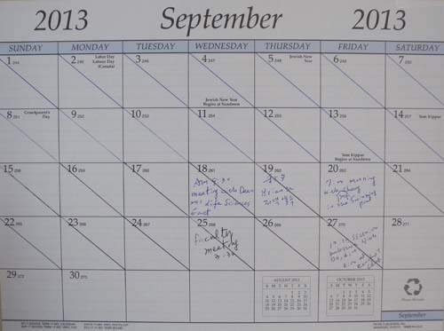
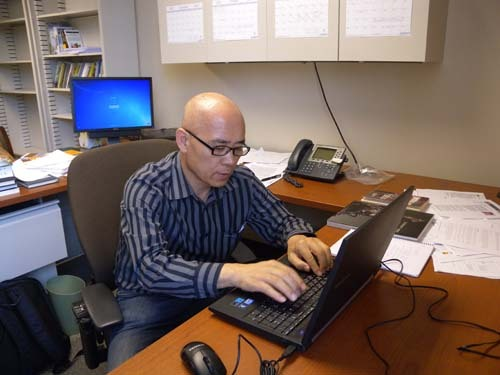
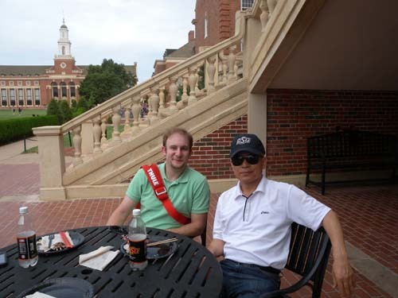
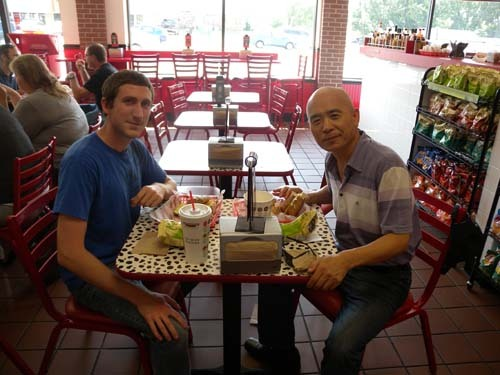
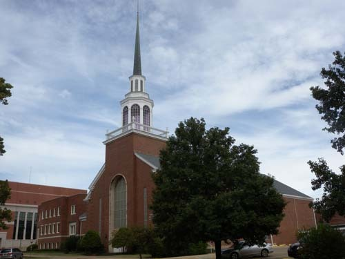
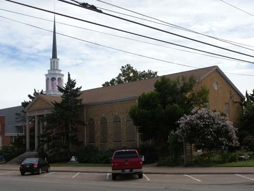
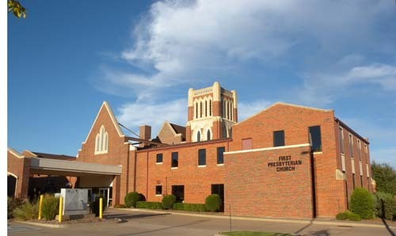

근황 1

미국식 혹은 오클라호마 식 인간관계

김형!

오랜만이오. 이곳에 온지 벌써 정확하게 한 달이 지났소. 외국에 나가면 조심해야 할 것들이 적지 않다는 사실을, 외국 생활을 두루 경험해 온 형은 잘 아시리라 믿소. 특히 외국에 정착하기까지 참 여러 가지로 신경 쓸 일들이 많은 건 우리처럼 단기간의 체류자들 역시 예외는 아닐 것이오. 우리가 잠시 엉덩이를 붙인 오클라호마의 스틸워터(Stillwater)는 미국의 다른 지역들과 비교해도 참으로 특이한 곳이오. ‘조용함・깨끗함・단조로움’으로 요약될 만한 자연 및 생활환경, 바이블 벨트(Bible Belt)로 통칭되는 이 지역의 정서, 그리고 미국인들 특유의 개인주의 등이 어울려 빚어내는 지역 색깔 말이오.

아무리 둘러보아도 산 하나 보이지 않는 평지에 띄엄띄엄 집을 짓고 사는 사람들. 그 한복판에 널찍이 들어선 대학 캠퍼스. 바둑판의 줄처럼 그어진 도로들을 따라 듬성듬성 조성되어 있는 상가들에나 나가야 그나마 다운타운의 맛을 약간 느낄 수 있을까요? 학생들과 대학 종사자들을 포함하여 2만 여명이 생활하는 대학 캠퍼스를 벗어나면 사람 만나기 어려운 곳이 바로 이 지역이오. 복잡한 서울에 살다가 이곳에 온 우리는 일종의 문화충격을 다독여 가며 쉽지 않은 적응의 한 달을 지내온 셈이오. 15년 전에 1년 남짓 살던 LA와는 판이하게 다른 분위기를 이곳에서 맛보고 나서야 미국인들의 생활철학과 그들이 신봉하는 합리주의 혹은 실용주의가 무엇인지를 어렴풋이나마 깨닫게 되었으니, 우리도 이제 철 들 나이가 되었기 때문일까요?

  
                                                    백규 연구실의 달력

  
                                         연구실의 백규

\*\*\*

이곳 도착 사흘 뒤 학과장[여기서는 ‘Head’라고 함] 로간 교수와 학과 비서들을 만났소. 반갑게 인사를 나누었으나, 인사가 끝난 뒤의 대화는 사무적인 내용으로 일관했소. 학과장은 학과 전반에 대한 소개와 부탁의 말씀을 한 다음 강의에 들어갔고, 비서들은 건물 출입문과 내 연구실 키를 주고 학과 시설에 대한 안내와 설명이 끝나자 모두들 자기 자리로 돌아가 업무들을 보는 것이었소. 차나 한 잔 하자거나 점심이라도 함께 하자는 등의 말 거래는 일체 없었소.

며칠 뒤 아무래도 이게 아니다 싶어 한 수 가르쳐 줄 요량으로 로간 교수에게 연락하여 점심약속을 잡았소. 그런데 까페테리아로 나를 데리고 들어가자마자 그는 먼저 작은 머핀 하나와 음료수를 고르는 것이었소. 그러는 그를 보며 나 또한 더 비싼 것을 고를 수 없어 같은 것으로 골라잡았소. 그런 다음 그는 자기 것을 자기가 계산하려 했소. 내가 화들짝 놀라며 오늘은 내가 함께 계산하겠다고 하자 마지못한 듯 그러라고 하는 것이었소. 내가 궁금하여 머핀 하나로 점심이 되냐고 묻자 ‘집에서 빅디너(big dinner)를 먹기 때문에 괜찮다’는 대답이었소. ‘참 인심 고약한 동네’라는 탄식이 절로 나왔소.

그 뒤 한 주쯤이 지나서 대닐로위츠 학장과 만날 약속을 잡게 되었소. 그로부터 다음과 같은 내용의 답신 메일이 도착했소. “Dear Kyu-Ick/ I am delighted you have made it safely to our campus, and meeting you would be very nice. I have copied Terri Cushing to this email- she will contact you soon to see when we might be able to get together for 30 minutes or so. If you come to my office, I can provide coffee or soda as we visit./Sincerely, Bret[친애하는 조 선생님/당신이 우리 캠퍼스에 안전하게 오셨다니 기쁩니다. 그리고 당신을 만나게 되어 매우 반갑습니다. 나는 이 이메일을 비서인 테리에게 복사해주었습니다.-그녀가 조만간 당신에게 우리가 30분쯤 함께 만날 수 있을 때를 상의하기 위해 연락할 것입니다. 당신이 만약 내 사무실로 오신다면 나는 우리들이 방문할 때처럼 커피나 소다를 대접할 수 있습니다.]”

문면에서 친밀함이 넘쳐나긴 하지만, ‘30분쯤 만날 수 있다는 것’, ‘커피나 소다를 제공할 수 있다는 것’ 등의 말을 형은 이해할 수 있겠소? 워낙 시간 제약을 많이 받는 자리이니 전자야 그렇다 치고, 후자는 굳이 말할 필요가 없는 것 아니겠소? 그들의 표현대로 거한 ‘빅런치’나 ‘빅디너’를 기대하는 것도 아닌데, 굳이 ‘커피나 소다를 대접한다’는 자신들의 관습을 언급하며 생색내듯 한 건 왜일까요?

  
                                        Gary Young 선생과 점심을 하고                                      

 

  
                                           Stephen과 학교 바깥에서 점심을 하며

지난 주 수요일. 내가 이곳에 온 뒤 첫 ‘패컬티 미팅(faculty meeting)’이 있었소. 우리로 말하면 학과 교수회의인 셈인데, 저에 대한 학과장의 소개에 이어 제 인사말이 끝나자 적지 않은 안건들이 논의됩디다. 무려 1시간 반이 넘는 회의였는데, 작은 것 하나도 그냥 넘기지 않고 활발한 토론을 거쳐 결정하는 그들의 공동체 문화가 제 눈에 좀 자잘해 보이기는 해도, ‘별 뒷말들은 없겠구나!’라는 생각이 들게 했어요. 그런데 놀라운 건 교수회의를 하면서 차 한 잔도 함께 마시지 않는다는 사실, 회의가 끝나자마자 뿔뿔이 흩어져 제 갈 길을 간다는 사실 등이었소. 한국에선 회의 중에 반드시 차 아니면 하다못해 물 한 잔씩이라도 앞에 놓아주고, 학과회의가 끝나도 특별한 경우가 아니면 저녁자리가 마련되곤 하는데, ‘이건 너무하지 않은가?’ 놀라고 말았소.

그 뒤로 점심시간에 교수들의 동태를 예의 관찰해 보았소. 점심을 싸와서 연구실에서 먹든가 각자 까페테리아 등에서 학생들 틈에 앉아 다소곳이 한 끼를 때우는 것이었소. 서울에서 점심때가 가까워 오면 혹시 누가 없는가 이 연구실 저 연구실로 전화를 넣곤 하던 내 문화와 관습이 여지없이 망가져버리는 순간이었소.

점심이나 저녁만 문제겠소? 밥도 함께 안 하는데 술자리야 엄두도 못 내지요. 참 ‘몹쓸 동네에 왔다’는 생각이 무겁게 나를 누르는 것이었소. 한국에서야 밥 먹으러 가면 우선 ‘두꺼비’나 ‘참이슬’이 밥보다 먼저 등장하는 것이 공식 아니오? 그런데 도통 이곳에서는 술을 구경할 수가 없소. 하도 궁금하여 술가게[Liquor Store]를 찾았더니, 그마저 몇 군데 없었소. 그 크고 흔한 월마트에서도 맥주조차 팔지 않는 동네임을 깨닫고, 그 원인을 내 나름대로 요모조모 분석해 보았소. 거리에 나가면 고색창연한 교회들이 곳곳에 멋진 자태를 뽐내며 서 있어요. 주로 침례교회[Baptist Church]가 많은데, 이곳이 그 유명한 바이블 벨트의 한 부분임을 많은 교회들이 입증해주고 있었소. 아직 교회 예배에는 참석하지 못하고 있지만, 들리는 바에 의하면 대부분의 교회들이 신도들로 가득 찬다고 합디다. 서구사회에서 주일마다 신도들로 가득 차는 교회를 구경해 보신 적 있소? 그러니 사람들의 일상이 매우 단조로우면서도 정결하고, 조용하면서도 경건하기까지 하다는 점을 비로소 깨닫게 되었소.

  
                     First Baptist Church in Stillwater의 모습

  
                         First Methodist Church in Stillwater의 모습

  
                      First Presbyterian Church in Stillwater의 모습

\*\*\*

도착하고 나서 여러 경험들을 했고, 한 주 두 주 그런 경험들이 겹치면서 처음 가졌던 내 느낌과 생각이 바뀌기 시작했다는 건 자연스러우면서도 약간은 이상한 일이오. 잘 아시지 않소? 서울에서야 때마다 호기롭게 점심을 사는 사람도 많고, 반면에 ‘뜬뜬하게’ 구두쇠 노릇을 하는 사람도 적지 않지요. 그러다 보니 공동체의 구성원들 사이에서 ‘아무개는 술 한 잔 사는 법이 없다!’는 투의 원망과 비난이 자주 생기고, 그게 상호간의 반목으로 커지는 경우도 없지 않은 것 아니겠소? 끼리끼리 술자리에 어울리다 보면 이해를 달리 하는 타인에 대한 험담[이른바 뒷 담화]이 오가기도 하고 ‘정당하지 못한 거래’도 이루어지는 법이니, 그 자체가 투명사회에 역행하는 일이지요. 그 때문에 우리나라가 세계적으로 ‘부패 선진국’의 오명을 뒤집어쓰고 있는 것 아닌가요? 모두 술 인심, 밥 인심, 담배 인심이 후한 데서 빚어지는 악폐라 할 수 있지요.

서로 간에 밥 한 끼, 술 한 잔 안 사는 미국교수들을 보며 ‘투명한 미국사회’의 근원이 어디에 있는가를 깨닫게 되었어요. 생각해 보시오. 툭하면 갖는 저녁회식에서 술 몇 잔 돌리다 보면 2차, 3차로 이어지고, 그 후유증으로 한 두 주 허송한 다음 몸에서 알코올 기가 떨어질 즈음이면 다시 그 일을 반복하니, 강철로 된 몸인들 배겨날 것이며, 책상 위에 그득 쌓인 연구는 언제 할 수 있겠소? 술 마실 땐 즐겁지만, 현실로 돌아오면 허탈과 상실, 미움과 반목의 갈등이 우리를 괴롭히는 것 아니겠소? 선진국 교수들은 제 밥 저 먹고 조용히 앉아 강의와 연구에 매진할 때, 나를 포함한 우리나라 일부교수들은 술친구 따라 우왕좌왕하며 시간만 죽이며 지낸다면, 참으로 암담한 일 아니겠소?

사실 한 달쯤 이런 문화에서 지내다 보니 언젠가부터 이곳 분위기가 참으로 편하다는 생각이 나를 지배하기 시작했소. 우선, 술을 사지도 얻어먹지도 않으니, 마음이 태평양만큼이나 여유로워졌소. 술을 사기 위해 지갑 속의 돈을 헤아릴 필요도, 술을 사지 않는 구두쇠를 원망할 필요도 없어졌으니 말이오. 그보다 더 좋은 것은 여기서 한 달 동안 지내다 보니 한국에서 평균 한 달에 한 번 꼴로 마셔댄 알코올 기가 내 혈액에서 모두 빠져나갔다는 점이오. 술에 잠겨 해롱거리는 인간을 볼 수 없는 이곳에서 나도 이젠 술 생각 전혀 나지 않는 ‘새로운 인간’으로 거듭 태어났으니, ‘미국의 바이블 벨트’에 온 보람이 있지요? 엊저녁 이곳 대학의 한국인 교수 모임에 참석했었지요. 한국인들의 밥상에 술 대신 물이나 탄산음료가 나오는 것을 보며 참으로 신기한 생각이 듭디다. 이곳 학과 교수회의 때 경험한 일을 옆의 장영배 교수께 여쭈었더니, ‘이곳은 어느 학과나 그래요. 그리고 그게 마음 편하고 좋아요. 그게 한국과 다른 점이에요.’라고 하십디다. 나도 그 말씀에 맞장구를 치며 속으로 ‘재미는 없지만, 길게 보면 이 길로 접어드는 것이 한국 지식인들의 의무’라는 결론을 내리게 되었소.

또 연락하리다. 편안히 계시오.

2013. 9. 28.

스틸워터에서 백규 드림

  
Stillwater Public City Library에서 책을 고르고 있는 Melania

공유하기

게시글 관리

**백규서옥\_Blog ver.**