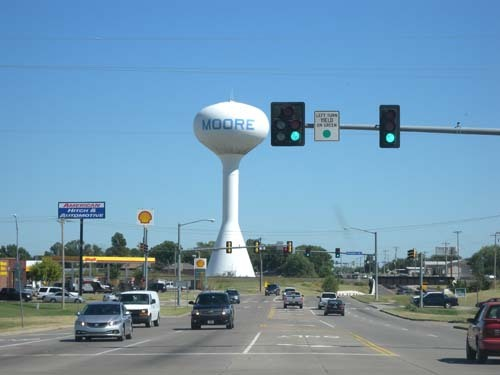
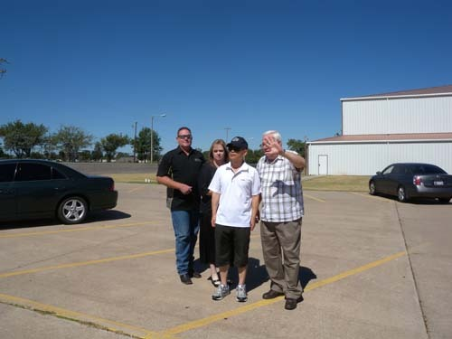
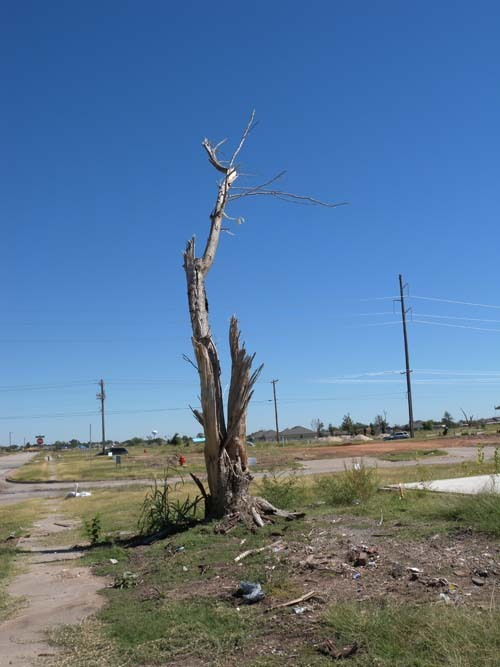
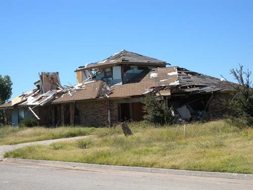
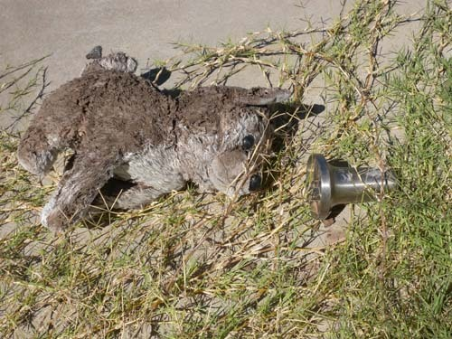
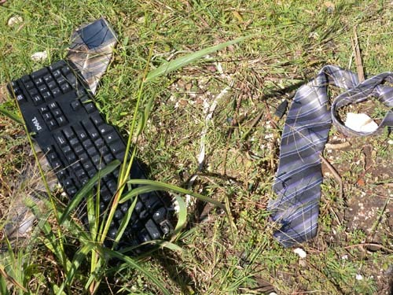
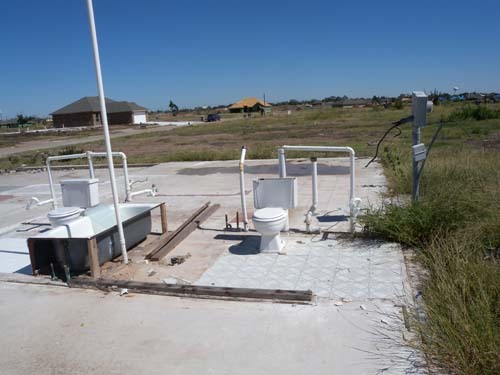
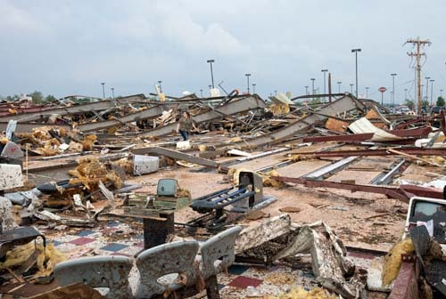

Moore 시에서 들은 소녀의 울음소리

금요일 저녁 OSU의 한국인 교수 모임에서 경제학과 김재범 교수는 내게 무어(Moore) 시를 가보는 게 좋을 거라고 했다. 자연의 위력을 현장에서 느껴볼 수 있는 절호의 기회라는 것이었다. 지난 5월 무어 시를 휩쓸고 간 토네이도 소식을 한국에서 접했던 나로서는 자연과 인간의 대응구조에 대한 내 마음 속의 의문을 풀어줄 단서가 될 수 있다는 점에서 김 교수의 권유를 받아들이기로 했다.

오늘[9월 29일/일요일], 날이 밝자마자 아내를 채근하여 무어 시로 차를 몰았다. 35번 하이웨이를 타고 쭉 내려가다가 오클라호마 시티를 지나며 여러 번 길을 바꿔 탄 다음 무어 시로 들어갔다. 1시간 반 이상의 비교적 긴 여행이었다. 타겟이란 큰 마켓에서 몇 가지 물건을 산 다음 이곳저곳 둘러보았으나, 김 교수가 말한 폐허 같은 토네이도의 현장은 보이지 않았다.

점심 참으로 들른 월남국수집[Phao Lan] 종업원의 덕을 보게 되었다. 그의 말대로 길을 따라 달려가니 과연 토네이도가 할퀴고 간 자국이 나타나기 시작했다. 초입에 있는 침례교회[Southgate Baptist Church]로 들어가니 노신사[Mr.James Fugate] 한 분이 주차장에 서 계셨다. 다짜고짜 지난 5월 토네이도 피해의 현장을 보고 싶어 한국에서 왔다고 하자 말문을 열시 시작했다. 이번까지 자신들이 그간 겪어온 3차례의 토네이도, 토네이도에 말 한 마디 못하고 날아간 초등학생들, 집이며 자동차 등을 순식간에 잃어버린 이웃들에 관한 이야기들을 소상히 들려주는 그의 눈가에 물기가 어리기 시작했다. 그를 더 이상 처연함의 늪에 빠뜨려서는 안 되겠다는 생각에 성함만 여쭙곤 그 자리를 서둘러 벗어나 현장으로 달렸다. 

  
 무어 시 초입에 서 있는 조형물

  
무어 시 Southgate Baptist Church에서 만난 James Fugate 옹이 토네이도 피해상황을 설명하고 있다.

아, 이럴 수가! 허허벌판이었다. 김 교수가 말하던 가옥의 잔해들은 이미 말끔히 치워져 있었고, 휑하게 너른 벌판엔 ‘인영(人影)이 불견(不見)’이었다. 토네이도 이전엔 예쁜 집들이 제법 촘촘히 들어 차 있었을 그곳엔, 부러진 나무와 지저분한 쓰레기들만 날리고 있었고, 벌써 잡초가 우거지기 시작했으며, 간혹 시멘트로 조성된 집터들이 보이기도 했다. 그 사이로 도로들은 간신히 옛 모습을 보여주고 있었으나, 온통 진흙투성이로 변해 있었다. 이제 몇 집은 새로 짓기 시작한 듯 뼈대만 세워두었거나 뼈대에 벽체까지 두른 집도 보였다. 그 넓은 피해지역의 외곽에 몇 채의 가옥들이 처참하게 뚫린 채 서 있었는데, 모두 지붕도 벽체도 마구 뜯겨 나가 사람의 체온을 느낄 수 없는 흉물들이었다.

                                                 

  
토네이도가 모든 것을 쓸어간 현장에 남아 있는 나목

  
토네이도의 습격을 받아 엉망이 되었으나, 간신히 지탱하고 있는 주택

 

나는 질퍽거리는 폐허 위를 걸었다. 그러다가 어떤 집이 통째 날아간 집터(시멘트로 만들어진)에 오를 때였다. 집 앞 풀밭에 ‘이쁜’ 고양이 인형이 눈을 동그랗게 뜬 채 그의 주인이었을 소녀의 장난감과 함께 흙투성이가 되어 나동그라져 있었다. 아, 그 눈은 바로 소녀의 눈이었다. 아마도 그 소녀는 토네이도가 들이치기 직전까지도 저 인형을 안고 있었으리라. 차마 눈도 감지 못한 채 그녀는 어디로 날아갔을까. 나는 그 고양이를 바라보며 한동안 그곳을 떠날 수 없었다. 혹시 그녀는 <오즈의 마법사>의 도로시가 그녀의 강아지 토토와 함께 토네이도에 휘말려 뭉크킨에 갔다가 여러 가지 모험을 거친 다음 다시 고향 캔자스로 돌아오듯, 마법사를 만나기 위해 어디론가 떠난 것이나 아닐까. 그렇다면 그녀는 왜 사랑하는 고양이를 이렇게 버려두고 떠난 것일까. 나는 그 고양이의 눈을 차마 정시하지 못한 채 원래는 집 안이었을 시멘트 바닥 위로 오르기 위해 몇 발짝 옮기다가 시궁창에 쳐 박혀 있는 넥타이, 양복, 키보드 등을 보았다. 음, 그 소녀의 아버지 또한 어디론가 떠났음을 알게 되었다. 그 자리엔 소녀가 토네이도에 휘말려 어디론가 여행을 떠나며 남겼을 마지막 외침만 남아 맴돌고 있었다. 과연 그 소녀는 동화속의 도로시처럼 다시 돌아올 수 있을까. 

  
어떤 꼬마가 데리고 놀았을 고양이 인형과 장난감

  
토네이도가 할퀴고 지나간 자리에 남은 키보드와 넥타이

  
다 날아간 집에 덩그러니 남아 있는 변기와 욕조

차를 돌려 스틸워터에 돌아오는 동안 많은 생각들이 교차했다. 원주민이든 이주민이든 미국인의 조상들은 자연과의 대결을 통해 오늘날의 문명을 이룩했다. 자연의 위력에 인간의 의지가 꺾인 듯한 순간들도 많았지만, 뒤에 보면 인간 의지의 승리를 입증하는 경우가 대부분이었다. 그러나, 인간이 끝내 어찌 자연을 이길 수 있단 말인가. 오늘날 과학의 힘을 발판으로 최고의 번영을 구가하는 미국에서 이토록 참혹한 인간 패배의 현장이 눈앞에 펼쳐지는 현실을 보라. ‘토네이도는 이 넓은 숲이나 들판을 지나지 않고 왜 하필 사람들이 밀집해 있는 도심만을 골라 지나는지 모르겠다’는 아내의 말 속에서 ‘의미 있는 자연의 메시지’를 확인하는 것 같아 갑자기 등골이 오싹해지는 기분이었다. 아름답고 풍요로운 무어 시는 다시 일어서겠지만, 자연이 던져 준 알 수 없는 수수께끼는 어떤 방식으로 풀어야 할지 다시 눈앞이 캄캄해지는 순간이다.

  
토네이도의 습격을 받은 무어 시의 당시 모습[Google.com]

  
토네이도 피해지역 외곽에 설치된 희망 기원 조형물[꽃송이로 HOPE라는 단어를 만들었음]

공유하기

게시글 관리

**백규서옥\_Blog ver.**