근황 2

미국음식 사귀기

김형,

우리는 몇 년 전 자동차를 몰고 유럽의 20여 개 국을 답사한 적이 있소. 당시에 매일 올리던 홈페이지의 글이나, 나중에 출판한 책[<<아, 유럽>>]에서 호기롭게 ‘음식에 관한 한 코스모폴리탄’임을 내 스스로 자부하곤 했지만, 사실 가장 큰 문제의 하나가 음식이었소. 유럽은 그래도 미국보다 훨씬 다양하고 섬세하여 우리나라를 비롯한 동양인의 미각을 달랠 만한 여건이 풍부하게 마련되어 있습디다. 물론 우리 동포들이 밀집해 사는 뉴욕이나 서부 도시들을 감안하면, ‘음식의 평균적인 친 한국 성향’은 이론상으로 미국이 유럽을 앞설 것이오. 물론 그 보다 훨씬 전인 15년 전 1년 남짓 지낸 LA에서는 전혀 음식 문제가 없었소. 차를 몰고 몇 분만 나가면 한국마켓들이 많았고, ‘한국보다 더 한국적인’ 한국음식점들 또한 수두룩했기 때문이오. 서울에서도 찾아가 먹어 본 적이 없던 ‘소공동 순두부’를 거기서 처음으로 맛보았으니, 더 할 말이 있을까요?

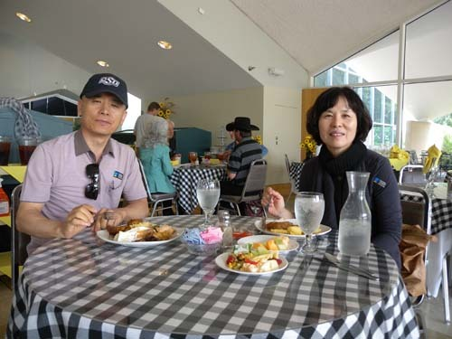  
카우보이 박물관 식당에서

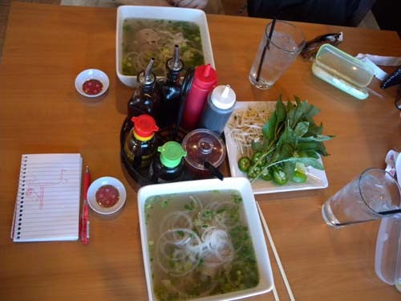  
무어 시에서 점심 차 들른 베트남 국수집

사실 이곳으로 오면서 ‘이번에는 완벽하게 미국식으로 살아보자’고 큰 소리를 쳤던 나요. 출국할 때 기본적인 양념이나 밑반찬 등을 다 빼놓고 온 것도 ‘미국식으로 살아보자’는 호기와 함께 미국엔 어딜 가나 한국인들이 터를 잡고 마켓이나 식당을 열고 있으리라는 막연한 기대 때문이었소. 무엇보다 ‘이젠 먹는 것으로부터 초탈할 나이도 되지 않았는가’라는, 우리 자신에 대한 착각이 ‘대책 없는’ 호기의 근원이었소. 나이 들면서 먹는 양은 줄었지만, 식성은 더 ‘근본을 지향한다’는 사실을 간과한 것이었소.

‘미각은 지문보다 더 정확하다’는 말은 나이 든 뒤 찾는 음식을 보면 대부분 그의 어릴 적 삶이나 지역까지 정확하게 맞출 수 있기 때문일 것이오. 서해안 촌놈인 나는 어릴 적부터 젓갈이나 뻘게, 소금에 절인 물고기 등을 자주 먹으며 자랐소. 그래서일까요? 나이가 들수록 밥숟가락을 들 때마다 눈길은 짭짤한 젓갈이나 비린내 나는 생선을 향하곤 하는 것이오. 그런 반찬에서 고향의 내음이 풍기기 때문이지요. 젊어서 먼 길 떠났던 나그네가 다시 고향으로 돌아갈 수 있는 건 고향으로부터 풍겨오는 ‘음식 내음’ 때문 아니겠소?

혹시 오나라 출신 장한(張翰)이 낙양에서 벼슬하다가 고향의 진미인 순채국과 농어회를 잊지 못해 벼슬을 버리고 낙향했다는 ‘순갱노회(蓴羹鱸膾)’의 고사를 알고 계시오? 물론 당시 제나라 왕의 무도함을 보며 위기를 느낀 그였으므로 그가 벼슬을 버린 것이 순전히 음식 때문만은 아니었겠지만, 만약 그에게 고향의 ‘순채국과 농어회’가 없었어도 그리 빨리 벼슬을 버릴 수 있었을까요?

그런데, 참으로 미국의 음식에는 매력이 없소. 며칠 전 만난 미국 여학생도 미국 음식은 모두 ‘unhealthy food’라고 한 마디로 매도합디다. 학교 안에 식당들이 많고, 대부분의 식당들이 학생들로 붐비지만, 나로선 딱히 먹고 싶은 것이 없소. 대부분 달고 기름기 많고, 어떤 것은 짜기도 하고, 비벼 놓거나 섞어 먹는 어떤 것들은 흡사 ‘사료’ 같은 모습을 띠기도 하오. 혹자는 ‘그대가 싸구려 음식만 먹으니 그렇지. 멋진 레스토랑에 가서 제대로 된 미국 음식 좀 먹어봐!’라고 타박하기도 하오. 그러나 값이 싸고 비싼 차이, 음식의 가짓수나 코스가 많고 적음의 차이는 있겠지만, 기본구조야 비싸다고 달라질 수가 있겠소? 설탕과 소금, 밀가루를 벗어나지 않는 이상 ‘미국 음식=unhealthy food’라는 공식은 아마 바뀔 수 없을 거라고 보오.

                                                                                                                    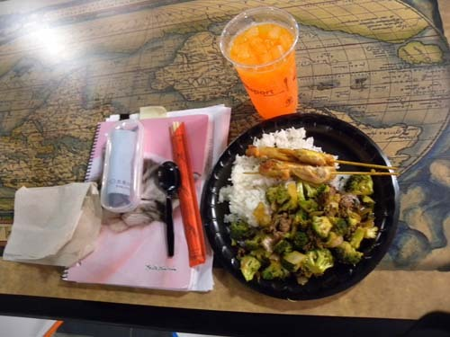                               
                                          어느날 학교 식당에서의 점심상

                                                 
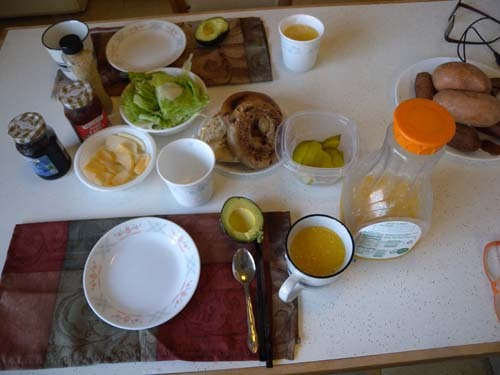  
                                          최근의 아침 메뉴

그래서 우리도 나름대로 궁여지책을 고안했소. 마트에 들러 수십 종류의 빵 가운데 밀가루와 약간의 식염 외에 전혀 가미(加味)가 되지 않은 한 종을, 과일 코너에서 아보카도(avocado)란 열대과일과 이 지역의 사과를, 유제품 코너에서 치즈 한 두 종을, 야채 코너에서 양상추를, 음료 코너에서 건더기[이곳 사람들은 이것을 pulp라 합디다]가 들어 있는 (원액) 오렌지 주스를 각각 고르니, 대충 미국식 아침식사로서는 분에 넘치는 조합이었소. 빵을 살짝 구어 버터 대신 아보카도의 과육(果肉)을 바른 다음, 치즈와 양상치를 얹고 오렌지 주스를 곁들이면 아침은 해결이지요. 그렇게 먹고 점심은 초원의 굶주린 사자처럼 미국 음식의 정글 속에서 어슬렁거리기 일쑤라오. 그러다가 저녁은 완벽한 캠핑족 스타일의 한식으로 (이들의 표현대로 한다면) ‘빅디너(big dinner)’를 먹게 되는 것이오. 

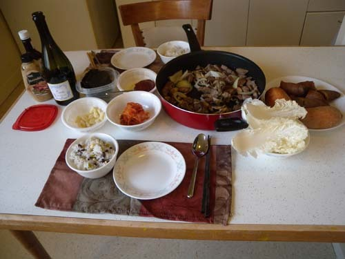  
어느 날의 빅디너(?)

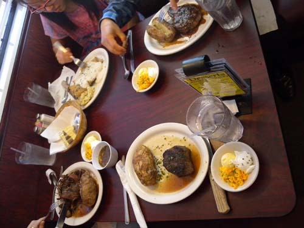  
장영배 교수 부녀와 함께 한 어떤 레스토랑의 점심

지난 달 하순인가요? 일요일에 길크리스 박물관을 관람하기 위해 인근 도시 털사(Tulsa)에 갔었소. 박물관 관람이 주목적이었지만, 아내나 나는 내심 그곳에 있다는 한국음식점에 더 무거운 방점을 찍고 있었다는 사실을 고백해야겠소. 나름대로 정성을 들인 그 식당의 김치찌개를 먹으며, 한 달 여 시달린 ‘솟증’을 풀어낸 셈이오. 돌아올 때 식당과 이웃한 한국마트에서 삼겹살 몇 근을 끊어 차에 실으니, 어렵던 시절 설 쇠기 위해 동네 돼지 잡던 현장에서 다리 한 짝 사들고 의기양양하게 대문을 박차고 들어가던 가난한 가장의 호기가 이런 게 아니었을까 짐작됩디다.

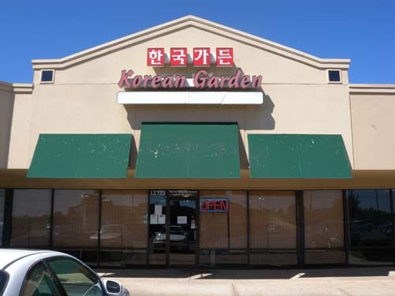  
털사에서 만난 한국음식점-한국가든

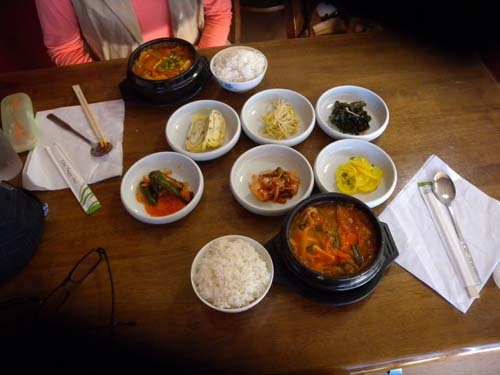  
한국가든에서 먹은 김치찌개백반

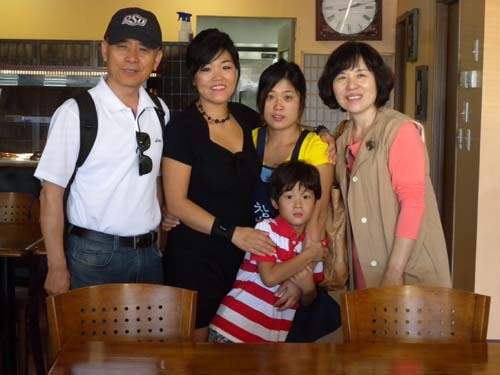  
한국가든 주인장의 두 따님 및 손자와 함께

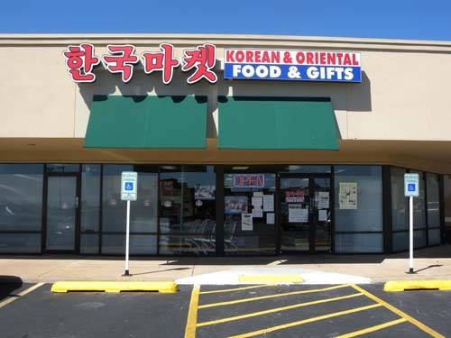  
한국가든 옆의 한국 마켓

그러나, 언제까지 한국음식만 찾아다닐 수 있겠소? 어차피 한국으로 돌아가면 다시 지겹게 그 음식 속에서 일생을 지내야 할 것을! 귀국 후 여기서 보낸 시간을 회상할 때 이곳의 음식경험만큼 오래 갈 추억 거리가 어디 있겠소? 김 형이나 나나 이제 젊은 시절의 아름답던 추억이나 반추하며 인생의 의미를 되새겨가야 할 군번들이 아니겠소? 세계 제일의 국가라 자부하는 미국, 그 미국을 움직이는 국민들, 그들이 먹는 음식. 어쩜 내 주관의 속박만 벗어날 수 있다면, 그들의 음식이 갖는 의미나 장점이 우리 음식의 그것보다 나을 수도 있지 않겠소? 그래서 이젠 적극 그들의 음식과 친해지기로 했소. 좋은 것, 입맛에 맞는 것, 익숙한 것만 찾으려면, 고생스럽게 이역만리 미국 땅엔 무엇 하러 왔겠소? 그냥 내 나라에서 두 다리 쭉 펴고 편하게 ‘소고기나 사 묵으며’ 살 일이지. 그래서 늦었지만 이제부터라도 내 미각을 길들이기로 했소. 잘 될지는 모르겠지만.

오늘은 이만 하리다. 잘 계시오.

2013. 10. 1.

스틸워터에서 백규

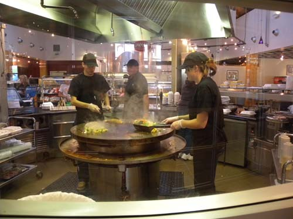  
캠퍼스 외곽쪽의 약간 특이한 반 주문식 학생식당에서

공유하기

게시글 관리

**백규서옥\_Blog ver.**