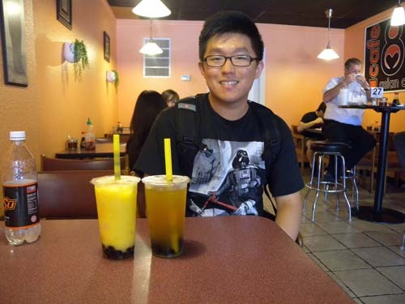
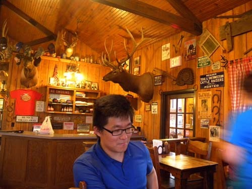
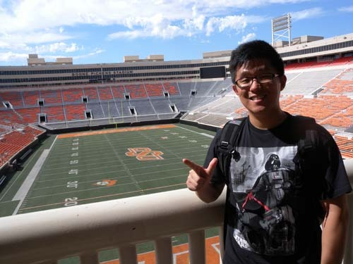
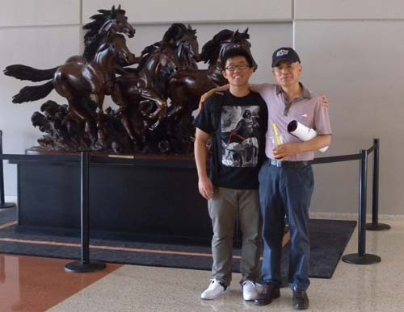
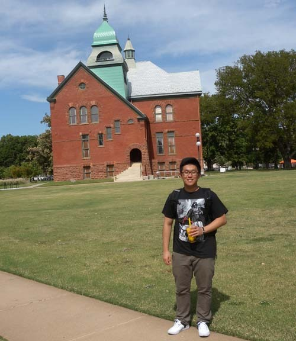
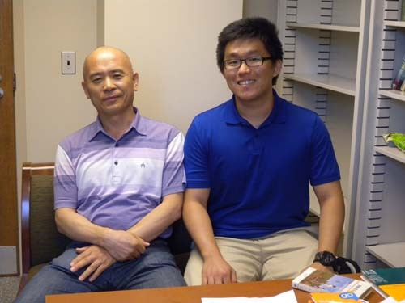

빛나는 한국학생 Hyunjun Brian Choi

점점 나이가 들어가면서 젊은이들이 눈에 들어오기 시작했다. 한창 자식들을 키울 때엔 그 녀석들을 지켜보는 것만으로도 시야가 모자랐는데, 이제 웬만큼 ‘홀로서기’들을 했다고 생각되면서 내 눈에 다른 아이들이 보이기 시작한 것이다. 강의실에서도 학생들은 두 가지 모습으로 내 시야에 들어온다. 요즘 들어 부쩍 남학생들은 아들로, 여학생들은 딸이나 며느리로 바꾸어 생각해보는 경우가 잦아졌다. 운 좋게도 나는 지금까지 학생들을 만나면서 거의 ‘저런 학생을 아들이나 딸로 둔 부모는 참 좋겠구나!’, ‘저런 아이는 며느리 감으로 딱인데!’, ‘참 잘 키웠구나!’ 등의 생각만을 갖게 되었으니, 참 행운아라고 할 수 있다. 자랑스럽게도 이처럼 내 주변에는 ‘반듯하면서도 이쁘고 착한’ 학생들뿐이다.

잠시라도 해외에 나가 산다는 것은 ‘가슴 설레는 일’인 동시에 잘 몰라서 ‘불안한 일’일 수도 있다. 미국 내의 연구기관을 오클라호마 주립대학으로 결정하고 대부분의 중요한 서류작업들을 끝낸 뒤에야 비로소 우리가 이곳에 대해 몰라도 너무 모른다는 점을 깨닫게 되었다. 대학의 학장, 학과장, 외국인 학자 관리처, 주택 관리처, 풀브라이트[미국 본부 및 한미교육위원단], 대사관 등 우리가 접촉한 기관이나 부서들 모두 공적인 업무 상대들일 뿐이었다. 친척이나 친구 등 좀 더 사적이면서도 내밀한 물음을 던질 수 있는 상대는 아무도 없었다.

답답한 나머지 사이트를 뒤지다가 이곳 대학의 한인학생회를 발견했고, 궁여지책으로 회장에게 이메일을 보냈으나 답장이 없어서 부득이 부회장에게 이메일을 보내게 되었다. 그러자 득달같이 생동감 넘치는 문체의 영문 답신메일이 날아왔다. 그가 바로 ‘Hyunjun Brian Choi’였다. 어려서 이곳에 왔기 때문에 한글을 쓰는 것보다 영문을 쓰는 것이 훨씬 자연스럽고 편하여 영문으로 이메일을 쓰게 되었노라는 해명까지 덧붙여가며 이곳 생활의 이면들을 자세하게 적어 보내온 것이었다. 참으로 예의 바르고 의젓하면서도 주도면밀한 그의 이메일을 받아보곤 호기심이 생겼다. ‘한인 학생회’의 부회장이라니, 대학원생 쯤 될 것이라는 짐작만 할 뿐이었다. 몇 번 오고 간 그와의 메일 연락 덕에 한결 가벼운 마음으로 이곳에 올 수 있었다.

  
Cafe 88에서

  
레스토랑 Bad Bread에서

  
OSU의 풋볼 경기장 Boone Pickens Stadium에서               

와 보니 정착이 쉽지 않았다. 시차 적응이 쉽지 않아 눈꺼풀은 스르르 내려앉는데 시장은 가야하고, 시장을 가려면 차가 있어야 하는데, 차를 사는 절차가 보통 일이 아니었다. 그에게 이메일을 보내자 또 자세한 이메일을 보내왔다. 그의 이메일을 통해 연결된 분이 바로 기계공학과의 장영배 교수였다. 장 교수의 호의로 우리는 나머지 정착과정을 순조롭게 마칠 수 있었다.

그런 다음 브라이언을 집으로 불렀다. 아직 차를 구입하기 전이었다. 시장을 가야 하는데 방법이 없다고 하자 강의가 끝나는 즉시 친구의 차를 빌려 몰고 부랴부랴 와 주었다. 놀랍게도 그는 앳된 학부 3학년생이었다. 첫 인상이 착하고 성실했다. 말을 시켜보니 의젓하고 생각 또한 깊었다. LA에 있는 명문 고등학교를 마친 다음 대학 기간을 단축하려는 계획을 갖고 이 학교 경제학과에 입학한 그였다. 벌써 1년 반이란 기간을 단축했단다. 학부를 졸업한 뒤에는 로스쿨에 진학하여 국제변호사[아마 경제 전문 변호사가 목표인 듯하다.]로 활약하려는 꿈을 갖고 있었다. 이미 한국의 유수한 로펌에서 인턴의 경력도 쌓아놓았다고 했다. 매학기 학점을 초과 이수하면서도 아주 좋은 성적을 올리고 있는 그였다. 예컨대, 상위 10% 이내의 학생들만 가입할 수 있는 ‘National Society of Collegiate Scholars’, ‘Phi Eta Sigma’, ‘Golden Key International Honor Society’ 등의 멤버로 활약하는 것만 보아도 그의 출중한 능력은 인정될 수 있을 것이다. 그 뿐 아니라 2012년에는 ‘Baugh, Russell, and Florence’ 장학금을 받았고, 2012년 봄 학기, 2013년 봄・여름 학기에는 우등생으로 학장의 상을 받았으며, 2012년에는 총장으로부터 우등상장을 받기도 했다.

  
Boone Pickens Stadium 건물 1층에서

  
브라이언이 속한 College of Honors 건물

 

나는 해외에서 빛나는 우리 학생들을 만날 때마다, 나라의 밝은 미래를 보게 된다. 물론 국내에서 두각을 나타내는 일도 중요하고 어렵다. 그러나 낯설고 물 선 해외에서 그들과 경쟁하여 앞서나가는 일은 더욱 어렵다. 어머니의 젖과 함께 물려받은 모어[mother tongue] 사용자들을 능가하는 실력을 발휘하는 일이 어찌 쉽겠는가. 영어를 모어로 사용하는 아이들과 경쟁하여 그들을 이기기 위해서는 그들보다 몇 배의 노력이 필요할 것인즉, 그 나이 또래에 누구나 맞이하는 ‘질풍과 노도’, 내부의 욕망과 외부로부터 밀려드는 유혹들을 억누르거나 물리치고 시시각각 침투하는 외로움과 맞서가며 자신을 제어한다는 것이 어찌 쉽겠는가. 브라이언이 풍겨내는 담담한 내면을 통해 나는 범상치 않을 그의 부모를 떠올리게 되었고, 그의 빛나는 미래를 점치게 되었다. 브라이트(bright) 브라이언 만세!!!

  
백규 연구실에서 브라이언과 함께

공유하기

게시글 관리

**백규서옥\_Blog ver.**