오클라호마의 숨어 있던 별 ‘Guthrie City’

오클라호마 시티로부터 35번 하이웨이를 타고 20~30분을 달리자 길가에 ‘Oklahoma Territorial Museum[오클라호마 지역 박물관]’이란 입간판이 서 있었다. ‘territorial’이란 이름에 관심이 갔다. 특수한 분야를 표방한 경우를 제외하고 일반적으로 박물관이란 시간과 지역을 초월하는 공간인지라, ‘territorial’을 강조한 그 이름이 내 시선을 끌었던 것이다.

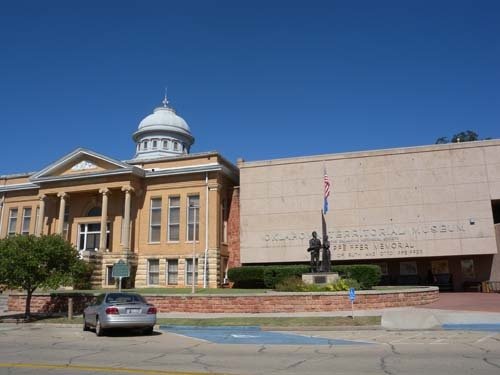  
Oklahoma Territorial Museum 전경

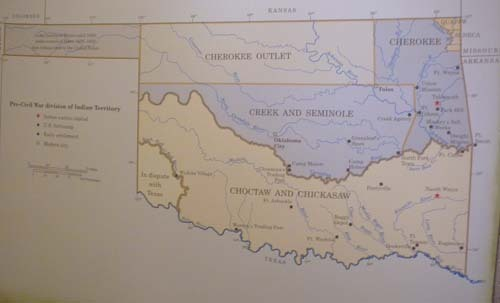  
오클라호마 주 인디언 분포도

10월 5일 토요일. 맘먹고 기억 속에 각인된 그곳엘 갔다. 거쓰리(Guthrie) 인터체인지로 진입하니 겉보기에 한적한 시골이었다. 다운타운이라 할 만 한 거리의 주차 공간들은 텅텅 비어 있었으나 도시 곳곳에 서려 있는 분위기가 범상치 않았다. 이곳이 바로 오클라호마의 첫 주도[州都, Capital]였다. 인근의 오클라호마 시티에 주도의 지위를 넘겨 준 뒤 와신상담(臥薪嘗膽)해 온 듯하지만, 한 번 지나간 역사의 물결을 되돌리기란 불가능함을 그들인들 모를 리 없을 터. 힘들여 보존하고 있는 영화의 옛 자취들을 곳곳에서 목격할 수 있었다. 주 간선도로를 따라 100년 넘는 건물들이 즐비하고, 거리에는 승객들을 가득 실은 당시 모양의 버스가 돌아다니고 있었다.  
                                                                                                    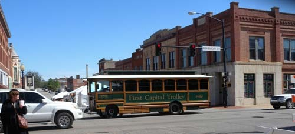  
                                        옛날 모습의 트롤리 버스

잠시 걷다 보니 하얀 천막들이 우리의 길을 막았다. ‘Guthrie Escape’란 명칭의 가을 축제였다. ‘거쓰리로의 탈출’쯤으로 번역될 수 있을까. 큰 도로 위에 설치된 각각의 천막들에는 각종 미술품, 음식, 와인, 의상, 도자기, 공예품 등이 그득그득 전시되어 있고, 천막 거리를 벗어난 곳의 가설무대에서는 그룹 싱어들과 악사들이 각국의 민속음악들을 공연하고 있었다. 주변에는 100년이 훨씬 넘는 건물들이 우뚝우뚝 서서 축제의 현장을 굽어보고 있고, 사람들은 그 사이를 냇물처럼 흐르고 있는 시간의 여울에서 물고기가 되어 유영하고 있는 곳이었다. 시간이 각인된 그 자리에서 시간의 흐름을 잊어버리게 하는 것이 축제의 힘임을 비로소 느껴본 우리였다.

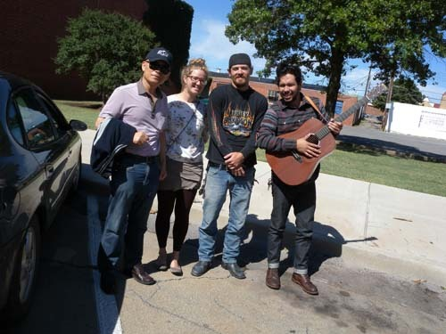  
축제 공연장 앞에서 만난 가수들

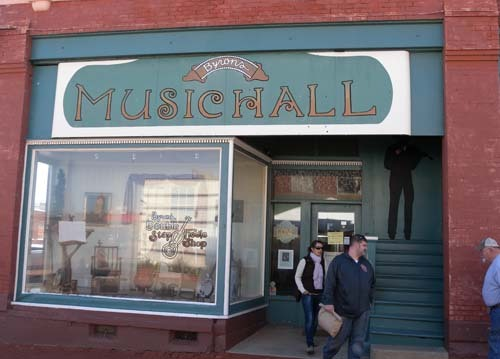  
거리의 오래된 악기점

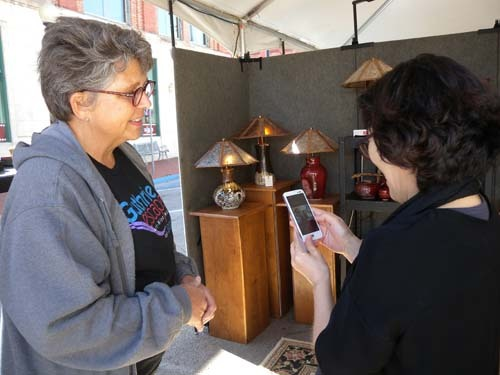  
축제장 도자기 부스에서 만난 아마추어 도예가

  
축제장 장식물 부스에서

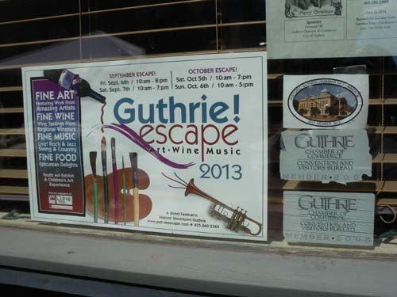  
거쓰리 축제 포스터

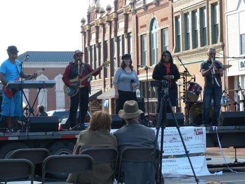  
축제장 공연무대

축제가 벌어지고 있는 곳으로부터 두 개의 네거리를 지나자 박물관이 서 있었다. 건물은 그럴 듯 했으나, 관람객은 우리 둘 뿐이었고, 들어가 보니 빈약한 컬렉션 또한 우리의 기대에 크게 미치지 못했다. 주로 개척시대 이 지역의 생활사 자료들이거나 복원된 것들이 대부분으로, 1, 2층에 나누어 진열되어 있었다. 그러니 이미 오클라호마 시티의 카우보이 박물관과 털사 시의 길크리스 박물관을 본 우리의 안목을 만족시키기에는 어림도 없었다. 그러나 박물관과 함께 하고 있는 ‘카네기 도서관’은 오클라호마 주에서 처음으로 세워진 것으로 당시 소장하고 있던 책들과 열람실이 그대로 보존되어 이 도시의 역사적 연원과 문화적 깊이를 증명하고 있었다.

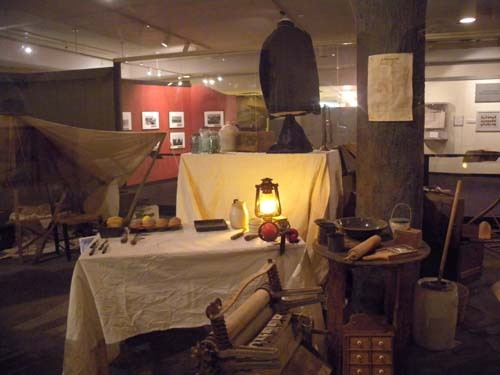  
박물관 소장품(집안 모습)

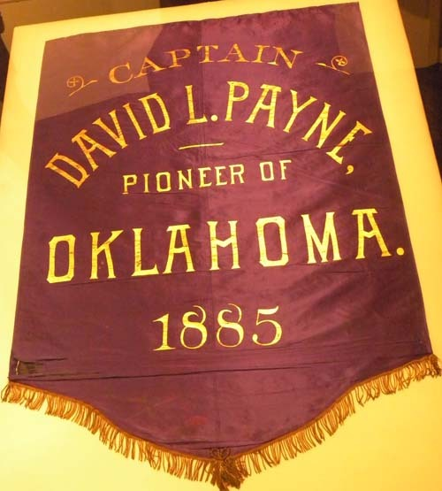  
페인카운티의 창설자 페인 기념 페넌트

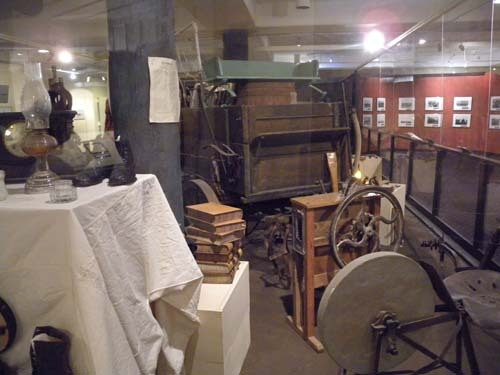  
박물관 소장 가구들

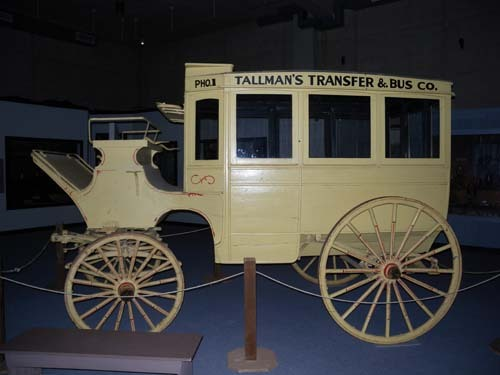  
박물관에 전시된 옛날 버스

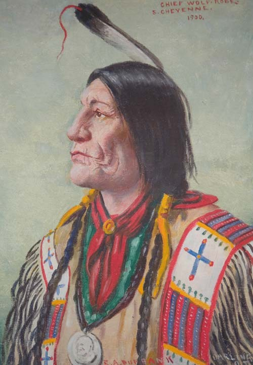  
인디언 체이옌족 추장 울프

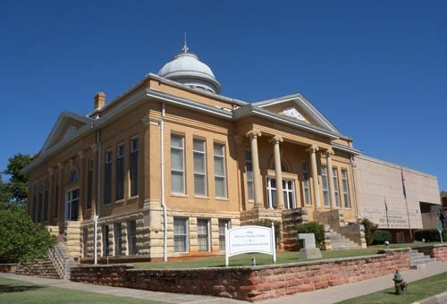  
카네기 도서관의 모습

박물관에서 나와 중앙의 대로를 타고 끝까지 가자 큰 건물의 '스코틀랜드 프리메이슨 사원(Scottish Rite of Freemasonry)'이 서 있었다. 기독교와 계통을 달리 하는 광신도들의 비밀 결사로서 이미 200~300 년 전부터 유럽과 아메리카 대륙의 백인사회를 중심으로 퍼져 나간 민간조직이 바로 이것이다. 루스벨트, 처칠 등 세계의 지도급 인사들이 많이 소속되어 있었지만, 그것은 이미 십자군 전쟁 때의 ‘성당 기사단’에서 연원되었을 만큼 역사가 길다.

십자군 전쟁 뒤 스코틀랜드로 도피하여 석공으로 변신한 기사들은 비밀 결사를 만들어 유지하며 수백 년을 지탱했고, 그로부터 약 400년이 지난 1717년, 흩어져 있던 지부들이 규합하여 프리메이슨의 공식명칭을 갖게 되었다고 한다. 그 프리메이슨의 사원을 이곳에서 보게 될 줄이야! 잠겨 있는 사원의 주위를 뱅뱅 돌면서 비밀스런 내부를 보고자 했으나 문은 굳게 잠겨 나그네의 출입을 완강히 막는 것이었다. 

프리메이슨을 떠나 클리블랜드가에 위치한 레스토랑 ‘EAT’를 찾았다. 100년이 넘는 역사를 자랑하는 이 집의 돼지 갈비 바비큐와 맥주 한 잔은 나그네의 출출한 배를 채우기에 충분했고, 모여드는 사람들의 친절한 표정과 응대가 이 지역의 분위기를 말해주고도 남았다.

  
늦은 점심을 때운 옛날 레스토랑 EAT

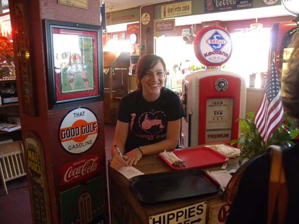  
레스토랑 EAT 캐시어의 상큼한 미소

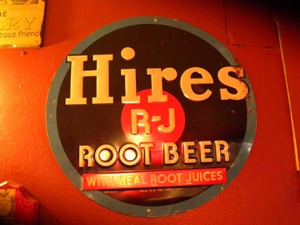  
레스토랑 벽에 붙어 있는 옛날 상표

식사 후 커피 마실 만한 집을 찾다가 들른 곳이 바로 빅토리안 티룸(Victorian Tea Room). 레스토랑이 주업인 그 집에서 차 한 잔만 마시기가 미안해 쭈뼛거리는 우리를 호화롭게 세팅된 자리에 앉힌 다음 여주인 셰릴(Cheryl)은 맛있는 티와 커피를 내왔다. 차를 마시면서 여주인과 우리는 이 도시의 역사와 문화에 대해 많은 이야기를 나누었다. 도시를 세운 인물 거쓰리의 이야기, 거쓰리 시의 역사와 문화, 조상들과 자신들의 삶에 관한 이야기 등을 자분자분 얘기해준 그녀는 우리가 미국에 도착한 이후 대학 밖에서 만난 첫 지성인이었다.

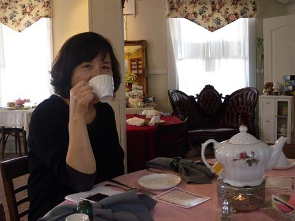  
빅토리아 다방에서 차를 마시며

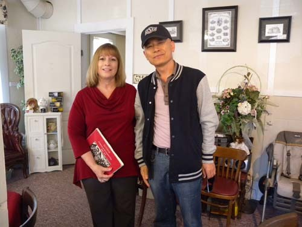  
빅토리아 다방의 주인 Cheryl씨와 함께

그 뿐 아니었다. 한참 만에 일어나 나가면서 찻값을 지불하려 하자 그녀는 돈을 받지 않으려 했다. 미국이 어딘가? 음식 값을 내고도 팁까지 얹어 줘야 하는 나라다. 그런데 우리와 재미있는 이야기를 나누고 난 그녀가 찻값을 받지 않겠다니! 오클라호마의 경건함과 친절함에 이미 감동받은 바 있는 우리는 거쓰리에 와서도 대접받는 기분을 가질 수 있었다. 자본주의의 천국 미국에서 공짜 커피를 마시고, 미국 친구까지 만들게 되었으니, 이만 하면 몇 배 남는 장사를 한 셈이었다. 즐거운 기분으로 거쓰리의 추억을 마음속에 담아두고, 다음을 기약하기로 했다.

공유하기

게시글 관리

**백규서옥\_Blog ver.**