폰카시티를 찾아

오클라호마 시로부터 정 북쪽에 위치한 케이(Kay) 카운티의 핵심 도시인 폰카 시티(Ponca City). 핵심적 인디언 거주지들 중의 하나인 그곳의 한 복판에 말란드(E.W.Marland)의 대저택이 들어서 있었다. 말란드는 석유 재벌로서 상원의원과 오클라호마 주지사를 역임하고 이곳에 기념비적인 저택을 남겨 놓은 인물. 그는 유럽을 여행하면서 이탈리아 피렌체 지역 저택들의 건축양식에 특히 매료되었고, 그것들을 본 떠 지은 까닭에 이 저택은 이탈리아 르네상스식 건축물이 되었다고 한다.

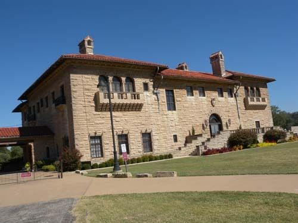  
폰카시티에 있는 말란드의 저택

이곳 답사에는 최근 헬싱키에서 건너와 캐나다 몬트리올 대학교 기계학습 연구실에서 연구하고 있는 큰 아이[경현]도 잠시 휴가를 틈타 합류하게 되었다. 우리는 스틸워터에서 자동차로 1시간쯤 달려 말로만 듣던 폰카 시티에 도착했다. 풍광이 수려하고 맑은 곳이었다. 다운타운에서 그랜드 가[街, Avenue] 1000번지로 찾아가니 과연 그의 저택은 절경 속에 숨듯이 앉아 있었다. 78피트의 폭에 184피트의 길이로 대략 43,561 평방피트 규모의 4층 건물이었다. 10개의 침실, 7개의 벽난로, 13개의 목욕실, 3개의 부엌을 포함한 총 55개의 방들 모두 호화로움의 극치를 보여주고 있었다.  
 

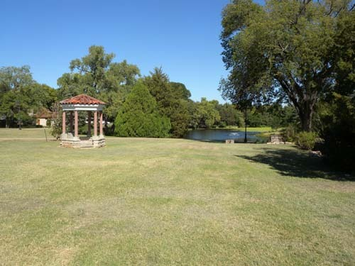  
폰카시티 말란드 저택의 정원과 정자

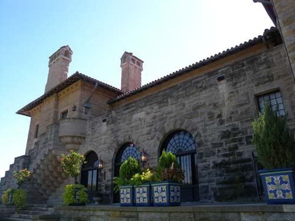  
폰카시티 말란드 저택의 뒷면

출입문으로 들어서자 말란드가 가장 좋아했다던 당대 제일의 조각가 데이비드슨(Jo Davidson)의 손에서 탄생한 그들 부부의 대리석 조각상이 깔끔한 표정으로 손님들을 맞이하고 있었다. 그곳으로부터 공식 연회가 베풀어졌을 식당이 가까웠는데, 이곳에 사용된 참나무는 영국 왕실의 산림에서 벌채해온 것이라 하며, 그것들을 모두 수작업으로 끊어내고 이어 붙여 만든 벽면의 모습을 목격할 수 있었다.  
                                                                                    

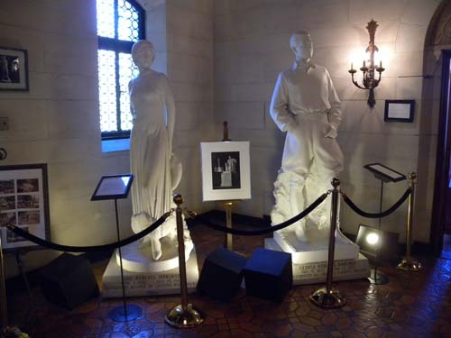  
말란드 저택 입구에서 만난 말란드 부부 입상  
 

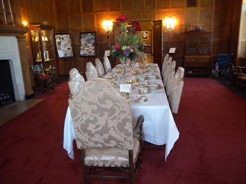  
말란드 저택의 식당

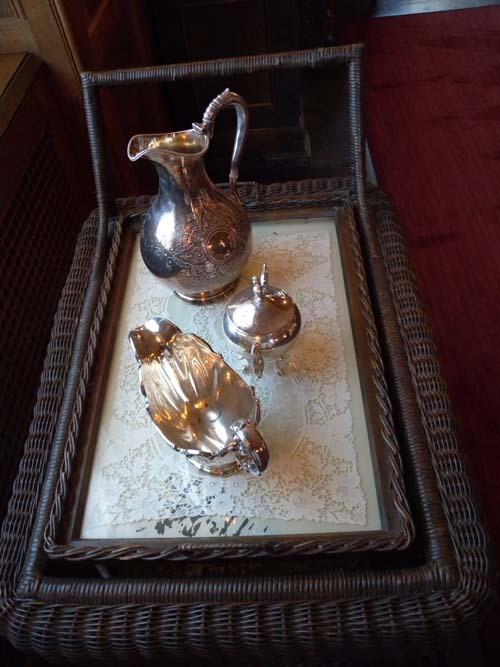  
말란드 저택 식당의 차 주전자 세트

좀 더 걸어가자 좀 작은 규모의 아침 식사 전용식당과 음식을 내오는 부엌 등이 연결되어 있고, 햇볕이 들어오게 설계된 북쪽의 살롱과 홀웨이(Hall Way), 많은 미술품과 조각들이 전시되어 있는 연회장 겸 갤러리, 거실인 남쪽의 살롱, 주인 내외의 침실, 손님들의 침실, 각종 화장실과 의상실, 테라스, 비밀 도박장[Poker Room]과 주류 보관실 등이 각 층에 분산되어 있었다. 도박장에서 이어지는 비밀통로를 따라 밖으로 나가니 너른 풀밭과 함께 당시 수영장의 흔적이 남아 있었다.

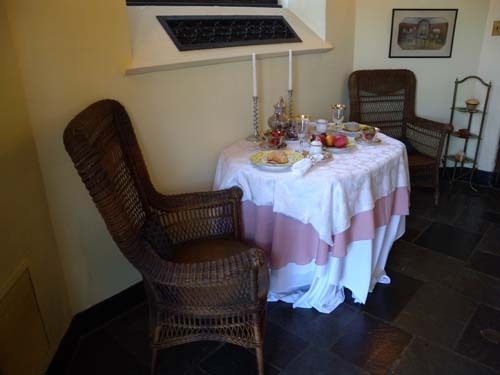  
말란드 저택의 아침식탁

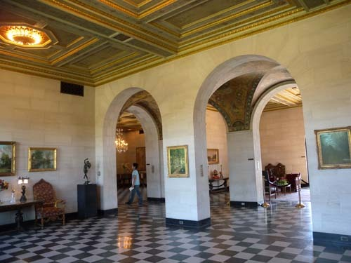  
말란드 저택의 연회장

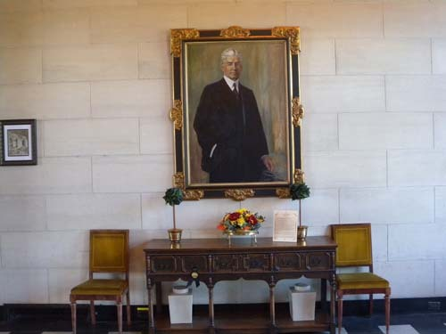  
말란드 저택 거실에 걸린 말란드의 초상

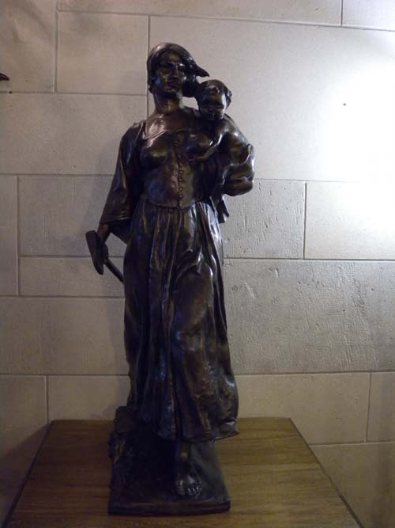  
말란드 저택 갤러리에 걸린 Herman Atkins MacNeil의 작품 "Challenging"

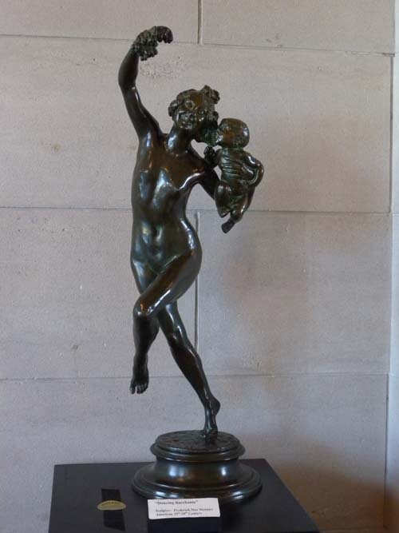  
말란드 저택 갤러리에 있는 F. Jenkins의 작품 "Adventurous"

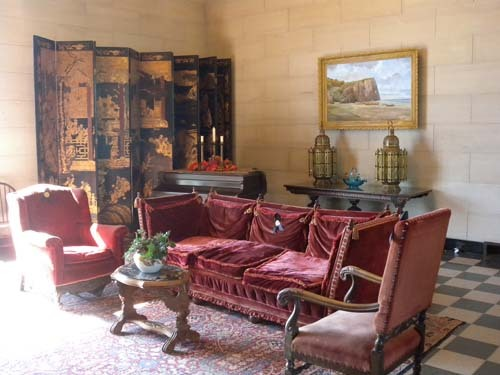  
말란드 저택의 거실

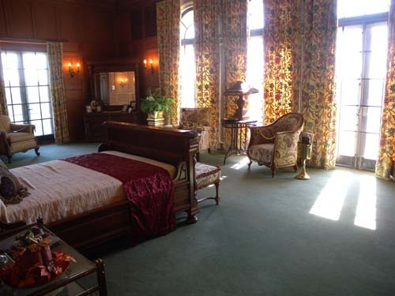  
말란드 저택의 침실

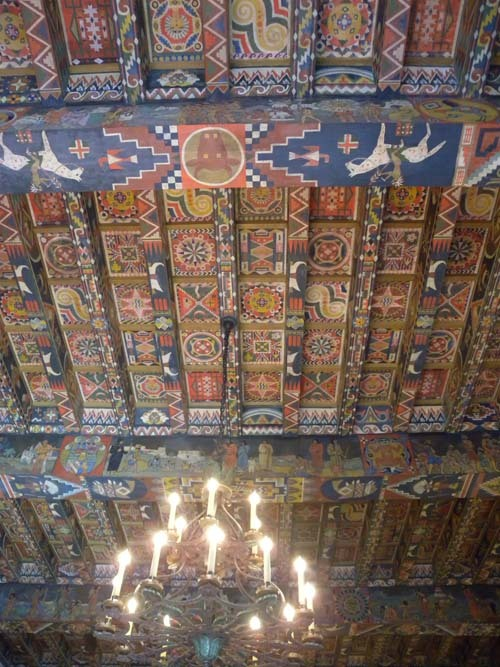  
말란드 저택의 샹들리에와 천장 장식

큰 골프장 넓이는 될 법한 정원을 따라 원형으로 에인절 홀[Angel Hall, 현재는 사립 초등학교], 아티스트 스튜디오(Artist Studio), 박물관, 말란드 부인이 만년에 살던 집, 저택을 둘러싸고 있는 다섯 개의 호수들, 풀밭 한 가운데 서 있는 정자[gazebo], 호숫가의 보트 보관소, 남・북쪽 테라스 등. 이루 헤아릴 수 없이 많은 기념비적 건축물과 기념물들이 남아 말란드 생전의 영화를 보여주고 있었다.  
 

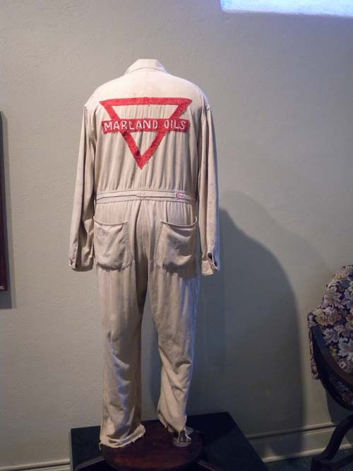  
말란드 석유회사 박물관에 전시된 당시 직원들의 작업복

  
말란드 석유회사 로고

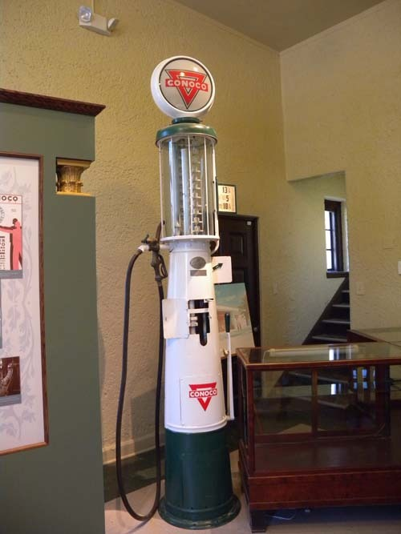  
말란드 석유회사를 합병한 코노코 석유회사 주유소의 주유기

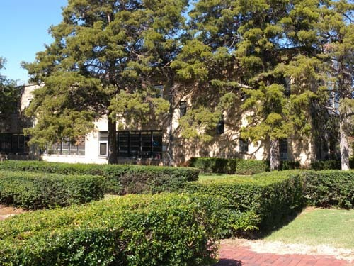  
말란드 저택 정원 한 켠에 있는 에인절 홀(Angel Hall). 현재는 사립초등학교

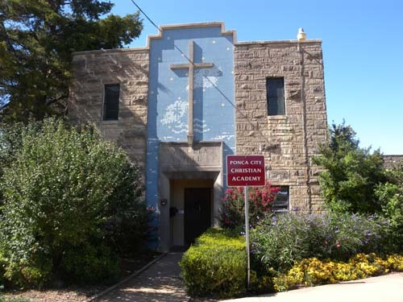  
말란드 저택 정원 한켠에 자리잡고 있는 기독교 신학교['Ponca City Christian Academy']

말란드는 석유 사업으로 거대한 부를 이루었고, 상원의원과 주지사를 지내는 등 화려한 지위를 얻었으나, 만년에 그의 회사가 코노코(Conoco) 회사에 합병되면서 그의 부와 권력은 종말을 고하고 말았다.

\*\*\*

사실, 말란드가 이 집을 지음으로써 폰카시티는 ‘화룡점정(畵龍點睛)’의 묘를 얻은 것이니, 이 저택이야말로 돈을 쓸 줄 아는 자의 결단에 의해 이루어진 불멸의 예술품이라 할 것이다. 이 저택을 두고 우리는 두 가지 생각을 갖게 되었다. 하나는 유럽에 대한 미국인의 의식을 알 수 있다는 것. 말란드는 유럽을 돌아보고 난 뒤 이 집을 지을 결심을 했다. 달리 말하면 오늘날까지 미국인들이 벗어나지 못하는 ‘유럽 콤플렉스’의 한 단면이 당시에도 얼마나 컸었는지 이 집을 통해 알 수 있지 않은가. 또 하나. 돈 있는 사람들이 이왕 집을 지을 경우, 크게 민폐만 끼치지 않는다면, 호화롭고 값나가게 지어야 한다는 점이다. 우리는 유럽을 돌아보며, 유럽의 역사적・예술적 무게야말로 지어질 당시 ‘화려함의 극치’를 보여 주었을 각종 건축물에 있음을 깨닫게 되었다. 간혹 욕하는 사람들도 있겠지만, 이왕 ‘제 돈 가지고’ 제대로 지으려고 마음먹는 바엔, ‘문화유산’급으로 지어야 한다. 그래야 후손들이 조상과 역사에 대한 자긍심을 갖게 될 것이고, 우리 같은 외국인들로부터 관광수입까지 챙길 수 있을 것 아닌가.  
 

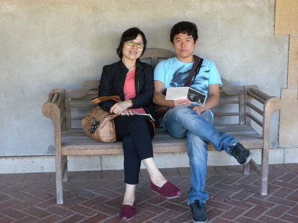  
말란드 저택 정원에서 Melania와 Kyung

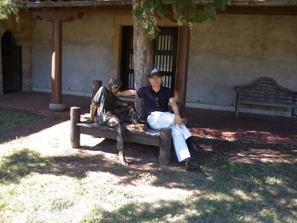  
말란드 저택 정원에서 백규

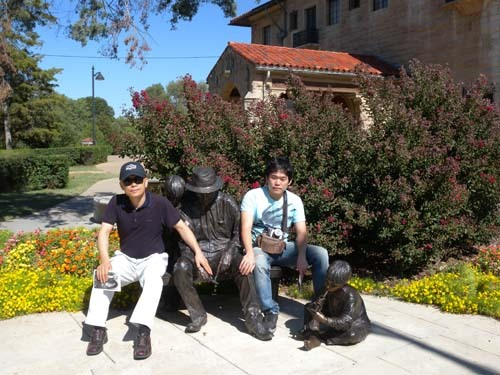  
말란드 저택 바깥에서 백규와 Kyung

공유하기

게시글 관리

**백규서옥\_Blog ver.**