오늘의 점심과 ‘불고기 오아시스’

점심시간 전에 나를 만나러 온 학생 룩(Lucas Mccamon)은 이 대학 최대 행사인 홈커밍의 최고 리더로 활약하고 있다. 홈커밍 행사의 하나인 ‘카니발’ 때문에 어제 밤 한잠 못 잤다는 그가 딱해 점심을 사주려 했으나, 강의가 있다면서 그냥 내빼는 바람에 혼자서 연구실을 나와 식당으로 향했다. ‘가봐야 별 수 있을까만, 그래도 한 술 떠야지!’ 시큰둥해지는 마음을 추스르며 연구실을 나섰다.

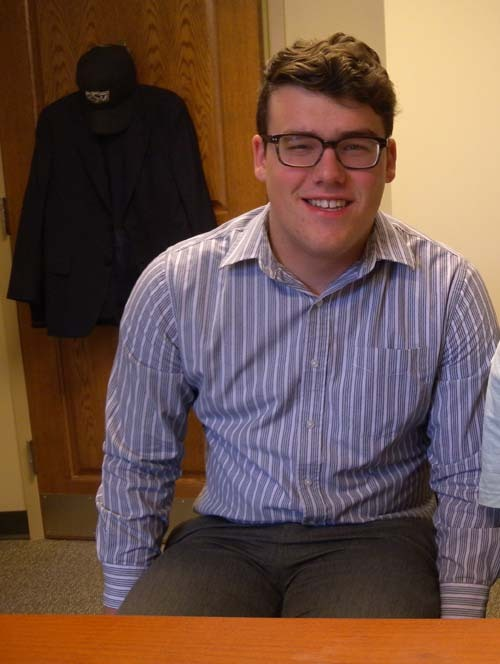  
OSU Homecoming 준비위원장인 역사학과 3학년 Lucas Mccamon군

교정을 가로질러 가다가 쎄타(Theta) 연못[\*나는 이 연못을 ‘에덴(Eden) 연못’으로 부르고 있다]가에서 점심 먹으러 나온 기러기들과 오리들, 청설모 부부를 만났다. 그런데 눈에 번쩍 뜨이는 광경은 어미 오리와 새끼[병아리]들이 나란히 혹은 충무공이 왜군들을 무찌를 때 사용했다던 학익진(鶴翼陣) 형태로 대형을 바꾸어 가며 열심히 배들을 채우고 있는 게 아닌가. 자세히 관찰하니 어미가 저 혼자 먹는 일에 몰두하는 게 아니라 가끔씩 이쪽저쪽 참견하며 아이들에게 모이 줍는 방법을 가르치고 있는 듯 했다. 그 모습이 참 아름다우면서도 ‘먹고 사는 문제’는 사람이나 동물이나 매일반이라는 점에 생각이 미치자 문득 그들이 딱하다는 생각이 드는 것이었다.

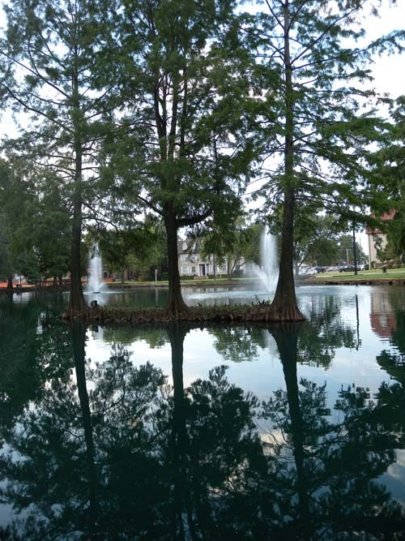  
내가 에덴의 연못[Eden's Pond]으로 고쳐 부르고 있는 'Theta Pond'

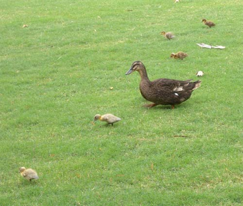  
대견한 듯 바라보는 어미오리의 표정이 느껴지시나요?

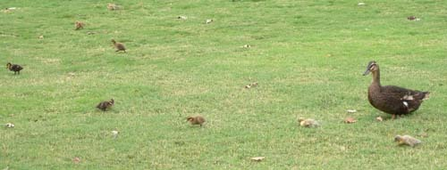  
어미오리의 걱정스런 눈빛이 보이시나요?

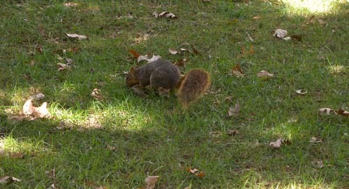  
마누라가 어디 간 줄도 모르고 열심히 뭔가를 주워먹고 있는 청설모

누가 뭐라 해도 에덴 연못에 둥지를 틀고 사는 이 친구들이야말로 천적 걱정 없이 풀밭에 널린 게 먹이일 것이니 행복한 존재들일 것이다. 그럼에도 양이 넉넉지 않은지 늘 풀 속에 부리를 박고 먹을 것을 찾고 있는 모습들이 약간 안쓰러운 건 사실이다. 참 재미있는 것은 이 연못에서 살고 있는 기러기와 오리들은 기가 막히게 나와 생체리듬이 일치하는 녀석들이라는 점이다. 내가 시장기를 느껴 창밖을 내다보면 으레 이들은 물 밖으로 몰려나와 오찬을 즐기고, 한참 있다가 다시 배가 고파 집에 가려고 연구실 문을 나서면 이들 역시 다시 내 눈길 안으로 들어와 만찬을 즐기곤 한다. 그 나머지 시간들은 물 위에서 몰려다니며 저희들끼리 장난질을 치거나 사색에 잠긴 모습을 보여주곤 한다.

 

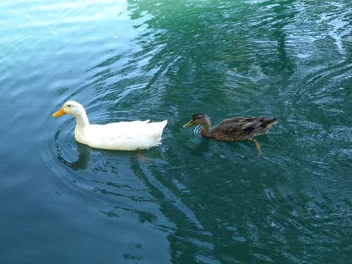  
식사를 끝내고 일상으로 돌아온 오리들

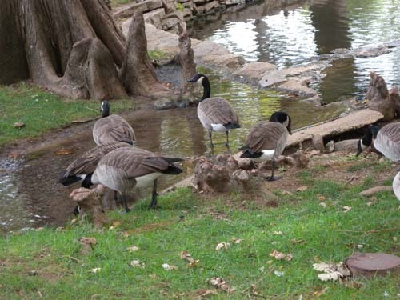  
식사를 끝내고 깨끗한 물을 마시러 모여든 기러기들

이 친구들로부터 간신히 벗어나 식당의 한 코너로 들어가니 코에 익은 육향(肉香)이 풍겨 나온다. 좀 더 다가가니 벽에 선명한 태극기와 함께 ‘이 주일의 특선 음식: 한국’이란 팻말이 걸려 있고, 곁에 만두와 쇠고기 불고기[Beef Bulgogi] 사진이 붙어 있는 것 아닌가. 사라졌던 식욕이 서서히 살아났고, 망설임 없이 배식대로 가서 ‘스팀드 라이스’에 ‘김치’와 ‘소불고기’를 얹도록 했다. 대부분 인도계 미국인들인 쿡들에게 한국음식을 누가 만들었냐고 물으니 바로 옆의 미국인을 가리켰다. 옆에서 ‘이 한국음식을 누가 만들었냐?’는 내 말을 들었는지 그가 갑자기 주눅 든 표정을 짓는다. 짐작에 한국인으로 보이는 내가 혹시 추궁하려고 자기를 찾는 줄 알았던 것 같았다. 그래서 그런지 ‘한국음식을 어디서 배웠느냐?’고 물으니 우물쭈물 얼버무리고 만다. 내가 다시 ‘한국음식을 만들어 줘서 고맙다’고 하니 그제야 표정이 환해지면서 자기도 고맙다면서 사진 촬영을 위해 포즈를 취해준다. 먹어보니 간도 맞고 달콤하며 은근한 것이 제법 흉내를 잘 낸 불고기라는 생각이 들었다. 목마른 나그네가 사막에서 오아시스를 만난 듯, 모처럼 밥알 하나 안 남긴 채 점심을 먹었다.

 

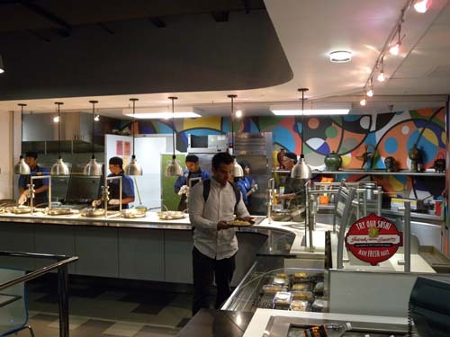  
식당의 한 코너

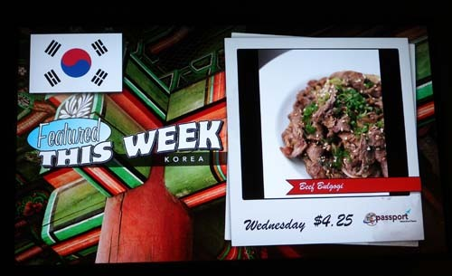  
이 식당 벽에 내 걸린 전광판 광고

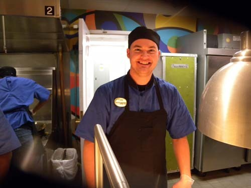   
한국요리를 만들었다는 요리사 브라이언(Brian Kreigh)씨

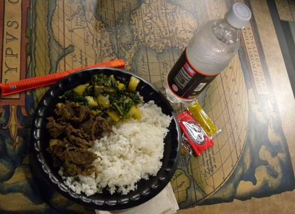  
간단하지만 맛있었던 불고기와 김치, 그리고 밥

돌아오는 길에 일부는 망울지고 일부는 피어나기 시작한 국화꽃들을 만났다. 국화꽃들의 자태를 한 눈 가득 머금고 문득 고개를 드니 화단 사이로 건물들 사이로 가을이 일렁일렁 차오르고 있었다. 뜨거운 햇살만 욕하며 쫓기듯 오고 가는 사이에 시간들은 이렇게 흘러가 버린 것이었다. 꽃밭을 지나 에덴 연못으로 오니 그 사이에 벌써 기러기들과 오리들은 점심 식사를 끝냈는지, 다시 물속으로 들어가 사색에 잠긴 모습들이다. 내가 그들을 따라 하는지, 그들이 나를 따라 하는지 알 수 없는 형국이다. 호접몽(胡蝶夢)을 꾸던 장자(莊子)마냥 ‘내가 오리인지, 오리가 나인지’ 구분할 수 없는 경지를 비로소 느끼게 되었다.

 

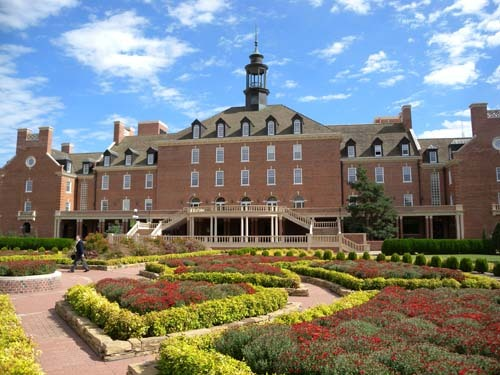  
식당가가 들어 있는 Student Union 건물

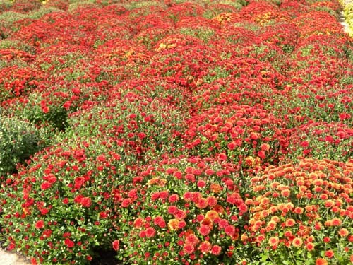  
Student Union 앞에서 만난 국화꽃들

큰 행복을 깨닫지 못하고 투덜거리다가 우연히 보니, 내 곁엔 사막 같은 정체불명의 음식들 가운데 오아시스 같은 ‘불고기’도 있었고, 나보다 훨씬 정확하고 사색적인 기러기와 오리들도 있었으며, 시간의 덧없음을 깨쳐 주는 국화꽃도 있었다.

‘개 같은 날의 오후’가 아니라 ‘무언가 행복한 일이 일어날 것만 같은 싱싱한 오후’다.

공유하기

게시글 관리

**백규서옥\_Blog ver.**