카우보이들, 풋볼의 진수를 보여주다!

언제부턴가 꼭 한 번은 ‘상암벌’에 나가봐야겠다고 마음먹은 적이 있다. 거기서 붉은 악마들과 함께 함성을 지르며 내 안에 잠자고 있는 ‘야성(野性)’을 흔들어 깨우고 싶다는 객쩍은 욕망을 슬그머니 가져본 적이 있었다. 친구들과 몰래몰래 가는 눈치를 보이곤 하던 작은 녀석은 끝내 ‘함께 가자’는 말을 건네지 않았다. 하루, 이틀, 사흘... 그렇게 내 청춘은 저물고 말았다.

유럽 여행을 하면서 몇몇 곳에 폐허로 남아있는 기원전 고대 로마의 원형 경기장[혹은 극장]에 혼자 오도마니 앉아서 흥분에 달아오른 관중들의 함성을 상상하곤 했다. 우리는 지금 풋볼[American Football]의 나라 미국, 그 중에서도 풋볼을 중심으로 아름답게 단합된 모습을 보여주는 이곳 OSU의 스틸워터에 와 있다. 한국에 있을 때 미국 하면 야구를 떠올렸지만, 이곳에 와서 느껴보니 야구나 축구는 간 곳 없고, 풋볼이 ‘짱’이었다. 이 대학에는 큰 규모의 각종 경기장들이 여럿이고, 체육관 시설도 입이 벌어질 정도다. 그러나 규모나 인기도에서 풋볼을 능가할 종목이 없고, 풋볼 경기장인 분 피켄스 스테이디엄(Boone Pickens Stadium)을 능가할 경기장도 없는 듯하다.

  
멀리서 내려다 본 Boone Pickens Stadium

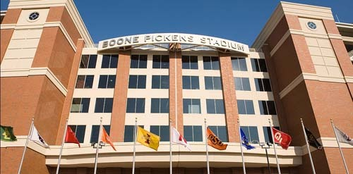  
 Boone Pickens Stadium의 앞면

우리가 이곳에 도착하면서 ‘게임데이(game day)’라는 생소한 말을 종종 들었고, 그 때마다 이 한적한 스틸워터에는 사람들이 북적대고 외부의 차들이 모여들곤 했다. 큰 주차장에는 각지에서 몰려든 RV(Recreational Vehicle) 차량들로 가득하고, 거리 곳곳을 차단하여 차량통행을 막기도 했다. 나중에서야 그것이 풋볼게임 때문이었음을 알게 되었고, 언젠가 한 번은 직접 경기장에 가서 구경하리라 마음먹게 되었다.

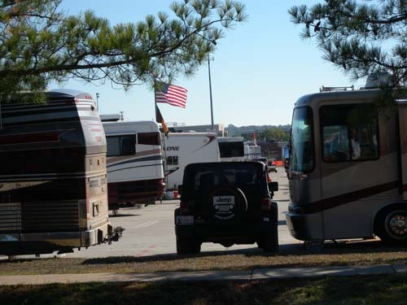  
게임데이 전날이면 이렇게 대부분의주차장에 RV들이 들어찬다

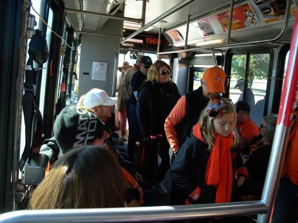  
게임데이에 사람들은 주차장에 차를 세워두고 경기장까지 셔틀버스를 이용한다

그러나 티켓을 구하기 어려웠다. 들리는 바에 의하면 거의 1년 전부터 대부분의 티켓이 매진된다는 것이었다. 가끔씩 온라인 사이트에 엄청 비싼 표들이 등장하거나 경기 당일 암표 등을 팔기도 하지만, 그마저도 손에 넣기가 쉽지 않았다. 그런데 우리에게 뜻하지 않은 행운이 찾아왔다. OSU 대학원에서 테솔[Tesol; Teaching English to Speakers of Other Languages]을 전공하는 이웃집의 제이슨[Jason Culp]이 풋볼 티켓 두 장을 건네준 것이다. 아내와 장모가 부득이한 사정으로 구경을 못 가는 바람에 남게 된 두 장의 티켓을 우리에게 선물로 건넨 것이었다.

미국 도착 거의 두 달 만에 드디어 미국 Big 12 경기연맹[Oklahoma State, Oklahoma, Texas Tech., Bayolr, Texas, TCU, West Virginia, Kansas, Kansas State, Iowa State] 에서 가장 오래되고 멋진 풋볼 경기장이자 미국 전역의 캠퍼스 안에 있는 것으로는 최고 경기장들 가운데 하나인 OSU의 분 피켄스 스테이디엄에서 난생 처음으로 풋볼 빅게임을 즐기게 된 것이다. 

오전 10시 40분 입장. 장관이었다. 경기는 11시부터 시작된다는데 관객 6만 명을 수용한다는 스탠드는 온통 빈틈없는 오렌지 물결로 이미 꽉 들어차 있었다. 학교의 상징색인 오렌지 색 의상들을 입고 응원도구를 들고 나온 학생, 동문, 시민들이 경기장 3면을 가득 메우고 있었다.[이 경기는 매년 이 시기에 열리는 ‘홈커밍데이(Home Coming Day)’의 메인 이벤트였다] 그라운드에는 식전 행사가 화려하게 펼쳐지고, 스탠드에서 운동장으로 몰려 내려오는 함성은 지축을 울렸다. 스틸워터 4만 7천의 인구에서 학생과 직원을 합쳐 2만 남짓을 빼면 2만 6천이 남을 것이니, 말하자면 OSU 학생, 교직원, 동문, 스틸워터 시민 등이 총동원 되어 스탠드의 6만을 구성하고 있었다는 얘기다. 우리로서는 놀라운 ‘팀스피릿(Team Spirit)’의 현장을 목격하게 된 것이었다.

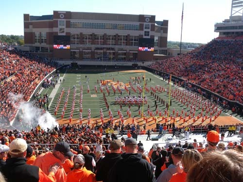  
게임 시작 전의 행사

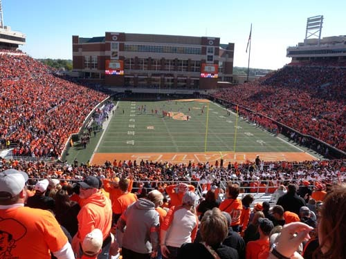  
게임은 시작되고

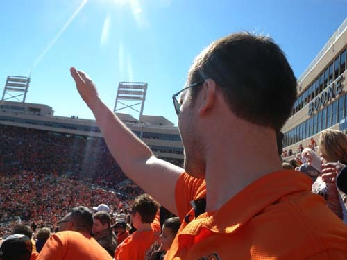  
관람석에서 OSU 식 응원을 보내는 제이슨

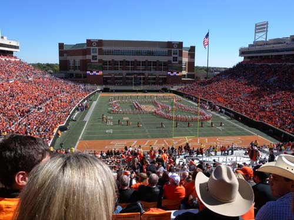  
2쿼터 이후의 막간 행사

경기는 4쿼터로 진행되었다. 각 쿼터 15분씩이었으나, 경기 진행상의 수시 중단, TV 광고를 위한 막간 공연, 작전타임 등이 추가되면서 11시에 시작된 경기는 오후 2시 30분이나 되어서야 끝이 났다. 경기 내내 OSU 카우보이 팀과 텍사스 크리스찬 유니버시티 팀 간의 공방이 숨 막히게 벌어졌고, 대부분 홈팀의 응원자들인 스탠드의 관객들은 질서정연하게 일어나 손을 내뻗으며 ‘OSU Cowboys!’를 연호했다. 그 덕인가. 카우보이 팀은 TCU를 24:10으로 이기고 학생, 동문, 시민들에게 홈커밍의 큰 선물을 안겨 주었다. 경기를 보면서 그것이 서부 개척시대의 ‘랜드 런(Land Run)’으로부터 나온 느낌을 받았을 만큼 ‘미국 정신(American Spirit)’을 듬뿍 느낀 3시간여의 호쾌한 경험이었다.

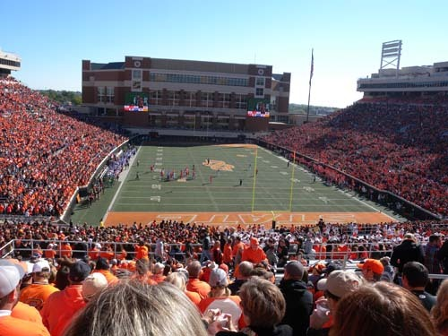  
                   경기를 벌이고 있는 양팀 선수들

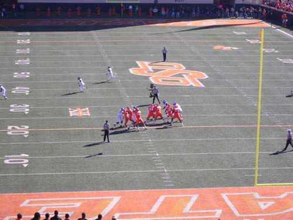   
                    경기장에서 열전을 벌이는 양팀 선수들

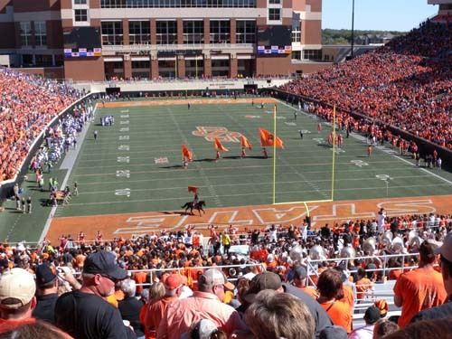  
                              카우보이팀이 득점을 하자 카우걸이 말을 타고 등장한다               

OSU의 졸업생 분 피켄스가 2003년 대학 역사상 단일 기부로는 최대 액수인 7억 달러를 쾌척하여 세운 이 경기장. 그는 2005년 다시 16억 5천만 달러를 기부하면서 대학교 체육 경기 분과에서 수령한 기부금으로는 최대액수를 기록하게 되었다. 그 덕에 최첨단 시설을 갖춘 이 경기장은 OSU와 풋볼 팀에게 환상적인 ‘게임데이’를 가능케 하는 환경을 선사했을 뿐 아니라, 다른 대학들과는 비교할 수 없을 만큼의 지근 거리에 최고 경기장을 마련하여 학생들은 물론 시민들에게도 좋은 경기를 직접 관람할 수 있는 기회를 제공하게 된 것이다. 뿐만 아니라 이 경기장에는 풋볼 사무실, 미팅 룸, 스피드 및 컨디션 센터, 라커룸, 시설관리실, 선수 의료센터, 미디어 시설실, 명예의 전당, 트레이닝 테이블 뿐 아니라 크고 작은 무수한 공간들이 복합적으로 구비되어 있었다.

사람들과 함께 경기장으로부터 밀려나오면서 미국인들의 장점 세 가지를 깨닫게 되었다. 단합정신, 모교 사랑, 질서 등이었다. 가장 기초적이면서도 우리가 실천하지 못하는 그 세 가지에서 그들이 우리보다 앞선 요인을 찾는 것이 과연 부질없는 일일까.

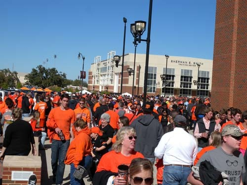  
                            경기가 끝나고 나오는 관객들의 모습   
  
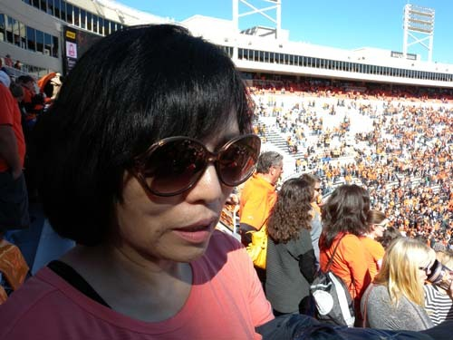   
                 관람석에서 Melania   
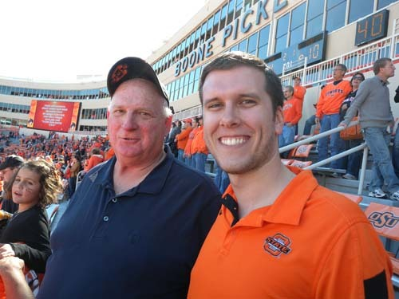  
            관람석에서 Jason과 그의 Father-In-Law

공유하기

게시글 관리

**백규서옥\_Blog ver.**