리틀 사하라(Little Sahara)에서 되찾은 고향의 꿈

한정된 주말이나 휴일을 이용한 문화답사는 결코 포기할 수 없는 우리의 특권이다. 그러나 그 일정들이 주로 박물관에 집중되다보니 답답함이 밀려드는 요즈음이다. 물론 도시와 도시, 박물관과 박물관을 옮겨 다니다 보면 주변에 펼쳐지는 자연이나 도시환경의 변화를 목격하게 되는 건 사실이다. 지금 우리가 주목하고 있는 오클라호마 서북부는 자연이나 도시환경만으로 보아도 특이한 지역이다. 모처럼 큰 아이가 합류한 며칠 사이에 좀 더 많은 걸 체험해야 한다는 Melani의 강력한 주장을 따르기로 하고, Waynoka로 향했다.

웨이노카로 가는 길은 멀고도 황량했다. 가도 가도 끝없는 평원의 연속이었다. 저 혼자 끄덕거리며 작업을 하고 있는 메뚜기 모양의 원유 채굴기나 느릿느릿 고개를 들어 낯선 이방인들을 쳐다보는 목장의 검정소들 외에 모든 것이 정지된 침묵의 공간이었다. 도중에 지나치거나 만난 대부분의 도시[도시랄 것도 없는 작은 부락 수준으로 우리로 치면 70년대 면 소재지 정도]들은 이미 많이 퇴락되어 있었다. 사람들은 도시로 떠나고 상가들은 텅텅 비어 있었다. 사람이 떠난 이후 기름기가 빠진 건물들은 초창기 서부영화에서 갱들과 레인저들 사이에 총격전이 벌어지곤 하던 주막집 세트와 흡사했다. 이곳에 그 유명한 사막이 있었다. 이름 하여 ‘Little Sahara’. 이 지형을 발견한 사람들은 사하라 사막을 떠올렸을 것이다. 미국 땅에도 사막은 많았다. 그러나 우리가 본 대부분 사막들에 풀들은 자라고 있었다. 미국인들은 이곳 빼고 사하라 사막처럼 고운 모래밭이 넓게 펼쳐진 사막을 발견하지 못했을까. 유독 이곳에만 ‘리틀 사하라’란 이름을 붙였으니 말이다.

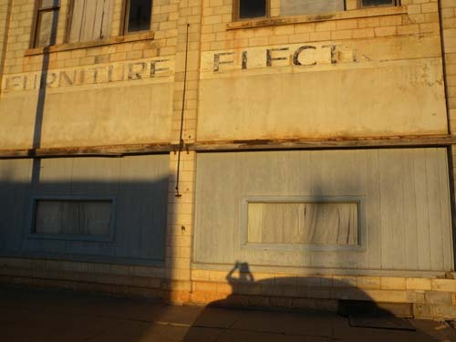  
기름기 빠진 웨이노카 시내 상가의 모습(가구점과 전기기구상이 있던 흔적만 남아 있다)

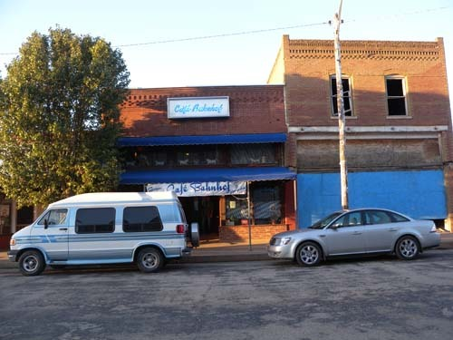   
웨이노카 상가들 가운데 살아있는 단 한 곳, 독일식당 '까페 반호프'

오클라호마 주 우드(Woods) 카운티에 속한 1,600 에이커[acres, 650ha] 넓이의 리틀 사하라[북위 36도 31분 59초/서경 98도 52분 55초]에 내가 호기심을 갖게 된 데는 특별한 이유가 있었다. 바로 그 옛날의 내 고향에도 ‘리틀 사하라’가 있었기 때문이다. 내 유년기의 꿈과 상처를 오롯이 받아들여준 그 모래언덕들은 인간들의 탐욕에 철저히 망가져 이젠 단 1%도 그 시절의 모습을 갖고 있지 않다. 리틀 사하라는 과연 어떻게 생겨났고, 어떤 과정을 거쳐 오늘날까지 지탱할 수 있었으며, ‘잘 노는’ 미국인들은 과연 어떻게 이 공간을 활용하고 있는지 아주 많이 궁금했다.

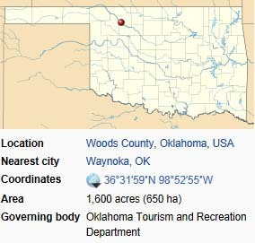  
오클라호마 지도에 붉은 점으로 표시된 리틀 사하라

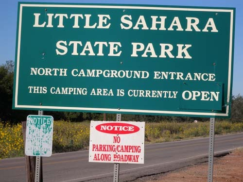  
리틀 사하라 표지판

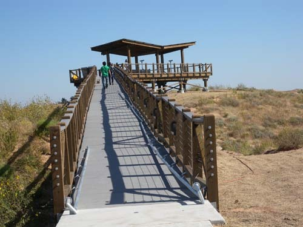  
리틀 사하라 전망대

서부 개척시대의 여관 풍으로 지어진 웨이노카 유일의 모텔에 짐을 풀고, 두어 개 있다는 식당 가운데 독일인이 운영한다는 곳으로 갔다. 시내의 상가들은 우리가 거쳐 온 여느 도시들과 마찬가지로 텅 비어 있었다. 식당 가득 독일 냄새가 풍겼다. 아주 오랜 시간이 걸려 주문한 음식이 나오고 나서 주인 겸 셰프가 우리 식탁으로 찾아왔다. 우리가 한국에서 왔다고 하니 특별한 관심을 보이며, 우리의 귀에 대고 신세한탄을 내뱉는다. 이곳에 건너 온지 17년 되었으며, 아직도 독일 국적을 갖고 있노라고, 이곳 사람들[어쩜 그는 미국 사람들 전체를 그렇게 싸잡아 보려는 것 같긴 했지만]이 ‘바보 같다[idiot!]’고, 귓속말로 속삭이며 답답함을 털어놨다.

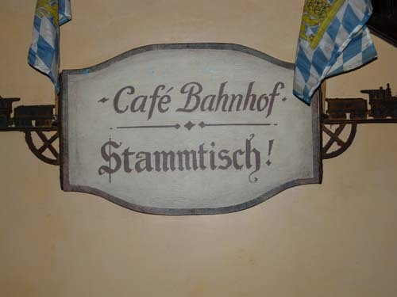  
까페 반호프의 간판

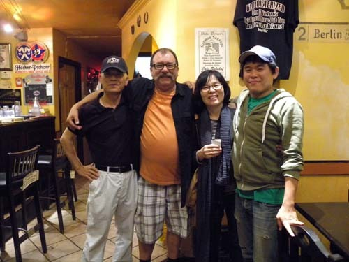  
식사 후 독일식당 주인과 함께

그렇게 낡고 퇴락된 분위기의 웨이노카에서 하룻밤을 묵은 다음 아침 일찍 리틀 사하라 탐색에 나섰다. 사하라를 탐색할 수 있는 특수 차량을 대여해주는 곳은 단 한 집. 그 집에서 ATV[All-Terrain Vehicle]를 빌렸다. 아무리 험한 길도 거뜬히 갈 수 있고, 넘어지거나 바퀴가 파손될 위험이 전혀 없는, 배기량 700cc의 탱크 같은 4륜구동의 특수차량이었다. 엑셀러레이팅 노즐 스위치를 밀자마자 굉음을 내며 달리는 ATV에 몸을 싣고 우리는 리틀 사하라의 탐사에 나섰다. 미루나무[cotton wood]와 유카(yucca)나무들이 군락을 이룬 숲길을 뚫고 지나자 풀 한 포기 보이지 않는 완벽한 사막이 펼쳐졌다. 모래밭에는 이미 많은 사람들이 거쳐 간 듯 ATV의 궤적들이 어지러이 그려져 있고, 모래 언덕을 오르내리며 묘기를 부리는 사람들도 멀리 보였다.

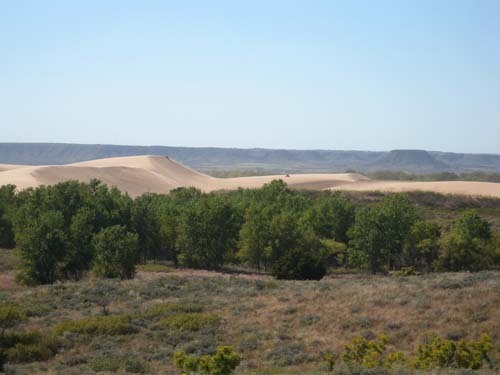  
전망대에서 멀리 바라보이는 리틀 사하라

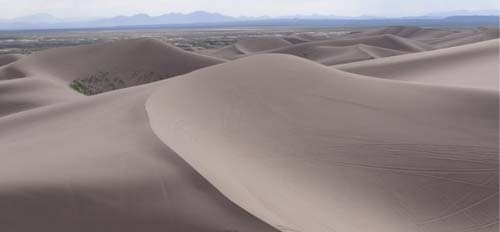  
리틀 사하라의 곡선들

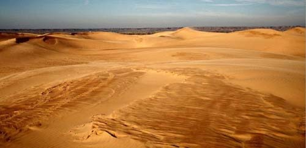  
리틀 사하라의 한 복판

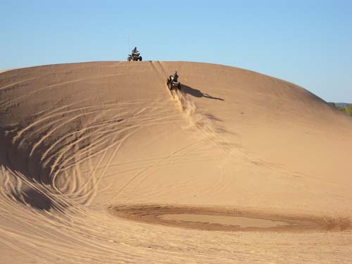  
모래언덕을 유린하는 ATV들

모래 벌을 헤치며 달려 나가자 간간이 오아시스 형태의 웅덩이들이 형성되어 있고, 그 곁엔 이미 죽은 나무의 잔해와 죽어가는 나무 몇 그루가 애처롭게 서 있었다. 죽은 자를 바라보며 자신의 멀지 않은 운명을 절감하는 인간들처럼 그들 역시 순환하는 생명의 법칙을 깨닫고 있는 걸까. 대략 7 미터에서 20여 미터 높이에 달하는 모래 언덕들은 이제 생명 잉태의 가능성을 포기한 듯 ATV들의 딱딱한 바퀴들에 마구 유린되고 있었다. 수천 년 간 바람이 불어 올려 만들어 놓은 모래 언덕은 흡사 솜을 쌓아 놓은 듯 푹푹 빠져 들어갔다. 그 언덕을 오르내리며 이미 사라진 고향의 모래언덕들을 떠올렸음은 물론이다. 잘만 보존했다면 멋진 자연유산이 될 수 있었고, 천연 학습장이 될 수 있었을 텐데. 탐욕에 눈 먼 인간의 무지가 없애버리고 만 것이다. 내 고향의 사하라를 말이다.

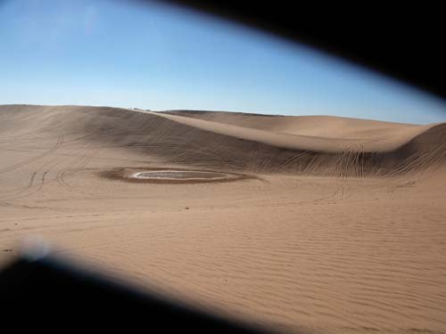  
리틀 사하라와 작은 오아시스

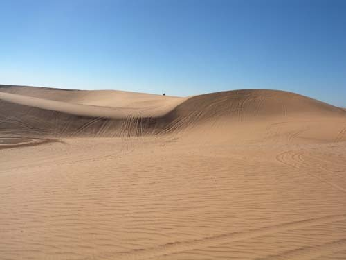  
리틀 사하라의 곡선과 평면

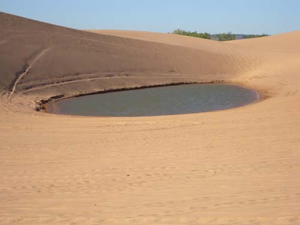  
또 다른 오아시스

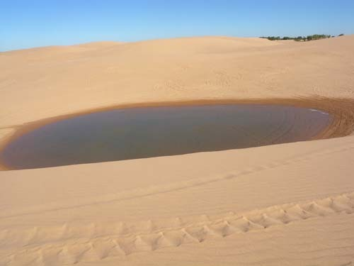  
또 다른 오아시스

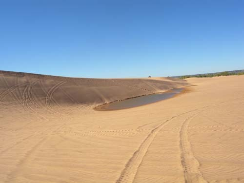  
또 다른 오아시스

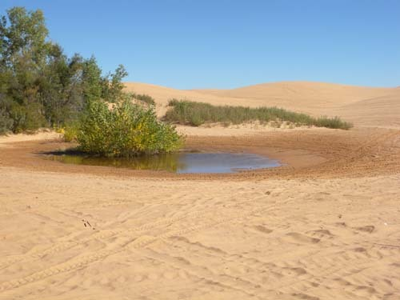  
나무가 자라는 오아시스

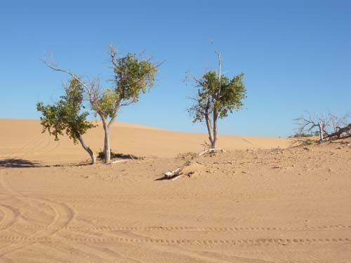  
다 죽은 나무와 죽어가는 나무들

우리가 굉음을 울리며 오르내리는 이 모래 둔덕도 조만간 사라져 형체를 알아볼 수 없게 될 것이다. 사물의 근저까지 꿰뚫어야 만족하고 마는 너와 나의 호기심은 미래의 삶터로 남겨 둬야 할 자연의 조화까지 무너뜨리고 있는 것 아닌가. 인간의 오만과 이기심이 재앙일 수밖에 없는 것은 바야흐로 무너져 가는 자연을 통해서 알 수 있다. 위대한 자연이 펼쳐진 이곳에서 새삼 옷깃을 여미고, 새삼 내 얕고 가벼운 욕망을 반성해 본다.

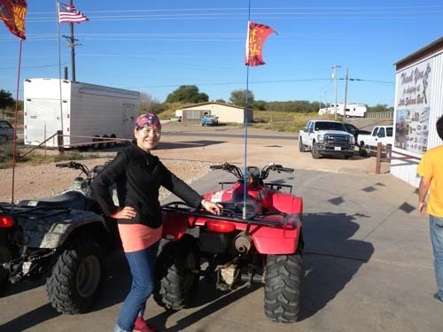  
ATV 대여점에서 Melani

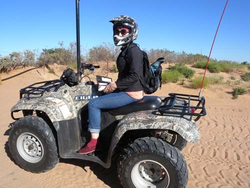  
리틀 사하라 입구에서 Melani

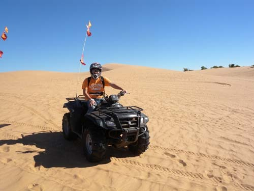  
리틀 사하라의 Kyung

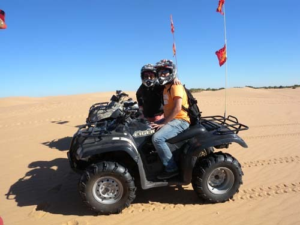  
Melani and Kyung in Little Sahara

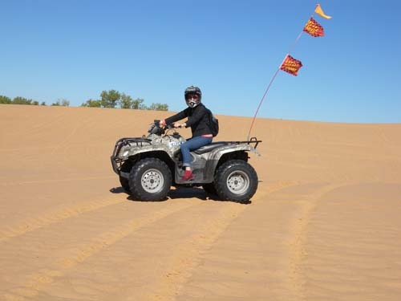  
Melani pausing on ATV

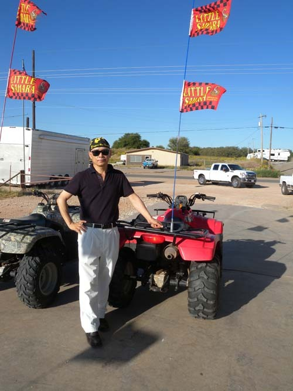  
Baek-Kyu by ATV

공유하기

게시글 관리

**백규서옥\_Blog ver.**