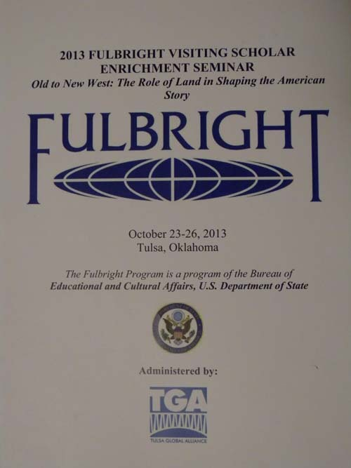
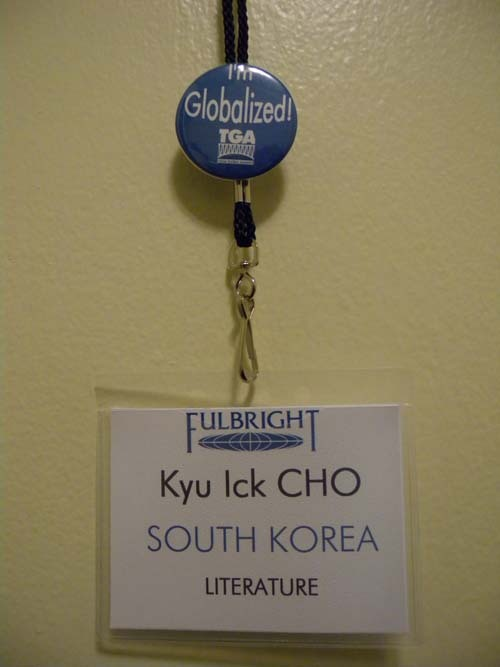
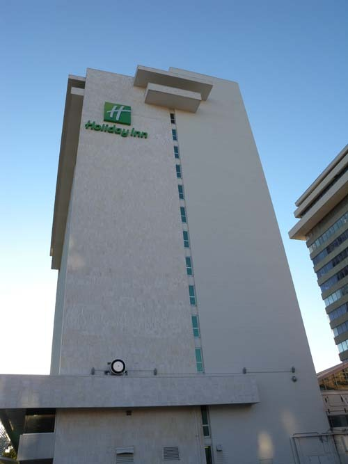
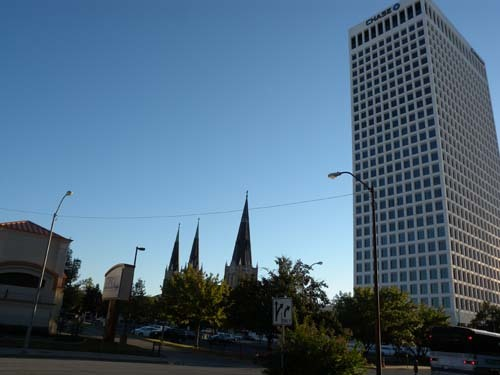
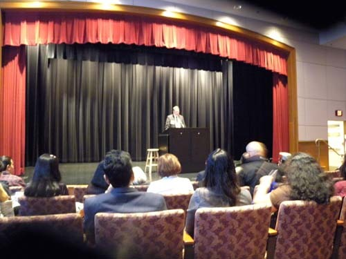
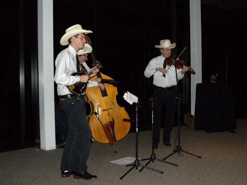
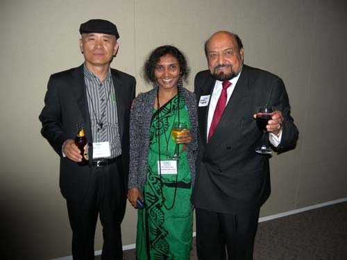
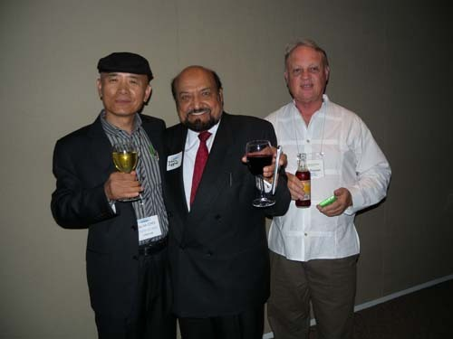
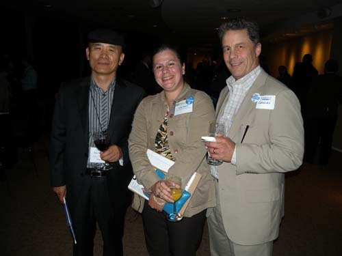
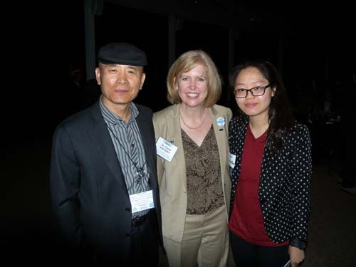

**아메리카 인디언 보호구역에서 미래의 꿈을 찾다!**

2013년 풀브라이트 방문 학자 발전 세미나[2013 Fulbright Visiting Scholar Enrichment Seminar]에 다녀와서

         제1일차-치밀한 미국인들

풀브라이트의 지원 대상으로 선정되어 미국 내 대학을 비롯한 연구기관들에 체류하고 있는 학자들은 기간 중 최소 1회 이상 3박4일의 발전 세미나에 참석해야 한다는 규정이 있다. 최근 나는 미리 3회까지의 시기와 주제만을 알려 준 다음, 신청을 받아 배정하는 풀브라이트 측[CIES(Council for International Exchange of Scholars, 즉 ‘국제 학자 교류 위원회’) Enrichment Seminar Team]의 기발한 아이디어에 혀를 내두르게 되었다. 광대한 미국 땅에서 미리 장소를 알려 준다면 대개 한쪽으로 몰릴 수 있기 때문에 고안해낸 지혜였을 것이다. 그들이 제시한 주제들은 다음과 같다.

1. 옛날의 서부에서 새로운 서부로: 미국 스토리의 형성에 기여하는 땅의 역할 [Old to New West: The Role of Land in shaping the American Story](10/23-26)

2. 법의 지배: 인권과 정의[Rule of Law: Human Rights and Justice](11/20-23)

3. 사회적 기업가 정신: 혁신하는 비영리 단체들과 발전하는 공동체들[Social Entrepreneurship: Innovating Nonprofits Developing Communities](2014 3/19-22)

모두 유익했으나, 그래도 나와 가까운 쪽은 1번이었다. 1번을 1순위, 2번을 2순위로 선택하여 신청했으나, 1번의 지원자가 많아 부득이 나를 대기표에 올렸다는 연락이 왔다. 어쩔 수 없이 2번으로 갈 각오를 하고 있던 차 9월 28일에 ‘털사 전 지구 연합[Tulsa Global Alliance, 약칭 TGA]’에서 이메일이 왔다. 국무성의 지원을 받아 1번을 주제로 자신들이 이번 세미나를 주관하게 되었으니, 신청할 사람은 하라는 연락이었다. 대기표에 올려놓았다던 나에게까지 연락한 것을 보면, 막상 뚜껑이 열려 멀리 떨어져 있는 오클라호마의 털사시티(Tulsa City)가 세미나 장소임을 알게 된 상당수의 사람들이 포기한 모양이었지만, 나로서는 ‘사막 속의 단비’인 셈이었다.

스틸워터에서 차를 몰고 달리면 1시간 남짓 걸리는 털사가 아닌가. 어차피 풀브라이트에서 비행기 표를 비롯한 모든 비용을 대 주는데 이왕이면 여행하는 셈 치고 먼 곳으로 가는 게 좋지 않으냐는 주변 사람들의 권유도 있었지만, 썩 좋지도 않은 미국 비행기들을 갈아타면서까지 여행하고 싶은 마음은 추호도 없었고, 무엇보다 1번 주제가 내겐 환상이었다. 10월 12일 TGA가 보내 준 Overview[행사개요]를 보고는 더더욱 가슴이 설렜다. 이 지역 인디언들의 삶과 문화에 대한 탐구가 세미나 내용의 핵심이었기 때문이다.

\*\*\*

모든 것이 결정되면서 주최 측의 주도면밀함이 감지되었다. 미국 전역에 흩어져 있는 참석자들[이번에는 40개국 70명의 학자들]의 교통편과 숙박 및 식사 주선, 세미나 장소 마련, 강사 및 패널리스트 섭외, 자원 봉사자 동원, 이동 차편 마련, 현장 견학 등 행사 전반의 일정을 짜고 조정하는 일들일 텐데, 사실 가까이에 사는 내가 오히려 쉽지 않은 존재였을 것이다. 다른 사람들은 비행기 표를 사서 보내주고 공항에 픽업을 나가면 그만이지만, 내 경우는 나 스스로 차를 몰고 가거나 주최측이 누구를 보내서 라이드를 해 주어야 했기 때문이다. 사실 나는 내 스스로 차를 몰고 갈 생각을 하고 있었으나, 규정상 그렇게 해서는 안 되는 모양이었다.

TGA의 행사 책임자 Bob Lieser씨와 이곳 역사학과 학과장 사이에 몇 번의 이메일이 오고 가는 것 같더니 최종적으로 내게 이메일이 왔다. 스틸워터에 있는 OSU 메인 캠퍼스와 OSU 털사 캠퍼스를 왕래하는 셔틀버스[Orange Big Bus]에 자리를 예약해 놓았고, 털사에 도착하는 대로 Mr. Clark Frayser가 픽업을 나갈 것이며, 세미나가 끝나고 돌아오는 날엔 Dr. Ron Bussert가 스틸워터의 집까지 나를 태워다 준다는 구체적인 계획을 통보해 주는 것 아닌가. 참으로 한 치의 빈 틈도 보여주지 않는 그들이었다. 내가 만약 이런 행사를 주관했을 경우, 참가자가 스스로 차를 몰고 오겠다고 한다면 얼마나 반가웠을까. 규정과 원칙을 철저히 지키려는 이들의 자세가 첫판부터 범상치 않았다.

\*\*\*

23일 오후 3시 10분. OSU 털사 캠퍼스에 도착하니 클라크 씨가 차를 대놓고 내가 나타나기만 기다리고 있었다. 그 차로 호텔[Holiday Inn City Center]에 도착하여 등록 후 체크인을 한 것이 3시 30분. 방에서 쉬다가 5시 정각에 호텔 2층의 시마론 포이어(Cimarron Foyer)와 테라스 등에서 간단한 음식을 들며 참석자들끼리 환담을 나누다가, 버스를 타고 세미나 장소인 길크리스(Gilcrease) 뮤지엄[미국통신 12 참조]으로 이동했다.

  
TGA에서 만들어 참가자들에게 나누어 준 일정표

  
세미나 기간동안 패용한 명찰

  
참가자들의 숙소[Holiday Inn City Center, Tulsa]

  
호텔 방에서 내다 본 털사 다운타운의 모습[가운데 첨탑 건물은 성가족 성당]

뮤지엄 강당에서 열린 행사의 내용은 ‘환영사와 기조연설’이었는데, 털사 대학교 세계교육 담당 교무 부처장인 셰릴 박사(Dr. Cheryl Matherly), 미 국무성 교육문화국 성인 프로그램 매니저인 레빈(David Levin) 씨, IIE[Institute of International Education, 국제 교육 연구소]의 캠벨(Kristin Campbell)씨, 털사 대학교의 길크리스 박물관 담당 부총장인 듀안 킹 박사(Dr. Duane King) 등의 간단하면서도 인상적인 환영사에 이어 털사 대학교 역사학과 명예교수인 론다 박사(Dr. James Ronda)로부터 ‘미국 서부의 발견[Finding the American West]’이란 주제의 기조연설을 들었다. 그는 미국 서부의 광범한 역사를 소개한 다음 서부를 이해하고 감상하기 위한 핵심 장소로 오세이지(Osage) 카운티를 지적했다. 뿐만 아니라 그는 넓은 의미의 서부, 특히 오클라호마가 갖고 있는 무궁한 현실적 의미와 한계를 설파했고, 우리가 내일 보게 될 Tall Grass Prairie[대초원, 이하 TGP로 약칭]가 갖고 있는 인간적・물질적 경관의 의미를 이해해 줄 것을 강조하기도 했다.[우연이겠지만, 그는 강연 서두에 오클라호마 주를 소개하면서 "Oklahoma State is taller than South Korea."라고 '콕 집어' 말했는데, 미국의 1개 주보다 작은 나라에서 온 나로서는 '우리의 현실'에 대하여 착잡한 마음이 들기도 했고, 작은 나라를 바라보는 그들의 관점이 궁금하기도 했다.]

  
기조발표를 하는 Dr. James Ronda

\*\*\*

7시 30분. 우리는 박물관의 비스타 룸(Vista Room)으로 이동,하여 Rick Morton, Nathan Eicher, Isaac Eicher 등 3인조 스윙밴드(swing band)의 서부 지역 컨트리 뮤직인 블루그라스를 감상하며 첫날의 만찬과 대화를 즐겼다. 그 자리에는 오클라호마 지역의 풀브라이트 동문들, 털사 커뮤니티의 지도자들, TGA 관리 이사들, 기업 회원 등 많은 지역 유지들이 초대되었는데, 그 가운데 이색적인 인사가 바로 인디언 출신의 이 지역 최고 기업가 메슈리 박사[Dr. Dayal T. Meshri]였다. ARC[Advance Research Chemicals, Inc.]의 CEO인 그는 나를 만나자마자 한국에 대한 좋은 인상을 반복하여 강조했다. 특히 현대자동차를 방문한 일과 부산에서 술을 마시던 추억을 크게 말하며 호탕하게 웃는 그에게 호감을 느낀 것은 그와 나 사이에 어떤 소통의 끈을 공유하고 있다는 점 때문이었을 것이다.

  
만찬장에서 연주하고 있는 3인조 밴드

  
만찬장에서 스리랑카의 학자 Dr. Asanthra, 인디언 출신 CEO Dr. Dayal T. Meshri와 함께

  
만찬장에서  Dr. Dayal T. Meshri, Mr. Clark Frayser와 함께

  
만찬장에서 TGA 대표 Ms. Becky 및 Mr. Charles와 함께

  
만찬장에서 Mr. Clark Frayser와 함께

  
만찬장에서 Dr. Cheryl Matherly, 털사대학교 한국인 학생 김세연과 함께

\*\*\*

9시쯤 만찬이 끝났다. 첫날의 몇 시간을 보내며 나머지 일정도 빡빡하게 진행될 것임을 예측할 수 있었다. 그리고 우리가 세미나 기간에 무엇을 배워야 할지 뚜렷한 방향을 잡을 수 있었다. 무엇보다 40개국에서 몰려든 70명의 학자들이 영어라는 기호 하나로 훌륭하게 소통하는 모습을 보며 새삼 영어와 미국의 현실적인 힘을 느끼기 시작했고, 덩치와 어울리지 않게 모든 일들을 꼼꼼하고 정확하게 처리하는 미국인들의 일거수일투족을 보며 나와 우리의 ‘쓸데없이 대범함’에 일순 부끄러움을 느끼기 시작했다. 매 순간 톱니바퀴처럼 ‘철저한 정확성’을 중시하는 이들의 모습을 통해 “대충 해!”라는 상투어야말로 나와 우리의 진로를 막는 커다란 돌덩어리임을 깨닫게 된 것은 세미나 첫날에 얻은, 무엇보다 큰 수확이었다.

공유하기

게시글 관리

**백규서옥\_Blog ver.**