2013년 풀브라이트 방문학자 발전 세미나[2013 Fulbright Visiting Scholar Enrichment Seminar]에 다녀와서

제2일차-대초원[Tall Grass Prairie]에서 멋진 ‘울음 터’를 발견하고

연암 박지원은 중국에 사신으로 가다가 요동벌판을 만나자 “멋진 ‘울음 터’로다. 크게 한 번 울어볼 만 하도다!”라고 소리쳤다. <<열하일기>>의 이른바 ‘호곡장(好哭場)’이 그것.

8시에 버스 두 대에 분승한 우리들은 2시간여를 달려 드디어 광활한 초원으로 들어섰다. 작은 키, 중간키, 큰 키의 각종 풀들이 끝이 보이지 않는 대지에 깔려 있고, 저 멀리 검고 흰 소떼가 대지에 주둥이들을 박은 채 풀 뜯기에 여념이 없었다. 간간이 관목지대가 보이지 않는 것은 아니로되, 온통 풀밭이었다. 미국인들이 ‘Tall Grass Prairie’[이하 ‘TGP’로 약칭]라고 부르는 자연 초지(草地)였다. 풀만 있는 게 아니었다. 드문드문 원유 채굴기들이 끄덕거리며 서 있고, 땅 속에서 퍼낸 원유와 가스를 저장하는 탱크들도 보였다. 말하자면 땅 위에는 달디 단 젖과 고기를 만드는 영양 만점의 풀이 그득하고 땅 밑에는 인류문명을 지탱하는 또 다른 젖인 원유가 고여 있으니, 이 나라는 대체 어찌하여 이런 복을 타고 났단 말인가.

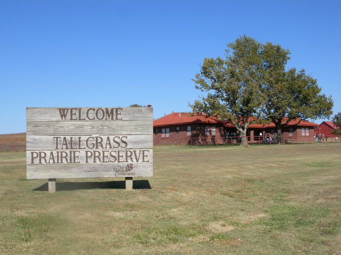  
Tall Grass Prairie Preserve 표지판과 뮤지엄

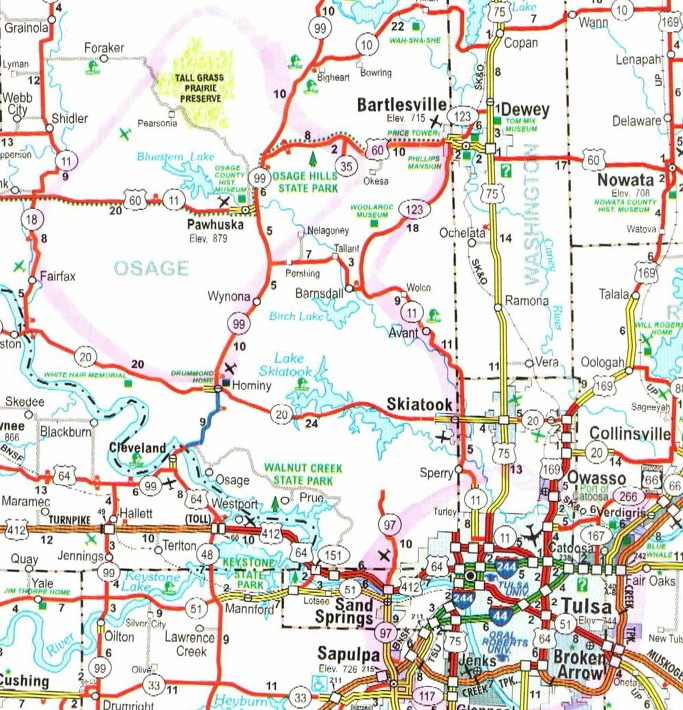  
털사 시티와 오세이지 보호구역 및 톨그래스 프레이리가 나온 지도

연암은 “사람들은 오직 슬플 때만 우는 줄 알고, 칠정(七情) 모두에 울 수 있다는 건 모른다네. 기쁨이 사무쳐도 울게 되고, 노여움이 사무쳐도 울게 되고, 슬픔이 사무쳐도 울게 되고, 즐거움이 사무쳐도 울게 되고, 사랑이 사무쳐도 울게 되고, 미움이 사무쳐도 울게 되고, 욕심이 사무쳐도 울게 되지.…울음이란 천지간에 우레와도 같은 것. 지극한 정이 발로되어 나오는 것이 이치에 맞아든다면 울음이나 웃음이나 무엇이 다르겠는가.”

그렇다. 기뻐도 슬퍼도 울 수 있는 것은 연암 뿐 아니라 인간이면 누구나 마찬가지다. 내가 ‘대초원’을 ‘울음 터’로 생각한 것은 나의 왜소함을 비웃는 듯한 그 광활함이 첫 번째 이유였고, 허허로운 듯한 외피 속에 그득 담긴 가멸찬 풍요, 그리고 그로부터 느끼는 상대적인 빈곤이 둘째 이유였다. 60 가깝도록 손바닥만한 풀밭에서 소꿉장난하듯 살아온 인생의 눈에 광대한 대초원에서 느끼는 놀라움과 부러움이 바로 내 울음의 근원이었다. 연암도 그랬으리라. ‘들판에서 해가 떠서 들판으로 지는’ 그 요동벌판을 보며 호연지기(浩然之氣)를 느끼기도 했겠지만, 그보다는 가난하고 좁디좁은 조선 땅과 백성들을 먼저 생각하지 않았겠는가?

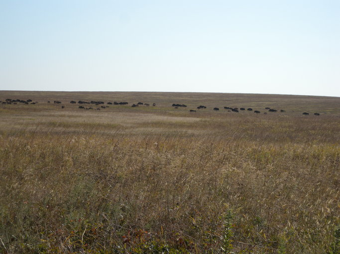  
대초원의 한복판에서 풀을 뜯고 있는 바이슨 무리

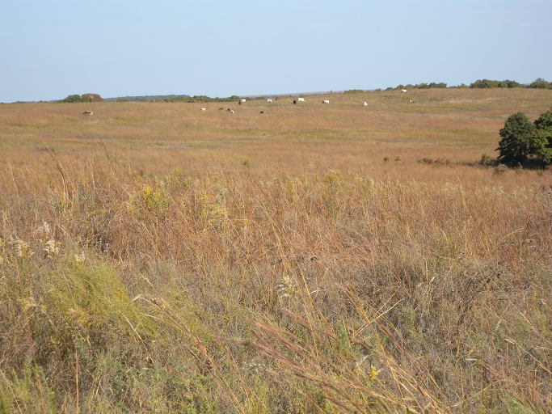  
대초원 저편에서 풀을 뜯고 있는 흰소와 검정소들

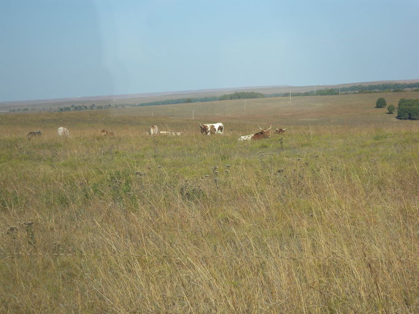  
대초원의 느긋함을 즐기고 있는 long horn cows

\*\*\*

두 대의 버스는 호텔로부터 두 시간 가량 달려 TGP로 들어섰다. 까마득히 넓어 가장자리가 보이지 않는 대초원. 안내자로 나선 자원봉사자의 설명을 들으며 초원 사이로 난 트레일을 느릿느릿 달리는 버스의 창을 통해 그 넓이를 마음으로나 가늠할 뿐이었다.

오세이지(Osage) 카운티에 속해 있으며, 포허스카(Pawhuska) 다운타운으로부터 근거리에 위치한 TGP. 초원 보호구역으로는 지구상에 남아 있는 가장 큰 역사의 현장이자 유물인 셈이다. 원래 텍사스로부터 마니토바(Manitoba)까지 14개 주의 부분들을 포함하고 있었으나, 도시의 확장과 농지의 전용으로 남아 있는 공간은 원래에 비해 겨우 10% 정도라 한다. 엄청난 크기와 기괴한 표정의 검정 소 바이슨(bison)들이 무리를 지어 주인 행세를 하고 있는 생태공간이다.

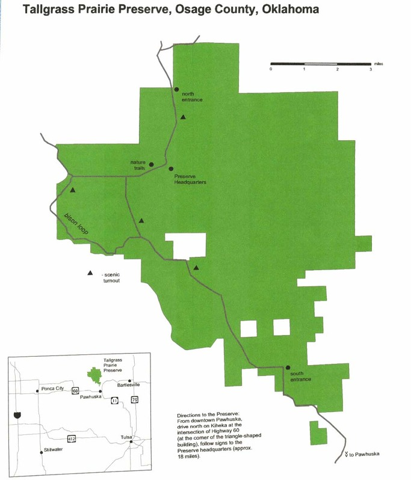  
                                           톨그래스 프레이리 구역도       

TGP의 관문인 포허스카는 19세기 이래 오세이지 부족의 중심역할을 해온 도시인데, 오세이지 족은 갠자스에 있는 보호구역의 땅을 팔고 포허스카를 둘러싼 땅을 새로 사들였다고 한다. 지나면서 얼핏 보기에 새 집들이 많이 들어서 있으나, 이 구역의 오세이지 인디언들은 자신들의 전통적인 생활양식을 계속해 오고 있다 한다. 그러나 석유의 발견으로 그들은 농업과 목축으로부터 벗어나 지구상에서 가장 부유한 민족 그룹들 가운데 하나로 변신하게 되었다는 것. 지금 오세이지 족은 자기들 땅의 광물 채굴권을 갖고 있으며, 특히 석유와 가스는 오세이지 부족원들 뿐 아니라 그들 영역 안에 사는 다른 부족원들에게도 이익을 주는 수입원으로 이용되고 있었다.

TGP는 1986년 이래 오클라호마의 웅장한 자연경관과 독특한 생물 다양성을 보호하기 위해 활동해 온 미국의 자연 보호 단체 The Nature Conservancy에 의해 만들어졌다. The Nature Conservancy의 오클라호마 지부가 총면적 77,000에이커[즉 120평방 마일]에 달하는 12개의 보호구역을 소유하거나 돌보고 있다 하니 놀라운 일이다.

TGP에 들어선 우리는 바이슨 루프(Bison loop)를 만나면서 본격적인 바이슨 관찰에 나섰다. TGP 본부 사무실보다 4~5마일 앞선 곳에 까마득한 넓이의 면적이 원형의 트레일로 구획되어 있는 곳이 바로 바이슨 루프였다. 풀이 없는 겨울 동안 녀석들이 먹을 건초 덩어리들을 쌓아놓은 건물이 있었는데, 그 앞마당에 모여 있던 수십 마리의 바이슨들이 우리가 다가오는 모습을 보곤 길 건너 풀밭으로 슬금슬금 피해가는 것이었다. 그들 가운데 어떤 녀석들은 길을 건너가면서도 우리 쪽을 흘끔흘끔 뒤돌아보며 무어라 투덜대는 게 분명했다. 자신들의 영역을 침범한 데 대한 불만이었을 텐데, 만약 우리가 다급하게 뒤쫓았다면 그 무서운 뿔을 곧추 세우고 덤벼들 것 같은 위기를 나는 분명 느낄 수 있었다. 그렇게 저 멀리 초원 한복판으로 몰려간 바이슨들은 길게 1자 대형을 유지하며 지평선으로 접근해갔다. 우리의 시야로부터 가물가물 멀어지다가 그들의 대열이 지평선과 합치되면서 우리는 자리를 떴다.

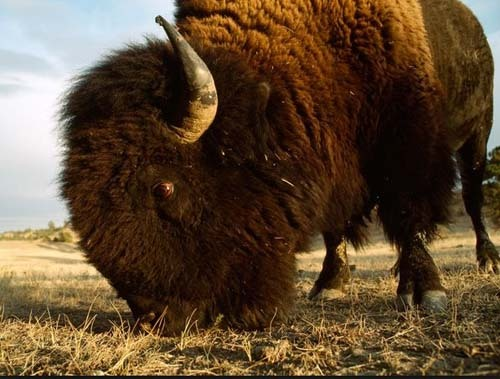  
풀을 뜯고 있는 바이슨(borrowed from Google.com)

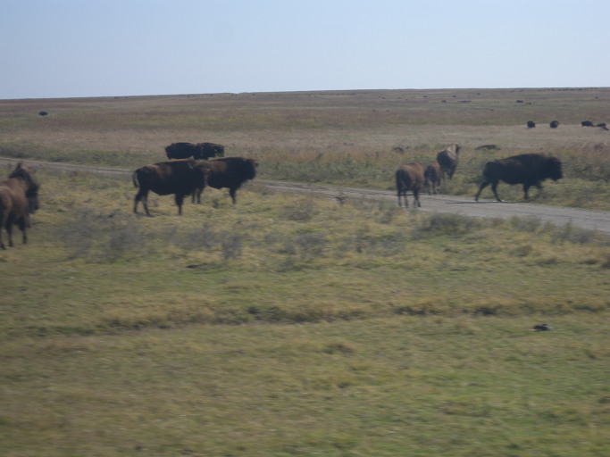  
우리를 보며 슬금슬금 물러나고 있는 바이슨 무리

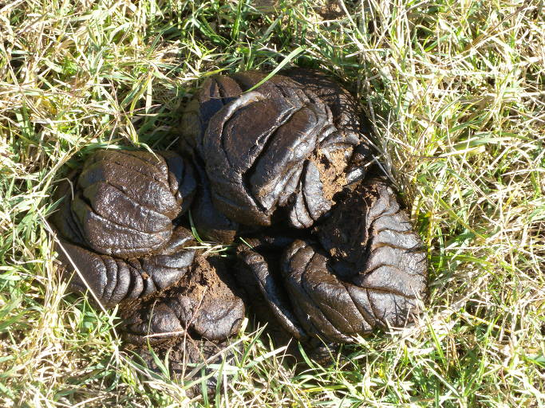  
바이슨들이 물러난 자리에 남겨진 엄청난 거름

한때 개체 수가 3천만 마리를 상회하던 바이슨은 대초원의 왕이었다. 어깨 높이 180cm에 1톤이 넘는 체중을 자랑하는 웅장한 체격의 바이슨. 수십 마리에서 수백 마리 규모로 떼를 지어 초원을 배회하는 바이슨은 결코 식물이나 토양을 황폐화 시키지 않는 특징을 갖고 있었다. 적당히 먹고 계속 움직여 뜯어먹은 곳의 식물을 다시 복원시키기 때문이다. 1800년대 후반에는 1000 마리도 남지 않아 멸종의 위기에 처해 있었으나, 보호에 힘입어 현재는 약 35만 마리 정도로 불어났다고 한다. 멸종의 위기는 벗어난 셈이고, 약 15000마리는 미국 내 공공의 땅에서, 나머지는 The Nature Conservancy에 의해 사유물로 각각 관리되고 있었다. 지금 The Nature Conservancy는 생태 시스템 복원작업의 한 부분으로 보호구역에 바이슨을 재입식해오고 있는데, 우리의 버스들이 바이슨 루프에서 시속 10마일로 서행한 것도 바이슨에게 충격을 주지 않기 위해서였음을 안내원의 설명을 통해 알게 되었다.

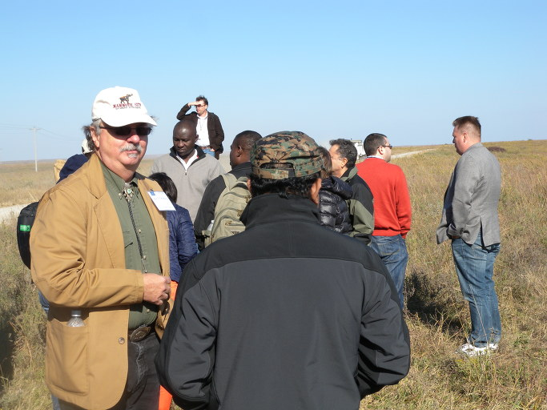  
바이슨 무리를 좇고 있는 각국의 학자들

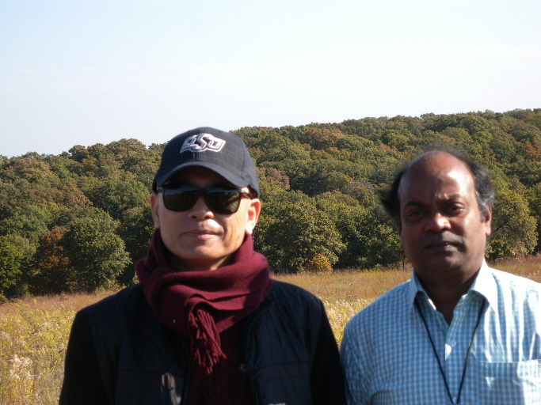  
인도의 탁월한 농학자 파트로 교수와 함께

사실 이 지역에 바이슨만 있는 게 아니었다. 가을이 깊어감에도 야생화들은 화려한 자태를 보여주고 있었으며, 기이한 종류의 풀들이 그득했다. 갖가지 새들은 지천으로 날아다니고, 여우나 토끼 같은 작은 동물들의 개체들도 엄청나게 늘어났다는 설명이었다. TGP 조성 이후 농약 등을 사용하지 않아 수질과 토양이 개선되면서 많은 동식물들이 서식할 수 있는 생태환경이 이루어질 수 있었던 것은 미국인들이 자연에 대한 인간의 빚을 최소한으로라도 갚고 있다는 증거였다.

\*\*\*

바이슨과 이별한 우리가 점심식사를 위해 멈춘 곳은 TGP Research Center였다. 그곳에는 우리의 점심 도시락을 싣고 온 트럭이 이미 도착해 있었다. 배분된 샌드위치 속의 바비큐가 바이슨 고기인지 묻고 싶었으나, 바이슨들의 표정이 떠올라 차마 그럴 순 없었다.

점심을 먹으면서 우리는 “오클라호마 음악에 미친 복합문화적 영향[The Multi-Cultural Influences of Oklahoma Music]”이란 제목의 강연 겸 공연을 접하게 되었다. 강사는 Dr. Hugh Foley[Professor of Fine Arts at Rogers State University]였고, 그 아들이 특이한 복장으로 나와 인디언 음악을 들려주는 것이었다. ‘새로운’ 옛날 음악을 새파란 젊은이로부터 듣는 것도 이색적이었지만, 무엇보다 부자가 음악으로 통해 있는 모습을 보는 건 참으로 아름다웠다. 아버지가 이론으로 설명하면 아들은 타악기로 직접 반주를 하며 노래를 불렀다.

  
TGP 리서치 센터 강당에서 공연 중인 휴 폴리 교수의 아들

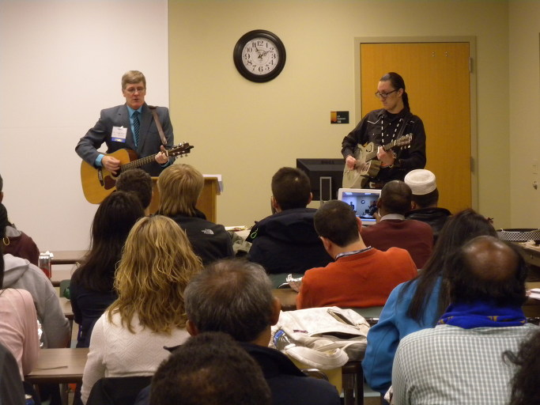  
휴 폴리 교수와 그의 아들

분명하진 않으나 노래들의 가락이 우리의 전통음악과 상당히 유사하여 인상적이었다. 그들이 설명하고 들려준 건 Red Dirt Music. 우리말로 번역하면 ‘황토음악’쯤 될까? Red Dirt Music은 오클라호마에 흔히 보이는 누런 흙에서 그 이름을 얻은 음악장르라 한다. 원래 오클라호마의 스틸워터가 Red Dirt Music의 중심으로 알려져 왔는데, 텍사스에도 Red Dirt Music이 있다는 설명이었다. 한때는 두 장르 사이에 분명한 차이가 있었지만, 2008년부터 그 차이가 소멸되기 시작했다고 한다. 우리의 전통음악, 특히 원시음악과 Red Dirt Music을 비교한다면, 의미 있는 결과가 도출될지도 모른다는 생각이 공연 내내 드는 것이었다.

점심 겸 공연이 끝난 뒤 랜취 하우스와 뮤지엄, 초원 사잇길 등을 거쳐 들른 곳이 오세이지 박물관[Osage Tribal Museum]이었다. 도착하니 그들은 이미 우리를 맞을 만반의 준비를 갖춰놓고 있었다. 연사는 Kathryn Red Corn. 오세이지 박물관 관장으로서 오세이지 족 출신의 지성인이었다. 그녀는 '오세이지 족의 역사와 TGP에 대한 부족의 흥미'를 주제로 30분 이상 차분하게 설명했다. 설명이 끝나고 질문시간에 나는 ‘현재 다른 부족들과의 관계는 어떻고, 어떤 관계를 유지하기 위해 노력하는가? 앞으로 얼마나 부족의 정체성[tribal identity]을 유지해나갈 수 있는가? 유지하기 위해 어떤 정책을 마련하고 있는가?’ 등을 물었다. 그러나 ‘Government 차원에서 다른 부족들과 좋은 관계를 유지하고 있으며 앞으로도 계속하겠다는 것, 각종 민속행사 등을 통해 부족의 정체성을 유지할 수 있다고 생각한다는 것’ 등 매우 추상적이고 원론적인 답변만 내놓았을 뿐, 그런 문제에 대하여 깊이 생각해본 적은 없는 것 같았다.

  
톨 그래스 프레이리에서 Dr. Cheryl Matherly와 함께

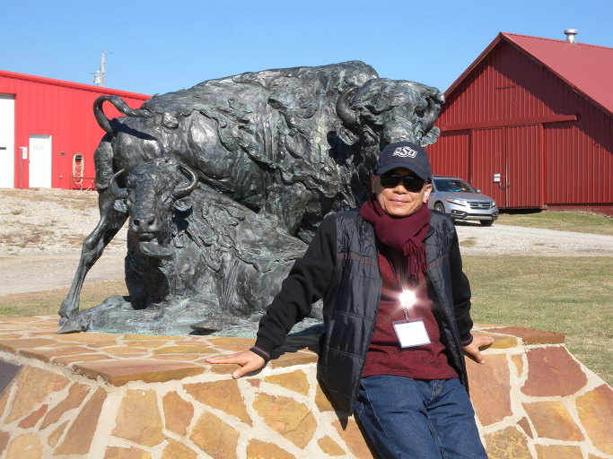  
Tall Grass Prairie 뮤지엄 앞에서

미국 최초의 인디언 부족 박물관인 오세이지 뮤지엄은 오세이지 부족의 전통에 따라 생활해왔거나 현대적인 삶을 살아온 사람들 가운데 오세이지의 역사, 전통, 관습 등에 정통한 사람들의 자원봉사로 운영되고 있었다. 이 뮤지엄은 오세이지 부족원들의 역사를 기념하거나 그것들을 배우기 원하는 사람들을 교육하기 위해 1년 내내 많은 활동들을 지원하고 있었다. 그러나 부족의 대표란 사람이 전통복장으로 행사장에 앉아 있었지만, 흡사 쇼윈도에 앉아 있는 마네킹처럼 생기 없이 인디언 부족의 미래를 대변하는 듯 했다.

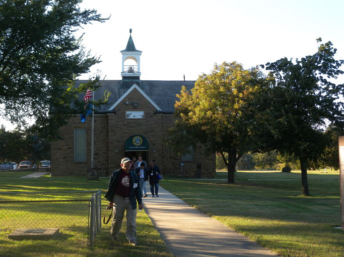  
오세이지 박물관(The Osage Tribal Museum)

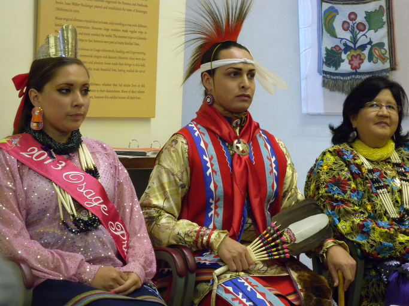  
오세이지 박물관에서 만난 공주(2013년 선발), 부족대표, 여성명사

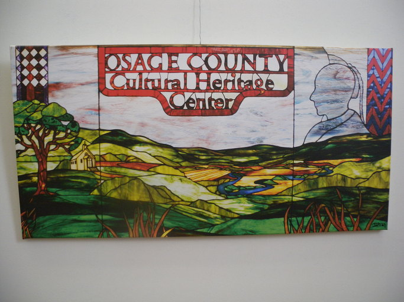  
오세이지 박물관 안에 붙은 그림

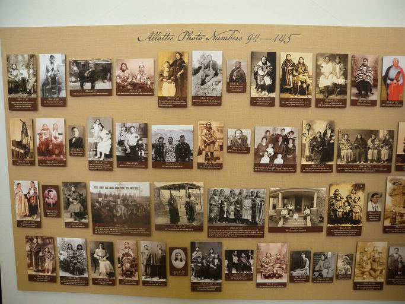  
오세이지 박물관 벽을 채운 오세이지족 인물들

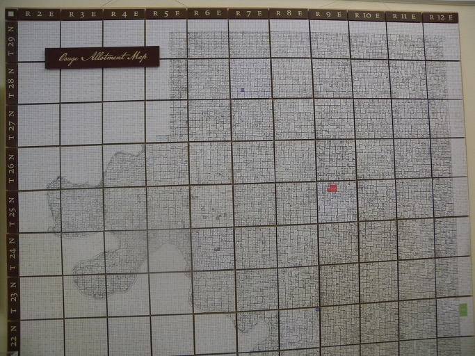  
오세이지 족이 분배 받은 땅(지적도)

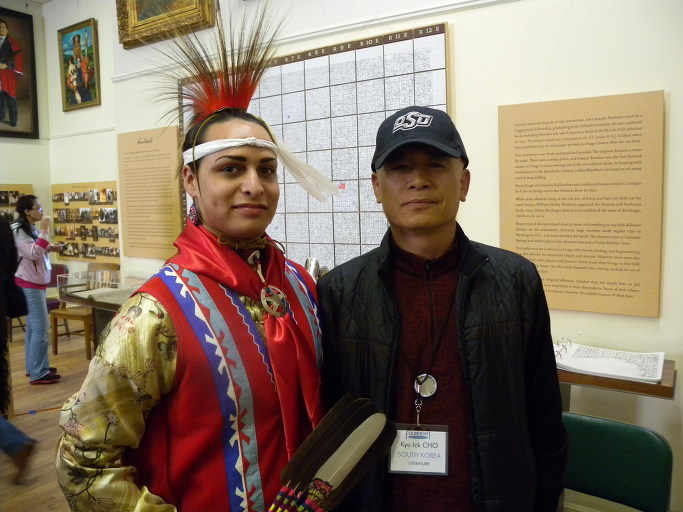  
오세이지 족의 대표와 함께

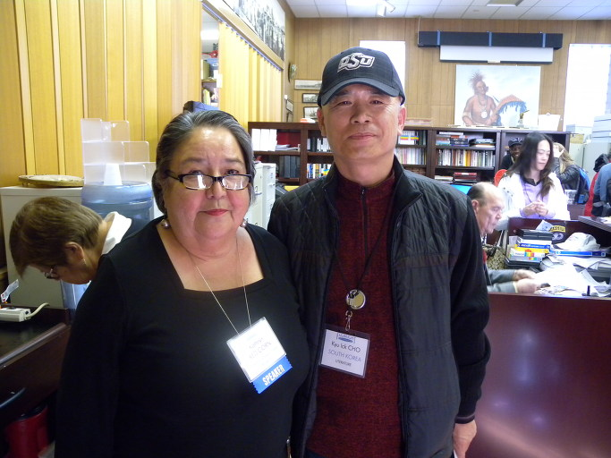  
오세이지 박물관 관장 Kathryn Red Corn과 함께

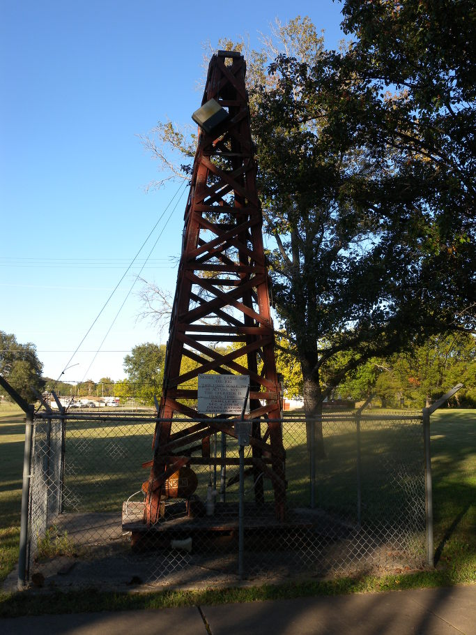  
TGP에서 석유를 채굴하던 옛날의 채굴기(오세이지 박물관 뜰)

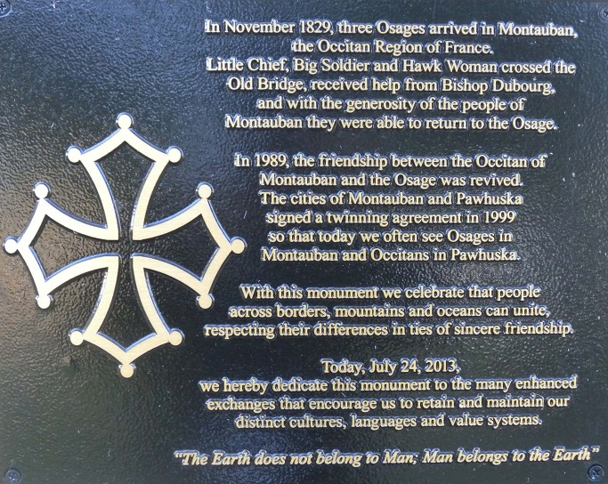  
오세이지 부족 사무소 앞에 세워진 기념 표지판

\*\*\*

시간의 단층들이 켜켜이 쌓여 만들어진 역사의 뒤안길을 우리는 단 하루 만에 주파한 셈이었다. 대초원에도, 바이슨의 눈빛에도, 인디언들의 마음에도 그들 과거의 기억들은 화석화 된 채 촘촘히 박혀 있는 듯 했다. 지혜로운 후세의 누가 있어 정을 들고 그 화석들을 캘 날이 있으리라. 종족의 문화와 역사를 복원할 유전자가 그 화석들 속에서 검출되고, 종국엔 이 땅에서 사라진 영광이 재현될 수도 있을 것이다. 대초원과 인디언들이 내게 주는 무언의 교훈이 바로 그것이었다. 우리는 오늘을 살고 사라지겠지만, 내일을 위한 씨앗 정도는 만들어 놓아야 한다는 역사적 책무를, 오늘 톨 그래스 프레이리에서 강하게 느꼈다.

공유하기

게시글 관리

**백규서옥\_Blog ver.**