2013년 풀브라이트 방문학자 발전 세미나[2013 Fulbright Visiting Scholar Enrichment Seminar]에 다녀와서

제3일차-체로키 후예의 집을 찾아 패러다임 전환의 증거를 찾다

프로그램의 내용이나 성격으로 보아 사실상 마지막 날인 오늘. 여러 전문가들의 발표와 토론을 통해 어제 대초원[Tall Grass Prairie]과 오세이지 족 보호구역을 둘러보며 갖게 된 감흥을 구체적으로 내면화 시키는 날이다. 무엇보다 기대되는 일정이 바로 호스트 패밀리와 함께 저녁식사를 하고 그들의 집을 방문하는 행사였다.

\*\*\*

8시에 버스를 타고 길크리스 박물관 강당으로 이동하여 털사대학교 영화학과 제프[Jeff Van Hanken] 교수의 강연을 들었다. “‘과거의 그 때’에 있던 일들이 아니다!-미국 서부 이미지들의 신뢰성과 정의에 관한 환상들[That ain’t how it was! Illusions of Authenticity and Justice in Images in the American West]”이라는, 약간은 난해하면서도 도발적인 제목의 강연이었다. 말하자면 영화에 들어 있는 서부의 이미지들이 인디언이나 서부에 대한 정확한 지식을 갖고 있지 않은 여타 미국인들이나 세계인들에게 잘못된 인식의 기초로 작용했다는 것이 그가 말하고자 하는 핵심이었다. 그가 제시하는 화면들을 보며 그간 접한 서부영화들이 인디언이나 미국의 서부에 대한 내 편견의 형성에 적잖이 기여했음을 깨닫게 되었다. 그런 깨달음은 인디언 보호구역에서 만난 모든 것들과 결부되면서 새로운 인식으로 이어짐을 흐릿하게나마 알게 되었다.

  
제프 교수가 보여주던 기록영화의 화면

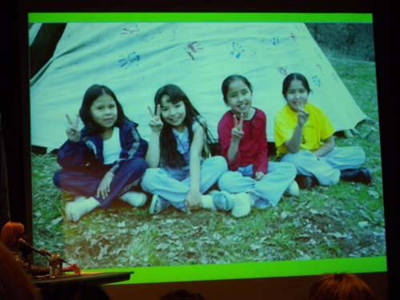  
제프 교수가 보여주던 화면

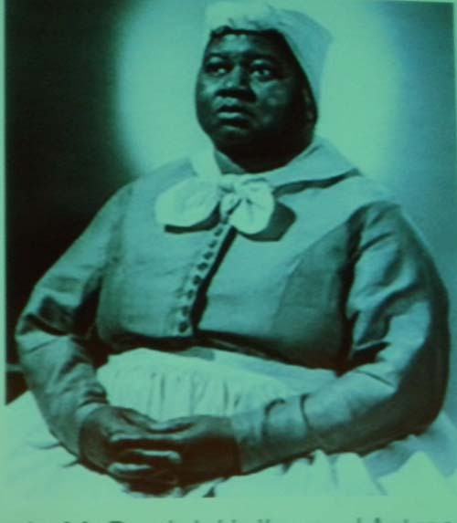  
인디언 출신 헐리웃 배우 Hattie McDaniel

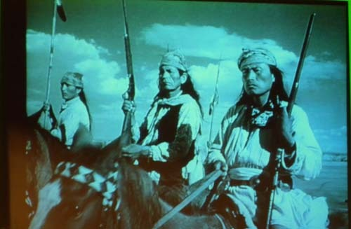  
서부영화의 한 장면

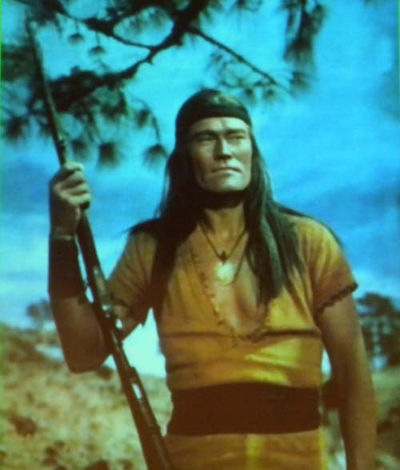  
서부영화의 한 장면

제프 교수의 강연이 끝나고 같은 자리에서 감동적인 이벤트를 겸한 또 하나의 행사가 이어졌다. 오클라호마 대학교에서 원주민 연락관[Tribal Liaison]을 맡고 있는 마크씨[Mr. Mark Wilson]가 무대에서 다양한 종족의 이름을 부르자 초등학교 학생들이 큰 깃발을 하나씩 들고 무대 위로 오르는 것이었다. 그 학생들은 털사 지역 공립학교 인디언 교육프로그램의 참가자들이고, 그들이 들고 있던 깃발들은 오클라호마 주에 본부를 갖고 있는 39개 원주민들을 대표하고 있었다. 대부분의 오클라호마 인디언 종족들은 1830년의 ‘인디언 강제 이주법’[Indian Removal Act]에 근거, 미합중국 군대에 의해 강제로 혹은 자발적이거나 토지소유권을 받아 이 지역에 재배치되었다고 한다. 인디언 교육 프로그램은 털사지역 공립학교들에 출석하는 인디언의 후예들[대략 4600명]에게 교육 서비스를 제공함으로써 과거 미국 인디언이 갖고 있던 풍부한 유산과 문화를 보존하는 역할을 하고 있었다.

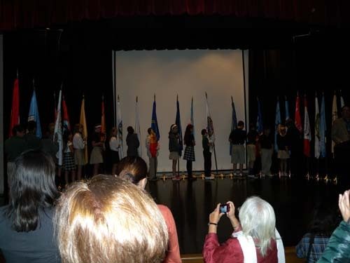  
깃발을 들고 입장한 초등학생들

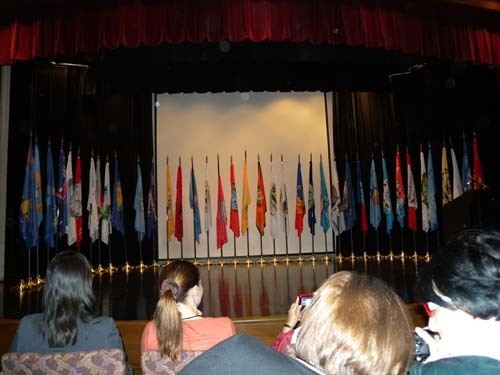  
초등학생들은 퇴장하고 남아 있는 학교의 깃발들

39명의 초등학생들이 무대 안쪽에 촘촘히 도열하자, 인디언 복장을 한 자그마한 여자아이가 앞으로 나오더니 앰프를 통해 울려나오는 배경음악에 맞추어 가냘픈 목소리로 미국의 애국가를 부르는 것이었다. 그 소리를 듣다보니 갑자기 눈물이 핑 돌았다. 그 아이가 차라리 쨍쨍하게 높은 목소리로 불렀더라면 괜찮았을 것을. 흡사 식민지배로 정체성을 빼앗겨버린 소수민족의 가냘픈 아이가 ‘다 죽어가는 목소리로’ ‘지배자의 애국가’를 부르는 모습이란! 글쎄. “비록 우리들이 이주해온 백인들에게 땅도 빼앗기고 민족의 정체성도 빼앗겼지만, 지금은 우리 모두 충실한 미국인이 되었음을 알려드립니다!”라는 메시지를 전하려는 것이었을까. 아니면, ‘무력한 가냘픔’으로 자신들의 ‘어쩔 수 없는 현실’을 표현하려 했던 것일까. 내 마음에 전해져 오는 ‘내 나름의 공감’ 때문에 감동적이긴 했지만, 그 정확한 의미는 끝내 알 수 없었다.

                                                                                    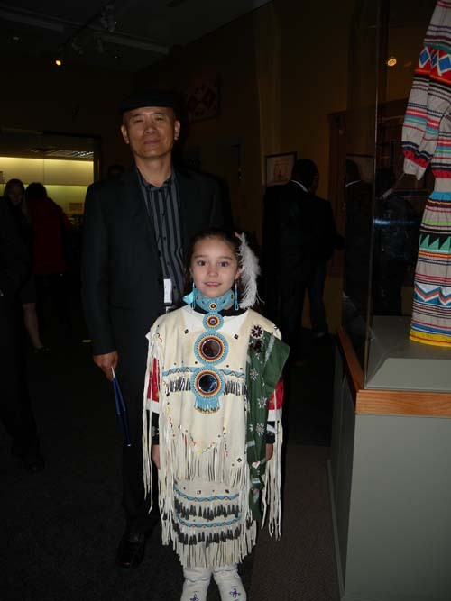  
                               대표로 미국 국가를 부르던 인디언 어린이

점심 후 ‘미국 서부의 실제 역사’라는 패널 토의에서는 다양한 연사들의 의미 있는 발표들이 이어졌다. 털사 대학교 역사학과 크리슨 박사[Dr. Kristen Oertel]의 사회로, 스테이튼 아일란드 대학[College of Staten Island] 지리학 교수인 드보라 박사[Dr. Deborah Popper]가 “서부 지역 환경사: 바람 속에 쓸려간 옛 약속들[Western Environment History: Old Promises in the Wind]”을, 아칸사 대학교[University of Arkansas] 역사학과 교수인 엘리엇 박사[Dr. Elliot West]가 “휘청거리는 인디언들과 실제 인디언들[Reel Indians and Real Indians]”을, 노쓰웨스턴 오클라호마 주립대학[Northwestern Oklahoma State University]의 역사학과 교수인 로저 박사[Dr. Roger Hardaway]가 “서부지역의 아프리카계 미국인들”을 각각 발표했고, 박물관 전시물들을 관람한 뒤 각계의 저명한 패널들이 열띤 토론을 벌임으로써 주최 측이 애당초 내건 “서부지역의 미래[The Future of the West]”라는 세미나의 마감 타이틀에 충실한 모습을 보여 주었다. 패널리스트들 가운데 특별히 주목 받은 인물은 변호사, 인디언 부족 판사, 학자 등으로서 종교적 자유, 죄수들의 권리, 수자원 권, 조약의 권리 등을 포함한 아메리카 인디언들의 기본권을 지키기 위해 30여년을 노력해온 포니족(Pawnee) 출신의 명사 월터 씨[Mr. Walter R. Echo-Hawk]였다. 인디언들이 받는 법의 보호와 한계에 대한 그의 설명을 통해 이 지역에서 해결해야 할 문제가 무엇인지를 그는 명쾌하게 설명했다.   

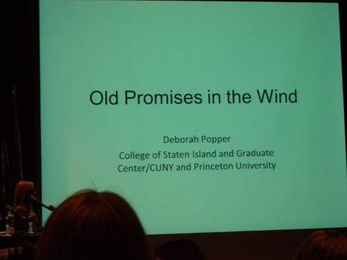  
드보라 박사의 강연 제목

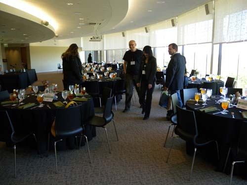  
점심이 차려진 길크리스 박물관의 비스타 홀(Vista Hall)

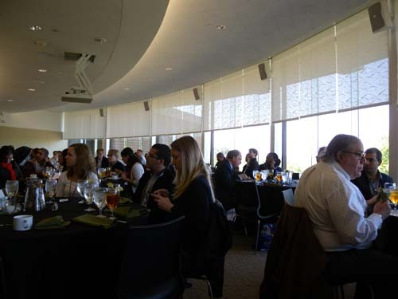  
식사를 마치고 발표를 듣는 각국의 학자들

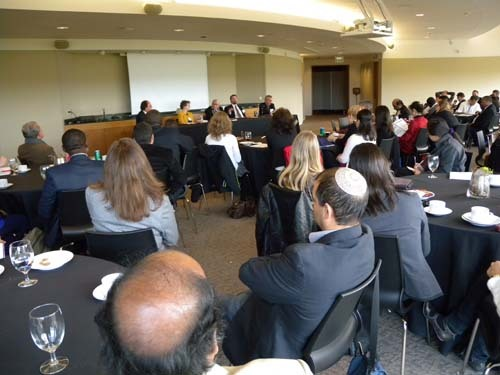  
패널리스트들의 클로징 토론을 듣고 있는 학자들

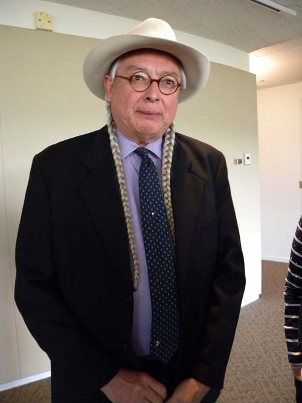  
학자들로부터 인기와 관심을 받은 포니(Pawnee)족 출신의 Walter Echo-Hawk씨

  
토론 후 학자들과 함께 한 월터씨

마감 패널 토의가 끝난 뒤 호텔로 돌아온 우리는 로비에서 삼삼오오 저녁식사를 초대한 호스트와 만나 호스트의 차로 각자의 가정이나 레스토랑으로 흩어져 갔다. 대개 한 사람의 호스트에 2~4명이 배정되었는데, 나를 초청한 호스트는 바로 첫날 나를 픽업해준 자원 봉사자 클라크[Clark Frayser]씨였다. 첫날 그의 차를 타고 호텔로 오면서 그의 한국 방문 경험과 한국에 대한 호감을 알고 있었기 때문에 그리 놀랄 일은 아니었지만, 사실 미국인으로서는 지나치다 싶게 소탈한 점이 처음엔 의문이었다.

  
패널 토론장에서의 클라크 씨[Mr. Clark Frayser]

다른 호스트들과 달리 나 혼자만을 초청한 이유를 묻자 한국에 대한 호감 때문이었다고 한 마디로 잘라 말했다. 10년 전 한국에 초청 받아 갔을 때 서울에서의 즐거웠던 체험, 현대자동차와 포항제철 등에서의 놀라웠던 체험, 비무장 지대 땅굴에서의 긴박했던 체험 등등 한국에 대한 추억이 그의 입에서 술술 흘러 나왔다. 또 다른 미국인들과 그의 분위기가 다른 이유를 묻자, 그것은 아마도 자신의 혈통 때문일 것이라고 설명하기 시작했다. 백인 할아버지와 체로키 인디언 할머니 사이에서 출생한 자신의 아버지는 자연스럽게 50%의 체로키 족 피를 갖게 되었고, 그 아버지와 백인 어머니 사이에 자신이 태어났으므로 자신은 40%의 체로키 족 피를 유지하고 있다는 것이었다. 그런 이유로 다른 순수 유럽계 백인들에 비해 분위기가 다를 것이라고 했다.

이혼 후 만나 함께 살고 있는 ‘걸프렌드(girl friend)’가 저녁에 일을 하므로 집에서 식사대접을 할 수는 없으니, 일단 레스토랑에서 식사한 다음 자신의 집으로 가자고 했다. 집에서 꼭 보여줄 게 있다는 것이었다. 그러면서 내게 클래식한 분위기의 레스토랑, 대중적이고 자유로운 분위기의 레스토랑 가운데 하나를 선택할 것을 요구했다. 후자를 선택하자 지체 없이 출발하여 30여분 뒤 도착한 곳이 ‘산타페(Santafe)’라는 레스토랑이었다. 호스트이든 게스트이든 대개 클래식한 분위기만을 경험해온 나로서는 산타페의 이색적인 분위기에 놀라게 되었다.

문 안으로 들어서자 땅콩을 껍질째 볶아 한가득 넣어놓은 통이 놓여 있었고, 사람들은 그릇에 그득그득 담아갖고 종업원의 안내를 받아 예약된 자리에 앉았다. 그들은 자리에서 땅콩을 까먹으며 함부로 껍질들을 바닥에 버리곤 했다. 다른 식당들에서는 거의 보지 못했던 술들이 진열장에 가득했고, 손님들 대부분이 음식과 술을 함께 마시고 있었다. 말하자면 일반적인 기준의 미국 레스토랑은 아니었고, 클라크씨는 그 점을 내게 보여주려 하는 것 같았다.

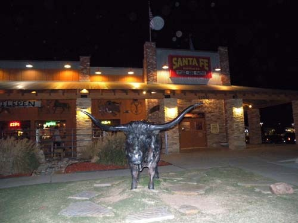  
클라크씨와 저녁식사를 한 레스토랑 산타페

  
클라크씨와 저녁식사를 한 레스토랑 산타페

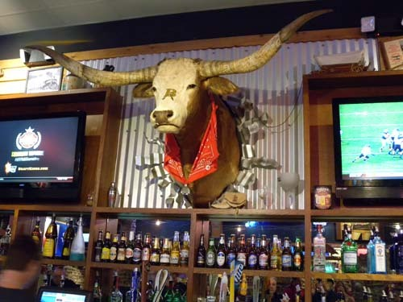  
클라크씨와 저녁식사를 한 레스토랑 산타페의 내부

  
클라크씨와 저녁식사를 한 레스토랑 산타페의 천정 장식

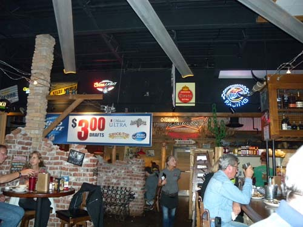  
클라크씨와 저녁식사를 한 레스토랑 산타페의 내부

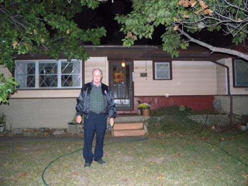  
산타페에서 돌아와 자신의 집 앞에 서 있는 클라크씨

다른 곳보다 비교적 맛있었던 스테이크와 몇 잔의 맥주를 마신 뒤, 우리는 거기서 10분 정도 떨어져 있는 그의 집으로 갔다. 집에 도착하여 내가 미리 마련해간 하회탈 선물을 내밀자, 뛸 듯이 기뻐하며 놀라는 것이었다. 선물을 가져왔으리라는 예상을 전혀 하지 못했다가 불쑥 선물을 내미니 우선 놀란 것 같았고, 그 선물이 ‘탈[mask]’이라는 점에 또 놀란 듯 했다. 주최 측으로부터 이메일로 미리 받아본 프로그램에 ‘가정 초대 만찬[Home Hospitality Dinners]’이란 내용이 있음을 알고, 혹시 몰라서 미국에 올 때 준비한 선물들 가운데 하회탈을 갖고 온 것이었다.                                         

                                                                                      

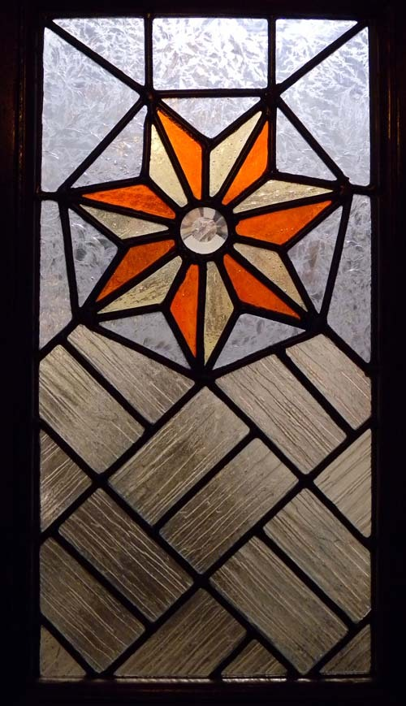  
클라크 집의 안쪽 출입문 유리에 새겨진 체로키 문장

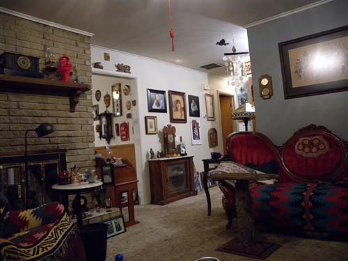"  
거실 등 클라크 씨 집의 내부

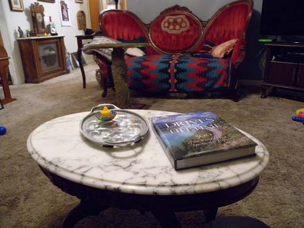  
거실

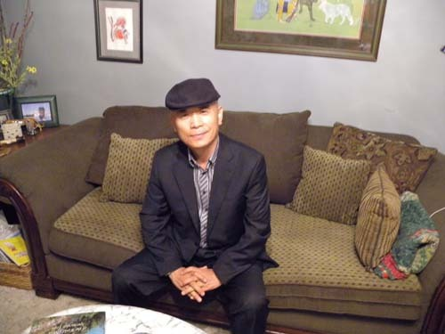  
거실에서 백규

  
클라크 씨의 딸

내가 큼지막한 하회탈을 건네자 깜짝 놀라며 다짜고짜 자신의 서재로 나를 끌고 갔다. 그런데 한쪽 벽면이 각종 탈들로 가득한 게 아닌가. 말하자면 그는 ‘탈 애호가’였던 것이다. 체로키 탈, 중국 무희 탈, 일본 가부키 탈 등 다양한 탈들이 걸려 있는 사이에 아이들 조막만한 하회 각시탈도 걸려 있었다. 그곳에 대감탈만 빠져 있었는데, 바로 내가 그걸 갖고 온 것이었다. 내가 생각해도 절묘한 선물이었다. 말 그대로 ‘뛸 듯이’ 기뻐하는 그의 모습이란!

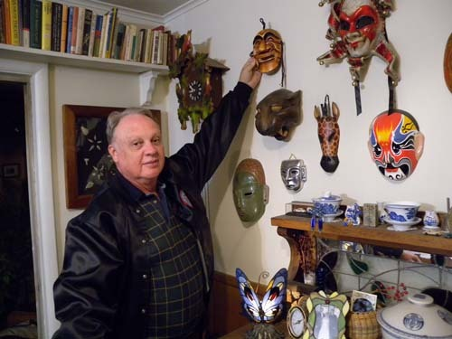  
                                   내가 건넨 선물을 들고 서 있는 클라크 씨 

그의 안내로 집안을 두루두루 구경했는데, 온통 체로키 유물 일색이었다. 체로키 인디언들의 정신이 집안에서 묻어나온다고 할 정도로 좁은 집안에 그득한 그림, 공예품, 사냥도구 등 유별난 컬렉션이었다. 자신의 가계도[family tree]를 보여주며 체로키와의 인연을 설명하기도 했다. 언제부터 이렇게 공개적으로 체로키 혈통에 대한 프라이드를 갖게 되었는지 묻고 싶었지만, 그 물음만은 아껴두기로 했다. 그는 이 지역에 자신을 포함, 체로키 등 인디언 혼혈 미국인들이 적지 않다고 강조하며 자랑스러운 표정을 지었다. 어쩜 그는 우리가 지난 3일간 귀에 못이 박힐 정도로 들어온 인디언 문화의 표본으로 자신을 보여주고 싶었는지도 모른다. 일부이긴 하지만, 주류의 미국인들이 감추며 살아왔을 혼혈의 사실을 흔들며 자랑하는 것은 다민족・다문화의 공존과 융합의 시대를 맞이하여 의식의 패러다임이 근본적으로 바뀌었음을 보여주는 분명한 사례가 아닐까.

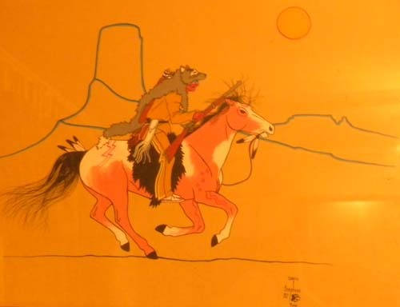  
                                 체로키 화가의 그림

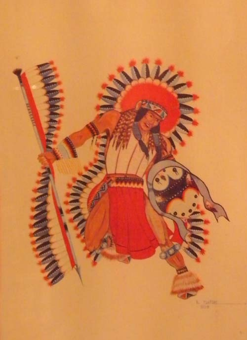  
                                 체로키 화가의 그림

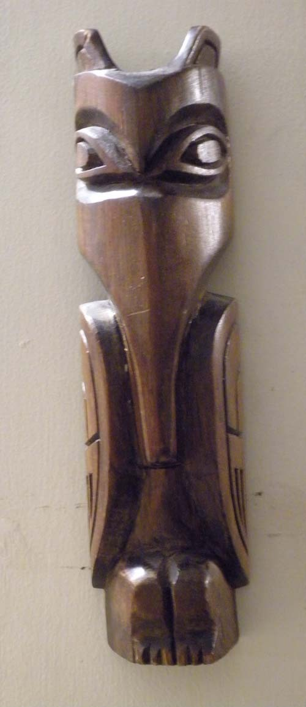  
                      체로키 공예가의 목각(모기의 모습을 나무로 깎아 만든 작품) 

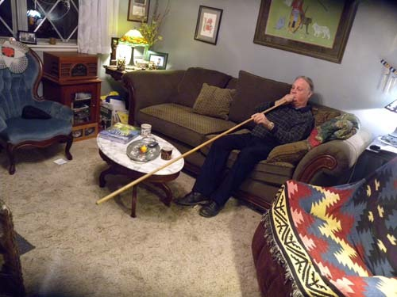  
                    자신의 거실에서 체로키 사냥법의 시범을 보이고 있는 클라크 씨

    \*\*\*

세미나 셋째 날. 학자들이나 지식인들이 강당에서 설파한 ‘미래의 서부’는 배제나 차별 아닌 공존과 포용, 융합의 새로운 패러다임이었을 것이고, 클라크 씨는 그 사례로서의 자신을 내게 보여 주었을 것이다. 그런 이유로 시끌벅적한 산타페에서 체로키 식(?)을 가미한 식사를 대접했고, 자신의 집으로 초대하여 일부분이나마 체로키 생활양식을 보여준 것이나 아닐까. 이런 분위기가 과연 공고한 레이시슴(racism)의 벽을 얼마나 허물 수 있을지, 역사의 진행이 항상 순조로운 방향만을 타게 되는 것인지 등등. 약간 불안하긴 하지만, 일단 작은 희망이나마 갖기로 한다.

공유하기

게시글 관리

**백규서옥\_Blog ver.**