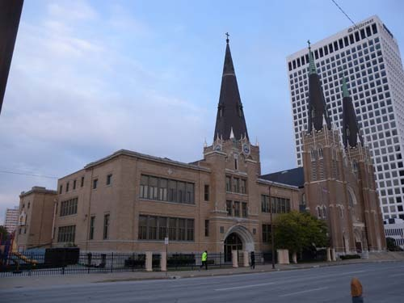
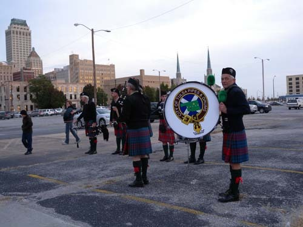
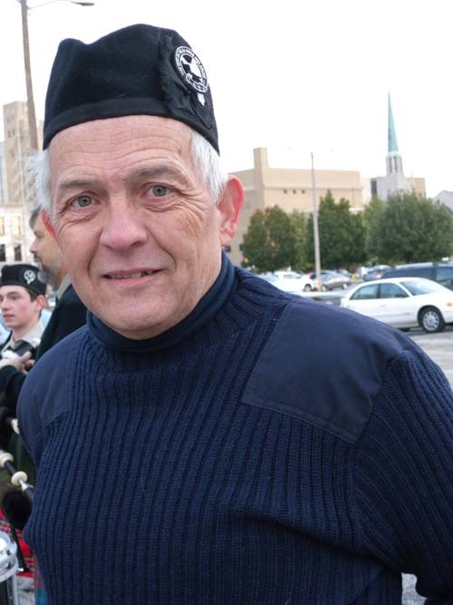
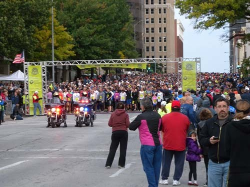
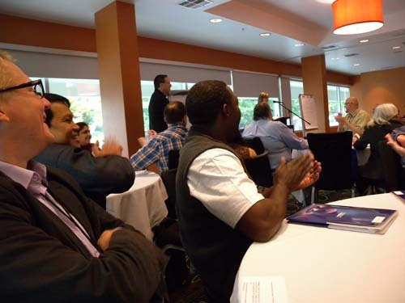
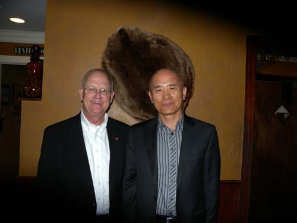
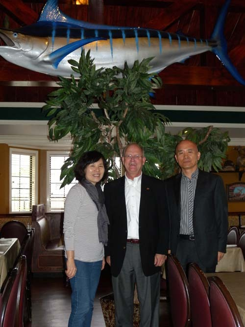

2013년 풀브라이트 방문학자 발전 세미나[2013 Fulbright Visiting Scholar Enrichment Seminar]에 다녀와서

마지막 날-좀 더 커진 마음을 안고 다시 스틸워터(Stillwater)로!

짧았지만, 참으로 긴 여정이었다. 단 4일 만에 이 땅에서 일어난 수백년 격동의 역사를 추체험하는 일이 어찌 간단하겠는가. 종족과 종족이 맞붙어 수백 년 삶을 이어온 터전을 뺏고 빼앗기는 투쟁이 바로 이 땅에서 계속되어 왔고, 지금도 그 불씨는 꺼지지 않은 채 내연(內燃)하고 있음을 우리는 목격했다. 이 땅의 많은 학자들이 현장을 밟으며, 연구실에서 이들의 어제와 오늘, 그리고 내일을 분석하고 예측하며 바람직한 방안을 연구해오고 있지만, 누가 그 정답을 알겠는가. 그 옛날 해저(海底)가 융기하여 하늘을 찌르는 산이 된 것처럼 어느 순간 역사의 주인은 바뀔 수도 있고, 수백 년 차별의 질곡에서 신음하던 자들이 채찍을 손아귀에 쥐는 순간도 있을 것 아닌가. 웅웅거리는 바람을 안고 누워 우리에게 겸허를 일깨워 주는 대초원[Tall Grass Prairie]의 드넓은 가슴을 보라.

\*\*\*

큰 일정 대부분을 마무리한 토요일 아침. 이 날이 마침 36년째 이어지고 있다는 털사 시민 마라톤의 날이었다. 어디서 그렇게들 모여들었는지 평소에는 한산하던 도로가 사람들로 가득했다. 호텔 바로 앞이 출발선이기 때문인지 적지 않게 시끄러웠다.

  
호텔 창 밖으로 보이던 성가족 성당

  
시민 마라톤 대회를 축하하기 위해 공연 준비를 하는 악단(City of Tulsa Pipes & Drums)

  
악단의 드러머 매튜씨[Mr. Matthew]

  
출발선에 그득히 모여 신호를 기다리는 시민들

  
출발신호와 함께 달려나가는 시민들

한 시간 늦게 아침식사를 하고 마무리 토론과 정리를 위해 호텔 2층의 시마론 볼룸(Cimarron Ballroom)에 모였다. 모두 개운한 표정들이다. 10여 개 조로 나뉘어 지난 며칠간의 경험들을 통해 새로운 방향을 모색하는 토론을 벌였다. 이곳에서 얻은 견문에 각자의 모국을 결부시켜 바람직한 방안을 찾는 것이 핵심이었다. 모두들 자기 나라의 형편이나 상황을 설명하기에 열을 올렸다. 따지고 보면 땅덩어리나 자원, 인재 등 모든 것을 두고 보아도 미국만한 나라가 어디에 있을까. 그럼에도 참석자들 모두 자기 나라의 장점을 부각시키기에 여념이 없었다. 객관적으로 큰 의미는 없겠지만, 그 모두는 애국심에서 우러나온 것이었으리라. ‘자신의 나라도 미국처럼 이랬으면 좋겠다’는 소망적 사고의 표출이었으리라. 마지막 토론을 주관한 베키[Becky Collins, President and CEO, Tulsa Global Alliance]도, 마캄 박사[Dr. J. Markham Collins, Professor of Tulsa University]도, 덕 프라이스 박사[Dr. Doug Price, Dean of Global Education, Tulsa Community College]도 참석자들의 말들을 정리하고 요약하면서 연신 고개들을 끄덕거린다. 각국의 사례들이 그들에게 큰 참고가 되는 모양이었다. 그렇게 토론과 보고의 마무리 과정도 끝이 났다.

  
마무리 토론에 참여한 참가자들

\*\*\*

방에서 짐을 꾸려 내려오니 스틸워터까지 나를 태워 가기로 약속한 론 박사[Dr. Ron Bussert, Vice President for Administration and Finance]가 벌써 로비에서 나를 기다리고 있었다. 티룸으로 모시고 가 커피 대접을 하며 통성명을 했다. OSU 털사 캠퍼스에 근무한다는 그 분의 집은 털사 시내에 있었다. 그러니 나를 집에 내려 준 다음 다시 그 길을 되짚어 와야 하는 상황이었다. 참으로 송구스럽기 짝이 없었다. 더구나 나보다 나이가 많다고 하니 더욱 몸 둘 바를 모를 지경이었다. 그래서 급한 대로 하나의 약속을 받아냈다. 론 박사도 점심 전이고 나도 내 아내도 점심 전이니 스틸워터에 도착한 다음 점심 대접을 하겠다는 제의를 했고, 그 제의를 그 분이 흔쾌히 받아들임으로써 미안감이 약간은 덜해졌다. 그 순간부터 이곳 풍습에 따라 편안한 마음을 갖기로 했다. 스틸워터의 집까지 오는 데 1시간 남짓 걸렸으나, 서로가 궁금한 게 많아서 끊임없이 대화를 주고받다 보니 어느 새 집 앞이었던 것이다. 아내를 불러내 그 분과 함께 괜찮은 레스토랑 ‘프레디폴스(Freddi Paul’s)’로 직행했다. 토요일 점심이라선지 식당은 한산했고, 음식은 달았다. 나지막한 어조로 자상하게 대화를 이어가는 론 박사는 참으로 편한 상대였다. 나누는 대화도 맛이 있고, 먹는 고기 맛도 일품이었다. 하이클라스 미국인들이 갖고 있는 교양의 정도를 느낄 수 있게 하는 인물이었다. 우리는 두 시간 가까운 식사 동안 서로의 흉금을 털어놓을 수 있었고, 훗날을 기약할 수 있었다. 가벼운 피로가 기분 좋게 몰려드는 토요일 오후였다.

 

  
레스토랑에서 식사를 마치고 Ron 박사와

  
레스토랑에서 식사를 마치고 Ron 박사와

공유하기

게시글 관리

**백규서옥\_Blog ver.**