누구 혹시 이 소녀를 아시나요?

오클라호마를 관통하는 옛 길 하나가 있다. 이른바 66번 도로[Route 66]. 이 길의 역사성이나 문화적 의미에 대해서는 다음에 자세히 거론하기로 한다. 언제부턴가 우리는 이 길에 주목해왔다. 토요일인 어제도 우리는 차를 몰고 이 길의 탐사에 나섰고, 그 길을 따라가다가 외견상 약간 퇴색되긴 했지만 아름다운 도시 유콘시티(Yukon City)를 만났다.[유콘 시티에 관한 글은 다음 기회에 싣는다] 이 도시의 ‘유콘 퇴역군인 박물관[Yukon Veterans Museum]’에서 우리는 코끝이 찡해오는 슬픔과 가슴 멍한 감동을 만나게 되었다.

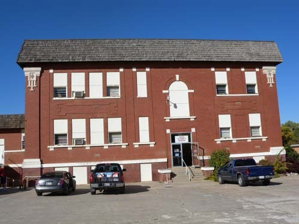  
유콘시 역사박물관[이 박물관의 3층에 퇴역 군인 박물관이 있음]

\*\*\*

박물관[Yukon Historical Museum]을 찾지 못해 안내서에 적힌 번호로 전화를 하니, 전화를 받는 여성이 찾아오는 길을 자상하게 설명해주었다.[Yukon Historical Museum에 대한 글은 미국통신 27로 싣는다] 이 박물관의 맑고 품위 있는 할머니 큐레이터 캐롤[Carol Knuppel]의 안내로 소중한 생활사 컬렉션을 두루 살펴 본 다음, 같은 건물 3층에 마련된 퇴역군인 박물관을 우연히 찾게 되었고, 거기서 일을 보고 있던 톰[Mr. Tom Thomas]을 만나게 되었다. 그의 도움으로 박물관 안을 둘러보다가 우리는 색깔은 바랬으나, 낯설지 않은 몇 장의 사진을 목격하게 되었다.

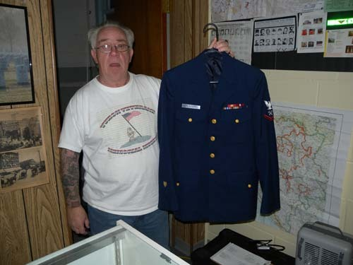  
유물을 들어 보이고 있는 톰 씨

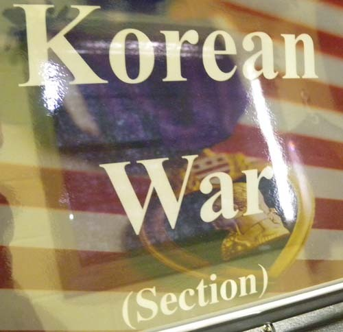  
한국전 코너 표지판

아, 그것은 6・25 전쟁의 포화 속에서 가까스로 살아남은 우리네 누이와 아주머니의 힘겨운 모습이었다. 칭얼대는 동생을 광목 포대기로 감아 업고 배고픔을 달래던 우리 누이, 전쟁 통에 죽었거나 끌려가 부재중인 남편 대신 산에서 땔감을 산더미처럼 지고 오던 이웃 아주머니, 비누도 제대로 없던 시절 냇가에서 빨래방망이를 두드리던 동네 아주머니들, 덜컹대던 버스, 동산만큼 무거운 짐을 실은 리어카를 활기차게 끌고 가는 어떤 장년 남자, 자신의 사진을 찍는 사람의 동작을 흉내내는 듯한 코흘리개 남자아이, 서울 수복의 감격이 짙게 배어 있는 서울시청, 그 때까지만 해도 웅장한 자태로 서 있던 동대문 등등. 그런데 이 사진들을 과연 누가 찍었을까. 사연을 알아보니 유콘에 살던 퇴역군인의 아들로부터 기증받은 것들이란다. 원판 화질이 안 좋았으나 우리로서는 그 사진들을 우리의 카메라로 다시 촬영하는 수밖에 없었다.

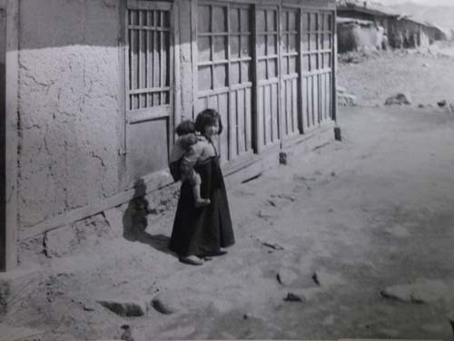  
누구 혹시 이 소녀를 아시나요?

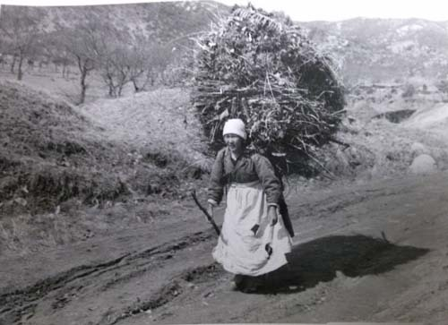  
누구 혹시 이 아줌마를 아시나요?

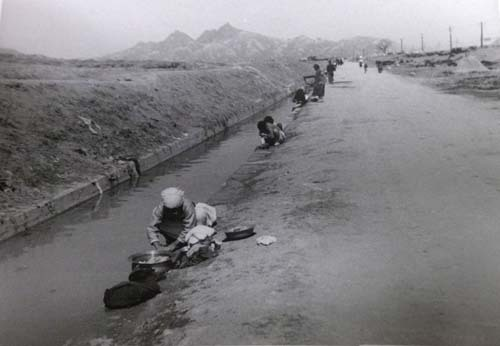  
누구 혹시 이 아줌마를 아시나요?

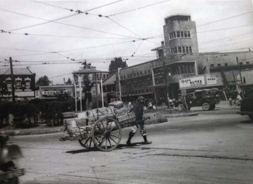  
서울시내 어딘가에서 리어카를 끌고 가는 남자

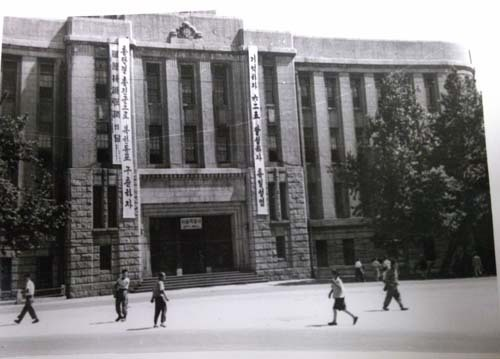  
1954년 당시 서울시청

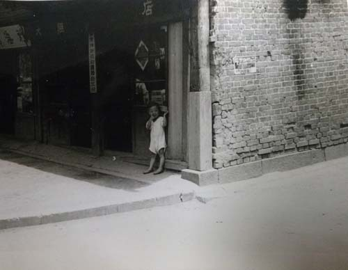  
누구 혹시 이 아이를 아시나요?

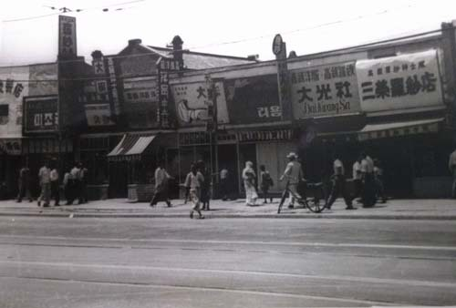  
1954년도 서울시내 한 곳

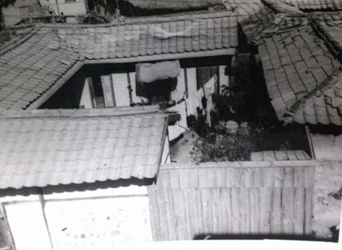  
1954년도 서울시내 한 곳의 한옥

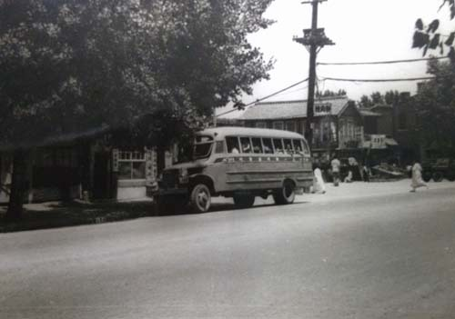  
1954년 당시 버스

그렇게 찍은 사진들이 혹시 사라질세라 카메라를 소중하게 부여안고 다른 노정들의 방문은 생략한 채 2시간 가까운 거리를 달려 집에 도착했다. 도착하여 컴퓨터 화면에 띄우는 순간 가슴이 철렁했다. 그 사진들 모두의 화질이 너무 안 좋았기 때문이다. 하는 수 없이 톰에게 전화를 하자 다음날[일요일, 즉 오늘] 12시에 사진 기증자가 이곳에 오니 다시 오라는 것이었다. 그래서 오늘 우리는 Yukon Veteran's Museum을 다시 찾았고, 거기서 이 사진을 찍은 퇴역군인의 신원을 알게 되었으며, 기증자의 아들인 Mr. Richard Cacini를 만날 수 있었다. 그 역시 미 육군에서 30여년을 근무한 군인이었고 그의 아들 또한 군인이었으므로, 이탈리아계 이민인 카치니 가문은 3대가 군에서 복무한 모범적 사례였다. 우리는 어제 같은 실수를 다시 범하지 않기 위해 카메라와 스마트 폰으로 사진들을 다시 찍고, 휴대용 스캐너로 일일이 스캔하여 별도의 파일로 보관하기도 했다. 리차드 씨의 흔쾌한 협조로 열 장이 넘는 사진들을 송두리째 우리의 가슴에 담을 수 있었다.

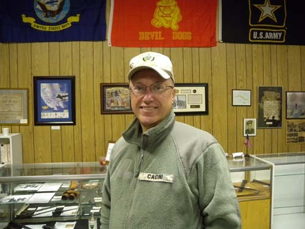  
Mr. Rick Cacini

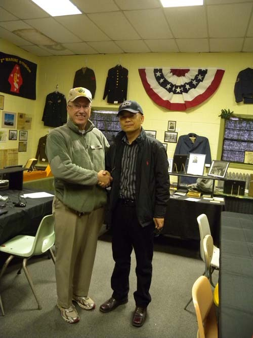  
Mr. Rick Cacimi와 처음 만나서

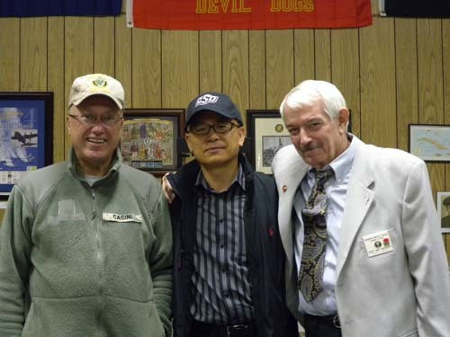  
Mr. Rick Cacini, 백규, 그리고 Mr. B Mac[미 해병 출신]

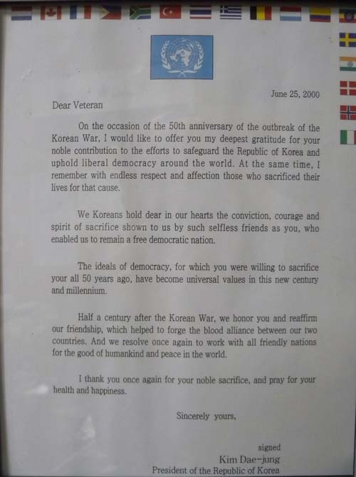  
김대중 전 대통령이 보낸 감사의 편지

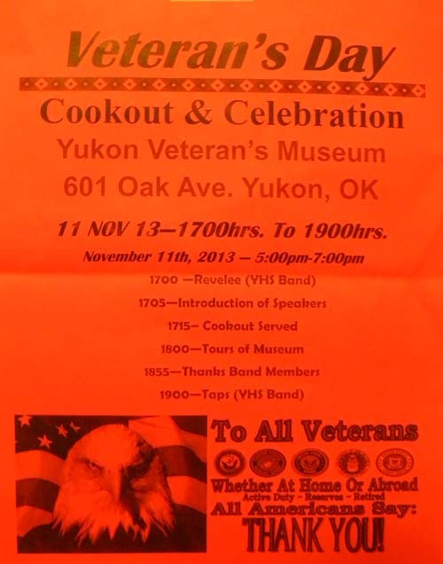  
퇴역군인의 날 행사 포스터

미 육군의 하사관으로 한국에 파견되었던 카치니는 각각의 사진들 뒷면에 장소와 연도를 표기했는데, 연도가 모두 1954년인 점으로 미루어 전쟁 직후의 우리 땅[의정부, 서울]에서 찍은 것들임을 알 수 있었다. 그러나 무엇보다 내 눈시울을 촉촉하게 한 것은 사진을 찍은 사람의 따스한 시선으로 어려운 시절의 우리 모습을 잘도 잡아냈다는 점이었다. 의정부에서 찍었다는 ‘나뭇짐 지고 가는 여인’ 사진 뒷면엔 다음과 같은 메모가 적혀 있다.

“당신이 혹사당한다고 말하지 말라. 이 여인은 200~400파운드 무게의 짐을 져 나르고 있다. 그녀가 내려놓았을 때 나는 그 지게를 들 수조차 없었다.[Don’t tell me you are overworked! This lady is carrying between 200 and 400 pounds. I could not even lift the ‘A-Frame’ when she put it down.]”

그는 산더미 같은 나뭇짐을 지고 가던 가냘픈 여인을 만났고, 그 ‘삶의 무게’가 그의 마음에 감동과 동정의 파문을 일으켰을 것이다. 어쩌면 이 여인의 모습을 통해 한국인이 당하고 있던 현실적 고통을 큰 소리로 세계인들에게 알리고 싶었을 것이다.

동생을 업고 있던 작은 소녀의 사진 뒤에는 다음과 같은 내용의 글이 적혀 있다.

“이 작은 소녀는 겨우 여섯 살인데 몇 달 동안 ‘애보개’의 역할을 해오고 있다. 거의 모든 어린이들은 등에 아기들을 끈으로 묶어 업고 다닌다.[The little girl is six and has been a ”baby sitter“ for many month. Nearly every youngster has another strapped on his back]”

여섯 살 난 여자애가 동생을 업고 있는 모습에 사진사의 시선이 꽂히는 순간이다. 한 집에 일곱 여덟씩의 아이들이 북적대던 우리 어린 시절, 젖먹이 아이들을 업어 키우는 일이야 당연히 형이나 누나들의 몫이 아니었던가. 그런 일을 미국인으로서는 상상도 할 수 없었을 것이다. 사진의 앵글이나 초점과 메모의 내용을 결부시키면, 사진사의 단순한 호기심보다 따스한 동정과 연민의 정이 느껴지지 않는가.

\*\*\*

이 소녀와 아줌마는 지금쯤 이 땅을 떠났거나 고령의 여인으로 어딘가에서 살고 있을 것이다. 어쩜 지금까지도 어떤 미군이 자신에게 카메라를 들이대던 그 시절의 기억을 놓지 못하고 있을지도 모른다. 무슨 인연으로 우리는 이 먼 미국 땅에서 사진으로나마 그들을 만나게 되었을까. 누군들 알았겠는가. 다른 지역에 비해 한국인들이 적은 오클라호마의 잊혀져가고 있는 소도시 박물관에서 사진으로 만나는 우리의 어제가 이토록 내 유년기의 상처를 건드릴 줄을. 11월 11일 이곳 박물관에서 열리는 퇴역군인의 날[Veteran’s Day]에 우리는 초대를 받았다. 반드시 그들을 만나서 지금의 우리는 기적처럼 일어나 세계 10위권의 경제대국이 되었음을 알려주리라. 그들의 마음에 고착되어 있는 6・25의 기억을 지우고 새로운 대한민국의 이미지를 심어주리라.

\*\*\*

다시 한 번 여쭙건대, 어딘가에 살아 있을 이 소녀와 아줌마를 누구 혹시 아시는 분 없으신가요?

공유하기

게시글 관리

**백규서옥\_Blog ver.**