66번 도로[Route 66]에 살아 있는 역사의 공간, 유콘 시티(Yukon City)

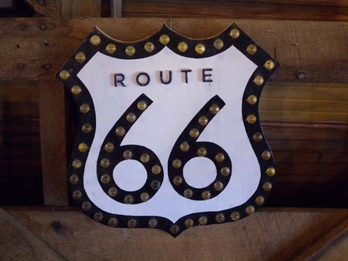  
66번 도로 가의 Arcadia Round Bahn에 전시 중인 66번 도로 표지판

우리가 유콘을 찾은 것은 11월 2일(토)이었다. 사실은 66번 루트에서 비교적 유명한 오클라호마시티 남쪽 엘크(Elk) 시의 ‘국립 66번 도로 박물관(National Route 66 & Museum)’, ‘옛 마을 박물관 단지(Old Town Museum Complex)’, ‘농업 및 목축업 박물관(Farm and Ranch Museum)’ 등 세 박물관들을 돌아보기 위해 집을 나선 길이었는데, 오클라호마시티에 들어오니 시곗바늘은 이미 11시 반을 넘고 있었다. 그런데 우리의 목적지는 스틸워터로부터 달려 온 만큼의 시간을 그로부터 더 달려야 하는, 100마일이나 먼 거리에 있었다. 도착하면 오후 2시쯤 될 것이고, 점심을 먹고 나면 3시쯤 될 것 아닌가. 난처했다. 박물관 하나를 겨우 보고나서 다시 되돌아 와야 하고, 되돌아오는 길 또한 300마일쯤이나 될 것이니, 오밤중이나 넘어서야 집에 들어 갈 수 있을 것이었다. 끔찍하게 드넓은 미국 땅. 그 중에서도 끝없이 펼쳐진 벌판의 왕국 오클라호마를 얕본 우리의 실책이었다. 잠자리에서 일어나자마자 출발했어도 쉽지 않을 거리였는데, 느직이 일어나 아침을 다 챙겨먹고 나선 길이니 여유롭게 돌아보고 오기란 엄두도 낼 수 없었다.

그래서 하는 수없이 하이웨이의 출구를 빠져나와 주유소와 푸드마트, 구멍가게 등을 겸한 휴게소에 들렀는데, 마침 66번 도로가 그 휴게소 옆을 지나고 있었다. ‘작전 상 후퇴’ 아닌 ‘시간 상 노정 변경’이었다. 마트에 들른 그 지역 사람들에게 물으니, 하나같이 유콘시티를 추천했다. 그래, 오늘은 유콘을 탐사하기로 하자. 그렇게 해서 우리는 66번 길가에 묻혀 있던 유콘을 찾아낸 것이다.

\*\*\*

시내에 들어서자 저 멀리 도시 입구 쪽의 메인 스트릿 양 옆에 원통형의 거대한 건물들이 서 있었다. 이 도시의 랜드마크 역할을 하는 듯 그 건물들의 위압적인 모습이 범상치 않았다. 다가가 보니 두 건물 모두 제분공장이었다. 문은 굳게 닫혀 있고 그 사이를 지나는 철길도 녹이 슬어 있어 이 제분공장에서 밀가루가 만들어지고 있는지 알만한 단서는 아무데도 없었다. 퇴락한 옛날의 영화들이 건물 벽의 각종 글씨들에만 흐릿하게 남아 있었다. 이 정도 규모의 제분공장들이라면 아마 이 근동 사람들이나 먹여 살리는 데 만족할 수는 없었을 것이다. 기차에 실려와 조달된 밀을 가루로 만들고, 그것을 다시 그 기차로 다른 지역에 실어다 팔기도 했을 것이다. 나중에 보기로 하고 우리의 1차 관심처인 ‘유콘 역사박물관[Yukon Historical Museum]’을 찾기로 했다.

 

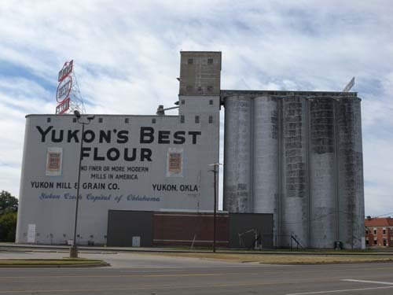  
유콘 제분소[Yukon Mill]-"유콘의 최고 밀가루"란 문구가 눈에 띈다

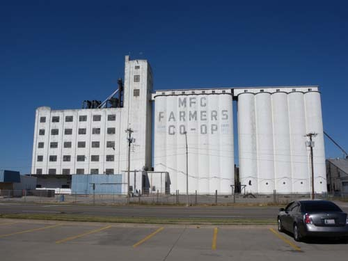  
맞은편에 있는 또 하나의 제분소

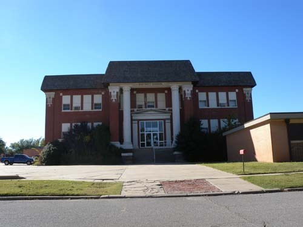  
유콘 역사박물관[Yukon Historical Museum]

그러나 작은 도시의 메인 스트릿을 오르락내리락 하며 박물관을 찾았으나 눈에 보이지 않았다. 하는 수 없이 책자에 소개된 번호로 전화를 걸었다. ‘규정상 미리 예약을 해야 볼 수 있으나, 오늘은 그냥 보여주겠다’는, 젊고 아름다운 여성의 목소리였다. 설레는 마음으로 달려가니 80대로 보이는 깨끗한 할머니가 기다리고 있었다. 이름은 캐롤(Carol Knuppel). 이른바 자원봉사 큐레이터였다. 건강은 좀 안 좋아 보였으나 맑고 지성적이며 자신들의 향토 역사에 대단한 자부심을 갖고 있는 지식인이었다.

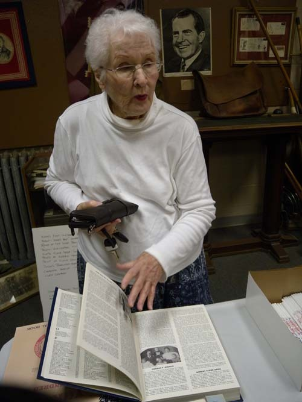  
유콘 역사박물관의 큐레이터 캐롤

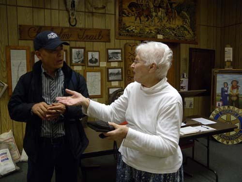  
대화를 나누고 있는 캐롤과 백규

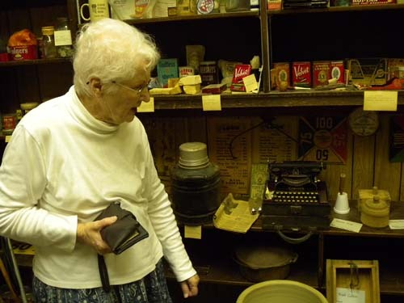  
생활사 관련 소장품을 설명하고 있는 캐롤

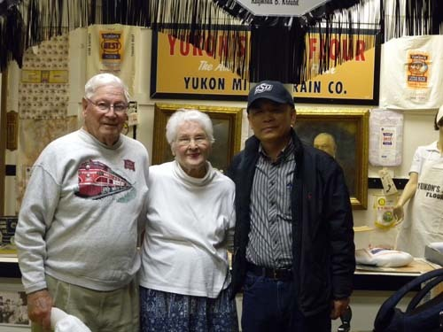  
캐롤과 전직 소방관인 남편, 그리고 백규

폐교된 초등학교를 1 달라에 주 정부로부터 불하받아 개관한 박물관이었다. 우리가 이미 목격하고 온 밀가루 공장 유콘 밀(Yukon Mill)을 중심 컨셉으로 박물관의 콜렉션은 이루어져 있었다. 캐나디언 카운티(Canadian County)에 속한 유콘은 1891년 스펜서(A. N. Spencer)에 의해 세워졌으며, 오클라호마시 인접 도시로 존속되어 왔다. 캐나다 카운티의 유콘 구역에서 있었던 골드러쉬(gold rush)를 바탕으로 명명된 유콘 시티가 지금은 오클라호마시티 직장인들의 베드타운 역할을 하고 있지만, 원래는 이 지역 농업의 중심지로서 대규모 제분작업이 이루어지던 곳이었다. 그런 역사적 바탕 위에서 비로소 우리는 Yukon Mill의 존재를 이해할 수 있었다.

유콘의 시민들은 Yukon Mill에 대단한 프라이드를 갖고 있다는 말로 큐레이터 캐롤의 설명은 시작되었다. 보헤미아에서 이민 온 체코인들의 자본으로 세워진 것이 이 제분소들이었다. 1891년 이 도시가 세워지고 철도까지 부설되자 이 도시는 급속히 번성하게 되었다. 1898년에 이르자 이 도시는 체코 이민자들의 보금자리로 자리를 잡게 되었으며, 그에 따라 유콘은 '오클라호마의 체코 수도'로 알려질 정도였다.

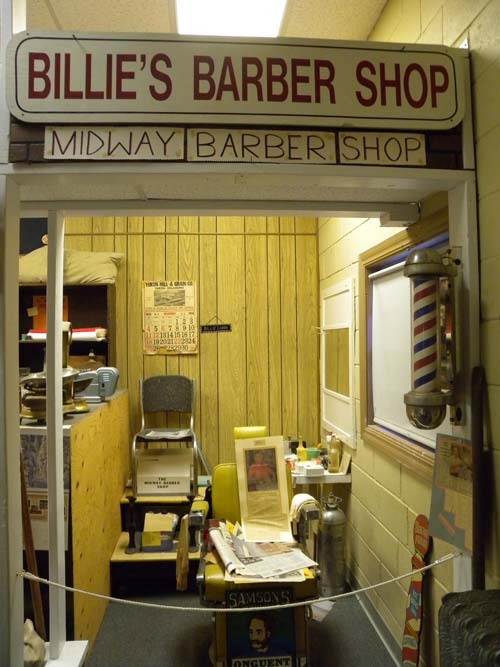  
박물관에 통째로 기증된 이발소

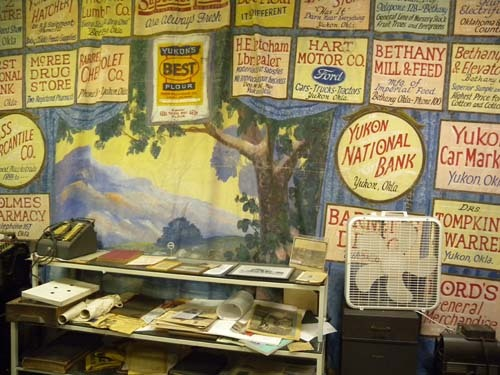  
박물관 행사를 후원한 지역의 기업들

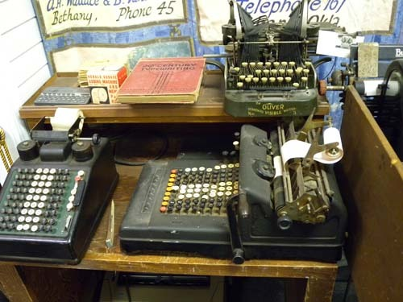  
박물관 소장 사무용품

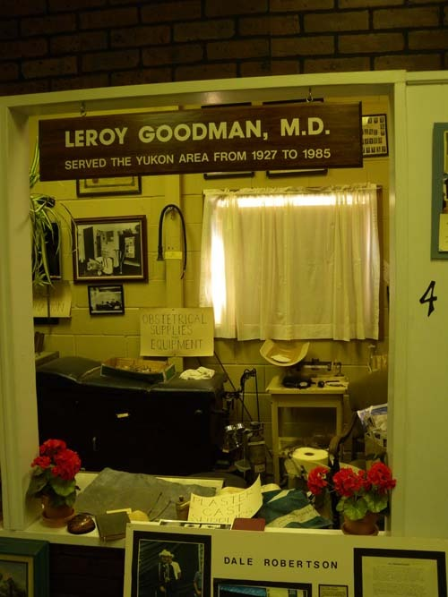  
통째로 기증받아 전시하고 있는 치과의원

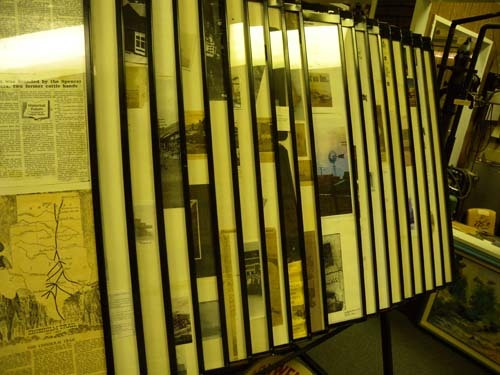  
유콘시에 관한 신문기사들을 스크랩해 놓은 자료들

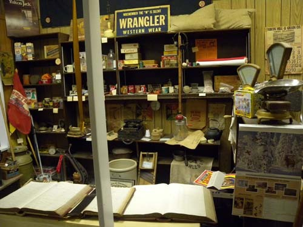  
통째로 기증받아 전시하고 있는 잡화상 콜렉션

 

1893년에는 소규모 제분공장인 ‘유콘 제분 곡물 회사[Yukon Milling and Grain Company]가 사업을 시작하여 급속히 성장했고, 1915년에는 해외로 곡물을 수출까지 하게 되었다. 그 첫 제분소는 없어진지 오래지만, 대형 곡물창고는 지금도 66번 도로와 철로가 만나는 지점에 서 있었다. 지금도 건물 북쪽의 외벽에는 “유콘 제분소[Ykon Mills]”, “유콘 최고의 밀가루[Yukon’s Best Flour]” 등의 글자들이 선명하게 빛을 발하고 있었으며, 동쪽에는 “유콘 최고의 밀가루[Yukon’s Best Flour]/미국 최고급 근대 제분소[No finer or more modern mills in America]/유콘 제분 곡물 회사-유콘 오케이/유콘은 오클라호마의 체코 수도[Yukon Czech Capital of Oklahoma]” 등의 글귀들이 새겨져 있었다. 2차 세계대전 동안 미국 정부는 이 회사로부터 많은 밀가루를 사다가 굶주린 동맹국들을 도왔다는데, 그 덕에 이 회사는 더욱 성장할 수 있었다고 한다.

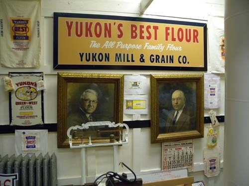  
유콘밀 관련 자료들과 설립자들

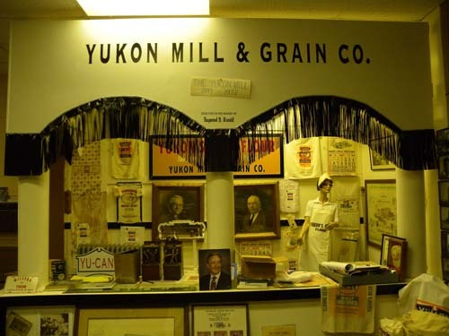  
유콘밀 관련 자료들

유콘 제분소를 중심으로 하는 이 지역 산업과 경제 관련 생활사 콜렉션들을 설명한 다음, 캐롤은 우리를 1층으로 인도하여 이 학교를 거쳐 간 졸업생들과 교사들의 사진이 가득한 방을 보여주었다. 사진은 물론 각종 교과서, 학용품, 학교 비품, 생활기록부 등 학교와 학생들에 관한 생생한 자료들이 방 안에 그득하였다. 일종의 살아있는 아카이브(archive)였다.

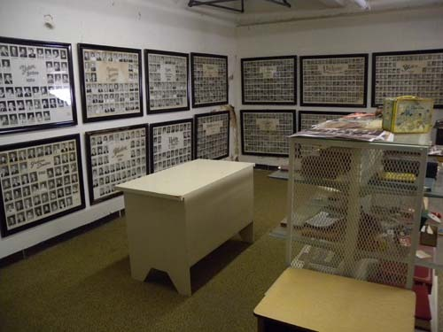  
학교 졸업생 관련 자료들

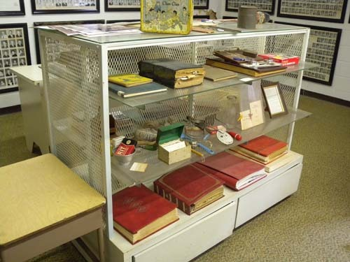  
학교 졸업생 관련 자료들

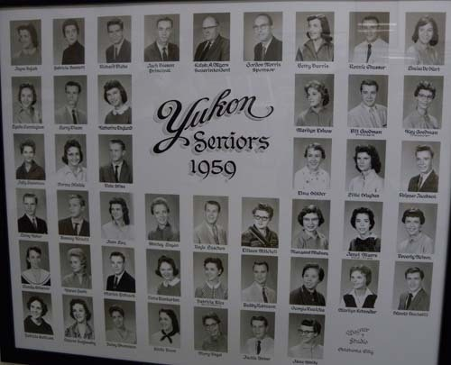  
1959년 교사들 사진

\*\*\*

박물관은 작았지만, 그곳의 콜렉션들은 1세기 이상 지속되고 있는 이 도시의 삶을 보여주는 ‘스토리’의 원천이었다. 설명을 들으며 폐교를 비싼 값에 매각, 처분하는 우리나라가 문득 생각났고, 그 ‘무사려한 처사’가 나를 많이 안타깝게 했다. 이곳에서는 폐교를 단 1달라에 이 지역 사람들에게 넘기고, 그 공간을 박물관으로 개조하여 쓰도록 도와주고 있다 한다. 이미 썩어버렸거나 엿장수들의 손에 엿 값으로 넘어가 지금은 모조리 사라진 우리 고향의 각종 생활사 자료들을 보관, 전시할 지역 박물관을 폐교에 만들었더라면 얼마나 좋았을까. 아무리 ‘비까번쩍한’ 건물로 우리의 외면을 치장한들 무엇 하랴. 역사와 스토리가 빠진 도시는 영혼이 빠져나간 인간의 육체나 마찬가지! 그런데 이들은 폐교를 활용하여 자신들이 스스로 모은 생활사 자료들을 박물관으로 만들고, 이 도시에 생명을 불어넣고 있었다. 주민들은 자원봉사 큐레이터 역할을 함으로써 선대로부터 이어온 삶의 모습과 문화를 계승, 보존하며 후대로 이어주고 있었다. 자신들의 삶에 대한 자부심과 철저한 역사의식이 없다면 불가능한 일일 것이다. 66번 도로의 역사성과 유콘 시티에 대한 부러움을 함께 느끼며, 우리는 아쉬운 발길을 돌렸다.

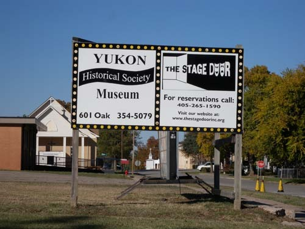  
입구 쪽 코너에 세워놓은 박물관 간판

공유하기

게시글 관리

**백규서옥\_Blog ver.**