인간의 악마성을 깨우쳐 주는 공간-오클라호마 메모리얼 뮤지엄(Oklahoma City National Memorial & Museum)

인간은 착한 존재인가, 아니면 악한 존재인가. 동・서양의 철학자들이 오랜 세월 궁리해왔지만 쉽게 결론 날 문제는 아니다. 성선설을 주장한 학자나 성악설을 주장한 학자나 아무리 복잡한 논리들을 늘어놓았어도 모두 경험의 한계를 벗어나지 못했다는 의혹에서 자유롭지 못하다. 이 경우 공자의 말씀[子曰 性相近也 習相遠也: 공자 말씀하시되 본성은 서로 비슷하나 익혀 얻게 되는 성품은 서로 멀어지게 된다/<<논어>> <양화> 제2장]에서나 어떤 해결의 단서를 찾을 수 있을까.

그렇다. 인간의 본성이 악한지 선한지 구분하는 것 자체가 부질없는 일일 것이다. 다만, 태어나 살아가면서 어떤 상황에 놓이느냐에 따라 다른 길을 가는 것 뿐 아니겠는가. 다만 착한 쪽으로 방향을 틀 경우는 대개 그 정도에 한계가 있으나, 악한 쪽으로 방향을 틀 경우 그 끝을 헤아릴 수 없고, 진행 양상 또한 극적이다. 그래서 고금의 많은 문학가들이 소설이나 영화를 통해 인간의 악마성을 그려내고자 노력해온 것이리라.

\*\*\*

얼마 전부터 ‘오클라호마에 왔으니 메모리얼 뮤지엄은 보아야 할 것’이라고 어느 지인이 권유를 했다. 18년 전 뉴스를 보며 ‘끔찍한 사건’이란 생각을 했으면서도 실감이 안 나 그냥 들어 넘기고 만 셈인데, 이제 그 현장에 온 만큼 안 볼 수는 없는 일. 더구나 훨씬 규모가 크고 끔찍했던 2001년의 ‘9・11 테러’로 치를 떨었던 만큼, 인간 악마성의 한계를 현장에서 느껴보고 싶었다.

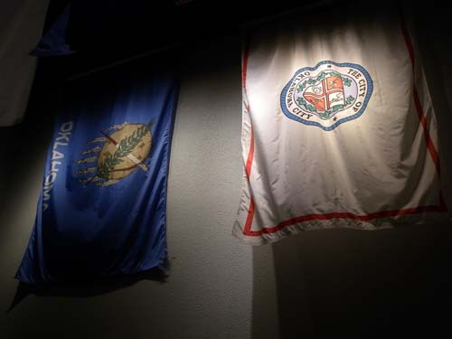  
연방청사 폭파의 참화에서 살아난 오클마호마 주 깃발과 시 깃발

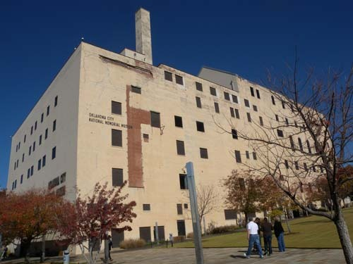  
오클라호마시 국립 메모리얼 뮤지엄의 현재 모습

이런 사건이 터지면 흔히 용의선상에 오르곤 하던 이슬람 테러단체 아닌 미국인들이 자국민을 상대로 테러를 벌였다는 점을 누군들 쉽게 이해하겠는가. 1995년 4월 19일 오전 9시 5분. 트럭에 실려 온 2000kg 이상의 폭발물이 터져 오클라호마의 연방청사는 처참하게 망가졌고, 보육원 어린이 상당수를 포함 168명 사망에 600여명의 부상자가 생겨났다. 사망하거나 부상당한 연방청사의 공무원들, 어린이들, 일반인들 모두 테러범들과는 이해관계가 전혀 없는 사람들. 평소 일면식도 없었을 이들에게 엄청난 규모의 폭탄 테러를 가한 이유는 대체 무엇이었을까.

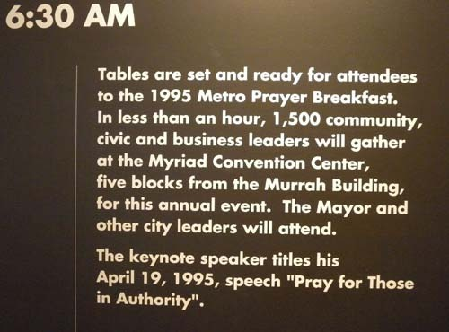  
테러 당일 오전 6시 30분의 상황. 조찬기도회 준비상황과 기도제목

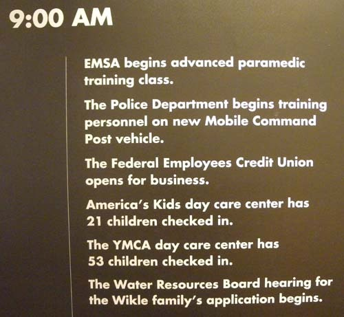  
폭파테러 직전의 상황(일상업무 시작, 그리고 보육원의 어린이들...)

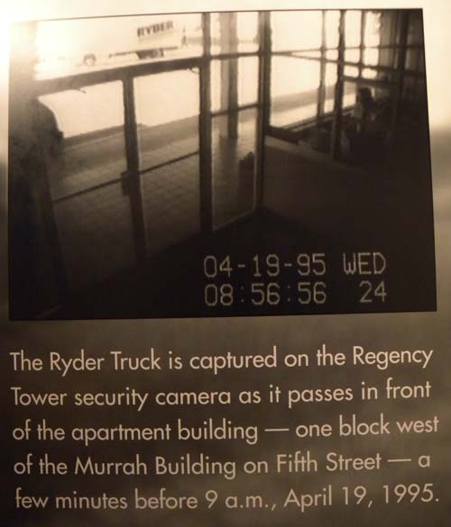  
폭발물을 싣고 달려오는 라이더 트럭이 창밖으로 보이지요?

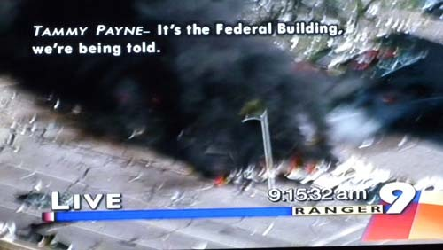  
폭발 순간의 영상

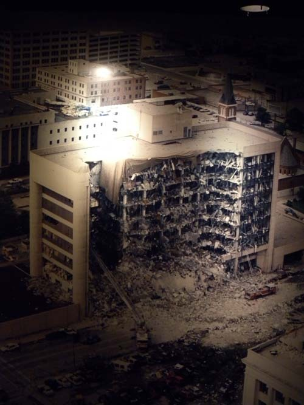  
테러 직후의 처참한 모습

주범인 중산층 출신의 걸프전 참전용사 티모시 맥베이[Timothy McVeigh, 1968-2001]와 종범인 테리 니콜스[Terry Nichols, 1955~]는 둘 다 미시간에 근거를 둔 급진 우익 서바이벌 그룹의 멤버들이었다. 서바이벌 그룹(survival group)이란 자신이나 자신의 그룹[혹은 국가]이 살아남아야 한다는 신념으로 ‘무슨 짓이든’ 저지르는 미치광이 집단이다. 이들의 광기 앞에는 환상을 바탕으로 한 테러나 무차별의 증오만이 있을 뿐, 상식이나 이성은 있을 수 없었다. 18년이 지난 지금까지 사건의 전말은 석연하게 밝혀지지 않았지만, 앞으로도 계속 미국사회가 이런 어처구니없는 테러의 무대가 될 수밖에 없다는 암울한 전망을 갖게 한 사건이었다.

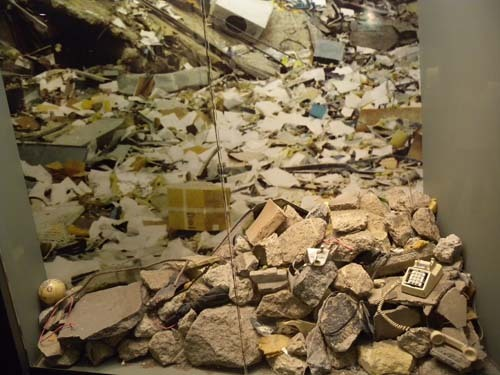  
참상

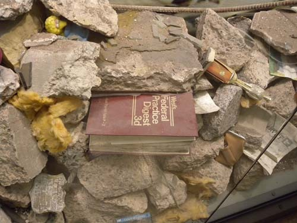  
참상

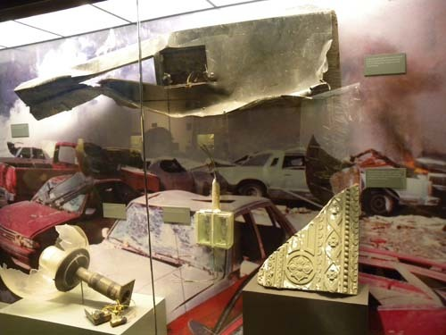  
참상

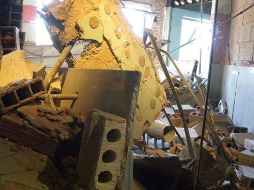  
참상

\*\*\*

사실 우리 같으면 빨리 그 악몽에서 벗어나기 위해 순식간에 잔해들을 치우고, 그 자리에 보란 듯이 새로운 건물을 세웠을 것이다. 그리고 잠깐 뒤면 새 건물에서 일을 보는 사람들이나 그곳을 드나드는 사람들은 언제 그런 일이 있었느냐는 듯 태평해져 있었을 것이다. 그런데, 이들은 그렇지 않았다. 모조리 사라진 건물터엔 희생자들의 공동묘지와 기념물을 만들어 놓았고, 위에서 아래로 ½가량 파손된 건물을 세심하게 수습하여 박물관으로 재생시켜 놓은 것이었다. 사건 직전부터 발발, 수습에 이르기까지의 시간대 별 전 과정과 내용, 범인의 체포와 형 집행 등 사건 처리 과정, 희생자들의 신원 및 제반 관련 정보들, 시민들과 전 세계인들의 반응, 국가의 대응 내용 등 사건과 관련하여 동원할 수 있는 모든 것들이 일목요연하게 전시되어 있었다. 뿐만 아니라 폭발의 위력에 깨지고 부서진 시멘트 벽, 엿가락처럼 구부러진 각종 철 구조물들, 소방관들의 희생적인 구조 활동, 구조견의 대견한 활약상, 상태가 심한 부상자들을 구조하다가 정작 자신은 숨을 거둔 민간인 부상자들의 영웅적 활동, 시민들의 자발적 구조 활동 참여 등 가슴을 뭉클하게 만드는 ‘교육의 현장’이었다.

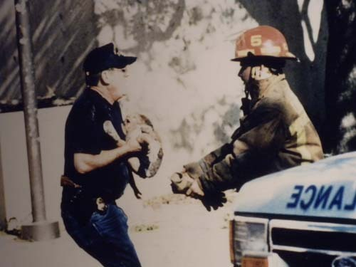  
잔해더미 속에서 아기를 구해 소방관에게 전하는 구조대원

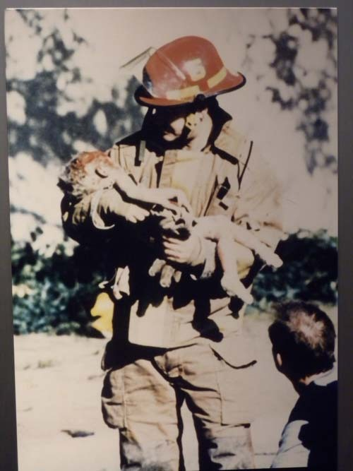  
구조대원으로부터 넘겨 받은 아기를 안고 있는 소방대원. 이 아기는 병원으로 옮겨졌으나 곧 숨졌음.

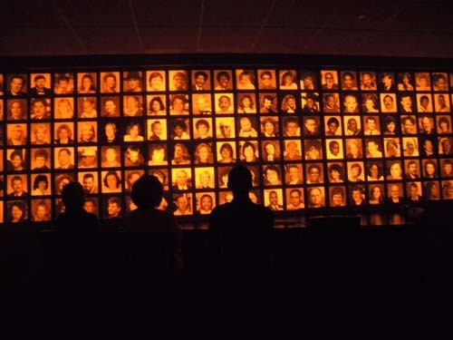  
희생자들

  
이 아기들의 재잘거림이 들리시나요?

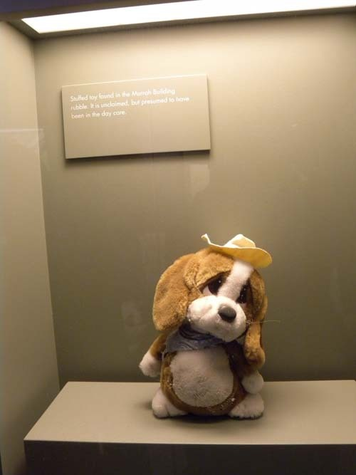  
잔해 속에서 발견된 봉제 강아지 인형. 건물 안의 'day care center'에 있던 것으로 추정됨.  
강아지의 슬픈 표정이 보이시죠?

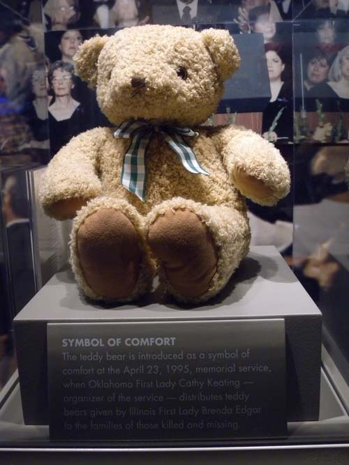  
평안의 상징인 테디 베어[일리노이주 퍼스트 레이디 브렌다가 보낸 테디베어를   
오클라호마 퍼스트 레이디 케이티가 희생자 가족들에게 나누어 주었음]

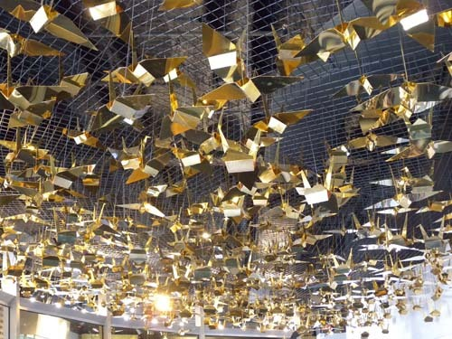  
산자들이 희생자들의 안식을 빌며 만든 종이학

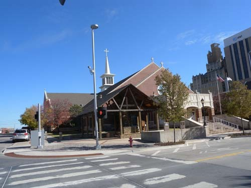  
테러 당시 크게 손상을 입었다가 새롭게 단장된 연합감리교회[First United Methodist Church]

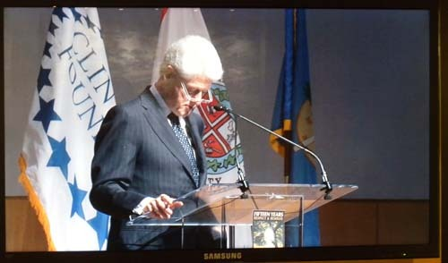  
희생자 추도식에서 조사를 읽고 있는 빌 클린턴 당시 대통령

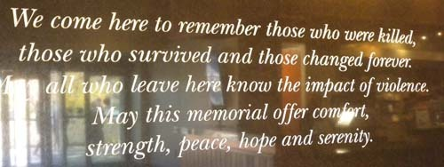  
미국인들, 아니 이곳을 방문한 세계인들은 다음과 같이 말한다. "우리는 죽은 이들을,   
살아남은 이들을, 그리고 삶이 영원히 변해버린 이들을 기억하기 위해 여기에 왔다.   
이곳을 보고 떠나는 모든 이들은 폭력의 충격을 잘 알게 되었다. 부디 이 기념관이 평안을,   
강건함을, 평화를, 희망을, 그리고 평온함을 주기를..." 이라고.

\*\*\*

부끄러운 테러, 혹은 비극적 참상을 ‘교육의 현장’으로 바꿔놓을 줄 안다는 점에서 참으로 대단한 미국인들이었다. 이곳을 끊임없이 찾아와 그 때의 충격을 느끼며 자손들에게 테러의 죄악을 교육하고 있는 미국인들의 모습은 지금도 여전했다. 그　뿐 아니다. 보존된 현장을 바탕으로 밝혀지지 않은 진실을 찾기 위해 노력 중이라는 그들의 말에 나는 할 말을 잊고 말았다. 우리가 만약 무너진 삼풍 아파트를, 다리의 상판이 떨어져 내려앉은 성수대교를 그대로 보존하여 반성과 경각심의 자료로 삼을 수 있었다면, 아마 지금쯤 우리는 선진국 대열의 앞자리에 앉아 있을지도 모르는 일 아닌가. 같은 잘못을 반복하지 않으려면, 잘못의 현장을 액면 그대로 보여주며 깨우쳐야 한다. 잘못을 반복하는 것은 역사의 부조리로부터 아무것도 배우지 못했기 때문이고, 그것은 국가를 운영하는 사람들의 무지와 짧은 생각으로부터 생겨나는 비극이다. 이제 우리도 큰 사건의 현장은 오래 보존하여 후세를 위한 교육의 자료로 삼아야 할 때다.

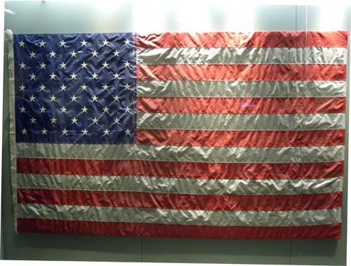  
테러에서 아무 손상없이 살아남았다는 성조기

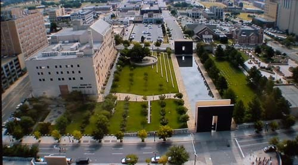  
테러 이후 박물관으로 환생한 연방청사와 주변의 모습

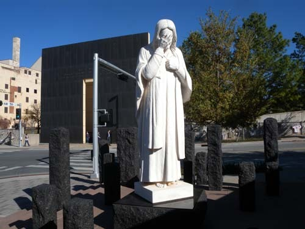  
최악의 테러사건에 눈물을 흘리시는 예수님[박물관 대각선 건너편 코너에 있음]

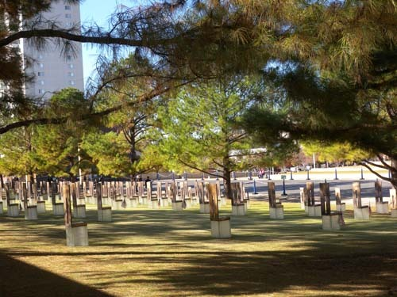  
희생자 묘역

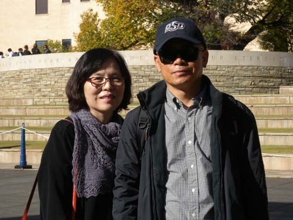  
희생자 묘역 앞에서

공유하기

게시글 관리

**백규서옥\_Blog ver.**