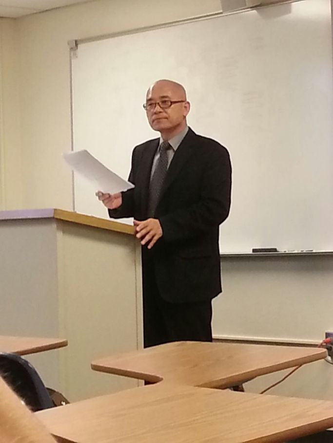
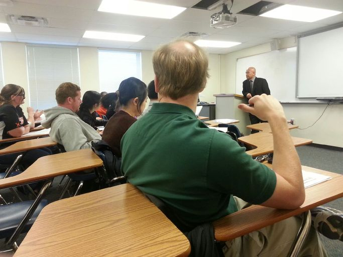
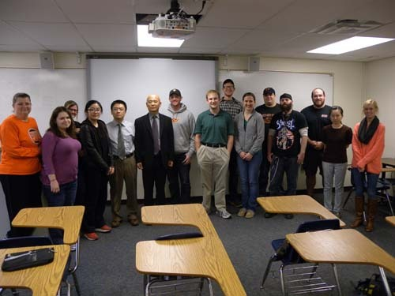

역사학과 학생들을 위한 특강을 마치고-한국의 이미지를 새것으로!

이곳에 도착하면서 아시아사를 가르치는 Du 교수가 한국사에 관한 내용들을 수시로 물어왔다. 이것저것 설명해주면서 ‘한국사 부분은 내가 가르칠까?’라고 농을 건넸더니, 그 말을 진짜로 알아듣고 이곳 생활이 겨우 안정되어갈 즈음 신라사 부분을 강의해줄 수 있느냐고 제의해왔다. 그러나 신라를 비롯한 고대사 부분에 대한 지식이 지극히 엷은 탓에 강의안을 마련하려면 아주 많은 시간과 정력을 투자해야 했다. 그래서 나름대로 자신 있다고 생각해온 여말선초, 특히 신흥사대부의 출현이나 국초의 분위기와 결부시켜 건국 서사시 <용비어천가>를 강의하겠노라 역으로 제의하였다.

\*\*\*

강의실에 들어가니, 한국 유학생 1명과 중국 유학생 2~3명을 제외하면 약간이라도 한국을 아는 학생들은 거의 없는 듯 했다. 사실 이 점은 이곳의 기성세대도 마찬가지였다. 직접 한국전에 참가했거나 참전한 부친으로부터 얻어들은 정보가 전부인 퇴역군인들을 이곳에서 만난 적이 있는데, 그들 대부분이 갖고 있는 한국 이미지 역시 ‘6・25 당시’의 그것으로부터 한 발짝도 나아가지 않은 수준의 것이었다. 그들은 우리를 ‘6・25 때 코 찔찔 흘리면서 쫓아다니며 껌을 구걸하던’ 그 상태로 생각하고 있는데, 우리만 좁은 한국 안에서 세상 사람들이 우리를 알아준다고 착각하고 있었던 것이다. 그래서 나는 ‘비록 한국이 면적으로는 오클라호마 주의 반밖에 안 되지만, GDP로 따져 세계 10위의 경제대국이고 수출액으로 세계 9위의 경제대국이며, 5천년의 역사와 찬란한 문화를 지닌 단일민족임’을 힘 주어 말할 수 밖에 없었다. 수긍하건 말건 이 사실만은 분명히 주지시킨 다음 특강을 진행해야 내 속이 풀릴 것만 같았다.

  
강의 중

  
강의 중

  
질의응답이 끝나고 남아 있는 학생들과

\*\*\*

그게 효과가 있었던지, 강의가 끝나고 질문을 하라고 하자 너도나도 손을 들고 한국사의 궁금한 점을 물어왔다. 그들이 특히 관심을 갖는 내용은 왕명으로 한글을 만들었다는 점, 한글의 존재와 쓰임새, 당시의 사회구조, 왕조의 지배체계, <용비어천가>를 올려 부른 궁중예술(court performing art) 등 다양했다.

그들과 질의응답을 하며, 다른 나라 특히 미국 같은 영향력 있는 나라에서 우리의 역사를 교육하는 것이 얼마나 중요한지 새삼 깨닫게 되었다. 자동차 한 대, 스마트 폰 한 대 더 파는 것보다 대학들에 한국학을 개설하고 학생들에게 교육하는 것이 우리로서는 훨씬 중요하다는 점을 알게 된 것이다. 한국사의 작은 부분을 문학과 결부시켜 설명하는 데 그치긴 했으나, 앞으로 한국학의 세계화를 위해 어떤 자세를 취해야 하는지 뚜렷한 해답을 얻은 셈이었다.

강의가 끝나자 청강하러 왔던 박사과정 학생 둘이 다가와 자신들이 만든 ‘외교사 토론클럽’이 있는데, 나와서 한국 현대사에 대한 지도를 해줄 수 있느냐고 묻는 것이었다. 이 요청을 받고, 한국사에 대한 학생들의 흥미를 자극하는 데 성공적이었다는 평가를 스스로 하면서 그들의 요청을 쾌히 받아들이게 되었다. 이 모든 것들이 연구 활동 과정에서 얻게 된 소중한 경험이었다. 

아시아사, 특히 한국사가 미국학생들이 별로 관심을 보여주지 않는 분야임을 알게 되면서 미국을 비롯한 서양 국가의 국민들이 우리를 잘 알지도 알려고 하지도 않는다는 점을 깨닫게 되었을 뿐 아니라, 그로 인해 얼마간 충격을 받은 것도 사실이다. 속된 표현으로 그저 '코딱지만한' 나라가 하나 있어, 동족끼리 맞붙어 크게 싸웠으며, 지금도 으르렁거린다는 점 외에 크게 아는 내용도 알고 싶어하는 내용도 없는 대상이 우리임을 비로소 알게 된 것은 길게 보아 우리자신에게 좋은 약이 되긴 하겠지만, 지금 당장은 분명 씁쓸한 일이었다. 

사실 중국 혹은 중국문화와 역사에 대하여 느끼는 서양인들의 두려움이나 존경심, 일본이나 일본문화에 대하여 갖고 있는 서양인들의 호감을 6개월에 걸친 유럽여행에서 확인했고, 지금 미국에 와서 재확인하는 중이다. 일모도원(日暮途遠)의 초조함에 우리의 조급함이 가세하게 되니, 참으로 마음이 편치 않은 나날이다. 그러나, 어쩌랴. 천릿길도 한 걸음부터요, 옹달샘이 있어야 강도 이루어지는 것 아닌가. 황소처럼 그냥 앞만 보고 나아갈 일이다. 그러다 보면 어느 순간 그들이 갖고 있는 '1950년대의 이미지'가 '펄펄 나는 21세기의 이미지'로 바뀌는 날도 있을 것 아닌가?   

참고로 강의내용을 들면 다음과 같다.

\*summary/special lecture for students of History Department

 

 

History as Literature, Literature as History

--Understanding Yongbi’eocheon-ga[Songs of the Dragons Flying to Heaven], the epic poem praising the foundation of Joseon Dynasty--

 

 

                         Dr. Cho, Kyu-Ick

(Professor of Soongsil University, Seoul, Korea/Visiting Fulbright Scholar, History Department of Oklahoma State University)

 

                       

 

**Foundation of Joseon Dynasty and Necessity of Creating**

**Yongbi’eocheon-ga[Songs of the Dragons Flying to Heaven]**

 

 

Is there a point of contact between history and literature? If there is, what is it? And where is it? The key purpose of my speech is to disclose this point through Yongbi’eocheon-ga\* [Songs of the Dragons Flying to Heaven]as an epic that sang the history of the early period of founding Joseon Dynasty. The point of contact is just using imagination whenever we interpret literary materials and historical facts. I’d like to explain this issue through the heroic achievements in Yongbi’eocheon-ga as historical facts or literary materials.

 

Joseon was the dynasty occupied in the last part of Korean history before the modern age. The first King, Taejo Lee, Seong-Gye founded the dynasty after destroying the Koryeo Dynasty in 1392 A.D. Joseon is the dynasty that 27 Kings had ruled for 518 years until the Japanese annexation of Korea in 1910.

 

The 4th King, Sejong the Great, created Han’geul, the independent letters to spell the Korean language. To test the usability of Han’geul, King Sejong the Great ordered his intellectual subjects to make Yongbi’eocheon-ga, which praised the achievements of the foundation of Joseon Dynasty by 6 ancestors from the 5th grandfather, Mokjo to his father King Taejong.

 

Lee, Seong-Gye, Taejo was a general of the late Koryeo Dynasty period. However, the late Koryeo Dynasty was facing a crisis of collapse because of the tyranny of a  small number of the aristocracy. Lee, Seong-Gye was a general with a strong military force, and the group in power that used his military force was the newly arisen aristocracy armed with Neo-Confucianism, also known as the Zhu Xi[Chu Hsi] school.

 

Eventually, Lee, Seong-Gye destroyed the Koryeo Dynasty and founded the Joseon Dynasty, using his own military force and the newly arisen aristocracy’s support. The Joseon Dynasty introduced Confucianism as its state religion, contrary to the Koryeo Dynasty that adored Buddhism, and enforced the bureaucracy led by the retainers group as a main axis at that time.

 

However, even if Lee, Seong-Gye grasped the Koryeo Dynasty’s military power, he was only a subject of his King. No matter how cruel the King was, the notion that a subject cannot get rid of his king was one of the kernels of Confucian ideology. In other words, the people at that time generally had a firm faith that all offspring had to practice filial piety toward their parents, wives had to respect their husbands, and subjects had to be loyal to their king.

 

In this respect, Lee, Seong-Gye’s taking the throne was a clear treason. Especially in respect to Confucianism, overthrowing their king was an indefensible treason. If the people think of their King as a leader of treason, who renders devoted service to him? How can a dynasty without people’s loyalty to their king be continued for a long time?

 

So, there were many resistance groups in the early stage of the dynasty, and the ruling foundation was not strong and steady. King Sejong the Great knew the problems well. He had pity on the people without their own letters, which are a means of expression about their thoughts and feelings. So, he made Hunmin Jeong’eum(it means ‘correct letters to instruct people’), developed the various science and technology, and strengthened the national defense.

 

King Sejong the Great thought his grandfather, King Taejo’s founding of the Joseon Dynasty after destroying the Koryeo Dynasty as a historical and political matter with quite a weak justification. He believed that he had to set a reasonable ground and logical basis for the historical facts surrounding the foundation of the Joseon Dynasty.

 

To do so, he needed to cite his 6 ancestors’ achievements and make a long epic poem like Yongbi’eocheon-ga. Through Yongbi’eocheon-ga, with showing that their outstanding achievements were results not from their own personal capacity but from Heaven’s Command, the authors succeeded to present the ground beyond ethics or morals. That is to say, the historical fact that Lee, Seong-Gye as a subject drove out his King and became King himself was a result not by human desire or ability but by Heaven’s order.

 

This is just an imitation of the “thought of Heaven’s Will” from King Wu of the Zhou Dynasty. The authors wanted to remind people to be nothing but loyal to the dynasty, because of its foundation from Heaven’s order. King Sejong the Great intended to stabilize his dynasty by elevating Yongbi’eocheon-ga to the level of history by brainwashing and teaching people.

 

**Yongbi’eocheon-ga as the last defense logic of the existing interested group**

 

Yongbi’eocheon-ga was a product of this intention. So, it can be a historical writing as well as a literary work.  The newly arisen aristocracy that participated in Lee, Seong-Gye’s revolution held important posts as the meritorious retainers, and the power could be inherited to their offspring unless they had special problems.

 

In the era of King Sejong the Great, they had already become an existing interest group. Yongbi’eocheon-ga was the real example of an attempt of the intellectuals in charge of ideology in the early Joseon Dynasty to dilute the perceived weakness of justice and the frailty of morality in King Taejo’s revolution.

 

Arguing the same points that Joseon is the dynasty founded with Heaven’s order, the heartwarming hospitality for the meritorious retainers has to be sustained, and the integrity of the dynasty has to be eternal are the core contents of Yongbi’eocheon-ga. In the point that the intellectuals at that time paraphrased their own wish variously, also Yongbi’eocheon-ga was no exception.

 

Rather it can be said to put content inclination or thematic consciousness of the existing Akjang\*\* together fully. Heaven’s Command is a condition to prove a dynasty’s legitimacy, and the political power’s legitimacy is one of the matters cared about by the ruling group. The matter of ideology also has a functional relationship with whether a group in power has legitimacy or not. When ideology falls into disorder, categorical propositions like as dynasty’s perpetuity cannot help but be threatened.

 

In Yongbi’eocheon-ga the regime change from the Koryeo Dynasty to the Joseon dynasty but we can imagine that Lee, Seong-Gye used his military force to be persuasive. In addition, King Taejong[father of King Sejong the Great] was not the eldest son, King Sejong the Great also was not the eldest son who could not claim legitimacy. The illegitimacy of kingship which had repeated from King Taejo to King Sejong the Great was a critical matter possibly arousing the crisis consciousness of the ruling class.

 

If there were contradictions or irrationality like that, dynasty was difficult to continue. Dynasty’s perpetuity and prosperity are matters closely related to maintaining the vested rights of the ruling class. Akjang makers wanted to clarify that the foundation of the Joseon Dynasty was the result of what they should do morally. The Koryeo Dynasty was a symbol of immorality, while the Joseon Dynasty was a subject of what should be morally. In light of justice, to destroy the Koryeo Dynasty was a matter which made people realize principles and rules of rewarding the good and punishing the wicked, and it was a basis for realizing the ideal order of Confucianistic ideology.

 

However, for them, to monopolize the power was most important as the ruling class of the new dynasty. In this situation, the ideal king on top of the power structure governs well with a right attitude of mind was only a way to perpetuate the power they fought for from age to age. In all times and places, the power group with vested rights stood on the central status of conservatives. The newly arisen aristocracy that led to foundation of the Joseon Dynasty had been reforming power group in the first stage, however they eventually walked on the one way of conservatization after becoming the power group with vested rights as time went on.

 

They were able to emphasize justification of reformation when they were the subject of reformation. Their anxiety and consciousness of the reality was expressed in the works of Akjang including Yongbi’eocheon-ga as the end of the series of Akjang in Joseon Dynasty can be interpreted meaningfully, even in the history of politics and culture. If we attach the pre-existing conditions like features of the power structure and the authors in the political circles at that time, Yongbi’eocheon-ga is only a verbal representation of the Joseon Dynasty, wrapped up the leading group’s wishful thinking.

 

**History and Literature as the interpreted facts or truth**

 

 

Yongbi’eocheon-ga is a literary work as well as a historic writing as a narration about basic facts. The narrative represented symbolically in myth or tales is a genre of history in the classical era. Recently in Korea, some historical dramas  have become popular on TV. Accordingly, sometimes many people misunderstand it as a historical fact or confuse it with history. Dramatists use literary imagination, and historians use historical imagination.

 

People say that the literary imagination making fiction is different from the historical imagination dealing only with facts. However, is it really like that? In What is History, the author E.H.Carr explained two ways to write history, as objective and subjective. Literally, objective writing is the way only to list the facts as historical materials, subjective writing is the way to add an interpretation by a historian’s opinion on the subject.

 

Strictly speaking, there is no condition to guarantee the objectivity of supposedly objective writings. Although most historians are confident of their historical writing’s objectivity as something anyone can accept, usually it can’t be admitted, and we can’t say that the history written like that is a good one. Because it is an essential ability of the historian to select and interpret some historical facts. Here, the contact point between literary imagination and the historic one, that is to say, between history and drama, comes into being.

 

As a matter of fact, the intellectuals that created Yongbi’eocheon-ga utilized historical imagination and a literary one at the same time. They were prominent people, a combination of scholars of literature and historians. Undoubtedly, they did not work just to write a simple history book. They selected and interpreted historical facts, and mixed them in the bowl as literature.

 

Accordingly, Yongbi’eocheon-ga is in the form of an epic made with the happy combination of historical and literary imagination. Any reader with normal knowledge or insight can feel the authors’ literary sensitivity and historical strictness at the same time, I suppose. Because it shows the emotional horizon of the knowledge-based society at that time and historical consciousness about the foundation of the Joseon Dynasty. If so, how is the composition? Let’s see the first 3 cantos and final canto\*\*\*.  

(The original text is omitted.)

 

 

Foot Notes

 

 

\*It was created in 1445[the 27th year on the throne of King Sejong the Great], and published in 1447[the 29th year on the throne of King Sejong the Great]. The first edition might be movable metal print book, however, all of the existing books are xylographic texts. Because it was created before promulgating Hunmin jeong’eum[it means ‘correct letters to instruct people’/Independent writing system for the Korean spoken language] by King Sejong the Great, it was the first document written in Hunmin jeong’eum. Jeong In-ji, Ahn Ji, Gwon Je created it, Seong Sam-moon, Park Paeng-nyeon, Lee Gae annotated it, Jeong In-ji wrote the foreword, and Choi Hang wrote the post script. The common structure of individual canto of Yongbi’eocheon-ga is composed of original text, translation in Chinese old letters, and the related historical facts.[About the meaning of ‘canto’, refer to the footnote 3) in pp.6-7.] 

 

\*\*Akjang, one of the literary generic names, is used only in the learned world of Korea. It was used for the lyrics in the Joseon Dynasty’s court performing arts, namely, a composite art, a combination of playing music, singing, and dancing. Cf. Cho, Kyu-Ick, Literary Aesthetics of Joseon Dynasty’s Akjang, Seoul: Minsokwon, 2005.

 

\*\*\*The canto is a principal form of division in a long poem, especially the epic. It is similar to ‘stanza’ in form, function, or meaning. The word comes from Italian, meaning ‘song’ or ‘singing’. Yongbieocheon-ga is composed of 125 cantos.

공유하기

게시글 관리

**백규서옥\_Blog ver.**