우린 언제쯤이나 존경할만한 대통령을 가질 수 있을까?

미국에서 알래스카 주 다음으로 크고 캘리포니아 주 다음으로 인구가 많으며, 내 느낌으론 미국 내에서 최고로 부유한 텍사스 주[State of Texas]의 달라스(Dallas)시에 와 있다. 1836년 멕시코로부터 텍사스 공화국으로 독립했다가 1845년 12월 29일, 미국의 28번째 주로 흡수된 텍사스 주. 이른바 '바이블벨트'로 불리는 이곳과 오클라호마 등 중남부의 여러 주는 전통적으로 높은 공화당 지지율을 보여주는 등 보수적 성향이 강하다. 미국 입성 이래 서서히 쌓여온 피로에도 불구하고 달라스 행을 무리하게 시도한 것은 아무리 바쁘고 귀찮아도 오클라호마 주와 인접한 텍사스를 생략하고 떠날 순 없다는, 일종의 의무감이나 초조감 때문이라 할까?

16일 오후에 도착하여 하루를 묵고 난 17일 오전. 도착 당일부터 오클라호마와는 현저하게 다른 교통체계와 북적대는 인파에 지친 우리는 전원적이고 목가적인 오클라호마의 스틸워터로 당장 돌아가고픈 마음이 절실했지만, 그 욕망을 잠시 억누른 채 두 명의 전직 대통령을 만나기로 했다.

한 사람은 매사추세츠 주 출신의 35대 존 F. 케네디[John Fitzgerald Kennedy, 1917년 5월 29일 ~ 1963년 11월 22일] 대통령, 다른 한 사람은 텍사스 출신의 43대 조지 W. 부시[George Walker Bush, 1946년 7월 6일 ~ ] 대통령이다. 케네디는 가톨릭 집안 출신의 민주당적 대통령, 부시는 개신교 집안 출신의 공화당적 대통령이었다.

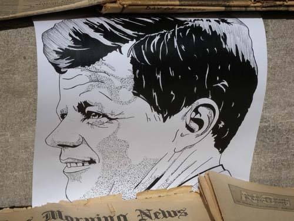  
시민이 그려 박물관 계단에 붙여놓은 케네디 대통령의 초상화

하버드대 정치학과 출신인 케네디는 44세에 대통령으로 당선되어 46세에 암살되었고, 예일대 역사학과 출신인 부시는 2001년 55세에 대통령으로 당선되어 첫 임기를 마치고 2005년에 재선된 뒤 2009년 63세까지 임기를 마친 행복한 인물이다. 정치경력으로는 케네디가 매사추세츠 주 상원의원을 지냈고, 부시가 텍사스 주지사를 두 번째 역임하고 있었으니, 이만 하면 똑같이 대권을 거머쥔 두 대통령이지만 상당히 다른 인생역정을 걸어왔음을 알 수 있다.

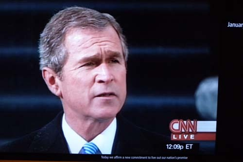  
취임연설을 하는 부시 대통령

두 대통령의 가문이나 경력, 정치적 성향, 정책의 성패, 개인적 성격 등 자세한 사항들은 이미 우리나라에도 많이 알려져 있으므로, 이 글에서 번거롭게 재론할 필요는 없을 것이다. 묘하게도 우리는 케네디 대통령 암살 50주년에 이곳을 찾게 되었다. 그 점을 깨달은 우리는 달라스라는 같은 공간에 자취를 남긴 두 대통령을 찾아보고자 했다. 존경하는 대통령을 한 사람도 갖지 못했다고 자탄하는 우리 입장에서 이 좋은 기회에 대통령을 자랑스러워하고 존경하는 미국인들의 모습을 직접 눈으로 확인하고 싶었던 것이다.

먼저 방문한 곳이 이른바 ‘6층 박물관[The Sixth Floor Museum at Dealey Plaza]’. 케네디 대통령 암살범 리 하비 오스왈드가 창틀에 앉아 총을 쐈다는 교과서 보관창고 6층에 마련된 박물관인데, 사실은 일종의 ‘사건 전말 영상 기록관’인 셈이었다.

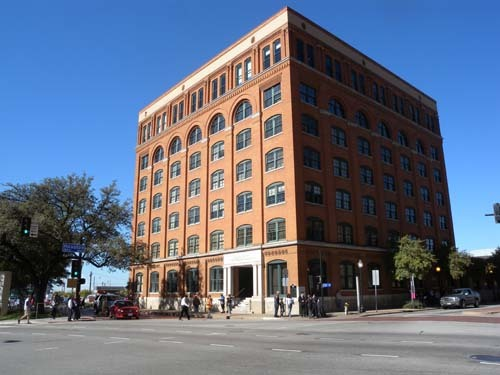  
케네디 대통령 암살범이 이용한 교과서 보관건물로, 현재는 박물관으로 쓰이고 있음

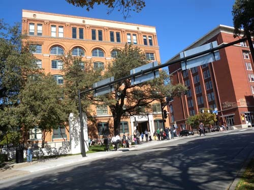  
현재 박물관으로 쓰이는 교과서 보관건물[오렌지색 건물] 6층 창문틀에서 오스왈드는   
카퍼레이드를 벌이며 이 사진 속의 아스팔트 위를 지나던 케네디 대통령을 저격했다.

1963년 11월 22일 링컨 컨티넨탈을 타고 달라스 시내에서 카퍼레이드를 벌이던 케네디 대통령은 딜리 플라자(Dealey Plaza) 인근의  교과서 보관창고 6층에서 오스왈드가 쏜 3발의 총탄 가운데 두 번째 총탄을 머리에 맞고 숨졌다. 이 사건의 전말이나 상세한 재판 과정, 저격범 오스왈드를 둘러싼 의혹 등 지금까지도 많은 사람들은 이 사건에 크나큰 의문을 갖고 있는 것이 사실인데, 그래서 그런지 사건의 발발에서 종말까지의 전 과정을 40여 장면으로 나누어 설명하고 있는 것이 박물관의 핵심 컨셉이었다. 박물관을 한 바퀴 돌고나자 암살사건의 전모와 함께 왜 미국인들이 케네디 대통령을 존경하고 사랑하는 지를 석연히 알 수 있게 되었다. 이런 점에서 외견상 허름하지만, 이 박물관은 매우 치밀하고 효율적으로 기획되어 있었다.        

                                                                      

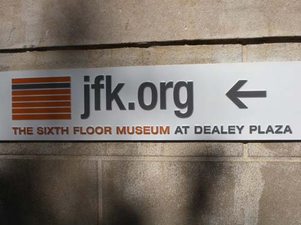  
                                  케네디 대통령 박물관 위치 및 사이트                                                            

                  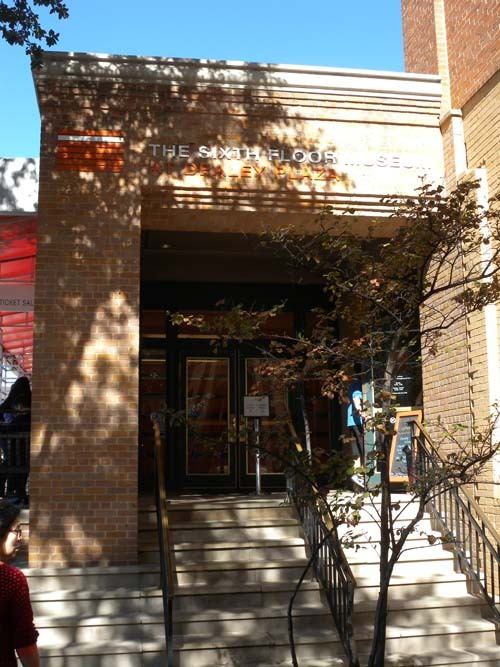   
                                                              케네디 대통령 박물관 입구  
                                                                                     

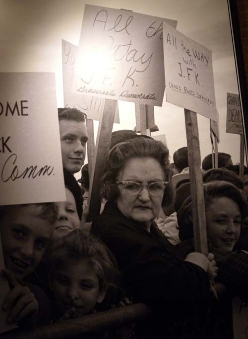  
달라스를 방문한 케네디 대통령을 열렬히 환영하는 시민들

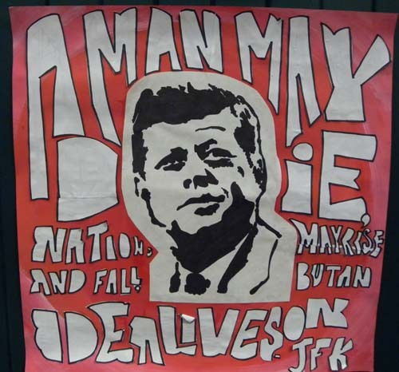  
                    어떤 시민이 그린 케네디 대통령

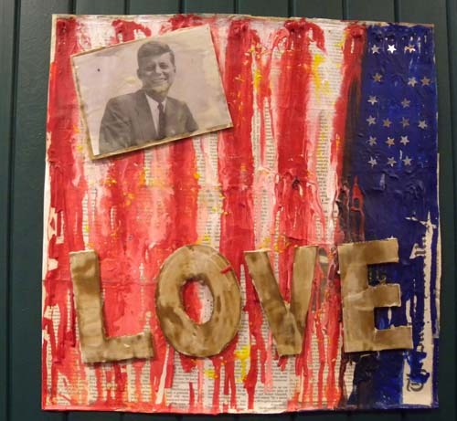  
어느 초등학생이 표현한 케네디 대통령에 대한 애정

  

그 다음 방문한 곳이 ‘조지 W. 부시 대통령 도서관과 박물관[George W. Bush Presidential Library and Museum]. 남부 감리교 대학교[Southern Methodist University]) 캠퍼스 안의 부시 대통령 센터 안에 세워져 있었다. 아버지 부시와 어머니 바버라 여사 및 부인 로라 여사 등을 비롯한 화목한 가족들, 학창시절과 군복무 시절의 각종 자료, 대통령 시절에 이룩한 대내외 업적들, 백악관 생활자료 등등. 엄청난 규모의 자료들이 생생한 사진들과 함께 기념관을 그득 메우고 있었다. 대충 둘러보아도 대통령 스스로의 자부심이 묻어날 뿐 아니라 국가와 국민을 위해, 더 나아가 세계인을 위해 미국 대통령이 걸어 온 영예의 흔적들이 역력했다. 정말로 이국인인 내가 보기에도 가슴이 뜨거워지는 감동의 현장이었다.

그러나 내가 주목하고자 한 것은 대통령의 암살에 대한 전말이나 의혹, 기념관에 전시된 업적들의 화려함이 아니었다. 미국인들은 과연 대통령을 진심으로 존경하고 사랑하는가가 궁금했던 것이다. 걱정했던 대로 관람객이 많이 몰려 우리가 케네디 박물관에 입장하는 데만 2시간이 넘게 걸렸고, 넓게 만들어진 부시대통령 박물관에서도 사람들의 어깨가 걸려 편안한 관람에 지장을 느낄 정도였다. 그 뿐 아니라 대부분 미국인들인 관람객들은 하나같이 진지하고 긍지에 찬 표정들을 하고 있었다. 내가 보기에 이 점들 만으로도 대통령에 대한 관심과 존경의 증거로는 충분했다.

케네디 박물관에서 만난 그들은 대부분 슬프고 안타까운 표정으로 이어폰에서 울려나오는 설명을 조용히 듣고 있었다. 나는 40대의 젊은 대통령이 단 2년 동안 이룩한 업적에 놀랐고, 그가 바로 이곳에서 극적으로 생을 마감했다는 점이 내 가슴을 아프게 했다. 물론 숱한 여인들과의 염문설이 사실로 드러나고 있고, 쿠바 미사일 위기나 흑인 민권법 등에 관한 대처에서 우리가 알고 있는 사실과 다른 진실이 밝혀지고 있긴 하지만, 그런 것들이 아직은 비운의 대통령에 대한 국민들의 존경심을 크게 손상시키지는 않고 있는 듯 했다. 대통령이 피격된 지점의 길바닥에는 지금도 x 표시가 선명하게 그어져 있었다. 내 눈에는 그것이 십자가[cross]로 보였는데, 어쩌면 미국은 폭력으로 점철된 그들의 죄를 용서받고, 앞으로 이런 일이 다시는 일어나지 않기를 기원하면서 케네디를 희생양으로 삼은 것이나 아닐까 잠시 엉뚱한 생각을 해보기도 하였다. 그러나 미국인들은 그런 복잡한 생각 없이 이곳에  x 표시를  해 놓았으리라. 차라리 그어놓지나 말든지 이왕 표시하려거든 말뚝을 박아 새끼줄이라도 쳐놓든지. 공사장 인부들이 아스팔트에 굴착지점 표시하듯이 백묵으로 찍찍 엇갈려 그어놓은 모습이란! 그러나 그것이 미국인들의 장점이기도 했다.

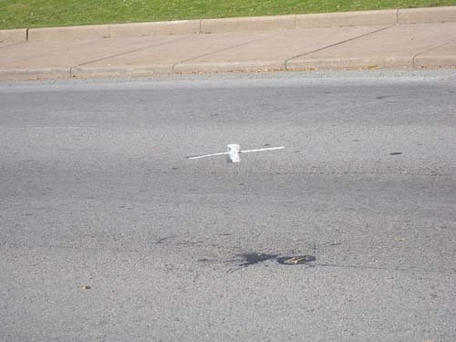  
케네디 대통령이 피격당한 지점

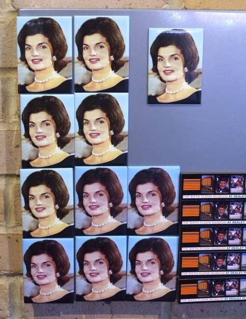  
케네디 대통령의 부인 재키 여사

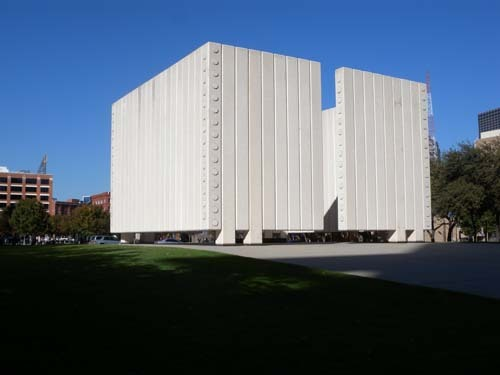  
케네디 대통령 추모비

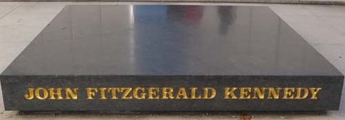  
추모비 안쪽의 상석

부시 대통령 박물관에서는 역사 진행의 합리성에 맞추어 가고자 한 그의 노력들을 읽어냈고, 대통령의 소탈하고 인간적인 면모들로부터는 잔잔한 감동을 받을 수 있었다. 부시 대통령 박물관에서 만난 미국인들은 대부분 자긍심과 존경심으로부터 번져 나오는 흐뭇한 미소들을 띠고 있었고, 나 역시 그랬다. 물론 이라크 전쟁을 두고 부시를 비판하는 사람들은 많다. 그러나 정책의 실수 혹은 판단착오는 그것대로 계산하면서도 대통령으로서의 전체적인 공적이나 인간적인 면모에 대하여 존경을 표하는 일은 민주국민의 성숙한 자세일 수 있을 것이다. 

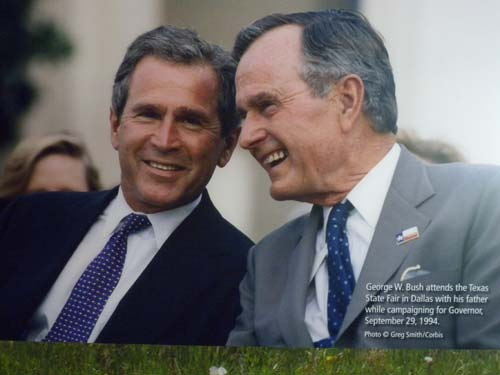  
1994년 9월 12일 달라스의 Texas State Fair에서 아버지 부시와 함께.   
부자 간의 다정한 모습과 미소가 국보급이지요?

  
세계적인 테러와 투쟁해온 부시 대통령

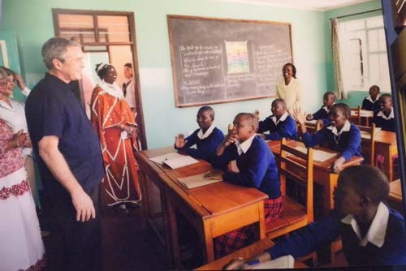  
초등학교 교실에서 1일교사로 참여한 부시 대통령

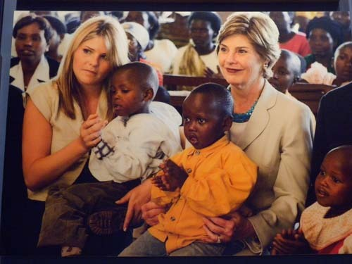  
어린이들의 건강 캠페인에 참여한 로라여사 모녀

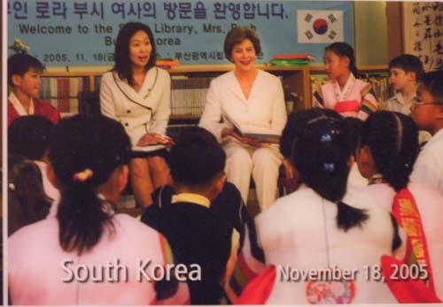  
2005년 11월 한국을 방문한 로라 여사가 어린이들과 함께

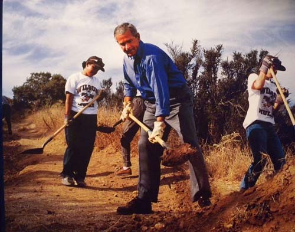  
스미소니언 자연사박물관에서 자연보호 활동을 펼치는 부시 대통령

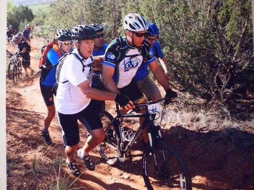  
연례 100km 산악자전거 대회에서 부시 대통령이 이라크 전에서 오른쪽 발을 잃은   
다니엘[Daniel Gade]소령을 부축하고 있다.

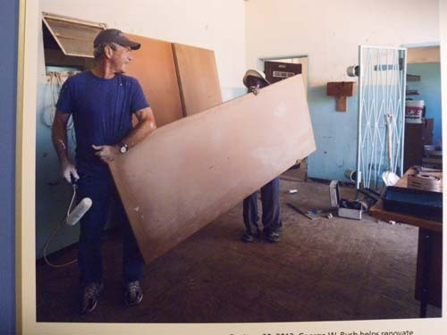  
 자궁경부암과 유방암 치료를 위한 부시 연구소 사업의 일환으로   
2012년 잠비아 Kabwe의 Ngungu Health Center 리노베이션 작업에 나선 부시 전 대통령.  
왜 우리 대통령들에겐 이런 모습이 없는 걸까요?

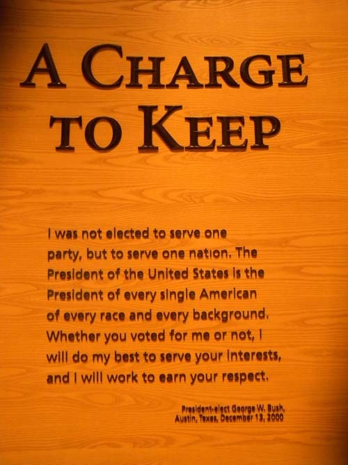  
2000년 12월 대통령 당선자 부시의 인사말 "나는 한 당파에 봉사하기 위해 대통령으로   
뽑힌 게 아니고, 한 국가에 봉사하기 위해 뽑힌 것이다. 미합중국의 대통령은 모든 미국인들의,   
모든 인종들의, 그리고 다양한 배경을 가진 모든 사람들의 대통령이다. 당신이 내게 표를 주었든   
그렇지 않았든, 나는 당신의 이익을 위해 최선을 다해 봉사할 것이며, 당신의 인정을 받기 위해   
일할 것이다."   
얼마나 멋진 말인가요?

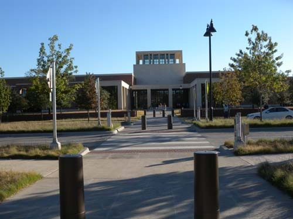  
조지 W. 부시 대통령 도서관과 박물관 앞면

그렇다면 그들을 보며 나는 왜 슬픔을 느껴야 했는가. 같은 자신들의 대통령이면서 서로 다른 길을 간 두 사람에게 똑같은 존경을 보내는 미국인들을 보며 나는 왜 슬픔을 느껴야 했는가. 대답은 간단하다. 내겐 그들처럼 존경할만한 ‘우리 대통령’이 없기 때문이다. 일국의 대통령직을 맡아 수천만 생령(生靈)들의 기대와 소망(素望)을 한 몸에 받은 입장이라면, 더구나 자연수명으로도 이제 살만큼 산 입장이라면, 무슨 세속적 욕망을 다시 추구하고 싶단 말인가. 아주 낮은 자세로 봉사활동에라도 나서서 국가와 국민으로부터 받은 벅찬 사랑을 아주 겸허한 자세로 한 톨 한 톨 갚아나가는 것이 올바른 자세이었으련만, 하나같이 가당찮은 물욕과 권력욕에 찌들어 재직 중엔 신성한 ‘대통령직’을 더럽히고 물러나서도 오욕(汚辱)의 구렁텅이에서 지금껏 헤매고 있단 말인가. 국민들에겐 실망을 안겨주고 역사에는 더러운 자취를 남기는 그들을 어떻게 ‘존경스런 대통령’으로 대접할 수 있단 말인가.

케네디 박물관의 매점에서 나는 한 권의 책을 샀다. 앤 보섬(Ann Bausum)의 <<Our Country’s Presidents>>란 책이었고, 이 책에는 조지 워싱턴부터 지금의 오바마 대통령까지 자랑스러운 얼굴들이 상세하게 소개되어 있었다. 과연 우리는 언제쯤이나 되어야 ‘우리나라의 대통령들’이란 자긍심 넘치는 책을 쓸 수 있게 될 것인가.

공유하기

게시글 관리

**백규서옥\_Blog ver.**