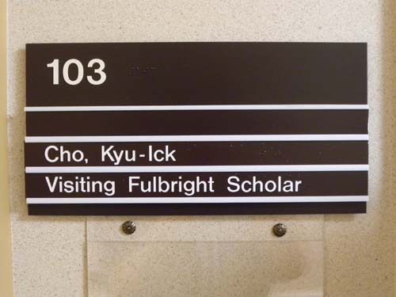
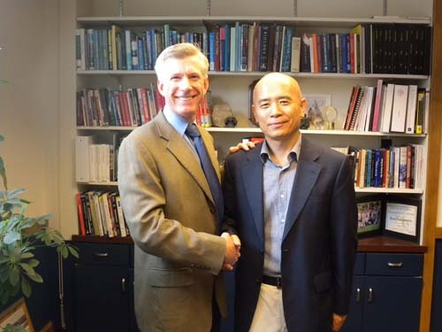
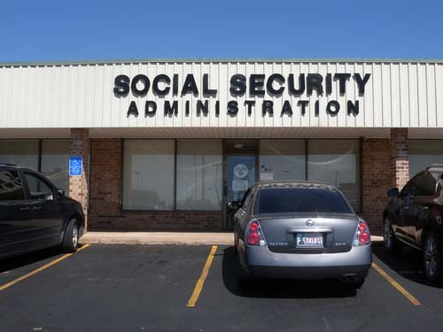
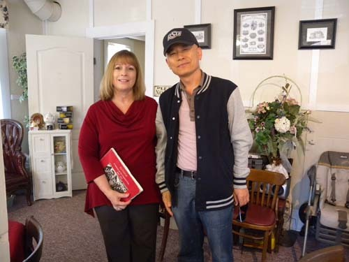
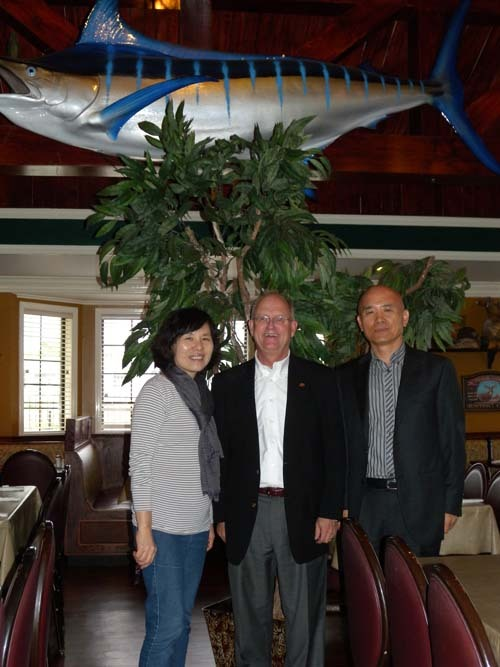
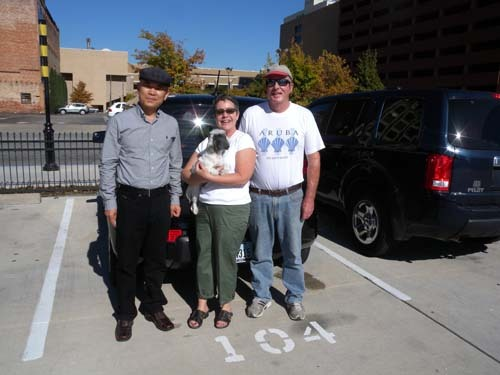

미국에서 ‘풀브라이터(Fulbrighter)’로 지내기

#1 세관 검사나 입국심사가 까다롭기로 유명한 시카고 오헤어 공항[O'Hare International Airport]. DS-2019 서류와 비자를 내밀자 그 여성 심사관은 ‘오, 풀브라이트, G-1, 팬태스틱!’하며 서류를 대충 훑어 보고 기본적인 사항만 확인한 뒤 선선히 통과시켰다.

#2 스틸워터(Stillwater)에 도착하여, OSU의 역사학과 사무실을 찾은 때는 섭씨 40도가 넘는 한여름 대낮이었다. 학과 비서 수잔(Susan Oliver)이 연구실로 나를 안내했다. 연구실 문 옆에 ‘Dr. Cho, Kyu-Ick/Visiting Fulbright Scholar’라고 선명하게 쓰인 명패와 깨끗하게 청소된 연구실이 나를 놀라게 했다. 며칠 뒤에는 ‘풀브라이트 방문학자’라고 명시한 학과의 명함도 찍어 주었다. 정중하게 환영받는 느낌이었다. 그러나, 풀브라이트의 수혜자로서 이 학과를 연구기관으로 선택한 것은 내가 처음이란 사실을 나중에야 알았다. 지금껏 나는 그들이 내게 베풀어주는 호의에 감사하고 있었는데, 풀브라이터가 그들을 선택한 것이 어쩌면 그들에게도 영예일 수 있다는 점을 비로소 느껴 알게 되었다.

  
연구실 명패

  
한국에서 연구기관 신청의 메일을 보내자 마자 환영의 답신을 보내 준 대닐로위츠 학장

#3 미국에 도착하고 나서 셋업이 진행되는 과정에 소셜 시큐리티 넘버[Social Security Number]가 필요했다. 한국에서 주민등록이 되어 있어야 보험계약이나 은행계좌 개설을 할 수 있듯이, 이곳에선 그게 필요했다. 15년 전 LA에서의 기억으로 미루어 보면, ‘소셜 시큐리티 사무소’는 불친절하고 고압적인 곳이었다. 당시 내 앞의 어떤 사람은 사무원의 질문에 대답을 잘못하여 퇴짜를 맞는 경우도 보았다. 그런 기억 때문에 가고 싶지 않았으나, 갈 수밖에 없었다. 그런데, 우리를 맞이한 나이 든 여성 사무원은 참으로 고상하고 친절했다. 시스템을 검색하더니 아내의 번호는 남아 있으나, 내 기록은 아예 없다고 고개를 갸우뚱했다. 내가 풀브라이트로부터 받은 ‘편의 요청’ 공문과 미 국무성이 보증한 비자[U.S. Department of State (Fulbright Scholars Bearer Is Subject To Section 212(E)]를 보여주자, 놀란 표정으로 ‘여기서 풀브라이트 학자를 만나게 되어 영광’이라고 말하며 간단한 인적 사항만 확인한 후 일을 처리해 주었다.

  
친절한 직원을 만난 스틸워터의 소셜 시큐리티 사무소

#4 거쓰리 시티(Guthrie City)를 답사하다가 박식하고 교양이 풍부한 찻집 주인을 만났다. 이야기가 무르익어 가는 도중 서로의 연락 정보가 필요하여 학교 명함을 건넸다. 명함을 펼쳐 보더니 ‘풀브라이트 학자시군요!’하며 깜짝 놀라는 표정을 지었다. 대화를 끝내고 나가며 커피 값을 계산하려 하자 극구 사양했다. 우리는 팁이라 우기며 간신히 5불을 놓고 나왔다.

  
Guthrie City의 찻집에서 만난 지성적인 주인 셰릴(Cheryl)

#5 털사(Tulsa)에서 열린 ‘2013년 풀브라이트 방문 학자 발전 세미나[2013 Fulbright Visiting Scholar Enrichment Seminar]’가 끝나던 날, 주최 측에서 스틸워터까지 나를 태워 줄 자원봉사자를 주선해 주었다. 그는 OSU 털사 캠퍼스 행정부서의 고위직 인사였고, 털사에 살고 있었다. 나이 많고 사회적 지위가 있는 미국인으로부터 ‘라이드 서비스’를 받기가 부담스러웠지만, 그는 ‘자기의 즐거움’이라면서 나를 안심시켰다. 한 시간이 훨씬 넘는 거리를 운전해 왔다가 다시 돌아가셔야 하니 내 마음이 편치 않다고 하자, 그는 ‘풀브라이트 학자에게 이런 봉사를 할 수 있어서 기쁘다’고 부연하는 것이었다. 덕분에 나는 편했고, 그 역시 진심으로 즐거워하는 것 같았다.

  
털사에서 나를 태우고 스틸워터까지 왔다가 돌아간 Dr. Ron Bussert

#6 텍사스 주의 달라스(Dallas)시에 갔을 때였다. 끝없이 펼쳐진 광야를 달려 겨우 도착한 달라스는 오클라호마와 달랐다. 미국에서 다른 주로 넘어가는 것을 ‘우리나라에서 다른 도로 넘어가는 것’쯤으로 착각한 우리였다. 오클라호마 주만 해도 면적이 우리나라의 두 배였다. 그러니 충청도에서 전라도로 넘어가는 것과 오클라호마 주에서 텍사스 주로 넘어가는 것이 같을 리 없었다. 가보니 시내의 교통체계도 오클라호마와는 완전히 ‘다른 나라의 것’이었다. 간신히 주차해놓은 다음, 아무래도 불안하여 막 떠나려는 어떤 중년 부부에게 물었다. 그랬더니 그들은 차에서 내려 주차방법을 친절하게 설명해주었다. 어디서 왔느냐고 물어 한국에서 왔다고 하니 자기네 차도 한국 차라며, 얼마 전 부산에 다녀왔다고 하는 게 아닌가. 그의 차종은 ‘기아 소울’이었다. 하도 반가워 함께 사진을 찍었다. 찍고 나서 그의 이름과 주소 혹은 이메일을 물어보기 위해 내 명함을 건넸더니, 보고는 ‘풀브라이트 학자’라며 깜짝 놀라는 것이었다. 그날 밤 그[Mr. Carl Smith]에게 사진을 보냈고, 그는 내게 정중한 답신을 보냈다. 그 답신 메일 가운데 “우리는 당신을 만나게 되어 기뻤고, 더더욱 풀브라이트 학자를 만나서 감격했습니다![We were delighted to meet you and thrilled to have met a Fulbright scholar!]”라는 문장이 있었다. ‘thrilled’란 말 속에는 ‘전율을 느끼다, 기쁘다, 감격하다’ 등 여러 가지 의미가 들어 있다. 그가 어떤 기분으로 이 말을 썼는지 분명치는 않으나, 당시의 상황에 비추어 매우 긍정적인 뜻으로 쓴 것만은 확신할 수 있었다.

  
달라스의 한 주차장에서 만난 칼[Mr. Carl Smith] 선생 부부

\*\*\*

1945년 아칸사(Arkansas) 주의 새내기 상원의원이던 풀브라이트(J. William Fulbright)가 입안하고 다음 해 트루먼(Harry S. Truman) 대통령이 사인함으로써 법안으로 성립된 것이 바로 풀브라이트 프로그램이다. 2차 세계대전이 끝난 뒤 전쟁의 잉여 자산들에 주목한 풀브라이트 의원은 그것들을 팔아 교육, 문화, 과학 분야 학생이나 학자들의 교류를 통해 국제 친선을 증진시키는 자금으로 활용하자는 법안을 의회에 제출했고, 1년 뒤 트루먼 대통령이 여기에 사인하여 확정을 본 것이 바로 이 법이다.

풀브라이트가 오늘날 세계에서 가장 널리 인정받고 있는 국제 교류 프로그램으로 성장할 수 있었지만, 사실 미국의 노력만으로는 불가능했을 것이다. 매년 미국 의회의 세출 승인을 받아 미 정부가 예산을 출연하고, 미국 이외의 국가들도 이에 상응하는 돈을 부담함으로써 문화 및 교육 교류를 위한 국제적인 협력 프로그램으로 정착할 수 있었던 것이다. 예컨대, 한국 내 Fulbright Commission인 ‘한미교육위원단’의 경우 한국과 미국 정부의 예산 출연으로 운영되며, 이 기구가 장학생 선발 및 프로그램 운영에 관한 모든 정책을 결정한다. 여기서 선발된 한국인 수혜자들은 미국에서 강의나 연구, 대학원 학위과정 이수, 중등교사 영어 연수 등에 참여하며, 미국인 수혜자들은 한국에서 강의 혹은 연구를 하거나, 초・중등학교에서 영어교사로 근무하기도 한다.

\*\*\*

내 느낌으로, 나를 포함한 대부분의 한국인들과 달리 미국인들은 풀브라이트 프로그램을 학생이나 연구자가 누리는 ‘최고의 영예’로 생각하고 있었다. 물색도 모른 채 연구비 주는 것만 고마워하다가 미국에 와서야 풀브라이트에 그런 깊은 뜻이 있는 줄을 알게 되었고, 그래서 이제부터라도 ‘내게 주어진 영예’에 대하여 깊이 생각하면서 지내야겠다고 새삼 결심하게 되었다. 말하자면 남들의 인식을 통해 풀브라이트의 진면을 비로소 인식하게 되었으니, 그동안은 ‘풀브라이트 수혜’라는 영예가 내겐 일종의 ‘개 발의 편자’였던 셈이다. 아는 자만이 혜택을 제대로 누릴 수 있다는, 평범한 진리를 곰곰 생각하게 되는 요즈음이다.

공유하기

게시글 관리

**백규서옥\_Blog ver.**