우리도 스토리가 있는 길을 한 번 만들어 봅시다!

-제1화-

손 형,

참 오랜만입니다. 그간 본의 아니게 격조했었군요. 오늘은 형께 모처럼 ‘길 이야기’를 건네 볼까 합니다. 뜬금없이 웬 길 이야기를 하느냐고 타박하지 말아 주세요. 우리가 작은 발과 짧은 다리를 움직여 꼬박꼬박 넘어 다니던 그 옛날의 시골길이 생각나시나요? 고갯길, 원둑길, 논둑길, 고샅길, 신작로 등 갖가지 길들이 이어져 우리의 시골길을 이루고 있었지요. 형, 혹시 박목월의 시 <나그네>를 기억하시는지요? 함께 감상해 보실까요?

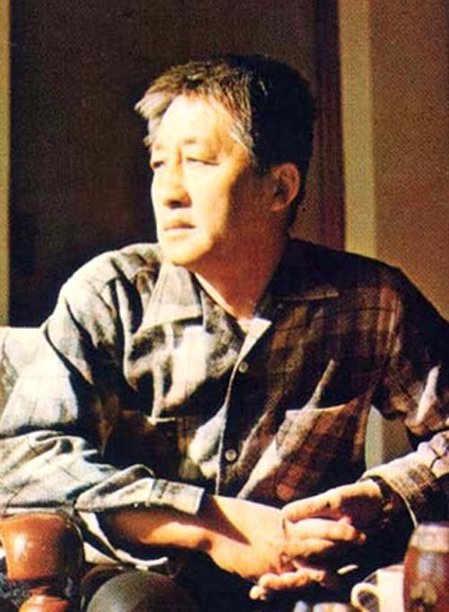  
목월 시인의 젊은 시절 모습<동리목월기념관>

강나루 건너서

밀밭 길을

구름에 달 가듯이

가는 나그네

길은 외줄기

남도 삼백 리

술 익는 마을마다

타는 저녁 놀

구름에 달 가듯이

가는 나그네

이 시 속의 ‘나그네’가 단순한 존재는 아니겠지요. 아마도 그는 어떤 복잡한 사연을 갖고 길을 떠난 게 분명하군요. 물론 무작정 길을 떠났을 수도 있겠지요. 그러나 달처럼 미끄러지듯 ‘남쪽을 향해’ 흐트러짐 없이 가고 있는 모양으로 보아 속으로는 어떤 목적과 사연이 있을 겁니다. 그가 가고 있는 길 또한 단순한 ‘도로’가 아니겠지요. 그래서 시인도 ‘남쪽지방으로 삼백 리나 벋어 있는 외줄기 길’을 말했을 겁니다.

그 ‘기~인’ 길에는 온갖 사연들이 스며들어 있었겠지요. ‘사랑, 미움, 믿음, 배신, 약속’ 등등 몇몇 기호로 요약되는 복합적 인간사가 이 길바닥에는 깔려 있을 겁니다. 길목 마다 조롱박처럼 매달려 있는 주막에는 늘 술이 익어가고, 그런 술독을 중심으로 전개되는 인간사가 좀 복잡합니까? 얼굴 반반하고 몸매 고운 주모라도 있는 경우라면 더 복잡해지겠지요. 고속도로와 철길이 생기면서 옛길은 사라졌지만, 우리의 목월 선생은 그 옛길을 잘도 찾아내서 우리에게 힌트로 던져 주신 것이지요.

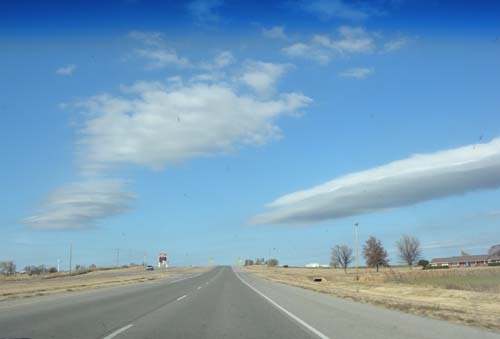  
엘크시티에서 스틸워터로 오는 길

우리에게도 ‘삼백 리나 되는 남쪽 길’이 있었다는 걸 알려 주려는 노 시인의 마음 씀씀이가 제겐 감동 그 자체입니다. 아마도 ‘서울에서 저 전라남도 혹은 경상남도 바닷가 어디쯤까지 이어지는 길’이었겠지요. 그걸 찾아내어 복원하라는 것이 목월 선생의 묵시(黙示) 아니겠는지요?

요즘 제주도에서 시작한 ‘올레길’이 뜨면서 그와 유사한 ‘둘레길’도 나타난 모양입디다만. 숲이 있는 곳이면 마구잡이로 파헤쳐 길을 만들어 놓고는 사람들을 유인하는 모습이 그리 아름다워 보이지는 않습디다. 말하자면 요새 만들어지는 길은 ‘스토리 혹은 히스토리’가 없는 무미건조한 공간일 뿐이지요. 걷는 자들이 무언가를 갖고 가지 않으면 아무것도 얻을 수 없는 ‘물리적인 길’이라는 점에서, 그것들은 목월 선생이 발견하신 ‘남도 삼백 리’와는 비교될 수 없지요.

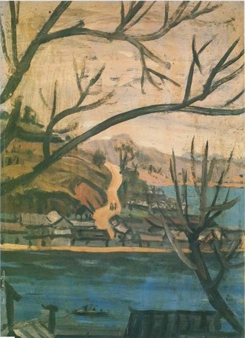  
이중섭의 <길>(이미지 갤러리)

\*\*\*

이곳에 와서 지낸 몇 달 동안 여러 가지를 목격했습니다만, 가장 가슴 뛰는 일은 ‘66번 길’을 발견한 일입니다. 처음엔 그저 대수롭지 않게 생각했지요. ‘참 할 일 없는 미국인들’이라고 빈정거리면서 말이지요. ‘넓은 땅덩어리에 필요하면 길을 뚫고, 그 길이 불편하면 뭉개버리고 새 길이나 다른 길을 뚫는 게 예사이지, 그 무슨 길을 가지고 이리도 호들갑을 떠는가?’ 라고 생각했지요. 그런데 한 번 두 번 지나다니면서 이게 예사 길이 아니라는 점, 길이란 그저 다니는 것만으로 소임을 다하는 단순 공간이 아니라는 점을 깨닫게 되었지요.

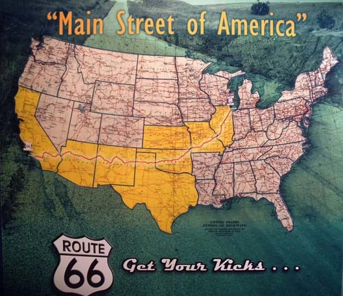  
여덟개의 주[일리노이-미주리-캔자스-오클라호마-텍사스-뉴멕시코-애리조나  
-캘리포니아]를 통과하는 66번 도로 

다니면서 적지 않은 걸 경험하게 되었어요. 예를 들어 에드몬드 시티(Edmond City) 근처의 아카디아(Arcadia)에서 발견한 POPS를 볼까요? 66번 도로를 달리다가 멀리 앞을 바라보니 '빨대 꽂은 음료수 병' 하나가 우뚝 서 있는 게 아니겠어요? 지나면서 보니 주유소였는데, 미국에는 주유소에서 음식도 팔고 물건도 팔지 않아요? 주유소라면 그 흔한 이른바 ‘폴 사인(pole sign)’을 세워 놓든가 영 뭣하면 주유기 표시라도 세워 놓을 것이지 대체 '빨대 꽂은 음료수 병'을 세워 놓은 건 참으로 ‘요상’했어요.

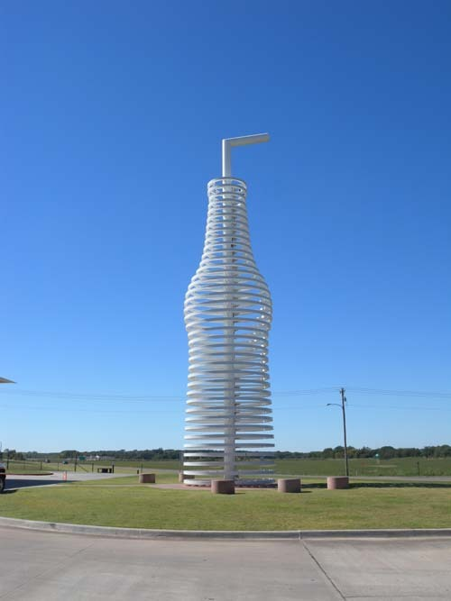  
POPS 주유소 마당에 세워진 '빨대 꽂은 병'

그래서 우리는 그 다음번에 작정하고 이 주유소에 들어가 보았지요. 과연 레스토랑의 유리창이나 벽에는 온갖 음료수 병들로 또 한 겹을 이루고 있습디다. 사람들은 음식을 주문해 놓고 벽 쪽으로 가서 마음에 드는 걸 하나씩 들고 오는 거지요. 그러고 보니 밖에 서 있는 거대한 병 모양의 조형물은 바로 이 음료수 병들을 바탕으로 디자인한 것이더군요 글쎄.

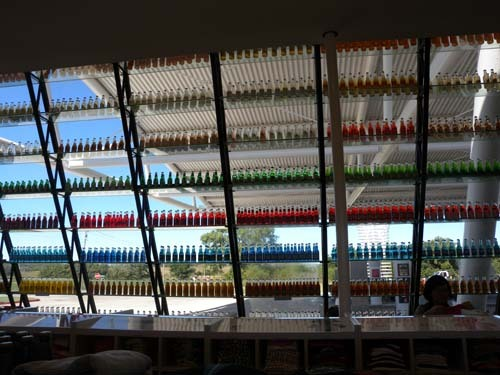  
POPS의 내부 앞쪽 창

종업원을 통해 알아본 바에 의하면, 여기에도 내력이 있더군요. 이게 바로 체사피크 에너지(Chesapeake Energy)라고, 미국에서 두 번째로 큰 천연가스 생산 회사이자 원유와 액화천연가스의 11번째 큰 생산회사로서 오클라호마 시티에 본부를 두고 있는 그 회사의 CEO 오브리 맥클레돈(Aubrey McCledon)이 아이디어를 내고, 건축가 랜드 엘리옷(Rand Elliot)d이 디자인한 것이라네요. 2007년 여름에 문을 연 뒤 급속하게 66번 도로 관광의 매력포인트로 부상했다는군요. 66번 도로 주변을 돋보이게 하는 66피트 높이의 소다 병이 바로 이것이지요. 그리고 이 POPS는 주유소 편의점 안에 비치되어 있는 수백 종의 소다 향들과 각종 브랜드들을 자랑하고 있지요. 이 뿐 아니라 이 편의점과 함께 각종 버거, 소다, 셰이크 등 다양한 식당 음식들도 갖추어져 있구요. 여기서 우리는 66번 도로가 살아날 수밖에 없는 원인을 발견할 수 있었지요. '이미 존재하는 66번 도로', 이 도로에 대한 사람들의 애정, 그리고 그들의 톡톡 튀는 아이디어가 바로 66번 도로를 살려 낸 힘의 원천이었어요.  

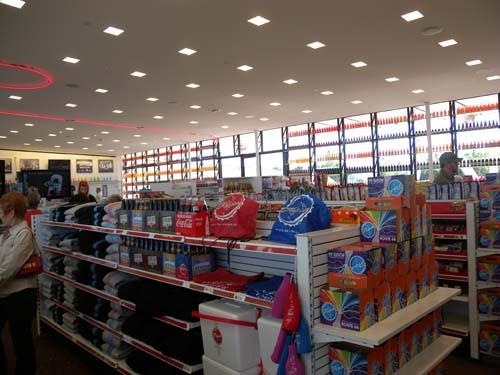  
POPS 내부 마트

또 하나 예를 들어 볼까요? 이 주유소에서 멋진 음료수 하나를 골라 목을 축인 다음 다시 길에 올랐지요. 한참을 가다가 루터(Luther)라는  지역의 경계에 들어오자마자 길가에서 주차장인지 마굿간인지 버려진 폐가인지 언뜻 분간이 가지 않는 허름한 건물 하나를 발견했어요.

차를 세우고 보니, ‘66번 도로의 경계선 레스토랑[The Boundary Restaurant on Route 66]’이란 멋진 이름의 식당이었어요. 버려진 길가 건물을 외부는 그냥 두고 내부만 수리하여 레스토랑으로 개업한 경우이겠지요. 내가 보기에 내부는 온갖 앤틱 풍의 재료들로 덕지덕지 혼란스러웠지만, 미국인들의 성향은 잘 반영하고 있었지요.

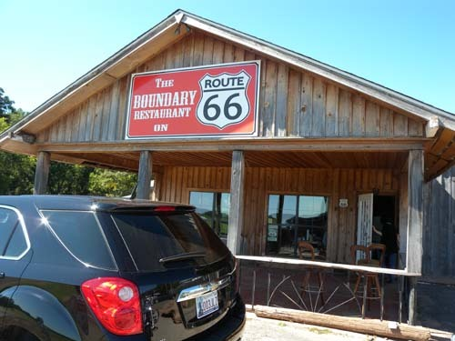  
66번 도로 Luther에서 만난 길가 '바운더리 레스토랑'

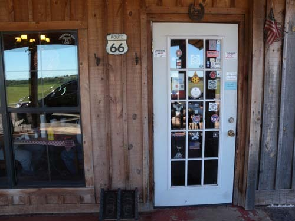  
'바운더리 레스토랑' 의 문

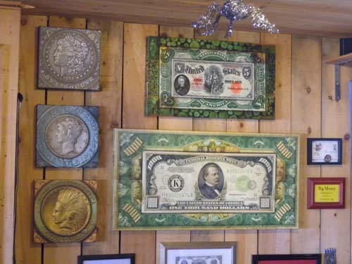  
옛날 화폐를 이용한 이 식당의 인테리어 디자인이 눈에 띈다.

바비큐, 핫독, 소세지 등을 팔고 있는 그 집 음식의 맛은 그저 그랬지만, 중동계 이민의 후예로 자신을 소개한 주인은 자신의 요리와 식당의 인테리어에 대한 자부심이 대단했어요. 식대가 만만치 않음에도 불구하고 손님들은 끊임없이 들어 왔지요. 그들이 만약 속도와 시간의 경제성에 충실한 현대인이었다면, 이 길로 접어들어 오지도 않았겠지요. 경제성에 충실한 사람들 사이에 살다보니 많이 피곤을 느낀 사람들이 옛날의 66번 도로를 찾아 여행을 하는 것이고, 입맛이나 분위기 또한 지난 시절의 그것을 추구하게 된 것이겠지요.

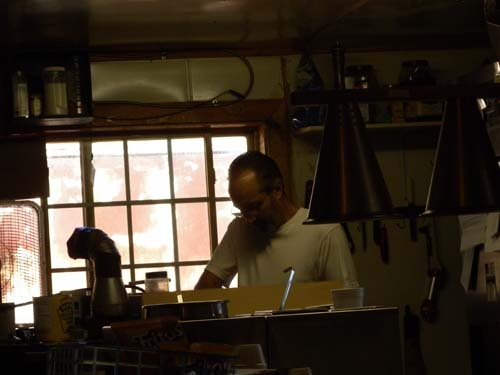  
'바운더리 레스토랑'의 주방장 겸 주인이 요리하는 모습

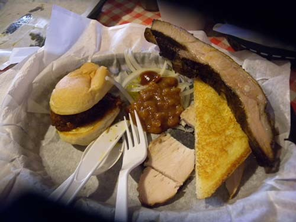  
'바운더리 레스토랑'의 음식. 옛날 식 음식이라 함.

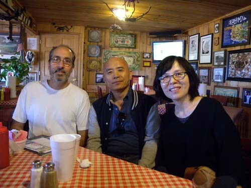  
 '바운더리 레스토랑'에서 주인과 함께

그런 분위기, 복고풍이랄까요? 실제 삶에서는 절대 옛날로 돌아갈 수 없는 것이 현대인의 일반적 성향 아니겠어요? 그런 현대인들이 가끔씩 자신의 공간 밖에서 ‘순간적인 일탈’을 꿈꾸는 것이고, 그런 일탈의 욕망이 66번 도로에 대한 향수로 표출되는 것이겠지요. 66번 도로를 복원시킨 사람들도 일반인들의 그런 심리를 간파한 것이겠고요. 그래서 이 길을 ‘현대인의 경제논리를 넘어서는[beyond economic logic of modern people]’ ‘수퍼 하이웨이 66번 도로[Super Highway Route 66]’라고 부르고 싶은 것이 제 생각입니다. **<****나머지는 다음번에 계속됩니다>**

공유하기

게시글 관리

**백규서옥\_Blog ver.**