우리도 스토리가 있는 길을 한 번 만들어 봅시다!

-제2화: 엘크 시티(Elk City)와 ‘국립 66번 도로 박물관 단지[National

Rt. 66 Museum Complex]’를 보고-

손 형,

2,400마일에 달하는 66번 길은 일리노이 주의 시카고에서 시작하여 캘리포니아의 산타모니카까지 8개 주[일리노이(Illinois)-미주리(Missouri)-캔자스(Kansas)-오클라호마(Oklahoma)-텍사스(Texas)-뉴멕시코(New Mexico)-애리조나(Arizona)-캘리포니아(California)]에 걸쳐 있고 시간대도 세 개나 들어 있으니, 이 도로의 길이나 규모를 짐작할 수 있으시겠지요? 이 길이 주변 사람들의 생활양식에 큰 영향을 준 것은 말할 것도 없고 새로운 문화를 꽃피우게 함으로써 ‘미국의 간선도로[Main Street of America]’, ‘미국 도로의 어머니[Mother Road of America]’ 라는 별명들까지 얻게 되었지요.

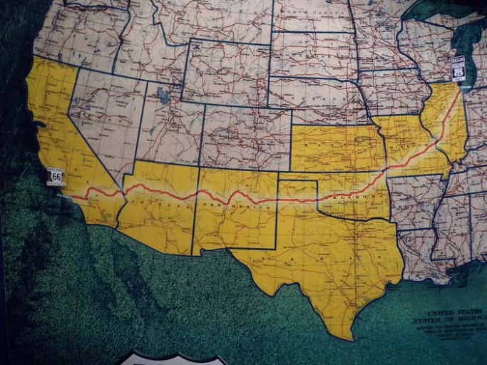  
66번 도로가 통과하는 8개 주

이 길은 숱한 질곡의 역사를 겪기도 한 것 같습니다. 길을 만들기 위해 전국 규모의 추진 기구를 만들어 각 주의 동의를 얻고, 길을 뚫고 포장을 하고, 각종 부대시설을 만드는 등 지난(至難)하고 복잡한 과정들을 거쳐 이 길은 태어난 것이지요. 그러나 산업과 교통의 발달에 따라 새로운 하이웨이가 뚫리고, 그것이 각 방면의 다른 길들과 연결되면서, 기존의 66번 도로는 버려지게 되었고, 그 도로를 중심으로 번성했던 도시들과 주민들도 마찬가지로 쇠락의 길을 걷게 되었겠지요.

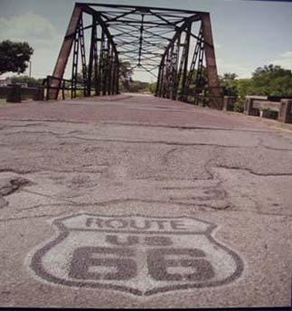  
남 미주리주, 스프링필드 바로 남쪽 옛 철교와 길의   
황폐화된 모습

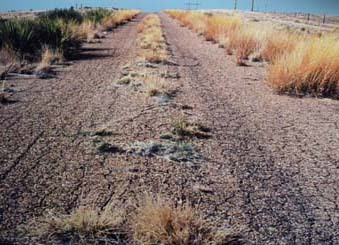  
황폐화된 66번 도로

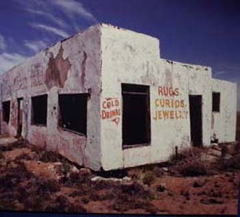  
66번 도로 가의 황폐화된 건물

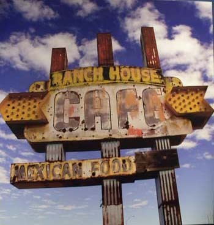  
66번 도로 가의 황폐화된 식당 간판

그러나 언제부턴가 버려진 채로 죽어가던 66번 도로의 가치가 사람들의 눈에 띄게 되었지요. 자연스럽게 그 길은 새로운 모습으로 회생하게 되었고, 주변의 도시들 역시 쇠락의 늪에서 빠져나와 다시 기지개를 켤 수 있게 된 것이지요. 경험하지 않아서 모르겠습니다만, 그 과정들은 매우 극적이었겠지요?

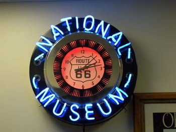  
국립 66번 도로박물관의 네온사인

66번 도로가 지나는 곳곳에 박물관이 세워져 있고, 여러 권의 책과 팜플렛, 인터넷 사이트를 통해 이런 사연들이 자세히 실려 있으므로 그 사실을 이 자리에서 재론할 필요는 없을 겁니다. 어쨌든 애버리[Cyrus S. Avery]라는 사람이 AASHO[the American Association of State Highway Officials]의 회장이 되어 66번 도로를 완공했다 하여 그를 ‘66번 도로의 아버지[the Father of Route 66]’라 부르는 모양인데, 그가 오클라호마 주 털사 출신이라는 점은 66번 도로를 공유하는 다른 주들과 달리 오클라호마 주의 한 복판을 대각선으로 정확하게 관통하고 있는 사실과 흥미로운 연관을 보여주는 것 같기도 하군요.

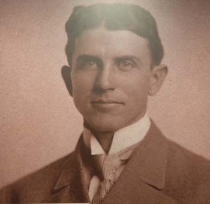  
66번 도로의 아버지로 불리는 애버리(Cyrus S. Avery)

사실 이 도로가 오클라호마 주와 일리노이 주만 중앙을 관통하고 있을 뿐, 나머지 주들의 경우 형식적으로 걸쳐 지났다는 것이 저 만의 느낌인지 모르겠네요. 미주리 주에서는 하단을 지났고, 캔자스 주에서는 살짝 건드리기만 하고 지났으며, 텍사스 주에서는 북부의 일부를 통과한 정도지요. 그나마 뉴멕시코와 애리조나가 북쪽으로 약간 치우치기는 했으나 관통한 경우로 볼 수 있고, 캘리포니아는 남쪽을 통과하여 산타모니카로 이어졌음을 확인할 수 있군요. 더구나 주도(州都)인 오클라호마시티를 통과하도록 설계되었다는 것은 매우 의미심장한 일이지요. 그는 어쩜 이 도로야말로 미래의 역사적 공간으로 영속될 수 있음을 깨달았고, 자신의 고향인 오클라호마 주에 긴 부분을 할당한 것이나 아닌지 모르겠네요.

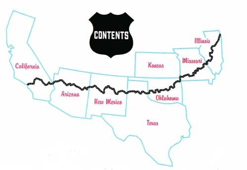

여덟개의 주를 통과하는 66번 도로

오클라호마 주 안에 배당된 66번 도로의 길이도 시기마다 약간씩 달라지는데요. 1926년의 추정 거리는 415.4 마일이었는데, 1936년에는 383.7 마일, 1944년에는 381.7 마일, 1951년에는 368 마일로 점점 줄어들었어요. 제 생각에는 아무래도 길을 고치거나 포장을 새로 하면서 굽은 길을 펴기도 하고 지름길을 찾아내면서 그렇게 된 것이나 아닌가 합니다만. 어쨌든 총 연장 2,400 마일의 8개 주 산술평균이 300 마일인데, 400마일 가까이 차지했다는 것은 이 도로의 큰 몫을 오클라호마 주가 갖고 있었음을 의미한다고 보여지네요.

이 도로가 지나는 오클라호마 주의 큰 도시들만 헤아려 보아도 열 개가 넘어요. 아래 텍사스 주 쪽부터 꼽는다면, 에릭(Erick)-세이어(Sayre)-엘크(Elk)-클린턴(Clinton)-웨더포드(Weatherford)-엘 르노(El Reno)-오클라호마시티(Oklahoma City)-아카디아(Arcadia)-챈들러(Chandler)-스트라우드(Stroud)-새펄파(Sapulpa)-털사(Tulsa)-클레어모어(Claremore)-빈타(Vinta)-마이애미(Miami) 등으로 연결되지요. 물론 이 도시들 사이사이에 촘촘히 박혀 있는 작은 도시들까지 포함하면 이 도로에 연결된 도시들은 무수하지요.

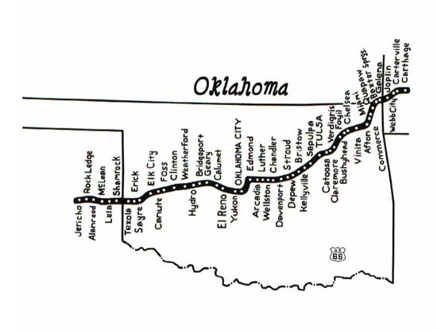

오클라호마 주 내의 66번 도로

글쎄요. 우리는 이들 가운데 몇 군데나 둘러보았을까요? 맨 처음 오클라호마시티와 아카디아를 들렀고, 그 다음이 털사와 유콘, 그리고 최근 엘크 시티와 클린턴을 들렀네요. 사실 오클라호마시티를 다녀오는 길이면 특별한 일이 없을 경우 66번 도로를 탔다가 177번을 만나 스틸워터로 방향을 틀곤 했으니, 66번 도로는 우리에게 꽤 낯이 익다고 할 수 있을까요? ‘몇 군데도 못 돌아 본 주제에 무슨 66번 도로를 말하려 하느냐?’고 책망하신다면, 드릴 말씀은 없습니다만. 어디 한 솥의 국물을 다 마셔야 국 맛을 알 수 있는 건 아니잖아요? 그래서 이 글을 쓸 용기를 내게 된 겁니다.

오클라호마주의 66번 도로 지도

저는 이미 아카디아의 라운드 반[Arcadia Round Barn], 털사(Tulsa)의 길크리스 박물관(Gilcrease Museum), 유콘(Yukon City)의 유콘 역사박물관[Yukon Historical Museum] 등을 둘러보고 그 공간들이 갖는 의미나 느낌들을 적어 이곳에 올린 적이 있습니다[앞쪽에 올린 미국통신 10, 12, 27을 참조해 주세요].

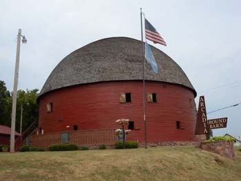  
66번 도로 가에 있는 아카디아(Arcadia)의 라운드 반(Round Barn)

엊그제 우리는 텍사스의 달라스에 갔다가 돌아오는 길에 다시 66번 도로를 통과하게 되었지요. 달라스로부터 포트워쓰(FortWorth)를 경유하여 오클라호마 주 66번 도로 상의 엘크 시티에서 1박을 하고, 그로부터 멀지 않은 클린턴 시티를 둘러본 다음 이곳 스틸워터로 귀환했지요. 그래서 이곳에 엘크와 클린턴의 뮤지엄 방문기를 중심으로 66번 길에 관한 인상을 남기려 하는 겁니다.

달라스 가는 길도 엄청나게 멀었지만, 달라스를 탈출하여 엘크로 돌아오는 길도 그에 못지않더군요. 달라스를 빠져나오는 데만도 스무 번 가까이 길을 바꿔 탔으며, 완전히 빠져 나온 후에도 십여 개나 다른 길을 거쳤으니, 미국의 길들이 넓고 곧으며 길게 뻗어 있긴 하지만 길을 한 번 잘못 들면 한참 고생해야 하는 것도 사실이지요. 어쨌든 달라스의 숙소로부터 계산하여 5시간 가까이 걸려 엘크시에 들어왔습니다.

고층빌딩들 중심의 다운타운을 갖고 있는 대도시를 제외한 미국의 어느 도시나 그렇습니다만. 이곳도 평탄한 들판에 넓은 중앙로와 주변도로들을 중심으로 양 옆에 띄엄띄엄 집들이 들어서서 시가를 형성하고 있더군요. 다만 나름대로 오랜 역사를 지니고 있어서 거리에 따라 약간씩 고풍이 느껴지는 곳들도 있고 새롭게 형성된 신시가지나 상업지구들이 있어서 전체적으로 조화로운 모습을 갖고 있는 점은 아주 좋았어요.

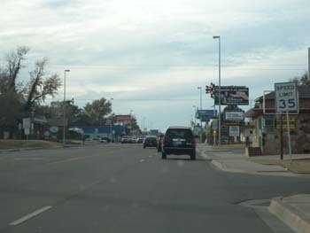  
엘크 시에 들어오며

엘크 시티가 언제 출발되었는지는 정확하지 않은 것 같아요. 1541년 스페인의 프란시스코 바스케스 코로나도(Francisco Vásquez de Coronado)가 이 지역을 통과한 첫 유럽인이긴 했으나, 실제로 엘크 시티의 역사는 오클라호마 서부 지역에 셰이옌-아라파호족 (Cheyenne-Arapaho)의 보호구역이 문을 연 1892년 4월 19일을 출발로 보아야 한다는 설이 유력하다는 군요. 이 때는 첫 백인 정착자들이 모습을 드러낸 때이기도 하지요. 따라서 이 도시 역시 아메리칸 인디언과 인연이 깊은 곳임은 말할 것도 없어요.

차를 몰고 시내에 진입하자 낮은 건물들이 듬성듬성 깔린 시가지가 눈에 들어왔고, 보자마자 걷고 싶은 거리라는 생각이 들었지요. 그러나 갈 길이 바빠 먼저 박물관을 찾기로 한 우리는 잠시 달려 신시가지 끝부분에 넓게 조성된 박물관을 만났지요. 그곳엔 여러 종류의 박물관들이 하나의 부지 안에 세워져 큰 단지를 형성하고 있었지요. 이 도시의 작은 규모에 비하여 꽤 큰 박물관 단지라고나 할까요? 여기서는 이 단지 이름을 ‘국립 66번 도로 박물관 단지[National Route 66 Museum Complex]’라고 부릅디다. 이 안에 ‘옛 동네 박물관[Old Town Museum]’, ‘국립 66번 도로와 운송 박물관[National Route 66 & Transportation Museum]’, ‘농업과 축산업 박물관[Farm & Ranch Museum]’, ‘대장간 박물관[Blacksmith Museum]’ 등이 들어 있었어요.

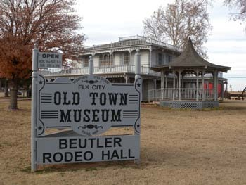  
엘크시 '옛 동네 박물관'의 건물과 입간판

우선 ‘옛 동네 박물관[Old Town Museum]’에 들어갔지요. 자원봉사를 하고 있는 할머니 큐레이터가 우리를 안내하여 가정생활의 모습을 복원해 놓은 코너와 각종 생활사 자료들을 둘러 보았지요. 초기 오클라호마 주 개척자들의 생활상이 그대로 재현되어 있었어요. 1층에는 초기 개척자의 삶, 성조기들, 아메리칸 인디언 갤러리, 1981년 미스 아메리카로 선발된 수잔(Susan Powell)의 사진과 의상 등이 전시되어 있었고, 2층에는 초기 카우보이와 로데오에 관한 모든 것들이 전시되어 있었어요. 사실 2층에 전시된 많은 것들은 유명한 로데오 증권 도입자인 뷰틀러(Beutler) 형제들이 기증한 것들이라네요. 참 대단합디다.

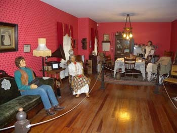  
 '옛 동네 박물관'에 전시된 당시 가정의 모습(거실 및 식당)

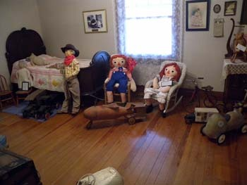  
 '옛 동네 박물관'에 전시된 당시 가정의 모습(아이들 방)

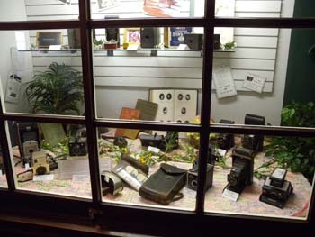  
옛날 생활용품들

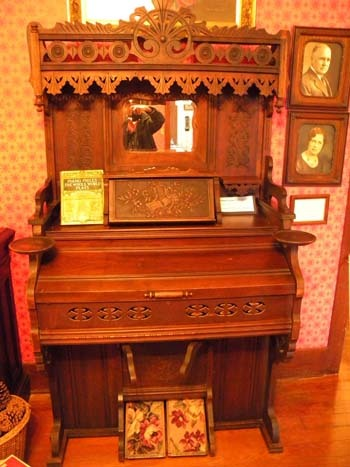  
당시 피아노

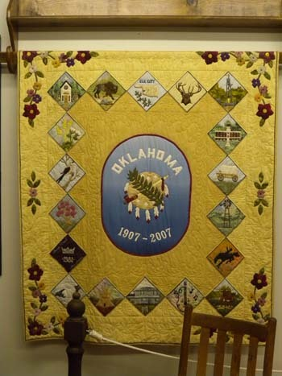  
엘크시티의 역사를 보여주는 휘장

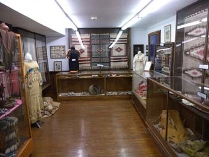  
생활사 자료실

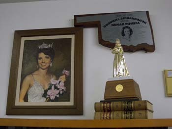  
1981년 미스 아메리카로 선발된 엘크시티 춣신의 수잔(Susan Powell)

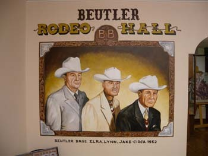  
로데오로 유명한 뷰틀러(Beutler) 형제들

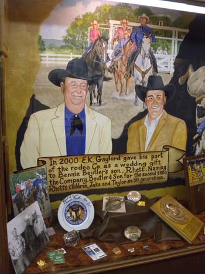  
로데오 회사 지분 일부를 뷰틀러의 아들에게 결혼선물로   
양도한다는 증서

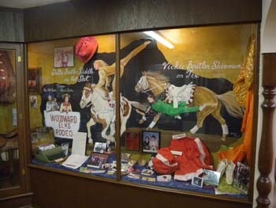  
로데오 관련 포스터와 의상 및 소품들

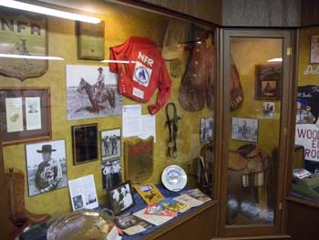  
당시 카우보이 관련 자료들

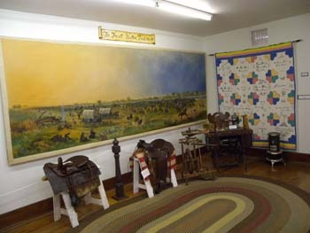  
당시 카우보이 관련 자료 및 랜드런을 소재로 한 그림

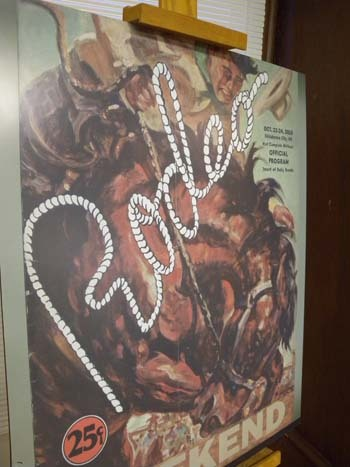  
로데오 경기 포스터

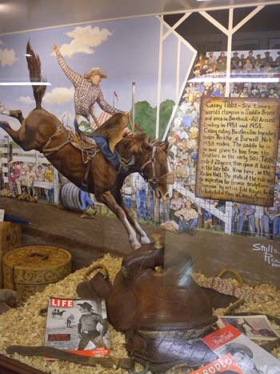

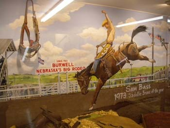  
로데오 경기 포스터

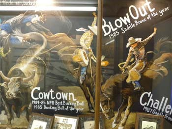  
로데오 경기 포스터

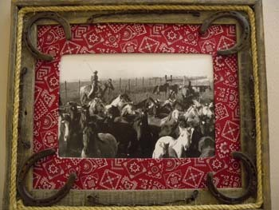  
당시 카우보이를 묘사한 그림

그 다음으로 들른 곳이 ‘국립 66번 도로와 운송 박물관’이었어요. 그곳에 들어서자 길 가는 이들을 유혹하기 위해 길 주변에 흔히 있던 것들이 당시의 모습대로 재현되어 있습디다. 옛날 풍의 차들, 주막, 레스토랑, 자동차 번호판 등과 미국 하이웨이의 서사적인 내용들을 구체적으로 보여주는 역사적 문건들로 전시장 안이 가득 차 있었어요. 특히 1955년도에 만들어진 핑크색 캐딜락, 자동차 영화관에서 고전적인 쉐보레의 임팔라(Impala)를 타고 앉아 감상하던 흑백영화 등이 압권이었고, 손으로 만질 수 있도록 전시된 각종 자동차들은 애들이나 어른이나 할 것 없이 눈길을 잡아 두는 효과를 발휘하는 듯 했어요.

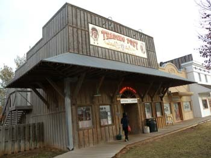  
매점 등이 들어 있는 건물

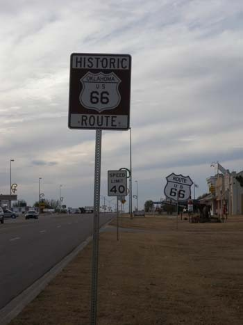  
66번 도로 표지판들

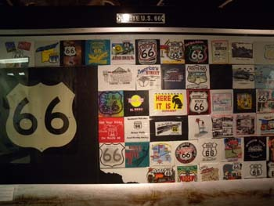  
66번 도로 표지판 도안들

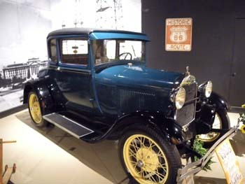  
국립 66번 도로와 운송 박물관에 소장된 당시 차량

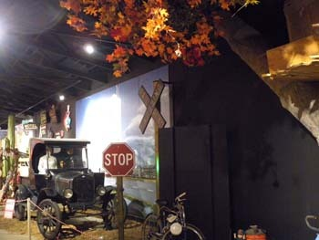  
국립 66번 도로와 운송 박물관에 소장된 자동차와 도로 상황

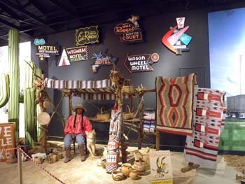  
국립 66번 도로와 운송 박물관에 전시된 당시 인디언 가게

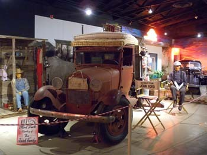  
국립 66번 도로와 운송 박물관에 전시된 당시의 트럭

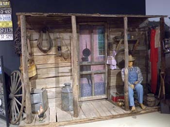  
국립 66번 도로와 운송 박물관에 전시된 당시 생활사 자료

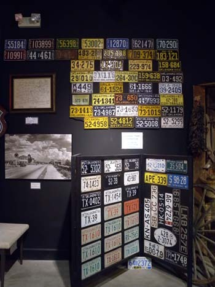  
국립 66번 도로와 운송 박물관에 전시된 당시 차량 번호판들

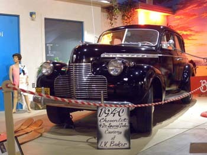  
국립 66번 도로와 운송 박물관에 전시된 1940년 셰보레에서 출시한   
당시 최고급 자동차

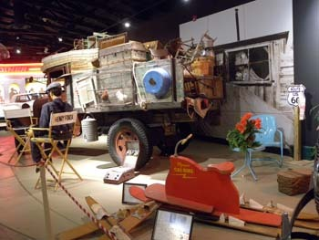  
국립 66번 도로와 운송 박물관에 전시된 화물적재 트럭

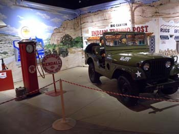  
국립 66번 도로와 운송 박물관에 전시된 주유소와 군용 지프

거기서 나와 길을 건너니 붉은 색의 창고 형 건물 두 개가 나란히 서 있데요. 오른쪽이 ‘농업과 축산업 박물관[Farm & Ranch Museum]’, 왼쪽이 ‘대장간 박물관[Blacksmith Museum]’ 이었지요. 그러나 우리는 시간이 없어서 ‘농업과 축산업 박물관’만 보기로 했지요. 박물관에 들어서자 그곳을 지키시는 노인이 우리에게 어디서 왔느냐고 대뜸 물으시는 거예요. 한국에서 왔다니까 자신이 21살 때(1954년) 부산에 미군으로 주둔해 있었다고 하시네요. 그 후 원주, 강릉 등으로 주둔지가 바뀌었던 모양인데, 고령으로 말씀은 어눌하셔도 우리나라에 대한 기억들을 분명히 갖고 계셔서 아주 반가웠어요. 그런데 이 박물관에는 서부 오클라호마주 초기 농업과 축산업자들의 생활에 쓰인 도구들이 광범하게 수집, 전시되어 있었어요. 대장간의 실제 모습, 각종 풍차 콜렉션, 트랙터의 각종 시트, 각종 수수 탈곡기, 가시철망 콜렉션 등이 이채로웠어요.

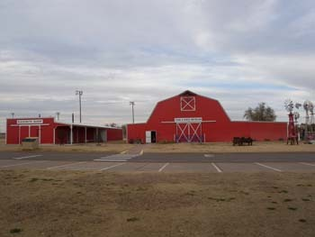  
왼쪽은 '대장간 박물관', 오른쪽은 '농업과 축산업 박물관'

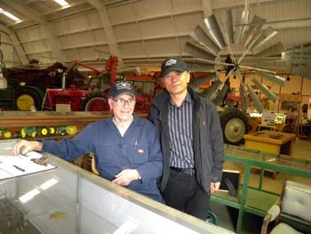  
'농업과 축산업 박물관'에서 만난 80대의 노인 관리자[21세 되던 1954년   
한국에 파병되어 부산, 강릉, 원주 등지에서 근무했다 함)

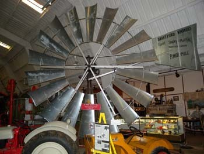  
박물관에 전시된 풍차

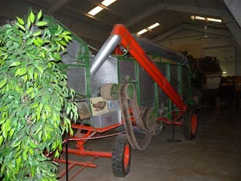  
트랙터

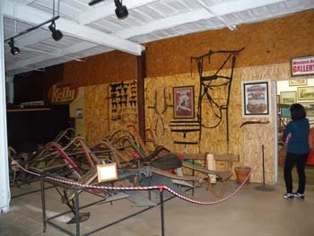  
농기구 전시장

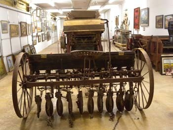  
밭을 갈던 트랙터의 일종

  
당시 주유기

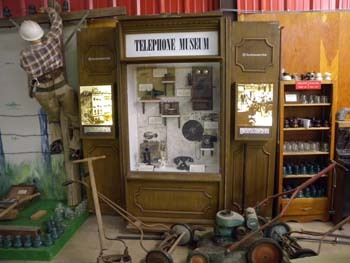  
당시 전화기들과 전화선 수리공의 모습

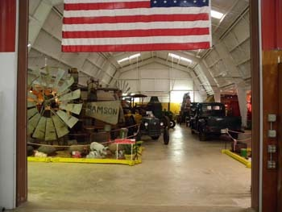  
각종 농기구들의 전시장

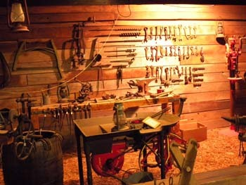  
당시의 각종 공구

  
당시의 각종 공구

농업과 축산 박물관 밖에는 미처 건물 안으로 들어가지 못한 풍차들이 늘어서 있었어요. 농업에 바람을 이용한 이들의 지혜를 보여주는 증거물들이었지요. 지금도 이런 모습의 풍차들은 들녘에 많이들 서 있었어요. 말하자면 삶의 역사가 현재와 미래로 이어지는 모습이었지요. 농업과 축산 박물관을 나와 길을 건너자 철로와 역사(驛舍)가 재현되어 있고, 당시 사용되던 엄청난 증기기관도 생생한 모습으로 놓여 있었어요.

  
농업과 축산 박물관 밖에 전시된 각종 풍차들

  
엘크역에 근무하던 역장의 모습

  
당시 열차의 증기기관

  
재현해 놓은 당시의 오페라 하우스

\*\*\*

텍사스 주를 기점으로 할 경우 66번 도로상에서 엘크는 에릭(Erick), 세이어(Sayre) 등에 이어 세 번째로 만나게 되는 거점도시인 셈인데, 우리가 둘러본 박물관 역시 규모나 내용상 그에 걸맞은 것들이었어요. 우리는 특히 박물관들을 둘러보면서 놀라움과 안타까움을 함께 느꼈지요. 이곳에 전시된 물건들은 대부분 1980년대 말에서 1920~1930년대의 것들이었는데, 특히 자동차와 농업기계들에서 제 눈을 뗄 수가 없었어요. 그 시기 우리는 어땠나요? 사실 제가 성인이 될 때까지 우리의 농촌에서는 꼬박꼬박 지게로 짐을 져 나르고, 괭이와 쟁기로 논밭을 갈아 왔거든요. 그 경험을 저도 아프게 한 사람입니다. 어렸을 적 어머니와 함께 목화밭에 나가 한 송이 두 송이 여린 손으로 목화를 따 앞자락에 담던 기억들이 왜 그렇게 가슴을 저리게 하는지요? 그런데 이들은 당시에 모든 일들을 기계로 해내고 있었어요. 목화 따는 일은 물론 목화로부터 솜을 뽑아내는 일까지 일관작업으로 해내는 기계를 이 박물관에서 목격하고 말았답니다. 하기야 끝이 보이지 않는 농토에서 농사를 짓기 위해서는 기계가 필수적이었겠지만, 우리와 너무도 대비되는 이들의 풍요로움을 보고 있자니 마음이 마냥 편치만은 않더군요. 요즘 아이들 말대로 이들과는 ‘잽도 안 되는’ 우리가 이제 기술이나 무역의 면에서 이들과 경쟁을 벌이는 위치로까지 올라섰으니, 장하지 않아요? 가끔은 우리 스스로 자랑도 하고 살아봅시다. 어쨌든 다음 날 클린턴(Clinton)을 거쳐야 하는 우리는 조용히 깊어가는 엘크의 밤을 느끼며 잠자리에 들었지요.**<나머지는 다음번에 계속됩니다>**

  
목화를 수확하는 기계

  
당시의 우물

  
농기구 전시장에서

  
오클라호마 지역의 가축 우리 모습

공유하기

게시글 관리

**백규서옥\_Blog ver.**