체로키어 ‘오시요(Osiyo)’와 우리말 ‘(어서) 오세요!’의 정서적 거리

11월 28일 아침 스틸워터를 출발, 털사를 거쳐 오후 3시쯤 체로키 네이션(Cherokee Nation)의 수도 탈레콰(Tahlequah)에 도착했다. 도시로 진입하자 전체적으로 약간 이색적인 기풍이 느껴지는 점만 제외하면 미국의 여느 지역 도시들과 다를 바 없었다. 중국식 표현으로 말하면 ‘미국 판 만족(蠻族) 풍’이라고나 할까. 간판의 영문글자 위에 작은 글씨로 체로키 글자들이 병기되어 있는 것만 다를 뿐 교통체계, 건물 양식, 먹고 마시는 모든 것들이 여타 지역들과 전혀 구별되지 않는, 미국 땅이었다.

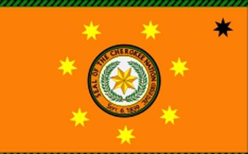  
체로키 네이션의 깃발

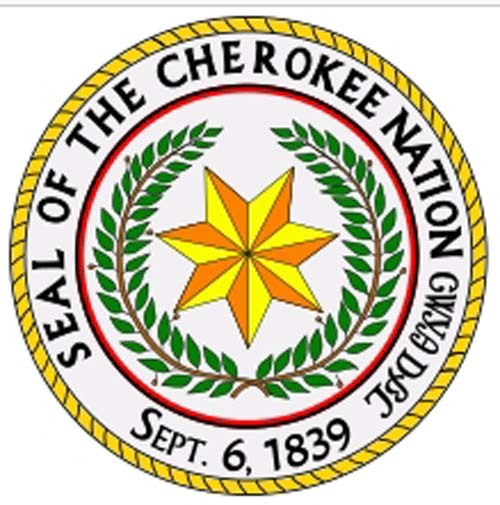  
체로키 네이션의 문장(紋章)

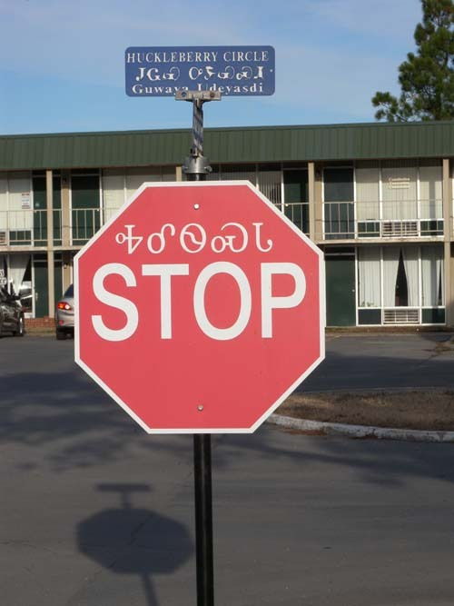  
stop 사인 위쪽의 글자는 같은 뜻의 체로키 글자

미국 백인들의 최대 명절인 추수감사절[Thanksgiving Day]이거나 말거나 이곳에서는 체로키인들 나름의 생활을 볼 수 있길 바랐으나, 그건 내 순진한 소망이었을 뿐. 호텔과 월마트, 주유소 및 맥도날드 몇 군데만 열려 있을 뿐 모든 곳이 꽁꽁 닫혀 있었다. 일단은 실망이었다.

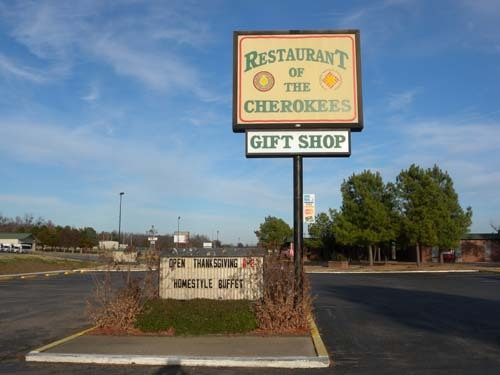  
체로키 네이션 안에서 유일하다는 체로키 고유 음식점. 명절날 점심에 잠깐 열었다가   
닫은 모양이다.

\*\*\*

인디언으로 보이는 호텔 프런트 아가씨들의 설명을 듣고 체로키 네이션 본부와 헤리티지 센터 및 뮤지엄을 찾아갔으나, 사람 없는 곳에 청설모들과 사슴들만 분주하게 그들의 일상을 이어가고 있었다.

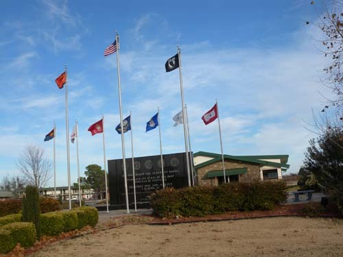  
체로키 네이션의 베테란 센터

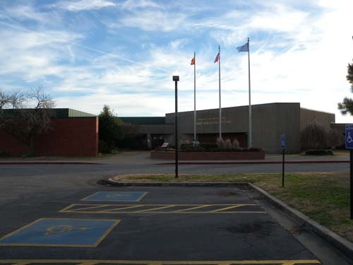  
체로키 네이션의 정부 청사

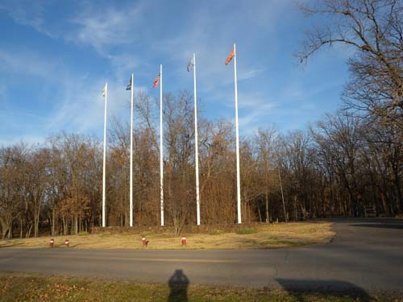  
체로키 헤리티지 센터 입구

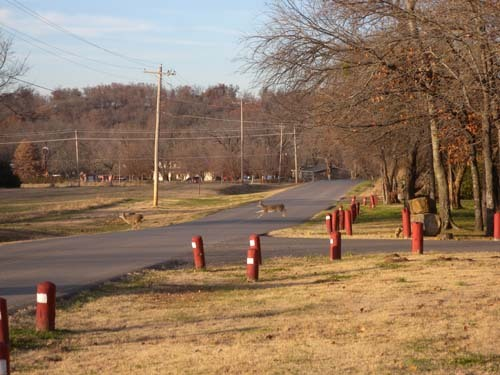  
헤리티지 입구에서 만난 사슴(노루?)들

하릴없이 돌아오면서 월마트에 들렀다. 다른 곳과 달리 그곳엔 사람들이 미어질 정도로 모여들고 있었다. 상품 매대(賣臺)마다 금줄이 둘러져 사람들의 손을 막고 있었고, 그 앞과 옆으로 카트를 밀고 있는 손님들이 줄을 서 있었다. 점원들은 그들의 주위를 오가며 삼엄하게 경비를 서는 모습. 이제 6시만 되면 일제히 달려들어 자신들이 점찍어둔 물건들을 카트에 실을 태세들이었다. 이른바 몇 시간 앞당겨진 ‘블랙 프라이데이(Black Friday)’였다.

  
이 날 월마트(Walmart)는 블랙프라이데이 때문에 붐볐다.

미국 전역에서 Thanksgiving Day가 끝나자마자 모든 상점들은 ‘엄청난 할인 가격’으로 재고물량을 소진시키는 행사들을 갖곤 하는데, 여기도 예외는 아니었다. 아마 가전제품 등 고가의 물품들이 그 주된 대상일 텐데, 비디오 코너나 어린이 용품 코너에도 사람들이 장사진을 치고 있는 점으로 미루어 모든 품목이 다 해당되는 듯 했다. 인디언 문화를 보고자 여러 시간을 소비하며 찾아왔으나, 정작 인디언들은 보지 못한 채 멀미나게 목격해온 미국의 물질문화, 소비문화만을 만나게 된 것이었다.

하릴없이 하룻밤을 호텔 방에서 묵고 다음 날 찾은 뮤지엄은 다행히 열려 있었다. 직원들은 모두 체로키 사람들이었고, 명절 연휴라서인지 관람객은 한 두 가족에 불과했다. 뮤지엄에서는 체로키 사회의 주요 인물들을 찍은 사진 작품들이 전시되어 있었고, ‘눈물의 여정(旅程)[Trail of Tears]’으로 불리는 ‘강제 이동’의 역사적 사건을 사진으로, 그림으로, 기록으로, 모형으로 세밀히 보여주고 있었다. 백인들에 의해 저질러진 체로키 인들의 수난과 고통의 역사가 자그마한 집에 고스란히 보관되어 관객들로 하여금 ‘정복당한 민족의 운명’을 생생하게 이야기하고 있었다.

컬렉션을 설명해주던 큐레이터에게 한국과 체로키 문화의 동질성에 관한 내 의견을 말하며, 일례로 그들의 인사말인 ‘Osiyo[welcome의 뜻]’가 우리말의 ‘오세요/어서 오세요’에서 나온 것이라고 말하자[물론 이에 대한 논리적 근거를 갖고 있는 것은 아니며, 다만 나의 희망적인 추측에 불과할 뿐이다^^], 그녀는 깜짝 놀라는 것이었다. 그러나 단순한 인사말보다 백인 지배자들에 의해 저질러진 체로키 인들의 디아스포라와 일제에 의해 저질러진 한민족 디아스포라가 이 박물관의 핵심 테마인 ‘눈물의 여정’에 기막히게 오버랩 되어 있었고, 정작 나는 그것을 설명하고 싶었으나 시간적 여유가 없었다.

  
'눈물의 여정(Trail of Tears)' 사진 전시회의 포스터

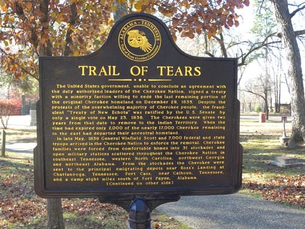  
'눈물의 여정' 설명판

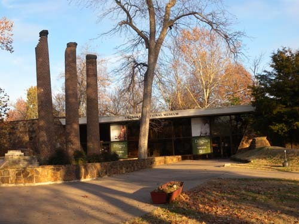  
국립 체로키 뮤지엄

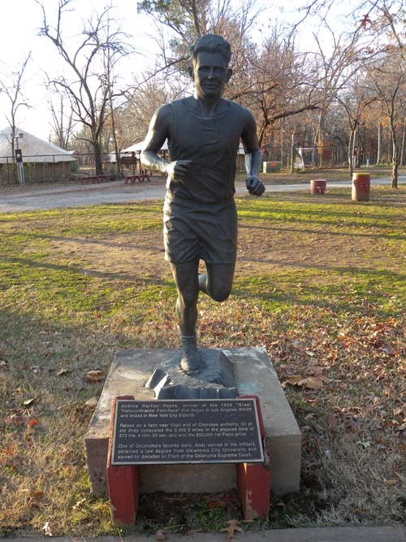  
Andrew Hartley Payne의 달리는 모습. 그는 1928년 열린 '미 대륙횡단 도보 경연대회'  
[1928년 3월 4일 LA를 출발하여 같은 해 5월 26일 뉴욕에 골인]의 우승자로서   
체로키 인디언의 후예다.

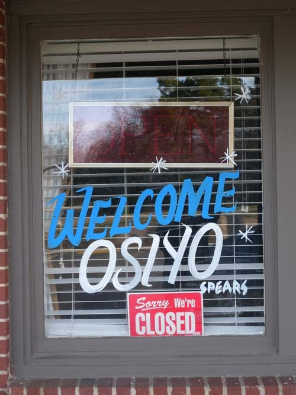  
체로키 레스토랑의 출입문에 쓰여진 'Osiyo'

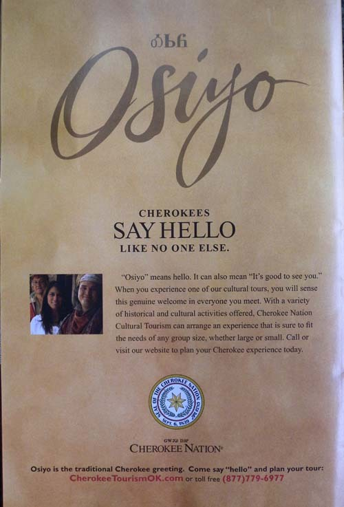  
체로키 네이션에서는 어딜 가나 'Osiyo'가 보인다.

건물 밖에도 그들의 역사가 전시되어 있었다. 정착 당시의 일반 가정들과 학교, 교회, 상점, 대장간, 마굿간, 닭장까지, ‘눈물의 여정’에서 간신히 살아남은 이들의 기증으로 그곳에 재현되어 있었다. 그곳에서 체로키의 관습을 몸으로 보여주는 체로키 남성 가이드 세 사람을 만났다. 한 젊은 가이드는 ‘체로키 의식(儀式)’에서 불리던 노래와 춤을 보여주며 그 의미를 설명했다. 전통적으로 체로키 인들은 유일신을 숭배해 왔다고 했다. 그래서 그런가, 그들은 일찍부터 기독교를 수용한 것으로 보였다. 그와 함께 그는 작은 돌들을 집어넣은 소형 거북이 껍질들을 여러 개 묶어 만든 그들만의 타악기를 보여 주었다. 발에 전대처럼 차고 ‘처륵처륵’ 소리를 내며 많은 사람들이 군무(群舞)를 추던 당시의 모습을 보여주는 것이었다. 그곳에는 지금도 봄철이면 많은 거북이들이 땅 위로 출몰한다고 했다.

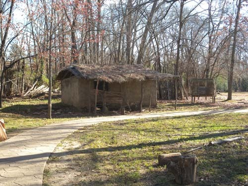  
정착 초기에 살던 집

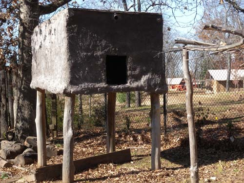  
집 앞에 서 있던 음식 저장고

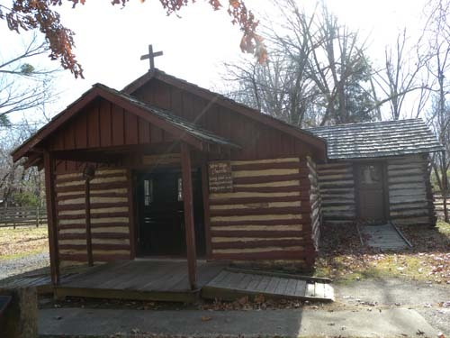  
새 희망 교회[New Hope Church]

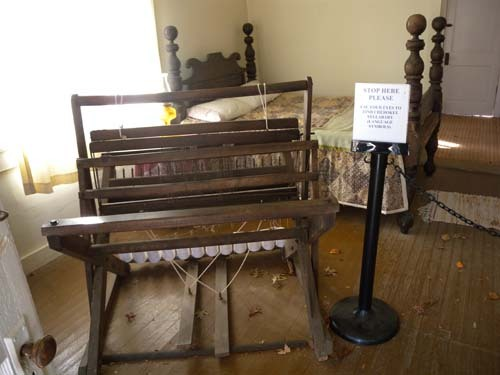  
가정집에서 부인이 사용하던 직물 기계. 우리의 베틀과 비슷한 원리를 갖고 있다.

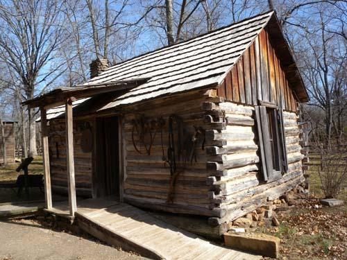  
농가

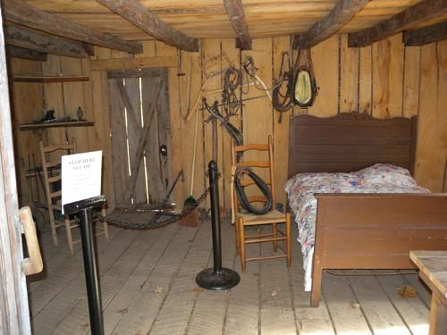  
농가의 내부

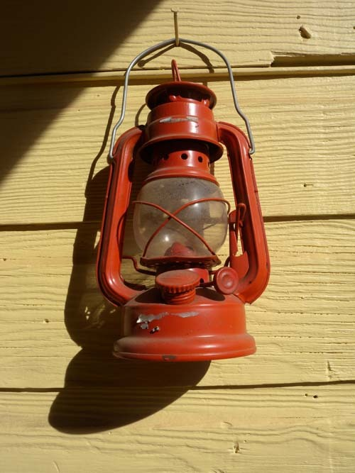  
집 바깥에 걸어둔 등

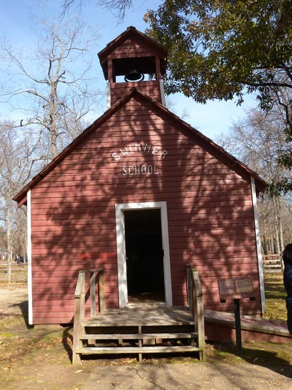  
학교 건물

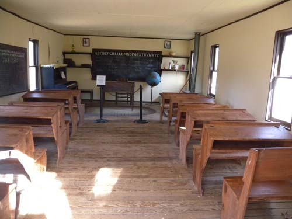  
교실. 영어 알파벳과 체로키 문자가 함께 적힌 칠판이 보인다.

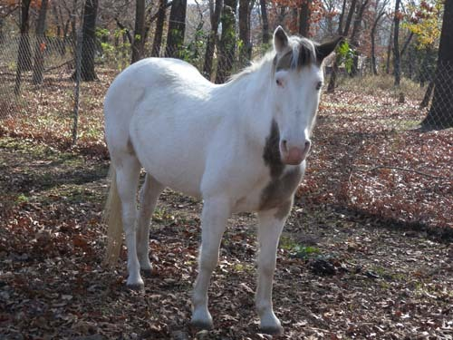  
야외 마굿간에서 만난 '명상에 잠긴 말'

가이드 나탄의 노래를 직접 들으실 수 있습니다. 클릭하세요.

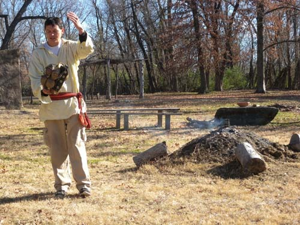  
마른 거북에 돌들을 넣어 만든 악기를 들고 의식의 실제를 보여주는   
젊은 가이드 나탄(Mr. Nathan Wolfe)

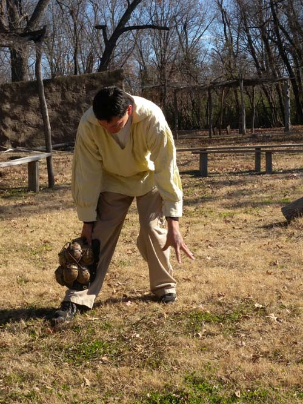  
젊은 가이드의 또 다른 포즈

다른 두 명의 중년 가이드들은 각각 전통 사냥법과 활 전문가였다. 한 사람은 대나무에 침(針)을 넣고 입으로 불어 토끼 등 작은 동물들을 잡는 시범을 보여 주었고, 다른 한 사람은 돌을 갈아 살촉을 만들고, 강하고 큰 활에 그 화살을 메겨 적에게 쏘거나 사냥하는 모습을 현장에서 보여주고 있었다. 두 사람의 설명을 통해 총으로 무장한 백인 침입자들의 출현에 속절없이 당하고 만 당시 체로키 인들의 비참한 상황과 역사의 아이러니가 눈앞에 떠올랐다.

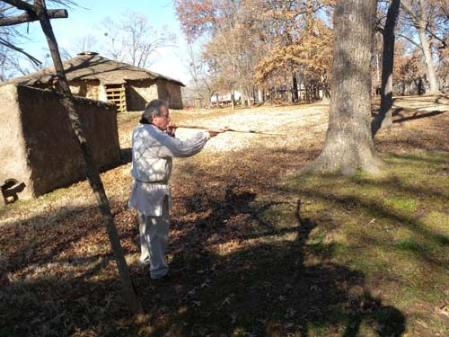  
대롱에 넣은 침을 입으로 불어 작은 동물을 잡는 시범을 보여주는 가이드

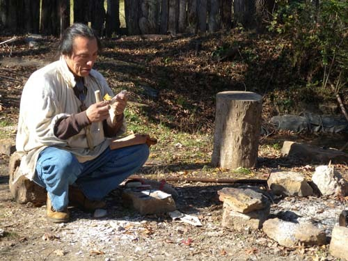  
돌 화살촉 만드는 시범을 보여주는 가이드

헤리티지 뮤지엄을 떠난 우리는 탈레콰 다운타운으로 진출했다. 조용하고 널찍한 도로 양 옆으로 건물들이 평화롭게 앉아 있었다. 1자형 간선도로가 끝나는 곳, 도시의 핵심이자 다운타운을 내려다보는 위치 양지바른 곳에 ‘북동부 주립대학[Northeastern State University]이 자리잡고 있었다. 2000명 규모의 작은 대학이지만, 아주 아름다운 캠퍼스였다. 학교 중앙에 세쿠오야(Sequoyah)의 동상이 세워져 있는 점으로 미루어 이 대학은 이곳 체로키 네이션의 정신을 바탕으로 세워진 듯 했다.

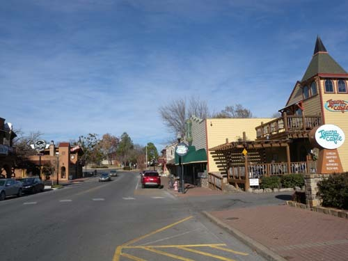  
탈레콰 다운타운

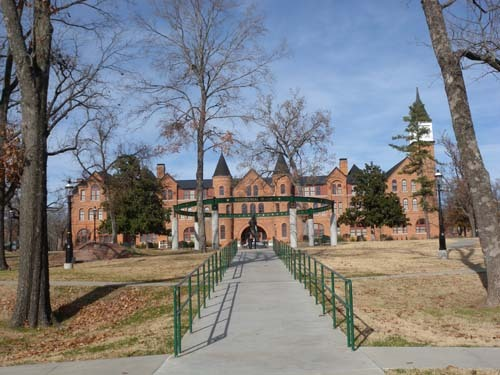  
북동부 주립대학[Northeastern State University]의 멋진 캠퍼스

체로키어를 읽고 쓸 수 있게 만들었다는 점에서 세쿠오야는 문화의 기록과 전승을 가능케 한 민족의 영웅이었다. 원래 그는 은 세공장이었는데, 1821년 독자적인 체로키어 음절표를 만들어냄으로써 체로키 사람들의 지적 활동에 큰 혁명을 가져오게 된 것이었다. 글자 없던 사람들에게 효율적인 쓰기 체계를 만들어 준 일보다 더 큰 공이 어디에 있을까. 그가 이 음절표를 만들어 내자마자 그것은 체로키 네이션에서 급속히 번지게 되었고, 1825년에는 네이션에서 공식 채택됨으로써 체로키 사람들의 문자 해독률은 주변의 백인 정착자들을 뛰어넘게 되었다고 한다. 말하자면 체로키인들에게 세쿠오야는 우리민족에게 세종대왕과 같은 존재인 셈이었다. 이곳 체로키 네이션 어딜 가나 세쿠오야의 사진이나 동상을 발견하기 어렵지 않은 것도 바로 이런 점 때문이었다.

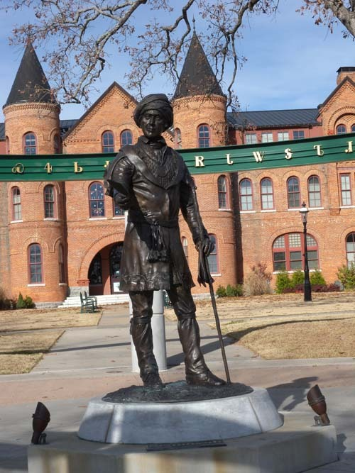  
대학 캠퍼스에 세워진 세쿠오야의 동상

NSU에서 나온 우리는 ‘체로키 국립 대법원 박물관[The Cherokee National Supreme Court Museum]’과 ‘체로키 국립 감옥 박물관[Cherokee National Prison Museum]’ 등에 들렀다. 탈레콰 타운 광장의 남동쪽에 위치한 대법원 박물관은 1844년 피어스(James S. Pierce)가 세웠으며, 체로키 네이션의 대법원 청사로 쓰이던 건물이다. 또한 체로키 네이션의 공식 간행물이자 오클라호마 주 최초의 신문인 ‘체로키 애드버킷’[Cherokee Advocate, 1844년부터 1906년까지 간행]의 첫 인쇄 행사가 열린 곳도 바로 이 건물이다.

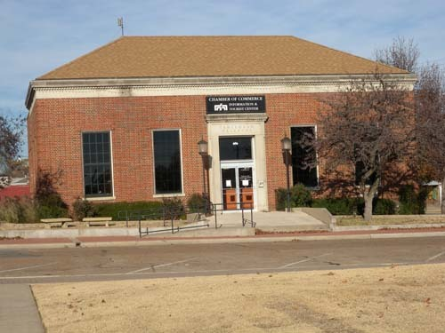  
상공회의소 겸 관광안내소

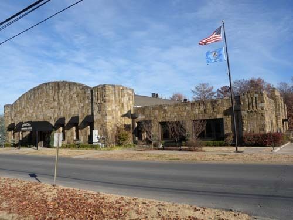  
탈레콰 시청

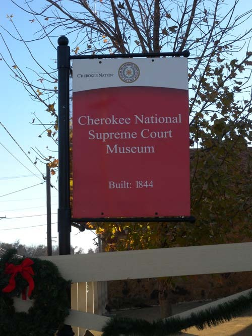  
국립 체로키 대법원 뮤지엄 표지판

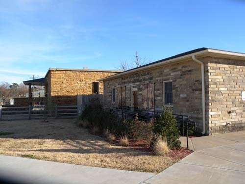  
국립 체로키 감옥 박물관

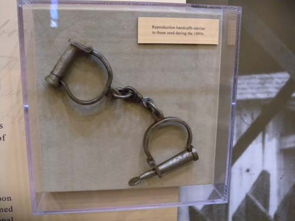  
1880년대 사용되던 수갑을 본떠 다시 만든 것

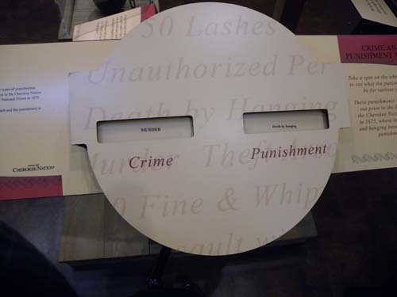  
죄명에 따른 당시의 판결. 살인범은 교수형에 처했다. 계획살인에 단 3~5년형을 부과해놓고도   
'중형'이라 너스레를 떠는 우리나라의 법관들은 반드시 배워야 할 법 정신이다.

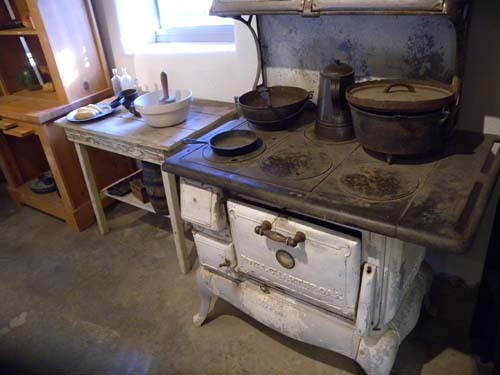  
당시 감옥의 주방

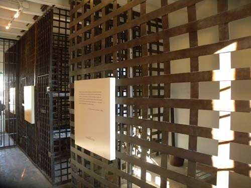  
당시 감옥의 모습

‘체로키 애드버킷’은 문화민족 체로키 인들의 자부심을 드러낸 간행물이라는 점에서 매우 의미가 크다. 1844년 9월 26일 창간호에 실린 ‘우리의 권리, 우리나라, 우리 민족’이란 그들의 모토야말로 오늘날 우리도 수시로 외치는 구호가 아닌가? 당시 이 신문은 체로키 인들에게 미국과 미국인들의 정보를 제공하기 위해 체로키어와 영어로 매주 발행되었다. 이 신문은 당시 미국 내의 유일한 민족 신문이었으며, 이 신문의 발간이 시작되자마자 다른 부족들에게도 영향을 주어 1850년엔 ‘촉토 인텔리젠서(Choctaw Intelligencer)’가, 1854년엔 ‘치카사 인텔리젠서(Chickasaw Intelligencer)’가 각각 발간되기 시작했다. 이 사실은 아메리칸 인디언에 대하여 잘못 된 고정관념을 갖고 있던 내게 큰 충격을 주었다. 이들도 누구 못지않은 지능과 식견을 갖고 있음을 그들의 박물관들에서 확인하게 되었기 때문이다.

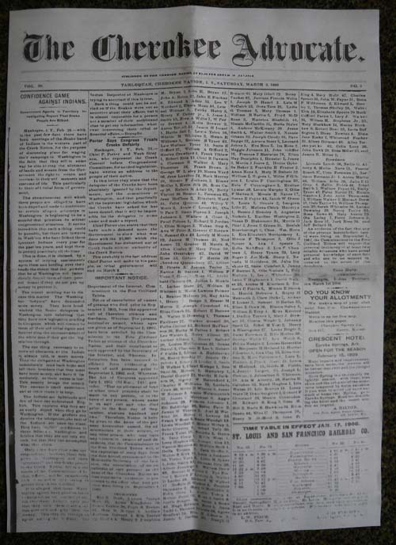  
<Cherokee Advocate> Vol. 30, No. 3.[1906년 3월 3일자]

\*\*\*

체로키 네이션을 방문한 것은 아직도 광활한 미국 땅에 온존하고 있는 ‘식민주의의 잔재’와 그 근원을 확인하고 싶어서였다. 지금은 다수자들의 통치논리에 순응하며 ‘행복한 삶’을 누리고 있는 듯하지만, 민족의 트라우마로 남아 있는 ‘눈물의 여정(旅程)[Trail of Tears]’을 그들이 어떻게 잊을 수 있겠는가. 자신들의 말을 표기하기 위한 글자체계를 만들었고, 신문까지 발행했으며, 합리적인 사법 시스템까지 운영했던 그들의 지능과 문화를 과연 지배자로서의 백인들은 제대로 인식해온 것일까. 물론 과거의 역사를, 복수를 위한 근거자료 만으로 활용하는 것도 바람직하지는 않을 것이다. 그러나 그걸 완전히 잊어버릴 경우, 삶의 바탕인 정체성마저 잃게 된다는 사실을 그들 스스로 깨닫고 있음을 확인하게 되었다. 아주 아름답고 생생하게 유지하고 있는 박물관들에 그 증거물들은 시퍼렇게 눈을 뜬 채 살아 있었다.

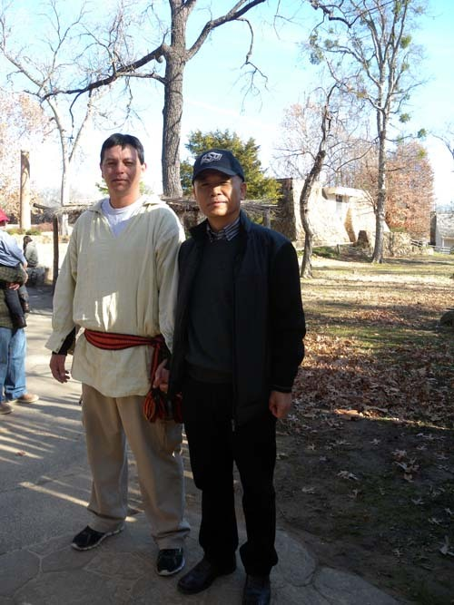  
체로키 헤리티지 센터 빌리지에서 가이드와 함께 한 백규

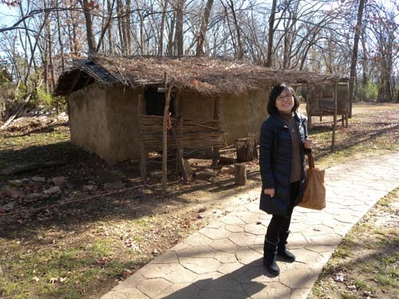  
빌리지 가옥 앞에서 Melani

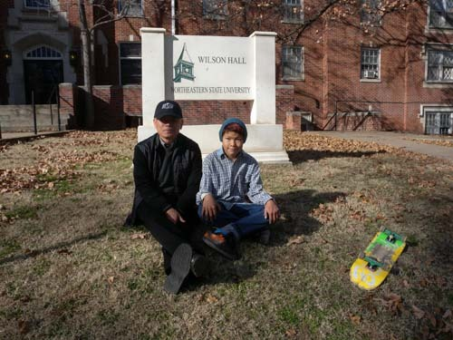  
북동부 주립대학교 교정에서 만난 오세이지족 인디언 소년 Joshua군과 함께.   
부자간으로 보이지요?^^

공유하기

게시글 관리

**백규서옥\_Blog ver.**