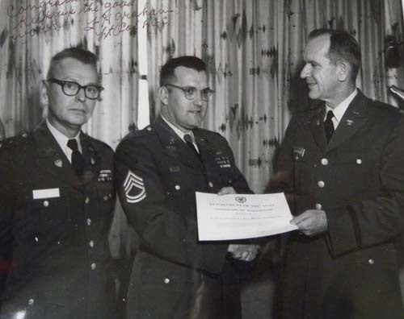
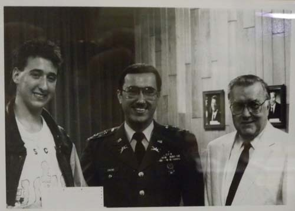
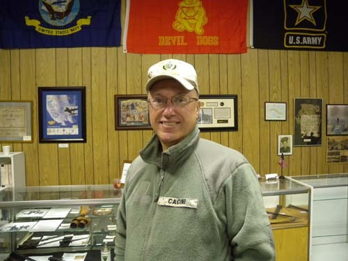
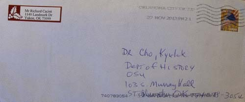
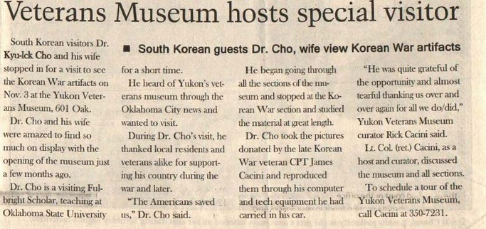
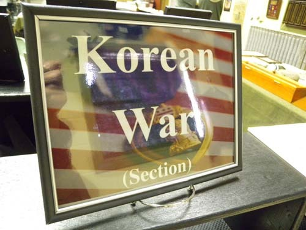
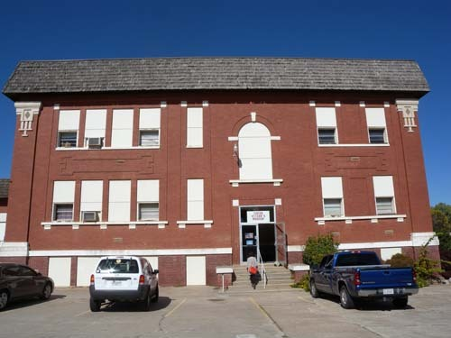

한국전 참전용사의 아들 리차드 카치니(Richard Cacini) 

지난 달 우리는 66번 도로와 그 주변 도시들을 탐사하던 중 유콘 시티(Yukon City)에 들르게 되었고, 거기서 우연히 ‘유콘 퇴역군인 박물관[Yukon Veterans Museum]’을 만났다. 당시 개관한 지 채 몇 달도 지나지 않은 뮤지엄이었는데, 큐레이터가 바로 리차드 카치니(Richard Cacini)였다. 그의 아버지 제임스 카치니(James Cacini)는 6・25 참전용사로서, 전쟁과 관련된 많은 유물들을 소장하고 있던 인물이었다.

  
한국에서 사령관으로부터 공로표창을 받고 있는 제임스 카치니(가운데)

  
미국 육군 3대(오른쪽부터 할아버지 제임스 카치니 대위, 리차드 카치니 소령, 로버트 카치니 일병)

  
현재의 리처드 카치니

그가 사망한 뒤 아들인 리처드 카치니는 자신의 아버지가 소장하고 있던 유물들을 이 뮤지엄에 기증했고, 그 유물들을 바탕으로 ‘한국전쟁 섹션’이 성립된 것이었다. 그 가운데 귀한 사진들을 발견한 우리는 이미 이곳에 발표한 ‘미국통신 26: 누구 혹시 이 소녀를 아시나요?’를 통해 소개했고, 뮤지엄에 대한 우리의 특별한 느낌을 적은 바 있다. 

그런데 오늘, 연구실에 들어와 보니 한 통의 편지가 도착해 있는데, 봉투를 뜯어보니 아래와 같은 기사가 실린 지역신문 한 부분이 들어 있었다.

  
리처드 카치니가 보내준 편지봉투

  
Yukon Review(2013. 11. 27)

이 기사를 대강 번역하면 다음과 같다.

              베테란스 뮤지엄, 특별한 손님 맞아

-한국으로부터 온 조 박사 부부가 한국전쟁의 유물을 관람하다-

한국의 조 박사 부부가 11월 3일 오우크 가(街) 601번지[601 Oak.]에 있는 유콘 베테란스 뮤지엄의 한국전 관련 유물들을 살펴보기 위해 이곳을 방문했다. 조 박사와 그의 부인은 바로 몇 달 전에 개관한 뮤지엄에 전시된 많은 유물들을 보고 놀라워했다. 조 박사는 잠시 오클라호마 주립대학에서 연구와 강의를 수행하고 있는 ‘풀브라이트 방문학자’다. 그는 오클라호마 시의 소식지를 통해 유콘의 베테란스 뮤지엄에 관하여 듣게 되어, 이곳을 방문하고자 한 것이다. 조 박사가 이곳을 방문하는 동안, 그는 전쟁 기간과 그 후에 자신의 나라를 도와 준 데 대하여 이 지역 주민들과 참전용사들에게 감사의 뜻을 표하며, “미국인들이 우리를 구해주었다”고 그는 말했다. 그는 뮤지엄의 모든 섹션들을 둘러보던 중 한국전 섹션에서 발길을 멈추었고, 오랫동안 그 자료들을 살폈다. 조 박사는 거기서 한국전 참전용사 고(故) 제임스 카치니(James Cacini) 대위가 기증한 사진들을 발견했고, 그것들을 그가 차에 싣고 다니는 컴퓨터와 몇몇 기계장치를 통해 복제했다. “그는 이런 기회를 갖게 된 것에 대하여 아주 고마워했고, 우리가 하고 있고 해 온 모든 일들에 대하여 거듭거듭 눈물겹도록 고마워했어요.” 라고 유콘 베테란스 박물관의 큐레이터 릭 카치니(Rick Cacini) 씨는 말했다. 주빈이자 큐레이터로서 카치니 예비역 중령은 뮤지엄과 그 안의 모든 부분들에 관하여 설명했다. 유콘 베테란스 뮤지엄 방문 계획을 갖고 있을 경우, 카치니 씨에게 전화[350-7231]하면 된다.

 

  \*\*\*

당시 우리는 여러 명의 베테란들을 만났고, 그 가운데 한국전 참전용사의 아들인 리처드 카치니는 특별한 존재였다. 6・25 발발의 원인이나 결말, 그로부터 시작된 우리 현대사의 질곡들은 학계에서도 아직 연구 중이다. 물론 학술적 차원을 떠나 6・25에 대하여 모르는 이들은 없을 것이고, 6・25와 관련된 미국의 책임을 들어 ‘반미’의 근거로 삼는 이들도 많다.

  
유콘 퇴역군인 박물관[Yukon Veterans Museum]의 한국 섹션

세계사의 진행과정에서 모든 사건들의 원인은 대부분 다원적이고 복합적이기 때문에, 어느 일방에 책임을 떠넘길 수는 없다. 비록 일각의 실수와 판단착오로 전쟁이 일어났다 해도, 그 전쟁에 이기기 위해 UN의 깃발을 든 16개국이 자식들을 전장(戰場)에 보내준 것은 쉬운 일이 아니다. 그 가운데 36,516명 전사, 92,134명 부상, 8,176명 실종, 7,245명 포로 등 미군 희생자 수는 단연 압도적이었다.

훗날 대통령이 되는 아이젠하워 원수의 아들을 포함한 140여 명에 달하는 장군의 아들들도 최전선에 참전하여 35명이나 희생되었으니, 6・25 참전의 근본 의도가 어디에 있었건 공산주의 세력에 대항하여 일치단결한 힘으로 한국을 살려낸 것은 그들의 희생을 바탕으로 이루어낸 역사적 쾌거임에 틀림없다.

미국에서 사람들을 만나 그들의 부조(父祖)에 관한 이야기를 나누다 보면 6・25 참전용사들이 심심치 않게 등장하는데, 그런 부조를 둔 자녀들은 대부분 친한(親韓) 인사라는 사실을 확인하게 된다. 그들의 뇌리 속엔 아직도 한국이 ‘전쟁으로 파괴되고 궁핍한 나라’로 각인되어 있긴 하지만, 우리도 모르는 외국 땅 어디에선가 우리에게 응원을 보내는 존재들이 바로 이들이라는 점을 생각하면 얼마나 감동적인가.

정치적・이념적 입장이 무엇이건 간에 사랑하는 자식들을 파견하여 죽음으로 우리를 지켜 준 점에 대하여 고마워해야 한다. 미국 땅에서 베테란들, 특히 한국전 참전용사나 그 후손들을 만날 때마다 누구든 스스로 한국인을 대표하는 심정으로 그들에게 최대한의 예를 표하는 것이 마땅하다고 보는 것도 그 때문이다. 국가가 나서서 참전용사들을 우대하고, 묻혀 있는 공로자들을 발굴・선양하는 일이야말로 상무정신(尙武精神)을 드높여 궁극적으로 국방을 든든히 하는 최선의 방책이다. 곳곳에 베테란스 센터나 뮤지엄들을 지어 이들의 공적을 선양하고 교육의 자료로 활용하는 미국을 보며, 완벽한 국방이란 무기의 좋고 나쁨에만 달려 있는 것이 아님을 새삼 확인하게 된다.

 

  
유콘 퇴역군인 박물관[Yukon Veterans Museum]

공유하기

게시글 관리

**백규서옥\_Blog ver.**