우리도 스토리가 있는 길을 한 번 만들어 봅시다!

-제3화: 클린턴 시티(Clinton City)와 ‘66번 도로 박물관[ Rt. 66 Museum]’-

손 형,

엘크시티를 떠나 동북쪽 30분 거리에 있는 클린턴시티로 가는 길은 늘 그랬던 것처럼 아득히 넓은 들판의 연속이었소. 가끔 고개 들어 우리를 쳐다보는 소떼들과 끄덕거리며 땅 속의 기름을 길어 올리는 사마귀 모양의 원유 채굴기 만이 시각으로 감지할 수 있는 움직임의 전부였소. 거칠 것 없는 바람은 그 들판 위를 달리는 차를 흔들어 나그네의 마음을 마냥 스산하게 만들었소. 그저 에머럴드 빛 하늘에 번지는 새하얀 구름만이 땅 위에 깔린 초록빛 목초와 어울려 그나마 운전자의 지루한 마음을 달래 줄 뿐이었다오.

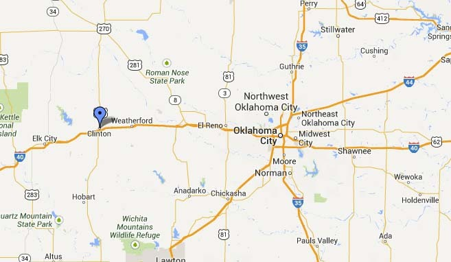  
엘크 시티에서 클린턴, 엘 르노, 오클라호마 시티 등이 표시된 66번 도로(I-40) 주변 지도

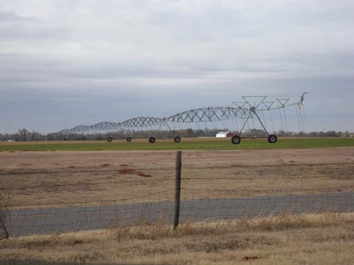  
엘크시티에서 클린턴 오는 길에 만난 들판의 관개시설(?)

\*\*\*

넓은 대지 위에 띄엄띄엄 집들이 들어서 있는 클린턴시티는 엘크시티보다 더 휑했소. 그러나 이곳에도 역시 많은 이야기가 깃들어 있었소. 우리나라는 역사가 길어 대도시를 제외한 소규모 도시들은 유래를 알기 어렵고, 도시 형성에 관련된 스토리 또한 딱히 찾아볼 수 없는 경우가 대부분 아니오? 그러나 미국은 역사가 짧아서인가 도시 형성의 유래가 분명하고, 영고성쇠(榮枯盛衰)로 요약되는 역사의 굴곡 또한 분명하더이다. 처음에 우리는 이 도시가 빌 클린턴 전 대통령 일가와 관련이 깊을지도 모른다는 가소로운 추정을 해보았소. 빌 클린턴의 기반 지역인 아칸사 주는 오클라호마 주와 인접해 있는 만큼, 본관(本貫)을 가진 한국인들처럼 그 옛날 클린턴 가문도 이곳에서 일어난 뒤 그 쪽으로 이주했으리라는, 그럴듯한 상상을 했던 것이오. 그러나 뮤지엄 관계자에게 물어보자마자 일언지하에 ‘No!’랍디다.

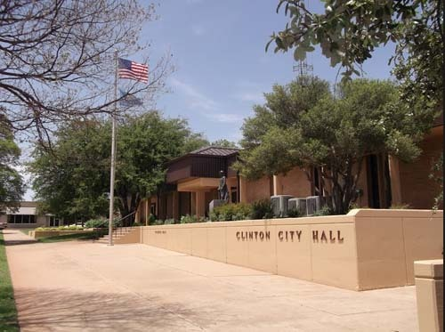  
클린턴 시청

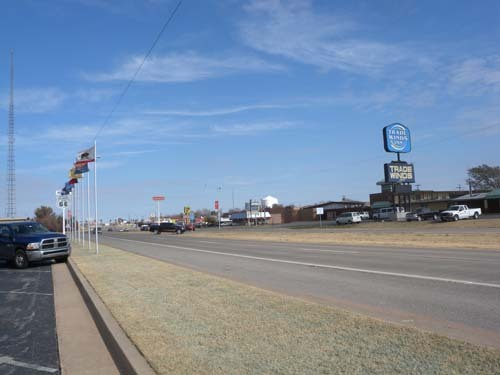  
클린턴 다운타운 입구의 시원한 모습

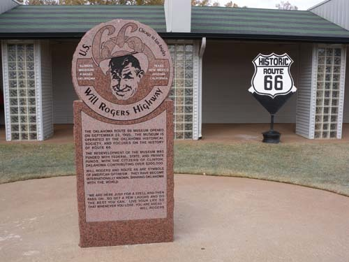  
66번 도로 박물관 앞에 세워진 윌 로저스 기념비

  
66번 도로 박물관 로비에서 만난 각 도시의 관광안내서들

1899년 아반트(J.L. Avant)와 블레이크(E.E. Blake)가 와쉬타(Washita) 강 옆의 계곡에 도시를 세우기로 결정한 데서 클린턴시티는 출발을 보았다고 하오. 이 지역 인디언들로부터 320 에이커의 땅을 사들여 와쉬타 지역 교차점에 작은 정착지를 조성함으로써 클린턴 지역 공동체는 시작되었소. 1902년 의회로부터 승인을 받음으로써 와쉬타 공동체는 급속히 발달하게 되었으며, 그와 함께 ‘커스터 카운티 크로니클 신문사(Custer County Chronicle Newspaper)’와 ‘제1국립은행(The First National Bank)’ 같은 기관들이 지역 사업체로서는 처음으로 등장했던 것이지요. 그러나 우체국이 신설되면서 체신부가 ‘와쉬타 교차점’이라는 명칭을 받아들이지 않자 세상을 떠난 이 지역 재판관 ‘클린턴 어윈(Clinton Irwin)’의 이름을 따서 이 도시의 이름으로 삼았다는 것이오.

어쨌든 클린턴 시티는 66번 도로와 뗄 수 없는 관계를 유지해 왔고, 그 덕분에 많은 이점을 얻었다고 할 수 있소. 66번 도로 가의 다른 도시들과 마찬가지로 클린턴도 여행자들을 상대로 하는 업종이 성황을 이루고 있었지요. 예컨대, 각종 레스토랑, 까페, 모텔, 주유소, 자동차 정비소 등이 그런 것들이지요. 그 업소들 가운데 하나만 예를 든다면, ‘팝 힉스 레스토랑(Pop Hicks Restaurant)’ 같은 경우는 66번 도로에서 가장 오랫동안 운영되던 식당이었다지요. 말하자면 ‘길에서 돈이 생기는’ 환상적인 체험을 적어도 66번 도로가 거쳐 가는 도시민들은 절감하게 된 것이지요. 사실 이 도로가 쇠락의 길을 걷다가 다시 부활한 것도 이 길과 이해를 함께 한 사람들의 추억 덕분이 아닐까 생각하고 있어요. 말하자면 ‘옛날의 영광이여, 다시 한 번!’이란 ‘인간 욕망’의 구현이라고나 할까요?

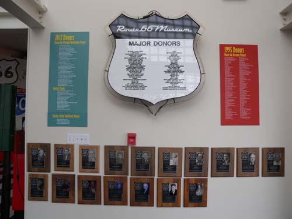  
66번 도로 박물관에 협찬한 기업들과 인물들

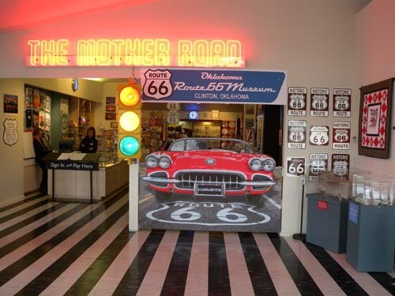  
66번 도로 박물관 로비(접수대 및 매점)

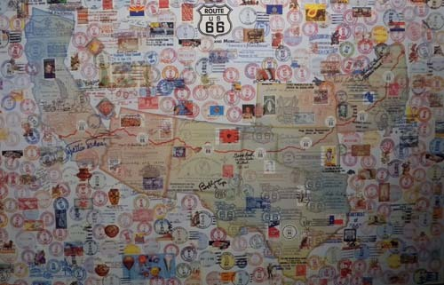  
66번 도로와 각 지역의 우편 스탬프

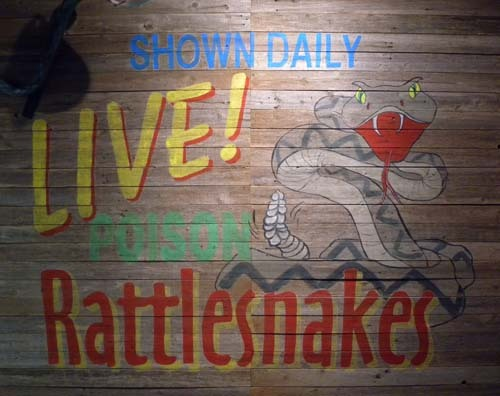  
당시 66번 도로 가에 있던 방울뱀 쇼 포스터

1970년대만 해도 이 도시를 우회하던 I-40¹[Interstate highway #40]이 오늘날엔 이 도시를 통과하게 되었고, 많은 길들이 이에 연결됨으로써 이 도시는 이 지역에서 매력적인 관광의 거점 역할을 하게 되었지요. 관광객들이 반드시 들렀다 가는 정거장 역할을 하고 있단 말입니다. 여기서 가까운 텍사스 주의 아마리요(Amarillo)와 오클라호마 시티를 연결하는 66번 도로 가의 큰 도시들 중의 하나이자 여행객들을 위한 중간 쉼터로서의 기능을 해내고 있다는 거지요. 이 도시 안에 일찍부터 해군비행단과 군용비행장이 있었고, 그에 따라 2차 세계대전을 전후로 많은 부침(浮沈)도 있었지만, 무엇보다 이 도시가 66번 도로와 함께 되살아난 점은 길이 인간에게 무엇을 의미하는지 극명하게 보여주는 사례라 할 수 있지요.

 

그래서 우리는 도시에 들어오자마자 마주치게 되는 ‘66번 도로 박물관[Rt. 66 Museum]을 찾았어요. 규모는 엘크시티의 ‘국립 66번 도로 박물관 단지[National Rt. 66 Museum Complex]’보다 작았으나, 질 높은 컬렉션과 정제된 기획력이 돋보이는 박물관이었어요. 특히 66번 도로의 역사성을 미국 현대사나 문명의 변화와 직결시킴으로써 길과 인간의 뗄 수 없는 관계를 보여주고자 한 의도는 다른 어떤 박물관에서도 찾아볼 수 없는 장점이었어요.

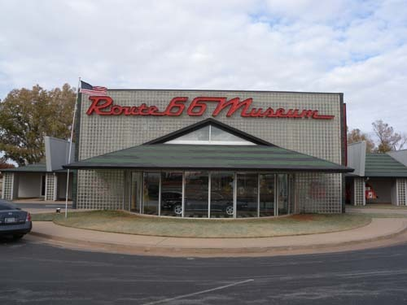  
66번 도로 박물관

66번 도로의 개통 및 변화, 길 주변 도시들의 영고성쇠 등과 정치・경제・사회의 변화가 어쩌면 그렇게 정확히 맞물려 돌아가는지 놀라움을 금할 수 없었지요. 1920년대 세계 대공황의 산물이 바로 66번 도로였고, 2차 세계대전과 산업의 발전이 이 도로를 쇠락하게 만든 주범이었으며, 과거에 대한 집단적 회상과 추억을 추구하는 새로운 사조의 등장이 이 도로를 부활시킨 힘이었다고 할 수 있지요. 고비마다 위대한 대통령들이 등장하여 그런 분위기를 견인해 나온 미국 현대사의 물결이 바로 이 도로에 스며들어 있다는 것이지요. 제가 너무 과한 해석을 한 걸까요?

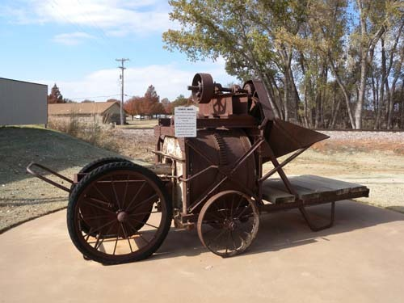  
1928년 66번 도로를 만들던 당시 사용하던 시멘트 믹서

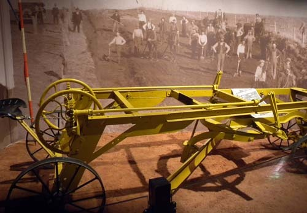  
66번 도로를 닦던 당시 작업 모습과 도구

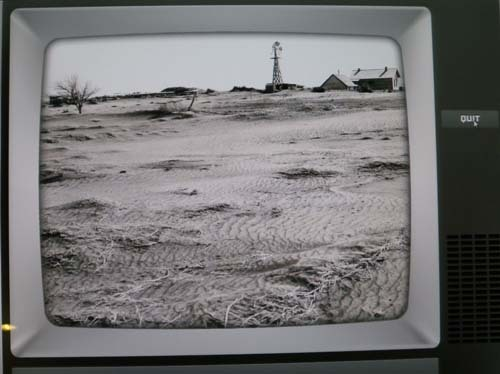  
가뭄으로 고통을 겪던 당시, 66번 도로 가에서 목격되던 이른바 'Dust Bowl'의 참상

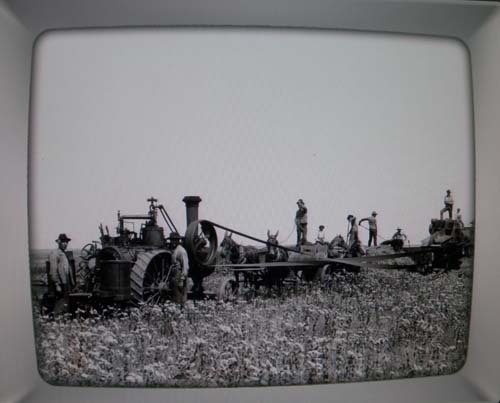  
66번 도로 가의 목화 수확 장면

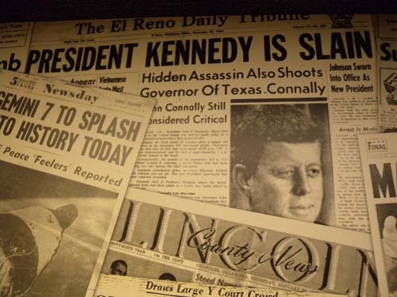  
케네디 대통령 암살 소식

  
베트남전 당시 반전의 목소리를 높이던 제인 폰다와 신인 정치인 존 케리(현재 미 국무장관)

  
지미 카터의 대통령 당선 소식

이런 대규모의 토목공사를 통해 세계 대공황으로 무너진 산업의 기반을 일으켜 세우려 한 것은 당연한 일이었겠지요. 길이란 필연적으로 여행의 욕망을 부추기는 공간이고, 여행은 어쨌든 소비 행위라 할 수밖에 없지요. 그래서 2차 세계대전 같은 비상시에 소비행위는 억제될 수밖에 없었고, 그 결과 66번 도로의 쇠락은 필연적인 결과였겠지요. 전쟁 이후 산업화 시대에 들어오면서 새로운 길의 수요에 따라 66번 도로 대신 넓고 빠른 하이웨이들이 건설되어 효율성을 추구하게 됨으로써 그 길은 다시 쇠락의 길을 걸었지요. 그러나 다시 시대가 바뀌어 삶의 질과 내면을 추구하는 시대로 접어들면서 버려졌던 66번 도로는 부활하게 된 것이지요. 그렇게 66번 도로의 ‘탄생-성장-쇠락-부활’을 일목요연하게 보여주는 컨셉으로 짜여 있는 곳이 바로 이 박물관이었어요.

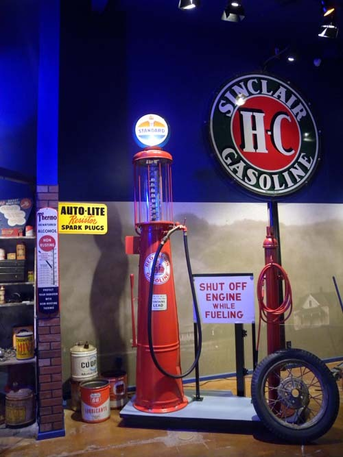  
당시 길가의 주유소

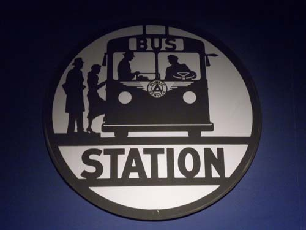  
당시 버스 정류장 표지판

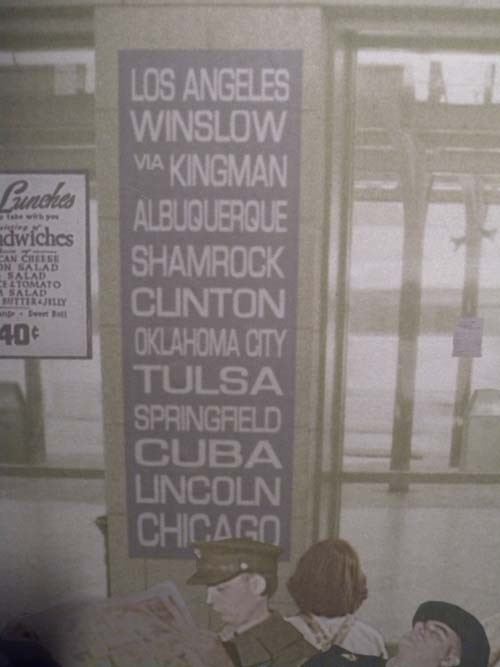  
당시 66번 길로 버스를 타고 갈 수 있던 도시들

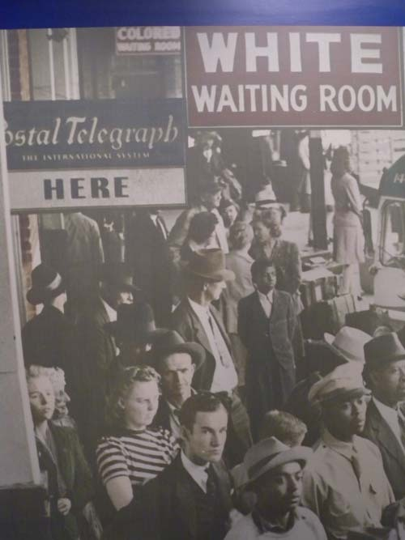  
버스 대합실의 풍경[고약하게도 당시는 백인 대기실을 별도로 운영하고 있었음]

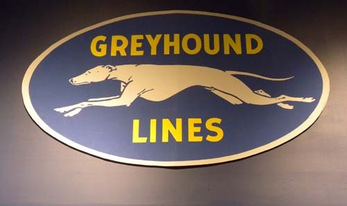  
당시 66번 도로를 통해 전국으로 달리던 고속버스 그레이하운드의 트레이드 마크

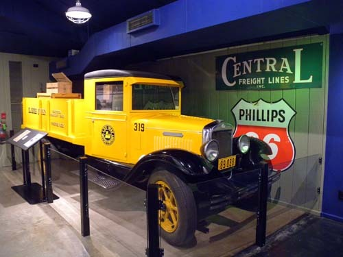  
당시 66번 도로를 달리던 화물차

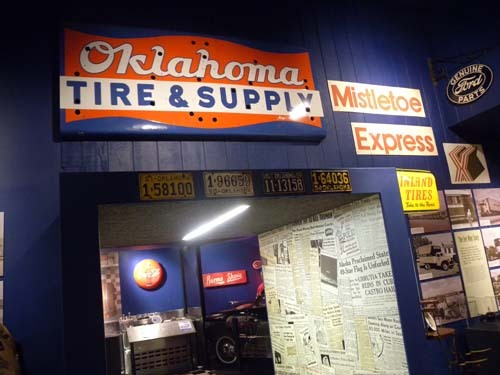"  
당시 66번 길가에 있던 자동차 정비소

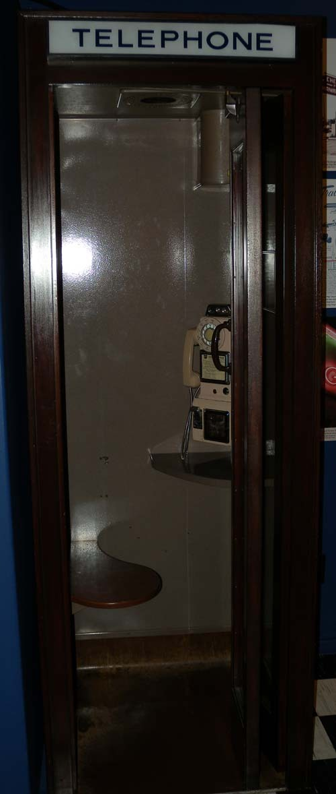  
당시 66번 도로 휴게소에 있던 공중전화 부스

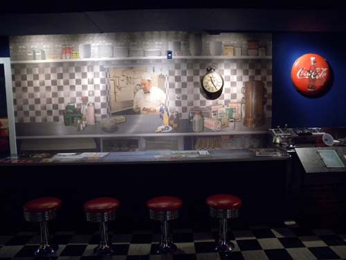  
당시 66번 도로가에 있던 카페

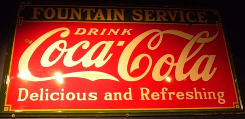  
당시 코카콜라 서비스와 선전문구

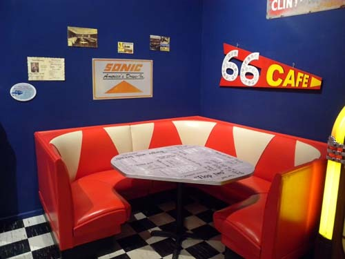  
당시 66번 도로 가의 카페

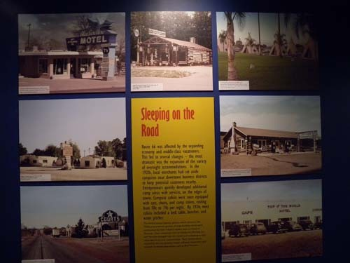  
당시 66번 도로 가에 즐비하던 숙박업소들

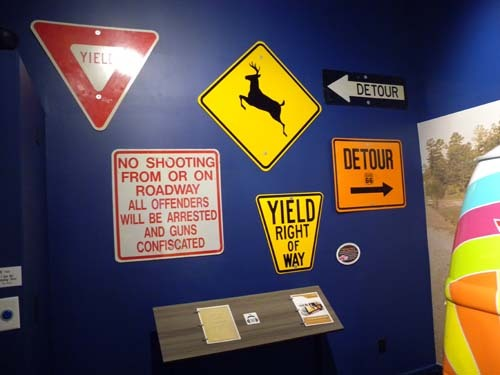  
당시 66번 도로에 설치되어 있던 각종 교통 표지판 및 경고표시들

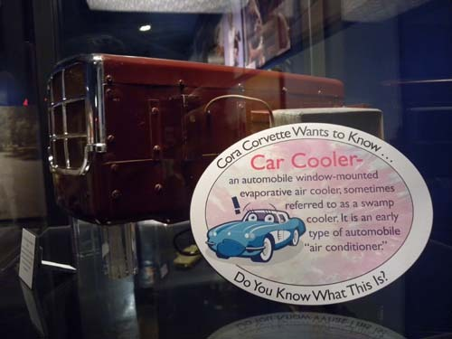  
당시 자동차에 사용하던 에어컨

  
당시 장거리 여행할 때 자동차에 갖고 다니던 유아용 젖병 보온기

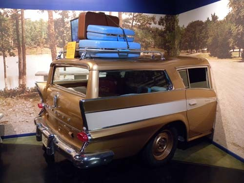  
당시 66번 도로 여행자들은 자동차 지붕에까지 짐을 싣고 다녔다.

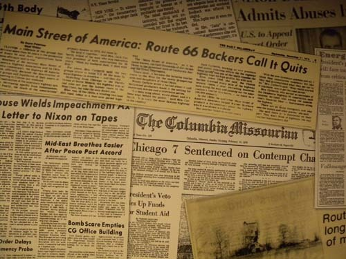  
66번 도로 부활 운동의 소식

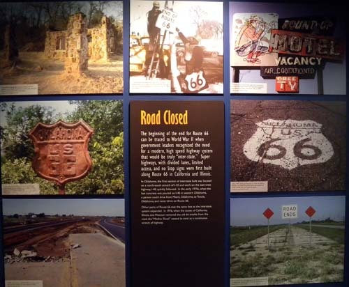  
66번 도로가 황폐화 되고 폐쇄된 여러 모습들

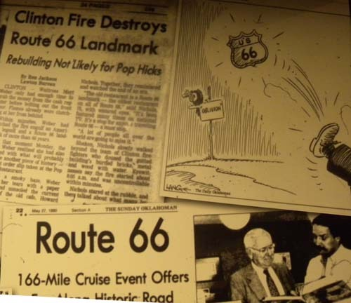  
66번 도로에 관한 소식

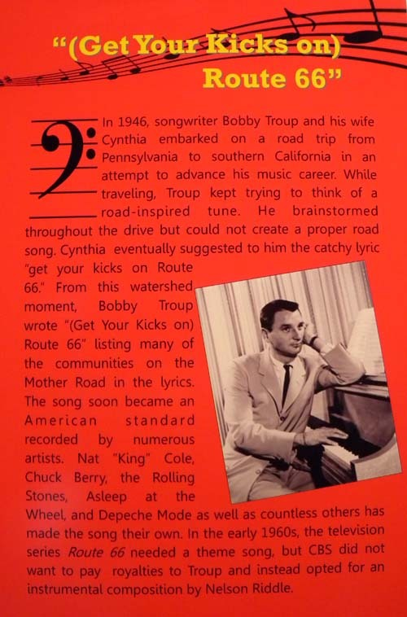  
66번 도로를 사랑한 작사가 바비 트룹

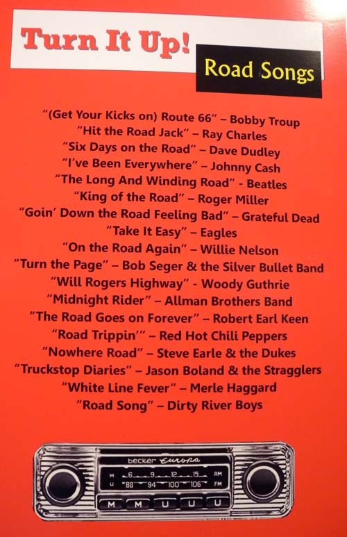  
66번 도로에 관한 노래들과 가수들

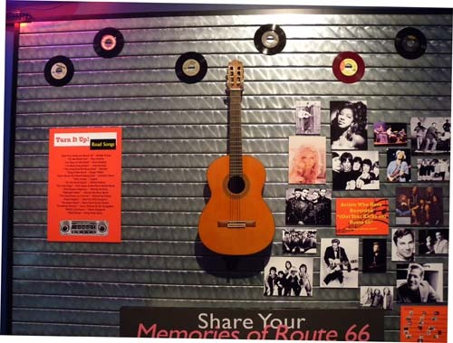  
66번 도로에 관한 노래들을 담은 음반들

\*\*\*

우리는 클린턴에 와서야 비로소 미국인들의 꿈과 현실을 이해하게 되었어요. 뚜렷한 철학과 방향을 갖고 있는 두뇌들이 역사를 견인하고, 그 외 대부분의 미국인들은 합리적 근거를 바탕으로 이들을 뒤따르는 모습을 발견하게 되었다는 것이지요. 채 1세기도 되지 않는 기간 동안 66번 도로는 탄생과 쇠락, 부활의 과정을 거쳤지만, 그거야말로 2세기 남짓한 미국 역사의 축도(縮圖)일 수 있다는 것이 바로 제 판단이지요. 책임 있는 미국인으로부터 뚜렷한 해명을 들은 건 아니지만, 66번 도로를 사랑하는 미국인들의 심리 저변에 이런 철학이 잠재되어 있는 것은 부정할 수 없다고 봐요. 그것을 잘 보여주는 곳이 바로 클린턴 시티의 ‘66번 도로 박물관[Rt. 66 Museum]’이었어요. **나머지 이야기는 다음번으로 넘기지요. 그 때까지 편히 지내시기 바랍니다.**

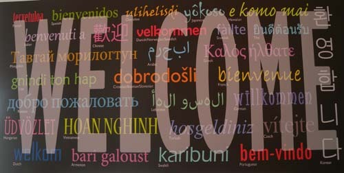  
66번 도로 박물관 로비에 각국어로 쓰여진 인사말 간판

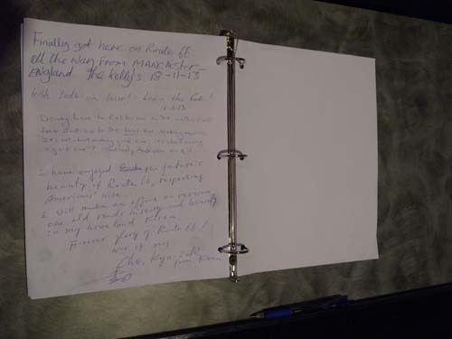  
박물관을 살펴보고 나서 방명록에 쓴 백규의 소감

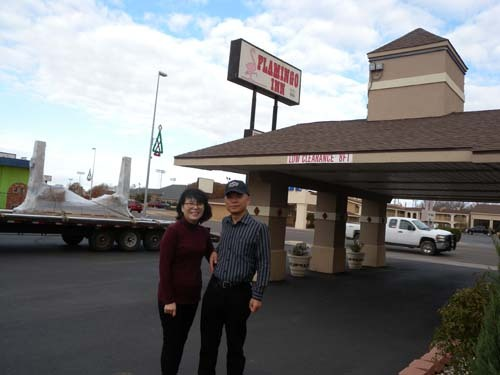  
엘크시를 떠나기 앞서 

¹ I-40은 미국에서 I-90, I-80에 이어 세 번 째로 긴 ‘동-서 주간(州間) 고속도로’다. 그 서쪽 끝은 캘리포니아 주 바스토우(Barstow)의 I-15이고, 동쪽 끝은 117번 도로와 북 캐롤라이나 주 윌밍턴의 북 캐롤라이나 하이웨이 132번과 합쳐진다. 오클라호마 시로부터 바스토우까지 I-40 서쪽의 많은 부분은 역사적인 미국 66번 도로와 병행하거나 겹쳐진다. I-40은 10개의 주요 ‘북-남 주간 고속도로들’ 가운데 여덟 개(I-5와 I-45를 제외한 모든 것)와 교차하고, I-24, I-30, I-44, I-81 등과도 교차하는 만큼, 미국에서 가장 쓰임새가 많은 도로라고 할 수 있다.

공유하기

게시글 관리

**백규서옥\_Blog ver.**