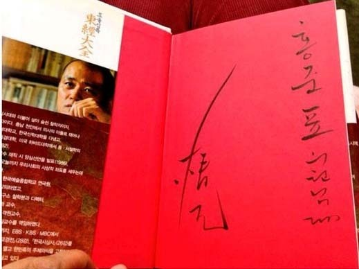

도올 선생과 홍준표 지사를 보며

-신문기사를 읽고-

xml:namespace prefix = "o" /  
          도올 선생이 홍준표 지사에게 증정했다는 책[사진은 중앙일보 2013. 12. 7.]

10 몇 년 전의 일이다.

평소의 습관대로 인터넷 경매 사이트에 들어갔다가 깜짝 놀라고 말았다.

가까이에 모시고 있던 선배 교수 한 분이 평론가 모씨에게 증정한 책이 경매 물건으로 나온 것이었다. “○○○ 교수님께, △△△ 삼가 드림”이란 헌사가 대문짝만한 사진으로 만천하에 공개되어 있었다. 저자가 유명인사에게 증정한 책일 경우 상대적으로 높은 가격에 거래된다는 것이 경매업계의 상식이다. 그 책을 내놓은 사람은 그런 관습을 이용한 것일 테지만, 당시의 나로서는 충격이었다. 실망으로 일그러지실 선배 교수의 표정이 떠올라 몹시 불안했다. 그래서 잽싸게 비교적 높은 가격으로 내가 찜했고, 결국 그 책은 지금도 내 서재 속에서 편안히 잠들어 있다. 인터넷 경매에 참여하는 경우 언제나 혹시 그런 헌사가 붙은 책이 없는가를 먼저 보게 된 것도 그 일을 경험한 뒤부터다.

어제 인터넷을 열었다가 우연히 ‘중앙일보’에 접속하게 되었는데, 흥미로운 기사 하나가 떠 있었다. 읽어본즉 ‘도올 선생이 홍준표 지사에게 증정한 책이 고서방에 나왔고, 누군가 그것을 구입했다’는 내용이었다. 그런 책을 구입했으면 조용히 가지고 있을 것이지, 만천하에 공개한 그가 일단은 서운했다. 그러나 어쩔 것인가. 헌사까지 사진으로 대문짝만하게 공개되었으니, 분명 도올 선생은 발분(發憤)했을 것이고, 홍 지사는 적지 않게 당황했을 것이다. 기사 말미에 홍 지사는 ‘국회의원 등 공직들을 그만 둘 때 사무실을 정리하던 사람들이 그렇게 했다’는 식으로 해명을 했지만, 궁색하기 이를 데 없는 일이다. 인터넷이 하도 발달하여 카메라에 찍히기만 하면 순식간에 지구를 몇 바퀴나 도는 세상이다. 지금 내가 미국 오클라호마의 오지에 틀어박혀 있지만, 마음만 먹으면 조국에 있는 친구들의 숨소리까지 들을 수 있는 세상이다. 그렇게 밝혀진 증거물 앞에서 무슨 ‘둔사(遁辭)’가 필요할까.

그간 고서에 관심을 갖고 종종 온라인, 오프라인 경매에 참여해왔다. 심심치 않게 확인하는 사실이 하나 있다. 생전에 책들을 열심히 사 모아도 세상을 뜬 뒤 그 책들의 가치를 알 리 없는 자식들이 그것들을 쓰레기 취급하여 고물상에 넘기는 일이 비일비재하다는 것이다. 실제로 나는 오프라인 경매에서 이름만 대면 알 수 있는 어떤 학자의 책을 여러 권 입수한 적이 있다. 어째서 이런 책들이 경매시장에 나올 수 있었느냐고 물었더니, ‘책 주인 죽은 뒤 두 달 만에 그의 소장서적들 모두가 시중에 깔렸다’는 대답이었다. 무식한 자식 놈들의 소행일 것이다.

그간 저서들을 몇 권 내놓은 입장으로 고서 경매에 참여하면서 혹시 내 책을 경매장에서 만날까 불안한 마음을 금할 수 없는 것이 사실이다. 제발 그러지 않길 바라지만, 최근 들면서 내 책도 경매 사이트에 뜨는 경우를 심심치 않게 발견한다. 출판사에서 재고도서를 고서점에 돌렸을 수도 있겠으나, 독자들이나 학생들이 내놓은 것들이 대부분이리라. 그 책들이 그저 내가 누구에겐가 ‘정성스럽게 헌사를 써서’ 증정한 것들만 아니길 기원할 뿐, 이제 그런 것들을 거둬들일 방법도 의지도 없는 것이 현실이다.

\*\*\*

얼마 전의 일이다. 가까이 지내는 다른 학과의 모 교수가 내게 책 한 권을 보내왔다. 봉투를 열어 꺼내 본 즉 그 몇 년 전 그에게 증정한 내 책이었다. 서운하기도 하고 놀랍기도 하여 그에게 전화를 걸었다. 그 교수의 대답이 걸작이었다. ‘연구실을 정리하려는데 몇 년 전에 받은 당신의 책이 나왔다. 보관할 여력도 없고 차마 쓰레기통에 버릴 수는 없어서 다시 되돌려 드린다.’는 요지의 말이었다. 일단은 야속했지만, 곰곰 생각하니 고맙고 솔직한 말이었다. 만약 자신의 전공과 무관하다하여 쓰레기통에 버렸다면, 그것이 어느 경로로 중고서점에 들어갔다면, 그러다가 어느 기회에 경매장에 나왔다가 내 눈에 띄게 되었다면... 아마도 나는 그와 대판 싸웠거나 심하면 원수가 될 수도 있었겠지? 그런데, 그는 내 ‘분신’을 그렇게 처리하지 않고 내게 돌림으로써, 일어날 수도 있었던 참화(?)를 미연에 막는 지혜를 발휘했던 것이다. 일시적인 서운함으로 더 큰 비극을 막은 셈이니 얼마나 다행한 일인가.

사실, 이사하다 보면 가장 큰 문제가 책이다. 이삿짐센터에서도 책 짐을 반기지 않는다. 부피에 비해 무게가 너무 나가기 때문이다. 우리의 주거문화가 아파트로 획일화 되면서 책을 보관할 공간이 없다. 그래서 이사철만 되면 아파트 쓰레기장이 버려진 책들로 넘쳐나는 것이다. 그래서 나는 요즘 책을 내도 전공자 이외에는 무턱대고 증정하지 않는다. 책을 주고 싶은 사람이 있을 경우 먼저 그에게 묻는다. 내가 이러이러한 책을 냈는데, 한 권 증정해도 되겠냐고. 대부분은 기꺼이 받겠다고 대답하지만, 과연 마음속도 그러한지는 알 수가 없다. 그래도 무턱대고 증정했다가 뒷날 고서 경매장에서 만나는 것보다는 나을 것이다.

\*\*\*

도올 선생이 홍준표 지사에게 책을 건넨 것에는 여러 가지 의미가 있을 것이다. 도올 선생이 보기에 홍 지사가 정치인으로서 괜찮은 인물이었을 것이다. 그래서 동학사상의 결정체인 ‘동경대전’을 해석한 자신의 책을 건넨 것 아닐까. 백성들 편에서 정치를 해달라는 기원이 담겨 있었을 것이다. 그런데 실수이었든 자발적인 행동이었든 홍 지사는 그 책을 버렸다. 그가 아마 한 줄이라도 읽어봤다면 그 책을 버릴 수는 없었을 것이다. 지금 여당이든 야당이든 대한민국을 이끈다고 자부하는 인물들 가운데 책을 가까이 한다거나 책의 의미를 제대로 아는 사람은 거의 없는 것으로 안다. 선거철에 매문가들을 동원, 자신의 일생을 미끈하게 윤색하여 선거용 책자를 내는 인사들은 여의도에 깔려 있지만, 제대로 책을 접하거나 쓰는 인사들은 아예 없는 것으로 안다. 사실 그런 인사들에게 힘 들여 쓴 저서를 증정하는 행위 자체가 의미 없는 일일 수밖에 없을 것이다. 그동안 나는 홍 지사를 정치권에서 그 중 나은 인물들 가운데 하나로 생각해 왔고, 이 일이 있음에도 불구하고 그런 믿음을 쉽게 버리지는 않을 생각이다. 이번 일은 아마도 그의 말대로 측근들의 실수였을 것이다.

그러니, 도올 선생께서는 너무 서운해 하지 마시고, 가가대소(呵呵大笑)하시라. 그리고 그 ‘가가대소’에 난해한 주석을 달지 마시라. 홍 지사께서도 더 이상 둔사를 내 놓지 마시고, 화끈한 전화 한 통화로 도올 선생의 마음을 풀어 주시라. “우리 자갈치에서 만나 산성막걸리로 회포 한 번 풉시데이!”하고 말이다.

미국 스틸워터(Stillwater)에서

백규

공유하기

게시글 관리

**백규서옥\_Blog ver.**