우리도 스토리가 있는 길을 한 번 만들어 봅시다!

-제4화: 엘 르노 시티(El Reno)와 ‘커네이디언 카운티 뮤지엄[Canadian County Museum ]’-

손 형,

엘 르노 시티와 만나게 된 것은 우연이었지요. 유콘 시티의 베테란스 뮤지엄에 들렀다가 돌아가려는데, 큐레이터 리차드 씨가 근처의 엘 르노 시티를 보고 가는 게 좋을 거라고 충고합디다. 그래서 그곳에 들렀는데, 그렇게 하기를 잘 했다는 생각이 들었어요. 상당히 퇴락된 느낌이 들었지만, 꽤 유서 깊은 면모를 간직한 도시였어요. 이 도시 또한 66번 도로와 큰 관련을 맺고 있지요. 그 뿐 아니라 열차의 터미널과 수리공장이 있던 곳으로, 말하자면 이 지역의 교통 요지라고 할 수 있지요. 우리가 방문한 박물관은 그 역사(驛舍)와 부지(敷地)를 통째로 개조한 것이었어요.

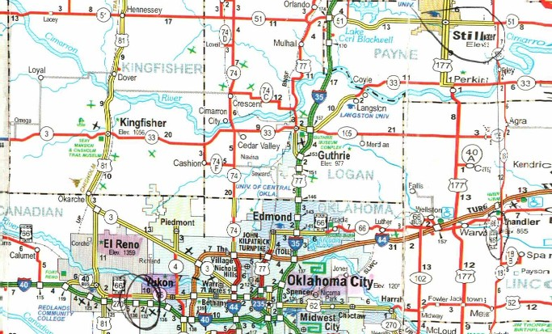  
엘 르노, 유콘, 오클라호마시티, 에드몬드, 거쓰리, 스틸워터 등이 표시된 지도

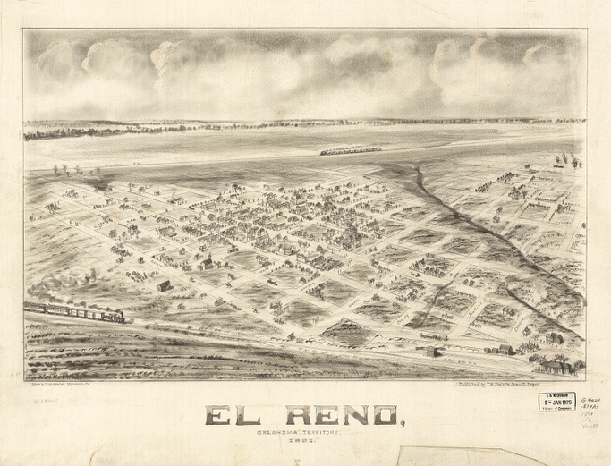  
1891년 엘 르노 시가지의 모습

엘 르노 시티는 캐나디언 카운티 청사의 소재지로서 현재 대략 1,8000에 가까운 인구를 보유한 도시이죠. 1889년 랜드러시(land rush)² 직후 인근의 Fort Reno를 본떠 명명된 이 도시는 오클라호마 시 중심가로부터 겨우 40km 정도 떨어져 있을 만큼, 주의 중심부라 할 수 있지요. 특히 오클라호마 시티 ‘표준 도시 통계구역[Standard Metropolitan Statistical Area]’¹의 한 부분이라는 점은 이 도시가 이 지역에서 아주 중요한 위치를 점하고 있음을 말해 주는군요. 원래 현재 위치로부터 북쪽으로 8km 정도 떨어진 ‘북 캐나다 강[North Canadian river]’의 제방에 있던 이 도시는 Reno City라는 이름을 갖게 되면서 네바다(Nevada)주의 Reno와 혼동을 일으켜 우편물의 배달 오류 사태가 자주 일어나곤 했다네요. 그래서 시가지가 물에 잠긴 두 번 째의 홍수 이후에 현 위치로 옮겼고, 이름도 El Reno로 바꾸었다는군요.

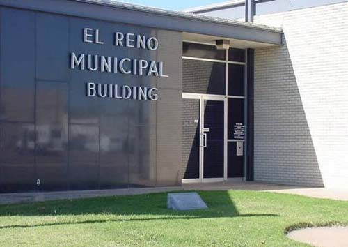  
엘 르노 시청

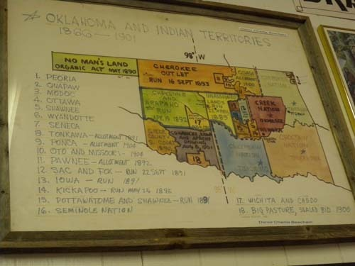  
오클라호마 주와 인디언 구역들

이 도시는 오클라호마 주에서 유일하게 다운타운 지역에서 운행되는 전차를 갖고 있다는 점, ‘시카고, 락 아일랜드 및 태평양 철도[Chicago, Rock Island and Pacific Railroad]’ 즉 ‘락 아일랜드(Rock Island)’의 터미널과 수리 시설이 있다는 점 등으로 아직도 오클라호마 주 안에서 중시되고 있었어요. 그런데 불행히도 1975년 이 회사가 파산하는 바람에 많은 사람들이 실직을 했고, 철도부지 역시 공터로 남게 되었다지요? 철도회사의 창고와 건물들은 캐나디언 카운티 역사학회가 사들여 박물관 단지의 중요한 부분으로 사용하게 된 것이고, 우리는 바로 그 박물관을 방문하게 된 겁니다. 기차 역사(驛舍)를 사들여 빌딩을 건축함으로써 엄청난 시세차익을 남기려는 우리와 달리 그들은 박물관으로 활용하는 모습을 보노라니 그들의 여유가 무척 부러워지더군요.

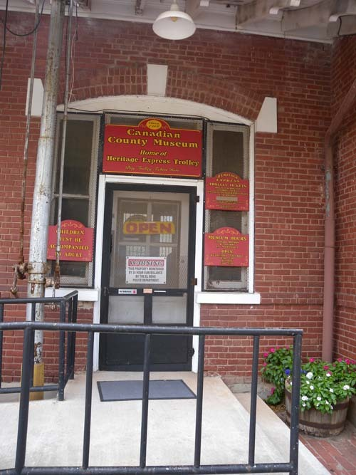  
커네이디언 카운티 뮤지엄

  
락 아일랜드 역사[현재의 카운티 뮤지엄]

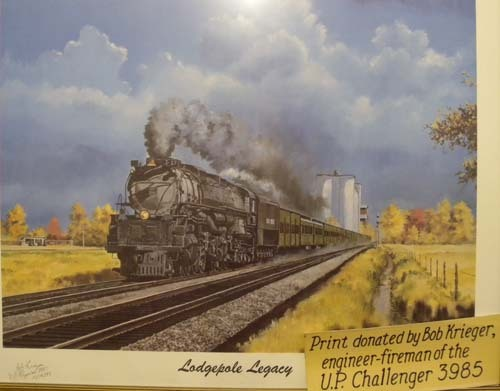  
Bob Kreiger가 기증한, 당시의 달리는 열차 그림.

박물관의 중심 컬렉션은 다른 도시의 박물관들처럼 이 지역의 ‘생활사 자료들’이 주축이었어요. 그러나 다른 지역과 다른 점은 ‘락 아일랜드’ 역 자체에 관한 풍부한 컬렉션이었어요. 기차와 철로에 관련되는 각종 물건들이 세밀하게 수집되어 있었고, 당시 운행되던 열차의 미니어쳐를 전시실 안에서 실제로 움직이게 함으로써 박물관에 생동감을 주는 효과를 발휘하고 있었어요. 박물관의 중심 건물 밖에는 당시 있던 학교, 교회 등 공동체의 건물들이 당시의 모습대로 재현되어 있었으며, 창고에는 열차 관련 부품들과 각종 운송수단 및 농기계 등도 전시되어 있었어요. 그 뿐 아니라 역의 사무실은 까페로 꾸며져, 사람들이 당시의 분위기를 느끼며 즐길 수 있도록 개조되어 있더군요. 전반적으로 이들이 쓸모없게 된 물건들이나 공간을 활용하기 위해 머리를 많이 썼다는 느낌을 줍디다. 발전의 주기가 짧고 변화 자체가 드라마틱한 우리의 경우도 생활사 자료들을 폐기처분하는 것만이 능사가 아니라는 점을 이 도시에서 특히 강하게 깨달았지요. 당장 우리의 안목이 좀 더 문화적인 폭과 깊이를 갖추어야 한다는 것. 미국의 중소 도시들을 몇 군데만 돌아다니면 얻을 수 있는 교훈이었어요.

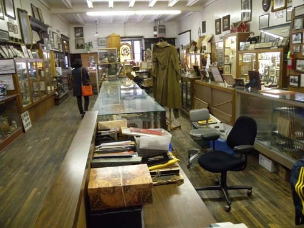  
커네이디언 카운티 박물관의 사무실 겸 전시장

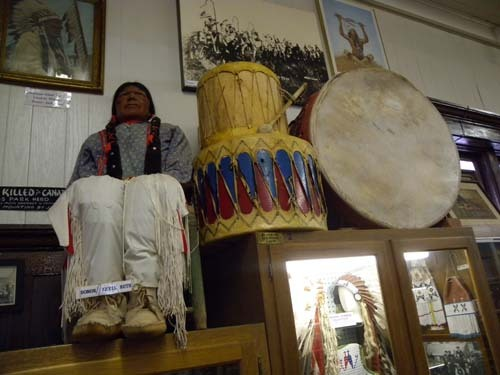  
박물관 컬렉션(인디언과 북)

  
박물관 컬렉션(엘 르노의 학교 관련 물품들)

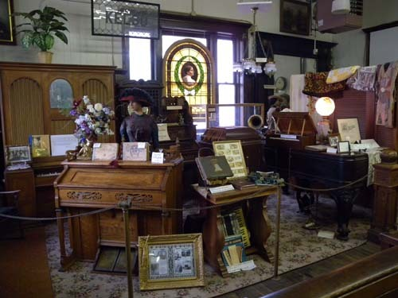  
박물관 컬렉션(거실의 물품들)

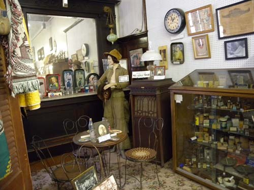  
박물관 컬렉션(여성용 화장품)

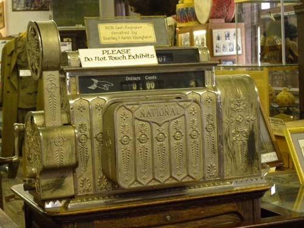  
박물관 컬렉션(금전등록기)

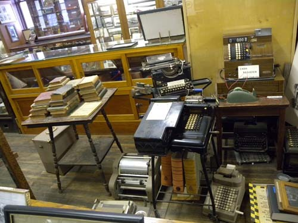  
박물관 컬렉션(사무용 비품들)

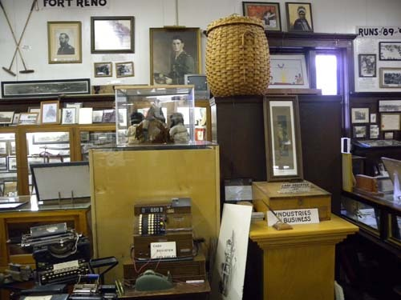  
박물관 컬렉션(사무용 비품들과 사진들)

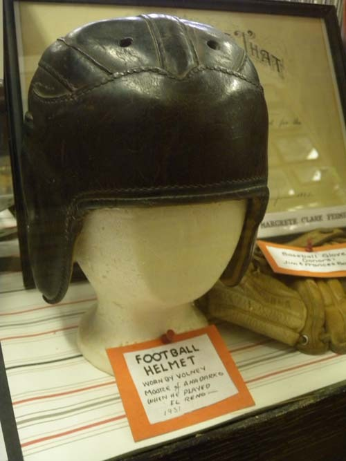  
1951년 당시 엘 르노 지역 선수들이 사용하던 풋볼의 헬멧

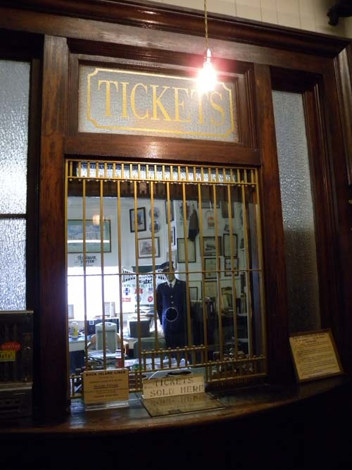  
당시 역 구내의 매표소

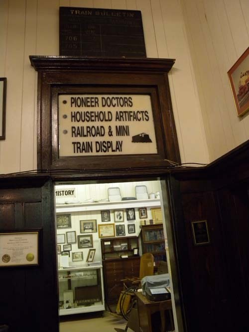  
전시품 소개문(개척시대의 의사들/가구 공예/철로와 모형열차 전시)

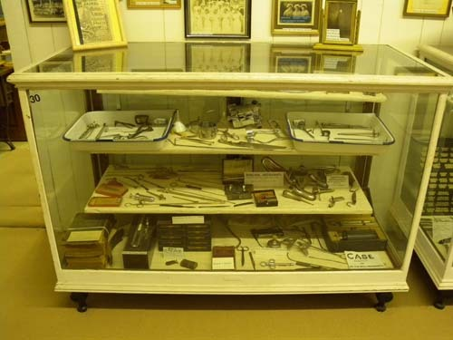  
Dr. Ernest Ewing 진료실의 진찰 및 치료용 도구들

이 도시 역시 엘크나 클린턴, 유콘 등처럼 66번 도로변의 도시, 즉 ‘메인 스트릿(Main Street)’ 공동체이지요. 아시겠지만, 오클라호마 주는 오래전부터 ‘메인 스트릿 프로그램(Main Street Program)’을 실시해 왔고, 엘 르노 시티는 자신들의 프로그램으로 미국 메인스트릿 대상[the Great American Main Street Award]’을 2006년에 받기도 했다지요. 말하자면 하이웨이의 신설 등 사회 간접자본의 확충으로 퇴락하는 다운타운을 되살리는 작업인 셈인데, 이 도시 역시 철도역을 중심으로 번성하던 숙박업소나 레스토랑, 백화점 등 각종 건물들이 현재는 각종 ‘사적(史蹟)’으로 지정되어 있었고 일부는 그 안에서 영업을 하고 있기도 했어요.

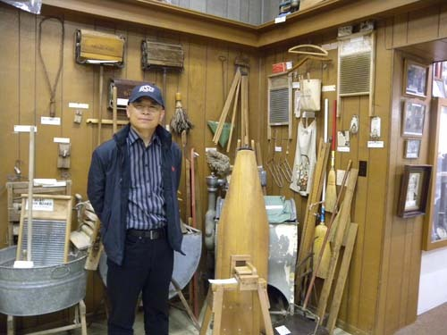  
당시의 농기구 전시실에서

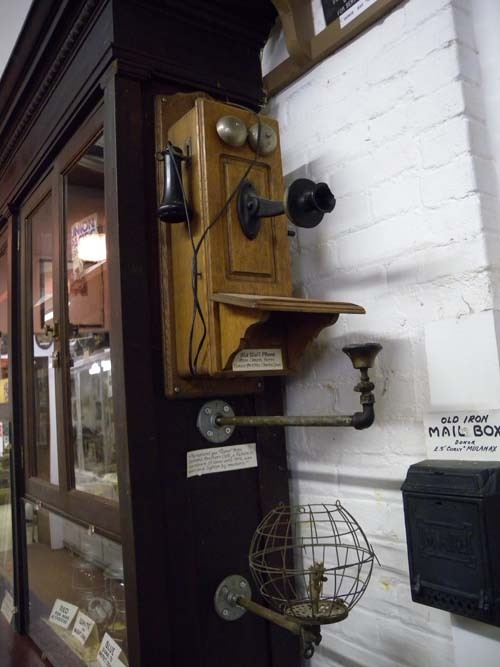  
당시의 전화기

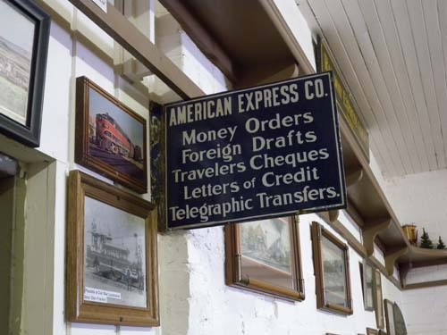  
어메리칸 익스프레스 캄퍼니의 취급 항목들(우편환/외국환 어음/여행자 수표/신용장/전신환)

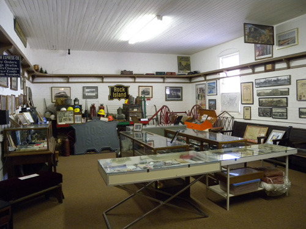  
락 아일랜드 역의 물품들과 당시 열차의 미니어쳐

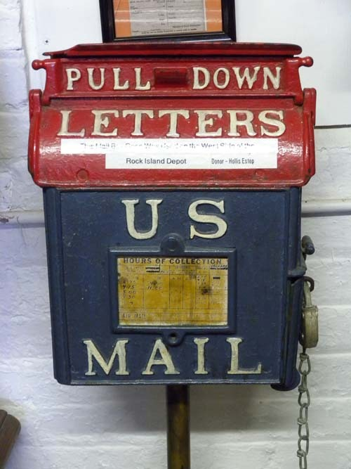  
당시 우체통

  
 소포의 무게를 재던 당시의 저울

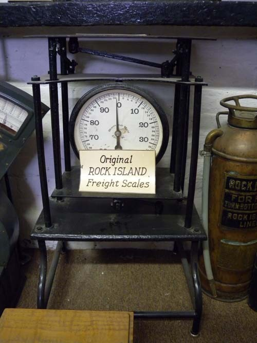  
당시 락 아일랜드 역의 수하물 저울들

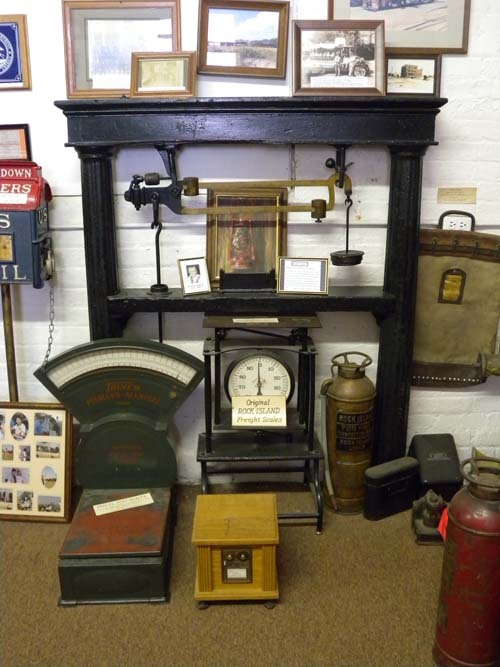  
당시의 저울들과 다른 물건들

  
락 아일랜드 역 관련 물품들

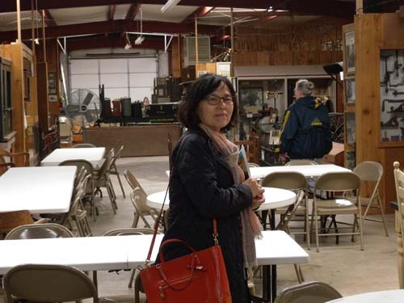  
까페로 개조한 역사

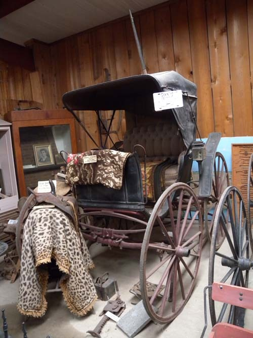  
당시에 타고 다니던 수레

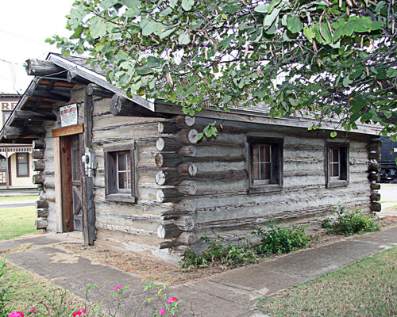  
당시 이 지역의 통나무집

다운타운은 여느 도시와 마찬가지로 널찍하게 정비가 잘 되어 있었고, 특히 100년 이상 된 건물들도 이 곳 저 곳에 중후한 모습으로 서 있었어요. 다운타운을 돌아보면서 무엇보다 우리의 눈길을 끈 것은 도심 한 복판에 전몰용사 기념공원을 만들어 놓았다는 점이었어요. 그 가운데는 이 지역 출신으로서 6・25 때 전사한 젊은이들의 사진과 이름을 새긴 석비도 있었는데, 순간 우리의 가슴을 뭉클하게 했어요. 정작 우리는 우리의 혈육들이 그 전쟁에서 몇 명이나 죽었으며, 전사자 가운데 우리 고장 사람들이 있는지조차 알지 못하는 게 사실 아니오? 그런데 미국 사람들은 전사자들을 도시 한 복판에 모시고 항상 추모하며 고마움을 느낀다는 사실이 우리를 감동시킵디다. 우리가 이런 점은 반드시 배워야 한다고 봐요. 세계 곳곳의 전쟁터에서 미국의 많은 젊은이들이 희생되어 왔지만, 국가는 그들의 희생을 한시도 잊지 않고 있다는 메시지를 국민들에게 매 순간 각인시키기 때문에 지금과 같은 부강한 나라로 발전할 수 있지 않았겠어요? 개인주의로 철저히 무장한 미국인들이 일단 ‘애국정신’의 기치 아래 뭉치면 천하무적의 집단이 된다는 점. 무섭고도 부러운 면이지요. 이 평범하면서도 쉽지 않은 점을 미국 중서부의 작은 도시 엘 르노에서 발견하게 되었어요. 우리는 과연 언제쯤이나 그렇게 될 수 있을까요?

나머지는 다음번에 말씀드리기로 하지요. 안녕히 계시오.

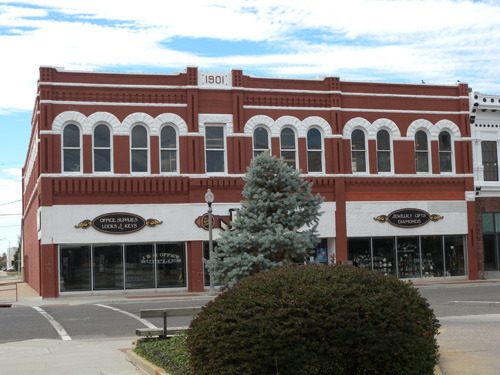  
1901년에 지어진 상가-엘 르노의 다운타운에서

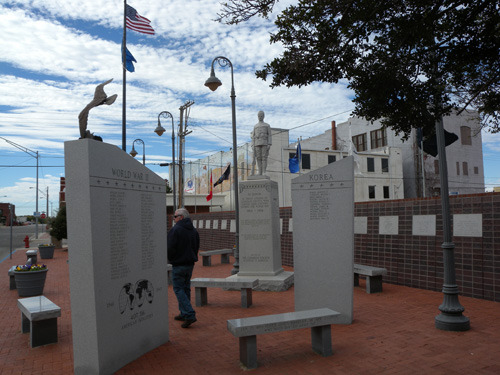  
엘 르노 다운타운에서 만난 전몰용사 추모 공원[한국전 관련 비석이 보임]

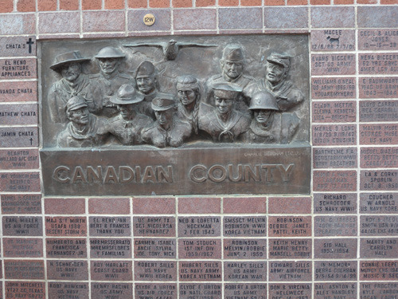  
커네이디언 카운티 출신의 전몰용사들

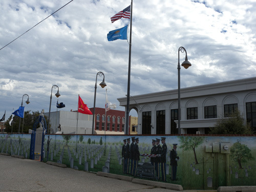  
전몰용사 추모공원의 담벽

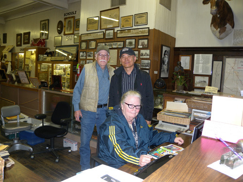  
박물관 사무실에서 관리인들과 함께

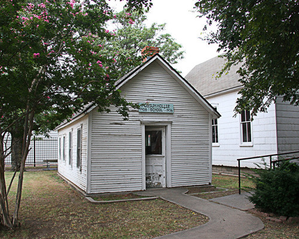  
당시의 초등학교

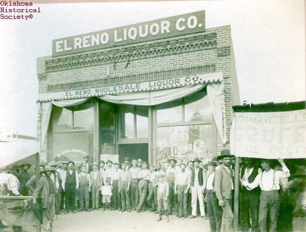  
당시의 엘 르노 주류판매점

  
당시의 호텔

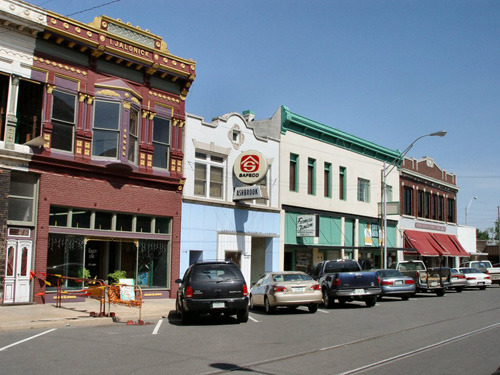  
당시부터 있던 상가 건물들

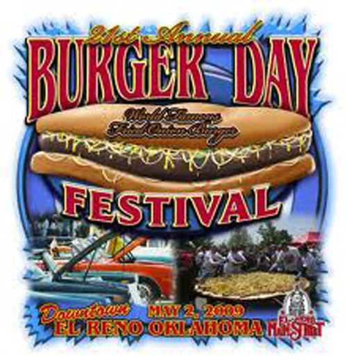  
엘 르노 연례행사의 하나인 버거데이 포스터

¹ ‘표준 도시 통계구역’이란 미국에서 대도시 문제를 분석하는 데 편의를 도모하기 위해 만든 개념인데, ‘인구, 도시의 성격, 통합의 정도’ 등을 기준으로 그런 지역은 설정된다.

² 1889년 오클라호마 인디언 구역 안에 백인 정착이 시작되면서 세계 역사에 보기 드문 도시 건설의 기괴하고 혼란스런 일들이 생겨나기 시작했다. 철로가 인디언 구역을 가로지르고, 아칸사와 텍사스를 잇는 통로들을 따라 여기저기에 증기 열차를 운행하기 위한 급수탑과 여타 설비들이 설치되었다. 인디언 구역이 개방되기 몇 달 전부터 도시구역의 회사들을 대표하는 개인들과 단체들은 이 위치들을 선점하고 이에 따르는 구체적인 계획들을 세우기 시작했으나, 당시 의회는 시민 정부의 어떤 형태도 제시하지 못했다. 당시 5만 여명의 정착민들이 200만 에이커의 땅을 둘러싸고 벌인 투쟁은 ‘랜드 러쉬’ 즉 ‘땅 차지하기’ 싸움으로 기록되었며, 인디언들에게는 비극적인 역사의 단초가 되었다.

공유하기

게시글 관리

**백규서옥\_Blog ver.**