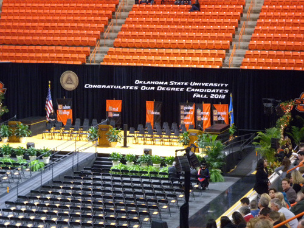
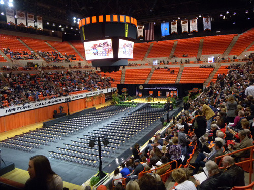
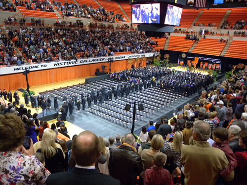
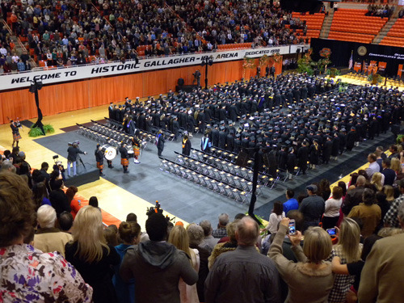
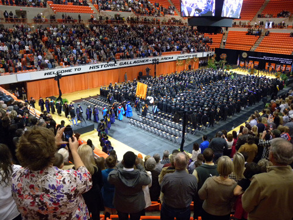
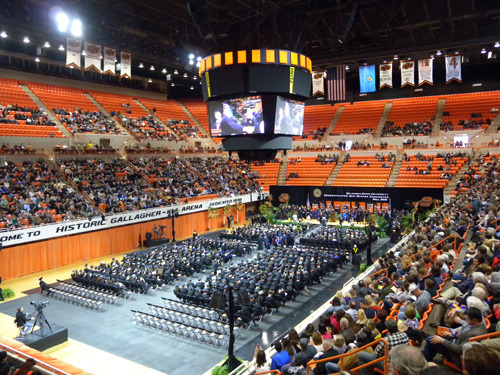
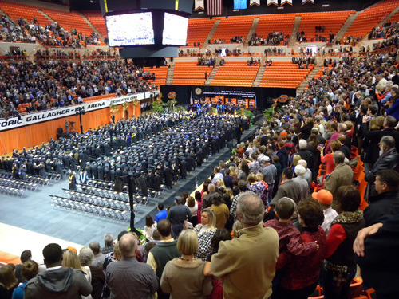
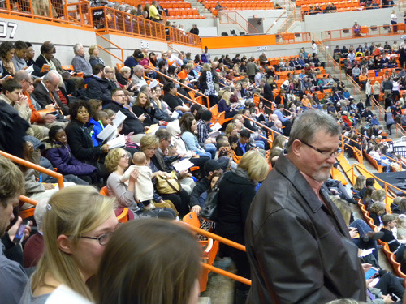
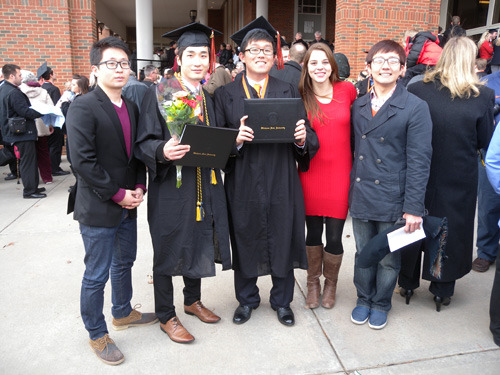
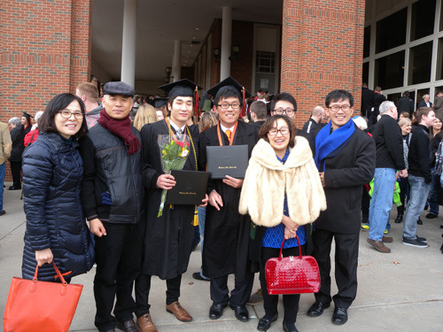

왜 우리는 이렇게 하지 못하는가?

어렵던 시절, 궁색한 현실에 비해 가당찮게 큰 욕구를 가졌었기 때문일까. 졸업식에 관한 내 추억은 온통 잿빛 일색이다. 1978년도 내 대학 졸업식은 참으로 우중충했고, 1981년도 석사학위 수여식과 1986년도 박사학위 수여식은 번잡하고 무성의하여 도무지 아무 감흥도 느낄 수 없었던, 그야말로 ‘서운한’ 행사들이었다.  그 후 대학인들의 타성이 고착되면서 졸업식에 관한한 ‘행사를 위한 행사’를 반복해왔고, 오늘날에 이르러 대학 졸업식은 ‘지리멸렬’ 그 자체로 전락해 버렸다.

독자 여러분 가운데 최근의 대학 졸업식에 가본 분들이 적지 않을 것이다. 졸업생들은 식이 시작되어도 식장에 들어가지 않는다. 흡사 사진 찍는 일이 졸업식의 전부인양 카메라를 껴안은 채 식장 바깥에서만 어슬렁거린다. 모처럼 자식의 학교를 찾은 학부모들도 식장 안에 들어갈 생각을 하지 않는다. 들어가 봐야 재미 없고 지루하기만 할 것이며, 무엇보다 당사자인 자식이 들어가지 않는 곳에 기를 쓰고 들어가 앉아 있을 부모는 없을 터이기 때문이다. 바깥은 인파로 북적대는데, 그 넓은 식장 안의 좌석들에는 석・박사학위 받는 몇 사람과 수상자 몇 명만 듬성듬성 앉아있을 뿐이다.

왜 그럴까. 간단히 말하면, 졸업식을 주관하는 대학 측의 철학이 결여되어 있기 때문이다. 졸업식은 학교당국과 교수들이 그 행사의 핵심인 졸업생을 위해 가족을 초청하여 갖는 학교 최대의 행사인데, 졸업생들이 철저히 소외 되고 있는 것이 한국 대학 졸업식의 현주소다. 

근래 어느 대학의 졸업식에 참석해 보았다. 그 넓은 단상에는 내빈들과 동문회 인사 등 외부 초청 인사들이 그득하고, 그 한 가운데 지역구 국회의원이 총장과 나란히 앉아 있었다. 총장의 연설이라는 게 왜 그리 장황하고 요령부득인지 참으로 한심했다. 하기야 우리나라 주요 일간신문들은 스피치 라이터가 써주는 큰 대학 총장들의 축사 전문을 경쟁적으로 싣던 때도 있었으니, 코미디도 그런 코미디가 있을 수 없었다. 각 대학 스피치 라이터들의 글 솜씨나 한 번 맛보라는 이야기였을까. 내빈축사는 왜 그리 많으며, 내용 또한 중언부언(重言復言) 지루하단 말인가. 그 많은 졸업장과 상장들은 왜 하필 졸업식장에서 일일이 수여해야 하는가. ‘이하 동문(以下 同文)’을 일일이 외쳐대면서도 서너 시간을 끌어가니, 그나마 상장이라도 받지 못하는 대부분의 졸업생들이 앉아 있을 이유가 있겠는가. 그런 고문을 당하고 나면 자신의 졸업이 어찌 영광스러울 것이며, 어찌 모교에 대한 사랑인들 생길 것인가.

\*\*\*

그간 가까이 지내던 브라이언 군이 이 대학에서 2년을 단축하여 조기 졸업한다는 소식을 듣고, 오늘 그 졸업식에 참석하기로 했다. 우리나라의 전기에 속하는 본 졸업식은 이미 5월에 있었고, 이번은 후기에 속하는 이른바 '코스모스 졸업'이었다. 규모가 작아 대충대충 진행되리라는 우려가 있었을 뿐 아니라, 대학 졸업식에 대한 기대를 접은 지도 오래 된 터여서 별 감흥은 없었지만, 정리로 보아 가지 않을 수 없었다.

졸업생들의 가족과 친지들은 물 밀 듯이 밀려들었으나, 모두 정시에 입장을 끝내고 경사 진 3면의 관객석에 안전하게 좌정했다. 식장인 실내 농구장의 바닥에는 졸업생들이 앉을 의자들이 질서정연하게 놓여 있고, 정면의 단상에도 그리 많지 않은 좌석들이 마련되어 있었다. 예정된 시각에 총장이 단상으로 나오더니 놀랍게도 그 스스로 식을 주재하기 시작했다. 총장의 말에 따라 이 대학 파이프 밴드가 행진곡을 연주한 뒤, 브라스 밴드의 연주에 맞추어 졸업생들이 두 줄로 들어와 마련된 의자에 착석하기 시작했다. 졸업생들의 착석이 끝나자 스코틀랜드 전통복장을 한 파이프 밴드의 연주와 선도로 단상에 앉을 인물들이 질서정연하게 입장했다. 그 다음 장내에 있는 모든 사람들이 일어나 미국 국가[The Star Spangled Banner]를 ‘우렁찬 목소리’로 제창했다. 이어 오클라호마 주의 노래인 'Oklahoma'를 부른 다음 본격적인 졸업식이 진행되었다.

  
OSU 농구 경기장에 꾸민 졸업식장

  
졸업식장 전경(좌, 우, 뒷면 등 3면에 가족과 친지들이 앉아 있다)

  
가족과 친지들이 일어선 가운데 졸업생들이 줄지어 입장하고 있다.

총장은 우선 특별한 몇몇 손님들을 소개했고, 그 가운데 세 사람[주 교육위원회 의장, 교수협의회 의장, 오클라호마 주 하원의장]이 각각 1~2분 정도의 아주 간단하면서도 의미심장한 졸업축하 인사를 했으며, 이어 학위증 수여가 있었다. 졸업생들은 호명되는 대로 단상에 올라 총장, 학장, 학과장 등과 악수하고 사진 찍기 위한 포즈를 취한 다음 자기 자리로 내려가는데, 좌석 부근엔 해당 학과 교수들이 함께 모여 기다리다가 자리로 돌아오는 졸업생들에게 축하인사를 건넸다. 무엇보다 인상적인 것은 졸업생들이 호명되어 단상으로 올라갈 때마다 관객석의 가족이나 친지들은 괴성에 가까울 정도의 함성을 질러대는 장면들이었다. 졸업식의 즐거움을 그들은 그렇게 표현했고, 당사자들 또한 단상으로 나가면서 이들에게 손을 흔들어주는 여유를 보이기도 했다. 이렇게 짧은 시간에 졸업생 모두를 단상으로 불러 올려 격려함으로써 그들에게 자부심을 불어넣어 주려는 배려가 느껴지는 것이었다.

  
입장한 졸업생들과 객석의 가족 및 친지들이 일어서서   
단상에 앉을 인사들의 입장을 기다리고 있다.

  
단상에 앉을 인사들이 입장하고 있다.

  
졸업생들에게 학위증을 수여하고 있다. 졸업생 좌석의 교차로에서   
교수들이 축하인사를 건네기 위해 기다리고 있다.

졸업장 수여가 끝나자 졸업생들도 단상의 인사들도 관객석의 가족이나 친지들도 함께 ‘모교의 노래[OSU Alma Mater]’를 부르는데, 내 주변 사람들의 노랫소리가 얼마나 큰지 깜짝 놀랄 정도였다. '모교의 노래'가 끝나고 단상의 인사들이 줄 지어 퇴장한 뒤 졸업생들도 들어올 때의 역순으로 퇴장함으로써 졸업식은 끝이 났다.

\*\*\*

그 흔한 꽃다발도 없었다. 식장 밖에서 어슬렁거리는 졸업생도 있을 수 없었다. 그들은 시간이 되자 악대의 선도를 받아 질서정연하게 들어왔고, 정확하게 준비된 의자를 모두 채워 앉았다. 어쩌면 이렇게 개인주의의 천국인 미국에서 마치 훈련이라도 받은 것처럼 질서정연하게 행사를 진행할 수 있단 말인가. 식 초반에 그들은 자신들의 국가와 주가(州歌)를 함께 소리 높여 부르며 단합정신[team spirit]을 확인하는 듯 했다. 어느 순서 하나 필요 이상으로 늘어지는 게 없었다. 모두가 졸업생들로 하여금 자신에 대한 영예와 모교에 대한 자부심을 갖도록 치밀하게 조직된 극본을 무대 위에서 보여주는 것 같았다.

  
모든 참석자들이 기립하여 국가와 주가 등을 제창하고 있다.

  
가족 및 친지들의 모습

사실 대학 졸업식에 대한 실망감 때문에 별 기대를 하지 않았던 나였다. 그러나 식이 시작되면서 심상치 않은 분위기가 일순 나를 긴장시켰다. 식순이 하나하나 진행되면서 서서히 감동이 일기 시작했다. 장황하거나 지루하지 않아 초점을 살리면서도 모두를 배려하는 세리머니는 예술 자체였다. 스피치에 참여한 모든 인사들도 하나같이 사전에 ‘입을 맞춘 듯’ 짤막한 멘트 속에 ‘촌철살인(寸鐵殺人)’의 교훈을 담으려 노력한 것 같았다.  

이 대학과 아무런 관련 없는 나도 식이 끝나면서 내심으로 작지 않은 변화를 느꼈다. 그건 또 다른 버전의 감동이었다. 개인주의를 넘어선 단합정신. 여기서 미국의 무서운 힘이 나온다는 것을 처음으로 확인하게 되었다. 미국에도 대학의 서열이 엄존한다. 그러나 그들은 무턱 댄 ‘자기 비하’나 ‘자기 우월’에 빠지지 않는다. 그 서열이란 모든 요소들을 반영한 것이 아님을 알기 때문에, 자기 대학의 장점을 찾아 열심히 노력하는 데서 자부심을 느끼는 것이 이들의 최대 장점이다. 추운 날 담요를 싸들고 경기장에 나가 모교 응원에 참여하는 이 대학의 졸업생들. 그들이 바로 초강대국 미국을 유지해가는 사람들이다. 허구 한 날 좁쌀들끼리 비교하며 경쟁심만 부추기고, 모든 사람들을 ‘자기 비하’에 빠지게 하는 우리나라 대학들의 행태는 이쯤에서 청산해야 한다. 헛된 자존심을 버리고, 배울 건 배워야 한다.

  
브라이언(왼쪽에서 세번째)과 친구들

  
브라이언 등과 함께

공유하기

게시글 관리

**백규서옥\_Blog ver.**