길 이야기

길

그대는 우울한 시절 햇살과 같아

그 시절 지나고 나와 지금도 나의 곁에서

자그만 아이처럼 행복을 주었어

오~ 가야할 길은 아직도 멀기만 하고

아픈 시간들 속에서 어떻게든 가야만해

혼자서 걸어간다면 너무나 힘들 것 같아

가끔이라도 내 곁에서 얘기해 줄래

그 많은 시간 흐르도록 내 맘속에 살았던 것처럼

사랑도 사람도 나를 외면했다고 하지만

첫 새벽 공기처럼 희망을 주었어

오랫동안 소리 없이 내게 살아왔던

너를 사랑해

너를 사랑해

모처럼 접해 본 윤도현의 노래 <길>이다. 행복한 사람도 상처를 입은 사람도 살아있는 이상 걸어가야 하는 것이 길이다. 길을 말하다가 ‘너에 대한 사랑’으로 끝맺는 윤도현의 노래가 좀 낯선가. 작사자는 누군가 먼 길을 가다가 문득 내 곁에서 함께 걷고 있는 길동무로서의 ‘너’를 발견했을 것이다. 혹은 ‘너’를 통해 ‘함께 걸어가야 할’ 길을 예감했거나 ‘함께 해야 할’ 운명을 깨달은 건 아닐까. 그래서 윤도현의 ‘길’은 ‘너’와 함께 함으로써 ‘운명적 사랑’이 구현되는 공간으로 해석될 수 있으리라. 

그렇다면 길에 시작이 있고 끝이 있는가. 아니다. 시작만 있고 끝이 없는 것이 길이다. 그러나 엄밀히 말하면, 시작도 없다. 길에 시작이 있고 끝이 있다면, 그건 길이 아니다. 언젠가 시작되었겠지만, 그저 까마득한 옛날부터 이어져 오는 것이 길이고, 끝 간 데 없이 뻗어가는 것이 길이다. 잘 찾아간 것으로 여겼지만, 곰곰 생각하면 잘 찾아간 길이 아닌 경우가 전부다. 그래서 다시 출발점을 찾지만, 그 찾으려는 출발점도 마치 끝인 양 잘 찾아지지 않는 것이 길이다.

어떤 사람들은 길이 ‘길다’의 형용사와 관계가 깊은 명사라 한다. 옛 사람들은 ‘리’나 ‘마장’으로 그 길이를 가늠해왔고 현대인들은 km나 mile로 그 길이를 재고 있지만, 그건 그냥 인간의 짧은 인식이 만들어놓은 편리한 단위일 뿐이다. 끝인 것 같은 곳에서 다시 시작되는 것이 길인데, 그 길을 누가 어떻게 잴 수 있단 말인가. 길을 찾다 보면 시작과 끝이 사라져 버리는 것을 누구나 경험하지 않는가.

누군가 인생을 ‘나그네 길’이라 했다. 시작도 끝도 없이, 한시도 쉼 없이 걸어야 하는 길이 인생이기 때문이다. 휴게소에 들러 잠시 웃으며 쉬면서도 갈 길을 걱정해야 하고, 다 왔다고 안도의 한숨을 내쉬다가도 다시 돌아갈 길을 걱정하는 것이 인생이다. 그래서 갈 길과 돌아오는 길은 한 치도 끊어지지 않는 ‘연속’일 뿐이다. 사람들은 그걸 찾아 이곳저곳 돌아다닌다. 인생의 험한 길을 걸어가면서도, 그 사이에 부지런히 ‘올레길’을 찾고 ‘둘레길’을 찾으며 ‘골목길’을 헤맨다.

‘길 아니면 가지 말라’고 했지만, 사람이 가면 길이 되고 길을 내면 사람이 다닌다. 그래서 인간세상에 길 없는 곳이 있을 수 없다. 사람들은 ‘옳은 길’과 ‘그른 길’을 구분하지만, 옳고 그름의 기준이 절대적인 것은 아니다. 또 어떤 길이 옳았는지는 많은 시간이 흐른 다음에야 판단할 수 있다고 하지만, 그 많은 시간의 기준도 명확한 것은 아니다. 그래서 예로부터 사람들은 길을 찾아왔으나 제대로 찾은 사람은 많지 않고, ‘올바른 길’을 통해 삶이 완성된다고 믿고 있지만, 그 ‘올바른 길’이 어디에 있는지 아는 사람도 별로 없다. 길을 찾으러 길을 나서기가 두려워지는 것도 그 때문이다. 그래서 눈에 보이고, 발로 밟을 수 있는 물리적 공간으로서의 길이나 찾아다니며 맛볼 따름이다.

\*\*\*

미국에 체류하면서 휴일이나 휴가에는 반드시 길을 나선다. 남한 면적의 두 배가 넘는 오클라호마 주는 미국 역사의 양지와 음지를 모두 갖고 있다. 그 가운데 내가 크게 관심을 갖고 있는 부분은 음지에 속하는 아메리카 인디언의 역사와 문화다. '식민주의'가 백인들의 원죄라면, 그 원죄의 역사적 표본을 이곳에 만들어 놓은 그들의 진의는 무엇이었을까. 자신들의 새로운 삶터를 건설하기 위해 인디언들을 고향에서 쫓아낸 백인들. 자신들의 본거지에서 쫓겨나 ‘눈물의 장정[Trails of Tears]’이란 쓰라림을 맛보며 대부분 오클라호마의 한 구석에 강제로 정착당한 인디언들. 그들 두 부류의 인간들은 오늘날 무슨 생각으로 살아가고 있는 것일까.  

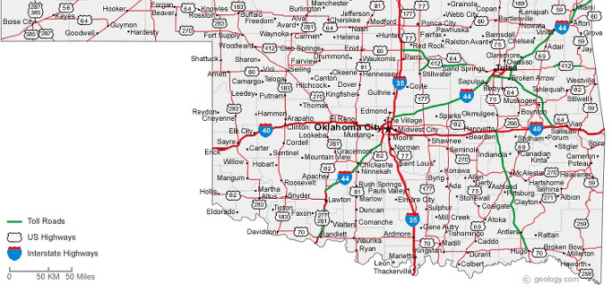  
오클라호마주 전역 교통도

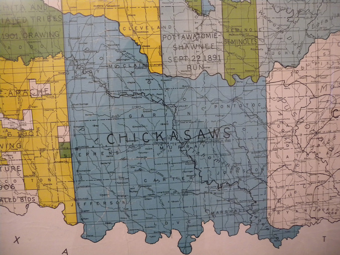  
이번에 여행을 하고 있는 치카샤 및 촉토 인디언 지역

  
아메리카 인디언들의 이른바 '눈물의 여정(Trail of Tears)'

그런데 그들을 만나러 가는 길이 쉽지 않다. 그 그늘을 확인하기 위해 토요일과 일요일은 물론 각종 휴가나 방학 등을 활용하지만, 길이 너무 멀어서 쉽지 않다. 그래도 쉬지 않고 다니는 편이다. 그 이유의 상당 부분은 길의 매력에 있다. 내가 지금 사는 곳과 가려는 곳이 엄청난 거리를 두고 떨어져 있지만, 그 연결고리로서의 길은 또 다른 가치와 의미를 지닌 공간이기 때문이다.

다른 어느 나라보다 미국의 길들은 넓고 곧다. 특히 가도 가도 산이 보이지 않는 오클라호마의 길은 약간의 과장을 보탠다면 솜씨 좋은 장인이 대지에 그은 미학적 직선처럼 보인다. 그저 자를 대고 종이 위에 쭉 긋는 선이 미학이나 철학을 갖기란 어렵다. 그러나 최소한 대지의 핏줄을 타고 심장을 직격(直擊)하는 선은 생명이나 미학, 혹은 철학과 직결된다. 그 생명성을 느끼게 하는 직선의 미학이 이곳 길들에는 내포되어 있다는 것이 내 생각이다. 한동안 내가 천착해온 ‘66번 도로’와는 다른 차원의 의미가 직선으로 쭉 뻗은 오클라호마 주의 길들에는 들어 있다는 것이다.

  
Route 66 표지판

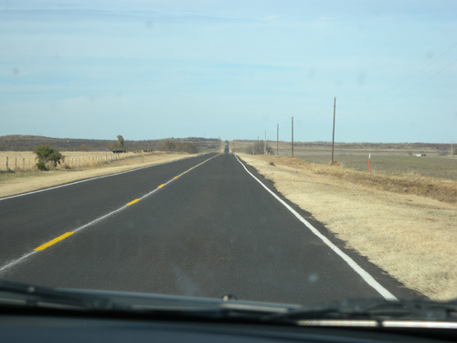  
클린턴에서 스틸워터 오는 도중

‘땅이 넓으니 그런 것 아닌가’라고 항변할 수 있겠는데, 사실은 그 이유가 가장 클 것이다. 다만 나는 이미 나 있는 길들의 해석적 의미, 혹은 내 나름의 생각이나 느낌을 강조하고 있을 따름이다. 이 길들에 생명을 불어넣는 가장 큰 요소는 인공과 자연의 ‘자연스러운 어울림’이다. 길을 따라 형성된 도시나 주택 등 인공의 구조물들은 철저히 자연의 질서와 호흡을 함께 하는데, 그 점이 그 ‘자연스러움’을 해치지 않는 요인이다. 땅 넓이에 비해 사람 숫자가 턱 없이 적으니, 굳이 자연의 질서를 거스를 필요가 없었던 것도 사실이다. 그래서 미국 아니라 어떤 나라라도 이런 도로들을 갖고 있다면, 나는 그들을 부러워했을 것이다.

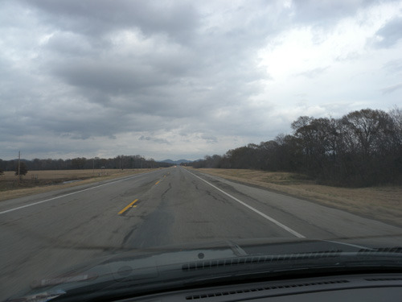  
엘크에서 클린턴 가는 도중

6개월 가까운 기간 유럽을 자동차로 여행하면서 길의 아름다움에 반한 적이 있다. 자동차를 몰아 스위스의 산하를 건너고 오르내릴 때의 짜릿한 흥분을 잊을 수 없다. 하늘로 솟구쳤다가 바다 밑으로 잠기는 듯한 충격을 스위스에서 운전하는 동안 느꼈기 때문이다. 동쪽의 바리항에서 서쪽의 나폴리까지 이태리를 횡단할 때 느낀 평화로움과, 프랑스 남부로 가기 위해 몽블랑 산맥의 터널을 넘을 때 느꼈던 혼돈과 재생의 희열을 그 후 어디서도 느껴보지 못했다. 프랑스 중남부를 거미줄처럼 연결하는 하이웨이와 독일 로만틱 가도를 달릴 때의 편안함과 드라이버로서의 자긍심을 그 후 다시 느껴본 적이 없다. 동유럽 루마니아를 종단하면서 열악한 도로사정과 그들의 험한 운전 관습 때문에 흘린 땀과 긴장감을 그 후 어디에서도 다시 체험하지 못했다.

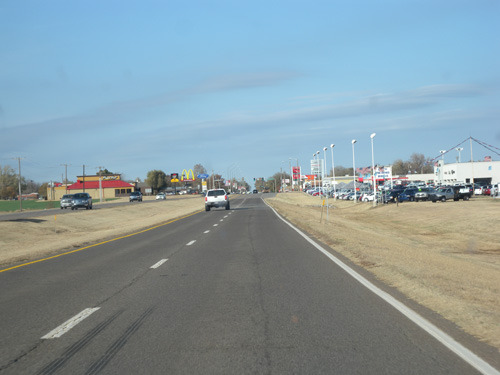  
엘크 시 초입

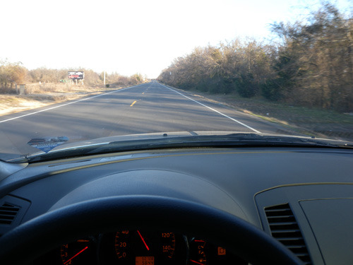  
치카샤에서 촉토로 넘어가는 길 어디쯤

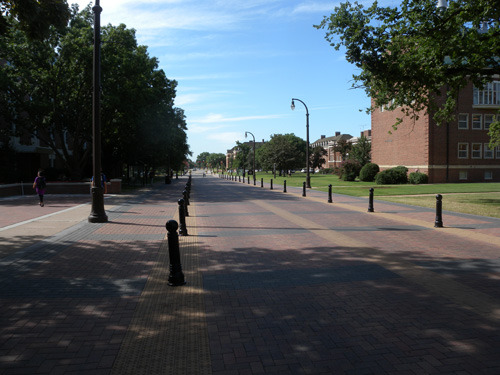  
OSU 중심을 가로지르는 먼로 길[Monroe Street]

\*\*\*

15년 전 LA에 머물 때 간헐적으로 미국 안에서의 장거리 운전을 경험한 적이 있다. 아직도 그 때 달리던 캘리포니아 서쪽의 1번이나 101번 해안도로를 잊지 못한다. 캘리포니아와 워싱턴 주를 거쳐 캐나다 로키산맥을 종단할 때의 그 ‘천상에 오른 듯하던’ 기분도 잊지 못한다. 미국 서부지역 사막지대의 가물가물한 지평선을 바라보며 달리다가 난데없는 폭우를 만나 흔들거리던 차 안에서의 말 못할 두려움 또한 잊지 못한다.

그러나 무엇보다 한시도 잊을 수 없고 피할 수 없는 것은 우리나라의 길과 운전자들이다. 땅은 좁은데, 사람도, 차도 많아 참으로 운전하기 어렵다. 시간은 없는데 도로가 막히면 짜증이 난다. 교통신호나 법규를 지키려다간 바보 취급당하기 일쑤다. 규정 속도를 지키려다간 뒤차 운전자에게 모진 욕설이나 듣기 십상이다. 그래서 우리나라 운전자들은 ‘집단 스트레스’에 걸려 있다고들 말한다. 그래서 평소에 점잖고 존경받는 사람도 일단 핸들만 잡으면 매우 거칠어지는 것이 우리나라라고들 말한다.

우리나라 운전자들은 누구나 세계 어딜 가도 최고의 운전 실력을 발휘할 수 있다고 말하는 것도 그 때문일 것이다. 끼어들기 천재, 앞지르기 천재, 신호위반 천재, 차선 안 지키기 천재, 경적 심하게 울리고 라이트 번쩍거리기 천재, 창유리 내리고 욕설 퍼붓기 천재 등등. 우리나라 사람들은 목숨을 건 곡예운전의 달인들이라고 한다. 그래서 하루에도 몇 번씩이나 ‘내가 운전을 그만 두어야 그나마 제 명대로 살지!’라는 생각을 갖게 되는 것도 사실이다.

\*\*\*

미국에서는 길, 특히 오클라호마 주와 같은 전원지역의 길들 덕분에 행복해진다. 야산 하나 보이지 않는 드넓은 들판 사이를 달리다 보면, 가슴이 뻥 뚫리고 휘파람이 저절로 불어진다. 길 좌우에는 목장이 이어지고, 한가로이 풀을 뜯는 검정 소들이 가끔 고개를 들어 달려가는 우리를 물끄러미 쳐다보기도 한다. 목초지에서 베어낸 풀들을 말아놓은 건초뭉치들도 흡사 십대 남자 아이 얼굴의 여드름처럼 아름답게 돋아 있다.

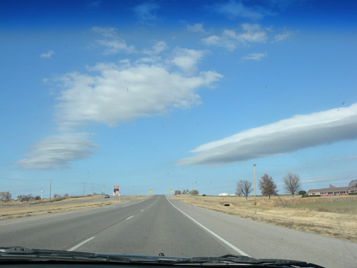  
킹피셔 인근 지역도로

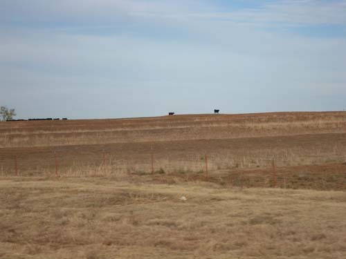  
킹피셔 인근지역에서 포착한 지평선 위의 소들

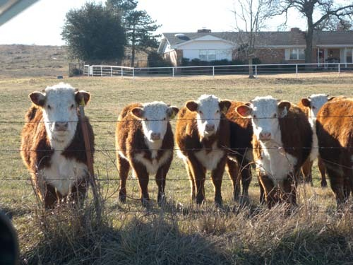  
치카샤에서 촉토로 가는 도중, 산중의 한 목장을 지나면서 만난 소들. 이들을 가까이 보려고   
길가에 차를 세우고 밖으로 나왔더니 글쎄 이 녀석들이 웅얼거리며 걸어와 우리를 유심히   
쳐다 보더군요. 우리가 그들을 구경한 게 아니고, 그들이 우리를 구경하는  형국이었지요.   
      사람 보기 어려운 산 속의 목장에서,동양인을 보기란 더더욱 어려웠을 겁니다.   
    신기한 눈초리로 우리를 뚫어져라 바라보는 그들의 모양을 보며   
내심 얼마나 멋쩍던지요.

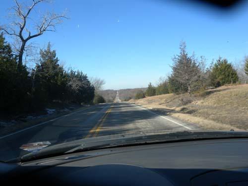  
촉토 인디언 지역[이곳은 오클라호마 주에서 유일한 산악지역임]에서 만난 길

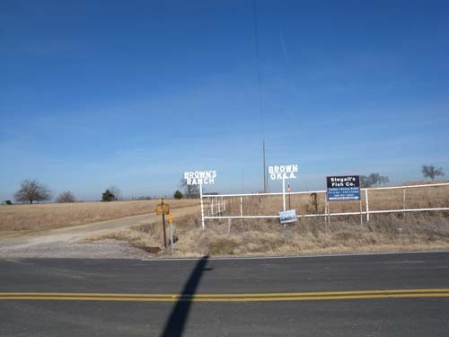  
치카샤 지역의 길을 달리다가 만난, 어떤 목장 입구

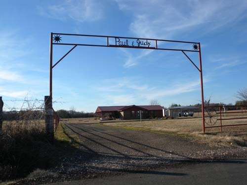  
토우손(Towson) 포트(Fort) 근처 길가에서 만난 농장입구[아마 주인 부부의 이름이겠지요?]

그 뿐 아니다. 땅 속에서 원유를 퍼내는 검은 색 채굴기들이 도처에 널려 있고, 그것들은 흡사 사마귀처럼 끄덕거리며 원유를 길어 올린다. 흡사 까치집처럼 생긴 겨우살이들이 다닥다닥 붙은 교목들이 길 좌우에 즐비하고, 다운타운을 벗어난 도시 외곽의 나무숲에는 멋지게 지은 집들이 간간이 모습을 드러내기도 한다. 마을마다 하얀색의 교회들이 하늘 높이 첨탑을 높이 올린 채 서서 마을의 역사를 대변한다. 그리고 이것들이 합쳐져 흥미로운 서사구조들을 만들어내고 끊임없이 이야기들을 이어간다. 그래서 길은 단순히 지나가는 통로가 아니고, 각종 사건을 재료로 이야기가 만들어지는 발효의 공간이다. 그래서 나는 길을 사랑하고 길 위에서 무언가를 찾아내고자 애쓴다. 우리는 전통적으로 ‘역마살’을 부정적으로 보지만, 글로벌 시대에 누군들 역마살을 피해갈 수 있으랴. 그리고 어쩌면 역마살이 낀 대부분의 사람들은 ‘길의 매력에 심취한’ 사람들일 것이다. 역마살이 끼었대도 좋으니, 의미를 찾아 방황할만한 좋은 길이 많아졌으면 좋겠다.

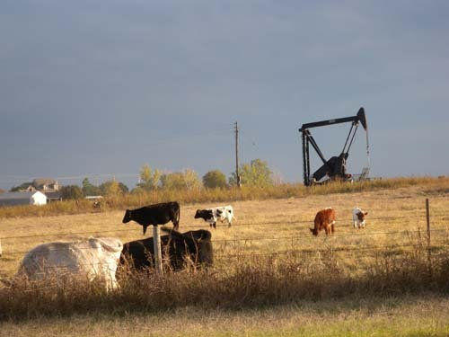  
스틸워터로 돌아오는 길에 잡은 한 컷[주택 옆에 목장이 있고,   
그 곁에서 원유채굴기가 작업을 하고 있음].

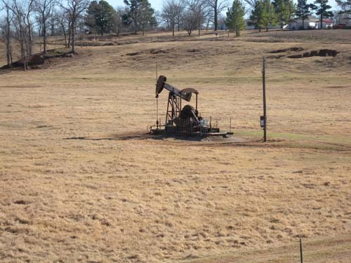  
아무 보는 사람 없어도 끄덕거리며 혼자서 열심히 원유를 길어 올리는 장한 채굴기

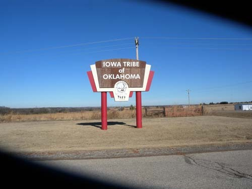  
177번 도로를 달리다가 발견한 소규모 인디언[Iowa Tribe] 집단 거주지의 표지판

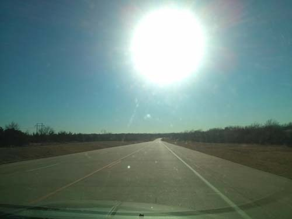  
오클라호마주 길 위에는 늘 태양이 빛난다!

공유하기

게시글 관리

**백규서옥\_Blog ver.**