고마운 미국인들, 그리고 인디언 전사들

얼마 전 이곳 OSU 역사학과의 강사 Gary와 대화를 나눈 적이 있다. 미국에서도 이제 세계를 상대로 한 경찰국가의 노릇을 그만 두어야 한다는 여론이 커지고 있으며, 그도 그 여론에 찬성한다고 했다. 나는 그의 생각이 얼마나 위험하거나 짧은지 말해 주었다. 즉 ‘미국이 경찰국가를 자청하는 의도의 이면에 엄청난 국가이익이 내포되어 있다는 것, 미국이 만약 경찰국가를 포기할 경우 다른 어느 나라[예컨대 중국, 일본, 러시아 등]가 경찰국가를 자임하고 나서거나 다양한 세력들의 춘추전국 시대가 전개되어 결국 미국은 자국마저 방어할 수도 없는 처지에 놓이게 된다는 것’ 등을 들어 미국은 결코 그 역할을 포기하지 않을 것이며 포기할 수도 없다는 점을 강조했다. 결국 그는 내 말을 수긍했다.

\*\*\*

길 가다가 한쪽 편을 들어 싸움판에 끼어들기란 쉽지 않다. 더구나 한쪽 편을 대신하여 맞거나 때려야 하는 입장이라면 더욱 그렇다. 하물며 다른 나라의 전쟁에 내 나라의 젊은이들을 파견하여 피를 흘리게 하는 일의 어려움이야 오죽하랴. 사실 미국이 관여해온 전쟁은 많았고, 지금도 어디에선가 보이지 않는 전쟁을 치르고 있다. 미국이 취해왔거나 취하고 있는 대외정책의 진의가 어디에 있는지 문외한인 나로서는 알 수가 없다. 다만, Yukon City에서 베테란들을 만나 ‘한국을 구해줘서 고맙다’는 진심어린 인사를 건넨 것처럼, 나는 미국이 6・25 때 우리를 구해줘서 말할 수 없이 고마운 나라라는 점은 뼈에 새길 정도로 갖고 있다. 6・25의 원인이나 동기를 따질 필요도 없이 만약 미국 등 UN 기치 하의 16개국이 자국의 젊은이들을 파견하지 않았다면, 죽었다 깨나도 ‘백두혈통’이 아닌 이 나이의 내가 갓 30의 애송이 김정은에게 마구 짓밟히고 있거나 분명 어느 수용소에라도 들어가 있을 것 아닌가. 그 끔찍함을 상상할 때마다 미국이 고맙기만 하다.

\*\*\*

미국은 사실 베테란의 나라다. 역대 대통령들을 비롯한 정치인들 대부분이 베테란들이다. 그래서인지 어느 도시를 가든 베테란을 위한 뮤지엄이 있고, 추모기념관이나 공원들이 중심부에 마련되어 있다. 나는 유콘 시티의 베테란 뮤지엄에서 6・25 당시의 귀한 자료들을 얻었고, 그로부터 멀지 않은 엘 르노시티의 다운타운에서 6・25 전몰용사들의 추모비를 발견했다. 그리고 최근 치카샤 인디언 네이션을 답사하던 중 듀랭(Durant)이란 자그마한 도시에서 6・25 전몰용사 추모비를 또 발견했고, 잘 알려지지 않았던 촉토(Choctaw) 인디언 네이션 뮤지엄과 세미뇰(Seminole) 인디언 네이션 뮤지엄에서 6・25 관련 자료들을 여러 점 목격하고 감동을 받은 바 있다.

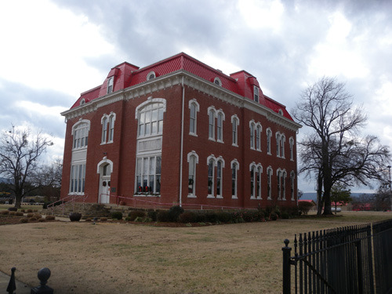  
투스카호마(Tuskahoma)에 있는 촉토 네이션 뮤지엄(Choctaw Nation Museum)

전쟁에서 목숨을 잃은 자국의 용사들을 명예롭게 하기 위해 노력하는 나라가 미국임을 이런 사례들을 통해 알게 되었다. 6・25가 끝난 지 60여년이 지난 지금도 병사들의 유해를 발굴하여 자국으로 모셔가는 그들의 모습을 보라. 살아있는 참전용사들마저 까맣게 잊어버리고 있는 우리와 어찌 비교할 수 있겠는가. 베테란들을, 전몰용사들을 ‘그딴 식으로’ 대접해 놓고 어떻게 젊은이들보고 전쟁터에 나가라고 할 수 있을까. 애국심으로 똘똘 뭉쳐 해외의 전쟁터에 기꺼이 나가는 젊은이들을 보며, 미국의 시대가 쉽게 저물지 않을 것임을 감지하게 된다.

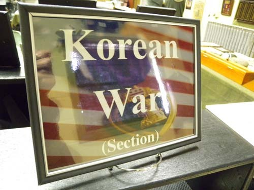  
유콘 시티 베테란 뮤지엄의 한국전 코너

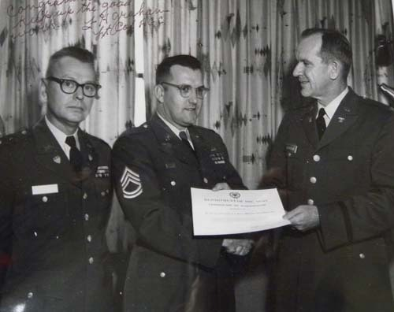  
6 25 당시 한국전에 참여했던 카치니[당시 상사]가 표창을 받는 모습

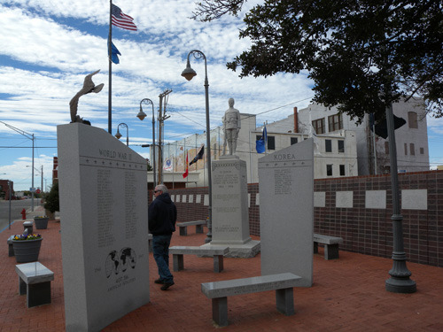  
엘 르노 시티 다운타운에 있는 전몰용사 추모 공원

\*\*\*

엘 르노 시티 다운타운의 전몰용사 추모공원 한 복판. ‘Korea’라는 글자들이 선명한 비석 중심에 ‘Dobbs, Johnny F./Johnson, Melvin J./Reed, Amzie O./Rogers, Glenn R./Rother, Robert L./Stanphill, Verlyn L./Wiewel, James M./Williams, Johnny/Wosika, Paul J./Ruser, Charles H./Morse, Robert L./Hollman, Paul H.’ 등 한국에서 전사한 미국의 젊은이들의 빛나는 이름들이 올라 있었다.

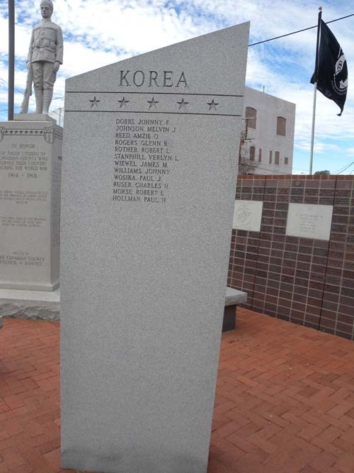  
엘 르노시티 전몰용사 추모공원의 한국전 전사자 추모비

치카샤 인디언 네이션에서 촉토 네이션으로 넘어가는 어름에서 듀랭(Durant) 시티를 만났고, 그 시청 앞의 ‘Korean War’라는 추모비에서 ‘Donnie J. Airington/Troy W. Bailey/J. C. Burr/James H. Cross/George H. Dillard/Carl Dill/Ernest H. Haddock/George O. Hiser/Arnett Lamb/Dewey E. McGehee/Charles L. Minyard/Loy A. Philpot/Ben D. Trout’ 등 젊은 전사자들을 발견했으며, 그들의 명복을 빌었다.

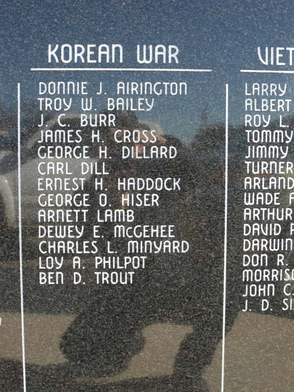한  
듀랭(Durant) 시티의 한국전 전몰용사 추모비

촉토 네이션 뮤지엄의 한복판에도 각종 전쟁에서 활약한 촉토족 전사들의 활약상이 자리 잡고 있었다. 특히 1・2차 세계대전에서 암호 해독병으로 활약한 그들의 공적이 크게 부각되어 있었다. 촉토족 언어가 전선에서 연합군 측 암호로 쓰인 점을 이 뮤지엄에서 비로소 알게 되었는데, 어쩌면 그것은 한국전에서도 활용되었을 것이다. 미국의 어디에서나 볼 수 있는 것처럼 이 뮤지엄의 뜰에도 전몰용사를 추모하는 비석이 서 있었고, 한국전에서 사망한 용사들의 이름이 나열되어 있었다. ‘Amos, Morris/Bryant Jr., William/Burris, Tony \*winner of Medal of Honor/Cole, William/Dill, Carl/Green, Joe/Franklin, Preston/Frazier, Elam/Kaniatobe, Charles/Killingsworth, Leo/Mcclure, Jim/Mccurtain, Buster/Mccurtain, Isaac/Ontayabbi, Timothy/Rasha, Willie/Watson, Leonard’ 등 16명의 혈기방장했을 젊은이들이 전사자 추모비에 자랑스럽게 올라 있었다. 이 가운데 명예훈장을 받았을 정도로 전공이 혁혁했던 인물 Burris, 형제가 사망한 것으로 보이는 Buster와 Isaac 등은 한동안 내 눈길을 끌었다. 추모비 뒤쪽에 촉토족의 용맹을 대표하는 ‘붉은 전사[Red Warrior]’가 적의 가슴을 향해 활을 힘껏 당기는 모습의 동상이 서 있는데, 이들 전몰용사들이야말로 그의 진정한 후예들이 아니겠는가.

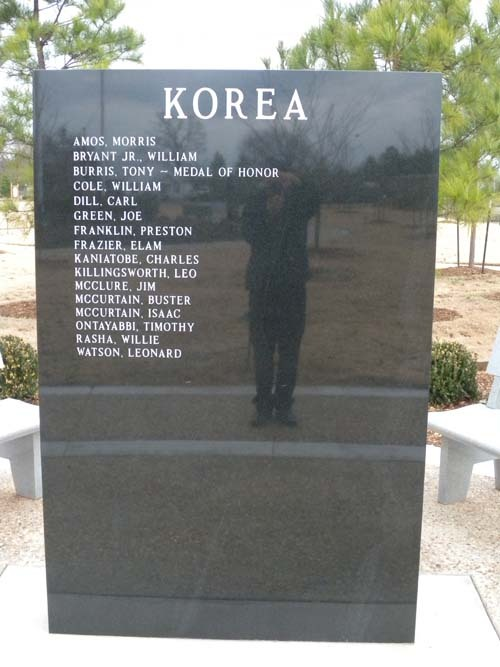  
촉토 네이션 뮤지엄 뜰에 서 있는 한국전 전몰용사 추모비

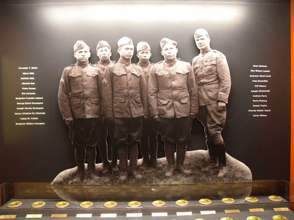  
2차세계대전에서 암호병으로 활약하여 큰 공을 세우고 훈장을 받은 촉토족 전사들

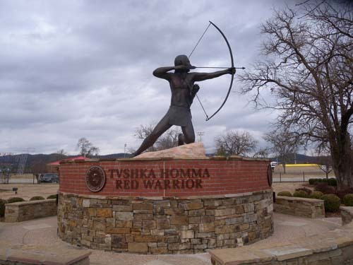  
촉토 네이션 뮤지엄 앞에 서 있는 '붉은 전사[Red Warrior]' 상

최근 만난 한 미국인은 자신의 할아버지가 열아홉 나던 해 한국전쟁에 참여했다고 했다. 다행히 그는 살아 돌아왔지만, 그 점으로 미루어 이곳에서 만나는 전몰용사들 역시 대부분 10대 후반에서 20대 초반에 걸치는 젊은이들이었을 것이다.

더 감격스런 일은 위워카(Wewoka) 시티의 세미뇰 네이션(Seminole Nation)에서 있었다. 세미뇰 네이션 뮤지엄에는 ‘군사박물관[military museum]’이란 별도의 방을 마련하고, 제1・2차 세계대전, 한국전, 베트남전 등 미국인들이 참여한 세계 각처의 전쟁 코너들을 별도로 마련해 놓고 있었다. 그런데 한국전 코너에서 참으로 인상적인 자료들을 접하게 되었다. 이곳에는 해병중위 팩터(Kenneth J. Factor)가 정찰임무 수행 중 전선에서 실종되었다는 사실과 그의 사진이 전시되었을 뿐 전몰용사들에 대한 구체적인 자료는 없었다.

그러나 당시 그들이 만들었을 것으로 추정되는, 한국에 관한 귀한 자료들이 여러 점 전시되어 있었다. 그 때의 한국인들에 관한 캐리커츄어(caricature) 석 점인데, 그림도 그림이려니와 그 밑에 달아둔 멘트가 감동적이었다. 약간 서양식으로 변이된 복장의 노인 둘, 여인네 둘, 꼬마 셋, 장승 하나를 그린 다음, ‘한국인들은 우아하고 자부심 강한 민족[The Koreans are a graceful and proud race]’이라는 멘트를 달아놓은 것이 그 하나이고, 소달구지를 몰고 가던 중 넘어진 소에게 화를 내는 주인과 깔깔대며 재미있어 하는 구경꾼들을 그린 다음 ‘한국인들은 가끔 화를 내면서도 예리한 유머감각을 지녔다[They have a keen sense of humor despite their occastional bursts of temper]’는 멘트를 달아 놓은 것이 두 번째 것이며, 장대비가 쏟아지는 속에 우산을 쓰고 가는 사람들을 그린 다음 ‘한국에서는 7월과 8월에 장마철이 시작된다[The rainy season occurs in July and August]’는 사실 관계 멘트를 달아놓은 것이 세 번째 것이었다. 이들이 얼마나 따스하고 긍정적인 시각으로 한국인들을 관찰했는가를 알 수 있게 하는 사례들이었다.

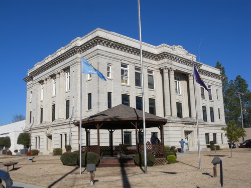  
위오카(Wewoka) 시티에 있는 세미뇰 네이션 뮤지엄

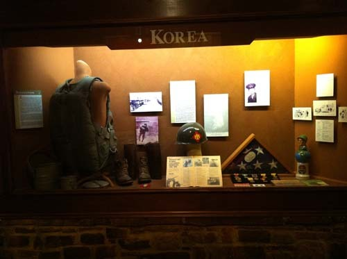  
세미뇰 네이션 뮤지엄의 한국전 코너

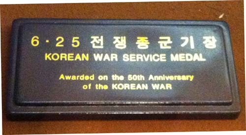  
한국전 코너의 '6 25 전쟁 종군 기장'

  
한국전에서 실종된 팩터(Kenneth J. Factor) 중위

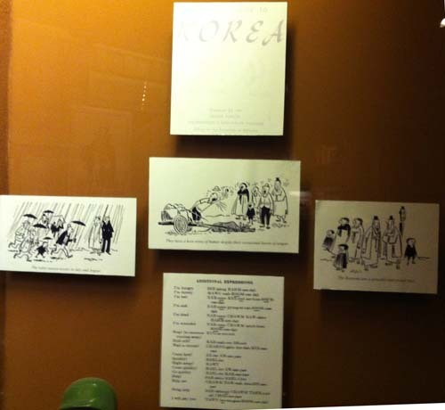  
한국전 코너에 전시된 자료들

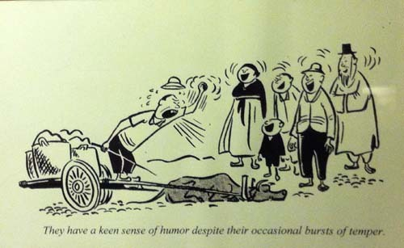  
한국전 코너에 전시된 자료

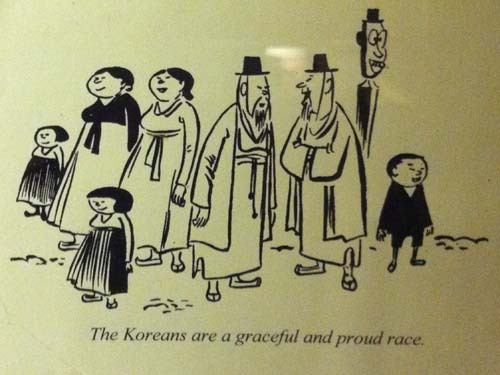  
한국전 코너에 전시된 자료

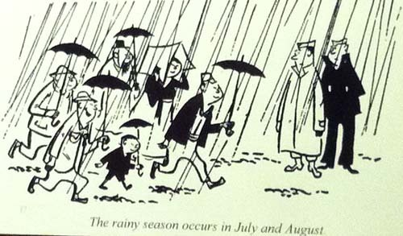  
한국전 코너에 전시된 자료

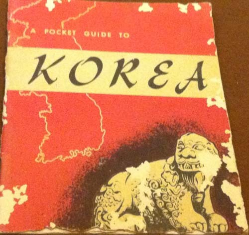  
한국전 코너에 전시된 자료(한국 가이드북)

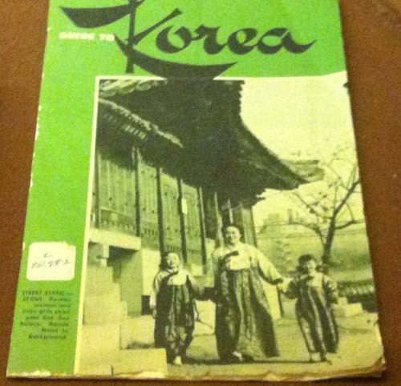  
한국전 코너에 전시된 자료(한국 가이드 북)

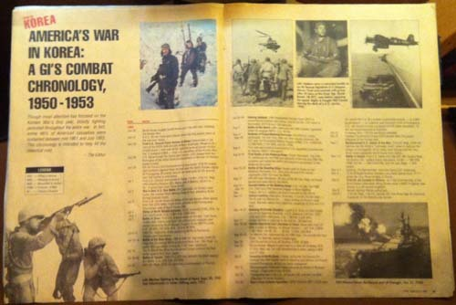  
한국전에 관한 저널의 보도

그러나 무엇보다 내 가슴을 찡하게 만든 것은 이들이 전선에 나가는 자민족 군인들을 교육시키기 위해 만들었음직한 한국어 교재였다. ‘추가적인 표현[Additional Expression]’이란 표제가 붙은 것으로 보아 주 교재는 별도로 있었을 것이다. 여기에 실린 총 18개의 표현들은 한국에 가면 꼭 알아야 하는 것들이라고 그들 나름대로 판단했던 것 같은데, 그 내용이 참으로 흥미롭다.

●I’m hungry                                   SEE-jahng HAHM-nee-dah

●I’m thirsty                                    MAWG mah-ROOM-nee dah

●I’m lost                                         NAH-noon KEE-rool eer-huss-SOOM-nee-dah

●I’m tired                                      NAH-noon CHAWM KAW-dahn HAHM-nee-dah

●I’m wounded                              NAH-noon CHAWM tahch-huss-SOOM-nee-dah

●Stop!(to someone running away)           KUG-ee sut-suh

●Hold still!                                                     KAH-mah-nee ISS-suh

●Wait a minute!                                           CHAHNG-gahn kee-dah-REE-see-yaw

●Come here!                                                 EE-ree AW-see-yaw

●Quickly!                                                       BAHL-lee

●Right away!                                                 KAWT

●Come quickly!                                            BAHL-lee AW-see-yaw

●Go quickly                                                   BAHL-lee KAH-see-yaw

●Help! SAH-rahm                                       SAHL-liyaw

●Help me                                                      CHAWM TAW-wah choo-SIP-see-yaw

●Bring help                                                  SAH-rahmool CHAWM TAHR-yudah CHIOO-see-yaw

●I will pay you                                            TAWN too-ree-gess-SOOM-nee-dah

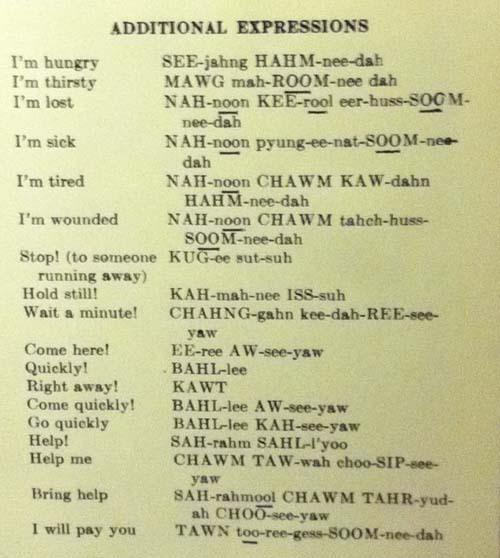  
당시 한국전에 참가할 세미뇰 병사들에게 교육하던 한국어 추가 교재

자기 민족의 젊은이들을 아무런 정보도 없는 한국의 전쟁터에 내보낸다고 생각해보라. ‘이 녀석들이 배고프면 어쩌나, 목이 마르면 어쩌나, 낯설고 물 선 타국 땅에서 길을 잃으면 어쩌나!’ 얼마나 걱정이 많았을까. 미국 연방정부의 명령이니 네이션에서도 파병을 거역할 수는 없었을 것이다. 그래서 부모의 마음으로 그들에게 교육을 시킨 것 아닐까. 도망가는 적군에게 ‘stop!’ 대신 ‘거기 섰어![KUG-ee sut-suh!]’라고 외쳐야 알아듣는다는 걸 대체 누가 알려 주었단 말인가. 이 추가적 표현들이야말로 생존에 필요한 가장 기본적인 사항들인데, 영문자로 ‘간신히’ 적어놓은 이 발음대로 말했다 한들 알아먹었을 한국인들이나 인민군들이 몇이나 되었을까. 그러나 아무것도 모른 채 보내는 것보다는 이 정도라도 알려서 보내는 것이 그나마 부모 형제, 동족으로서는 마음 놓이는 일이었을 것이다. 길 떠나는 자식에게 불안한 마음에서 ‘쓸데없이’ 이것저것 잔소리하는 우리네 부모의 심정이 이랬을까.

그렇게 이역만리 전쟁터로 사랑하는 아들들을 보낸 미국인들, 혹은 인디언들이었다. 그들의 희생 덕에 우리는 기사회생(起死回生)했고, 세계 10위의 경제 대국으로 성장했다. 그러나 지금 ‘등 따습고 배부른’ 우리는 당시 ‘거지 몰골’로 우리네 사립문을 흔들며 ‘나는 시장합니다!’라고 외쳤을 인디언 전사들, 아니 이름 모를 험한 계곡에서 피 흘리며 죽어갔을 그들의 모습을 전혀 기억하지 못하고 있다. 아니 기억하지 않으려 하고 있다. 오히려 당시 우리를 죽이려 했던 적들에게 공공연히 부역(附逆)하려는 무리가 백주대낮에 활개를 치고 있다. 과연 우리는 어디로 가고 있는 것일까.

공유하기

게시글 관리

**백규서옥\_Blog ver.**