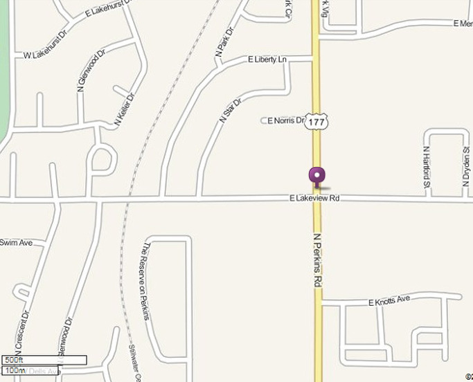
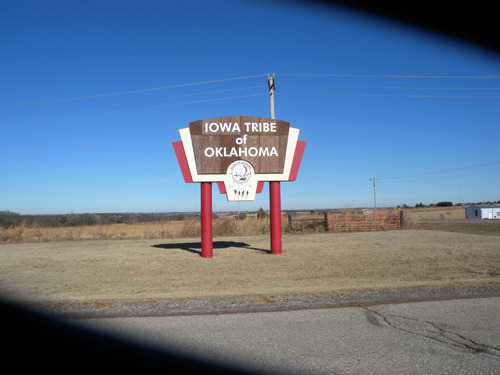
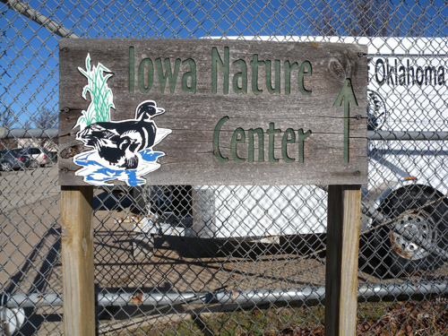
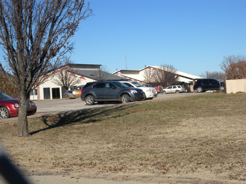
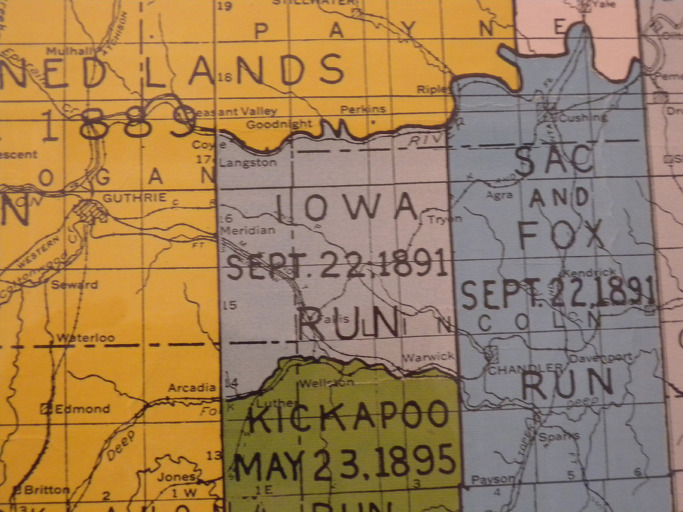
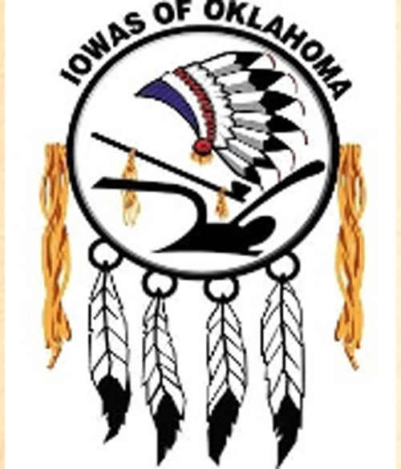
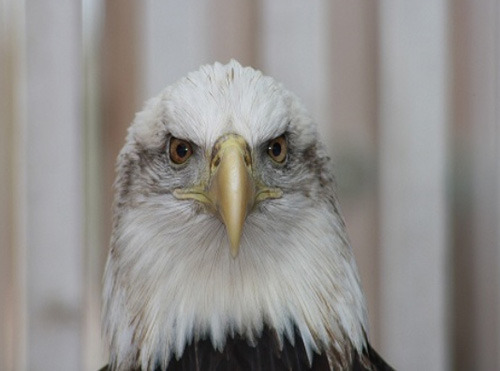
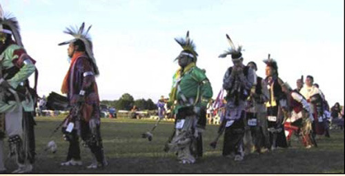
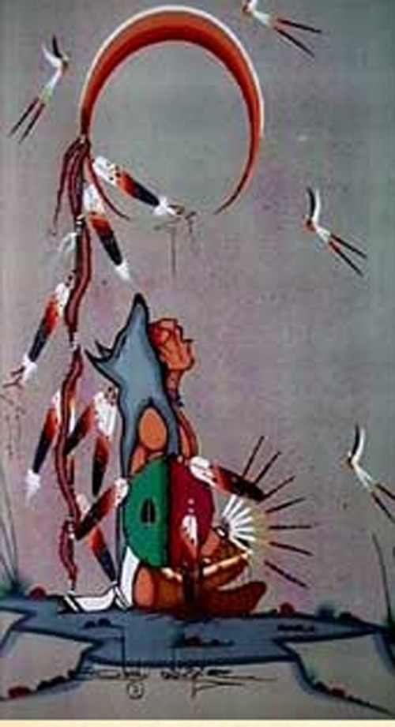

길 가다가 아이오와(Iowa) 족을 만나다!

미국에 온 이후 갖가지 일들에 정신이 팔린 채 살아왔으나, 그래도 잊지 않고 찾아다니는 분야는 아메리카 인디언의 역사와 문화다. 지난 10월 털사(Tulsa)에서 3박 4일간 진행되었던 ‘2013년 풀브라이트 강화 세미나[2013 Fulbright Enrichment Seminar]’에 참여하여 오세이지(Osage) 인디언 보호구역을 방문한 이래 11월 하순 체로키(Cherokee) 인디언 네이션까지 답사함으로써 ‘문명화된 다섯 인디언 부족들[Civilized 5 Indian Tribes]’ 중 두 개를 체험한 셈이었다. 그러나 오클라호마 주만 해도 36개의 인디언 부족들이 주로 남부지역에 터를 잡고 있는데, 최소한 다섯 부족만이라도 접해보는 것이 내 목표였다. 그래서 이번 겨울방학 초반에 그 목표를 달성하고자 나선 길이었고, 그 행선지가 바로 치카샤(Chickasha) 인디언 네이션이었다.

\*\*\*

2013년 12월 16일 아침 10시쯤 집을 나섰다. 첫 목표지는 치카샤 인디언 네이션이 있는 아다(Ada)였고, 거기로 가기 위해 타는 길이 177번 하이웨이였다. 그 177번길의 스틸워터 시내 구간은 퍼킨스 로드(Perkins Road)였고, 묘하게도 그 길은 퍼킨스 시티(Perkins City)로 연결되었다. 즉 퍼킨스 로드를 따라 스틸워터에서 벗어나 30분쯤 가니 퍼킨스 시티가 나오고 그로부터 남쪽으로 계속 4마일쯤 달리다가 눈에 번쩍 뜨이는 표지판을 만나게 된 것이었다. “Iowa Tribe of Oklahoma”란 글자들 밑에 이상한 모양의 문장(紋章)이 새겨진 앙증스러운 표지판이었다.

  
스틸워터 시내의 퍼킨스 길(Perkins Rd.)

  
177번 도로에서 2~3분 가량 들어간 B의 위치에 아이오와 네이션이 있다.

  
177번을 달리다가 길가에 있는 이 표지판을 발견했다.

‘부족’을 뜻하는 ‘tribe’란 말과 독수리 깃털로 만든 문장의 디자인이 분명 인디언을 지칭하는 것 같은데, 이전에 ‘아이오와 주[Iowa State]’는 들어보았으되, 그런 이름을 달고 있는 인디언을 들어본 적이 없던 터라 의아해 하면서도 처음엔 그냥 지나치고 말았다. 1~2분 정도 달리다가 아무래도 그냥 지나칠 순 없다는 판단이 들었다. 전혀 예상하지 못했다 해도 그것이 인디언 부족인 이상 그냥 가면 나중에 후회가 남을 것 같았다. 그래서 차를 돌려 이곳에 들어가게 된 것이다.

하이웨이로부터 빠져나가 5분 정도 들어가니 과연 오하이오 네이션이 있었다. 주차장에 차를 대고 관리 사무소에 들어가니 20대 후반의 아가씨가 자리를 지키고 있었다. 그녀에게 이것저것 물었으나 기초적인 사항을 제외하고는 별로 아는 게 없었다. 책임 있는 인사를 만날 수 있느냐고 묻자 한참 만에 족장[Tribal Chairman]이 나와서 나를 자기 방으로 불러 들였다. 수인사를 나눈 뒤 그에게 여러 가지 질문들을 던졌다. 그러자 그의 입에서는 자기네 부족의 과거와 현재가 술술 흘러나왔다.

  
네이션 입구의 간판

  
아이오와 네이션

  
아이오와 네이션의 친절한 아가씨 Miss Kent Tehavno

토착 원주민들 가운데 하나인 아이오와 부족은 (연방정부와의) 각종 조약과 법령으로 인정된 자치정부를 갖고 있는, 말하자면 독립적 주권국가의 중심에 있다고 했다. 자체 헌법과 각종 법률, 통치체제를 갖고 있다는 설명이었는데, 정말로 당신네 공동체가 ‘독립국가’냐고 물으니, 미국민이지만 어느 정도 자치를 인정받고 있다는 식으로 정정하기도 했다.

  
아이오와 트라이브의 족장[Tribal Chairman] Mr. Gary Pratt

아이오와 사람들은 자신들을 ‘회색 눈[grey snow]’을 뜻하는 ‘바코제(Bah-Kho-Je)’로 부르는데, 그 말은 겨울 몇 달 동안 난방 연기로 그을린 눈에 뒤덮인 그들의 집이 회색으로 보인 데서 나왔으며, 아이오와 주[Iowa State]의 이름도 아이오와 부족으로부터 나온 것이라 했다.

오네오타(Oneota) 지역민들의 후손인 아이오와 부족은 1600년대에 남서 미네소타의 파이프스톤 쿼리(Pipestone Quarry) 지역에 살고 있었는데, 1730년에는 북서 아이오와 오코보쥐(Okoboji) 호수와 스피릿(Spirit) 호수 지역의 마을들에 살고 있는 것이 발견되었다고 한다. 그 후 그들은 아이오와 주 카운슬 블렆스(Council Bluffs) 인근에서 남쪽으로 이동했고, 18세기 중반에는 그들의 일부가 드 모인(Des Moines) 강으로 이동해 올라갔다. 당시 남아 있던 사람들은 스스로 미주리의 그랜드 플랫강(Grand and Platte River)가에 정착했고, 연방정부와의 조약에 따라 미주리, 아이오와, 미네소타 등의 땅에 대한 권리를 포기하게 되었다. 연방정부와 맺은 1936년의 워싱턴 조약에 따라 그들 중 일부에게 네브라스카와 캔자스에 있는 그레이트 네마하 강(Great Nemaha River)을 따라 보호구역을 할당해 주었으나, 나중에 아이오와 족 일부가 오클라호마의 인디언 구역으로 이주하게 되었다. 1883년 8월 15일 날짜로 발령된 대통령령[Executive Order]에 의해 설립된 것이 원래 오클라호마 주 아이오와 보호구역이다. 나중에 아이오와 네이션은 두 부분으로 분할되었는데, 오클라호마의 아이오와족은 남부 아이오와이고, 캔자스와 네브라스카의 아이오와족은 북부 아이오와다.

  
오클라호마 주 인디언 분포 지도 가운데 Iowa 족의 구역

족장은 특히 자신의 부족이 강인한 정신력으로 고난과 불공평 등 그들을 억압한 역사의 시련들을 견디어 온 데 대한 자부심을 강하게 피력했으며, 아이오와 족은 현재 490명 이상의 등록 인구를 갖고 있으며, 페인(Payne), 오클라호마(Oklahoma), 링컨(Lincoln), 로건(Logan) 카운티 전역 혹은 부분들을 아우르는 사법 관할구역을 갖고 있다고 했다. 아이오와 족은 지역 행정 기관과 부족 기업들의 회계부서, 부족이 운영하는 경찰과 소방서 등을 포함 다양한 분야에서 160여명이 고용되어 활약할 만큼 우수성을 인정받고 있다는 것이었다.

설명이 끝나고, 족장 뒤편에 있는 문장에 대하여 물었다. 인디언 부족들을 방문할 때마다 느끼는 것은 그들의 실(Seal) 즉 문장(紋章)이 가장 중요한 상징이라는 사실이었다. 각 문장에는 해당 부족들의 현실과 꿈, 그리고 철학이 응축되어 있다고 보기 때문이다. 그는 다음과 같이 설명했다. 이 문장은 1978년 밥 머레이(Bob Murray)가 디자인한 것인데, ‘생명의 순환 고리’를 의미하는 원은 신성한 독수리의 깃으로 장식된 아이오와 전사의 전투모를 상징한다. 원 안에는 신성한 파이프[담뱃대]가 있는데, 아이오와 족의 각 클랜(clan)은 그 자신들의 신성한 파이프를 클랜 우두머리 집에서 가까운 방어구역 안에 갖고 있으면서 각종 제사나 의식(儀式), 특히 평화와 동맹을 맺는 절차들에 사용했다고 한다. 원 안의 쟁기는 아이오와 족의 농경 전통을 나타내며, 원의 양쪽에 매달려 있는 총채 비슷한 털 자루는 전통적으로 버팔로의 은신을 본뜬 떨림을 나타낸다. 그리고 그것은 아이오와 족의 일상생활에서 가장 중요한 활과 화살을 운반하는데 사용되었다. 원 아래 쪽의 독수리 깃털 네 개는 사방의 바람과 사계절을 나타내는데, 전통적으로 아이오와 족은 독수리를 존경해왔으며, 부족과 신을 매개하는 것이 바로 독수리라는 믿음을 가지고 있다는 것이다. 그렇게 단순치 않은 의미가 바로 이 문장에 숨어 있었다.

  
아이오와 족의 문장

  
아이오와 족이 존경하는 독수리

족장의 설명을 듣고 난 다음 방문한 갤러리에는 부족의 삶을 보여주는 물건들과 예술품들이 가득했다. 비록 흩어져 있는 부족원들을 모두 합해 봐야 1000명이 채 되지 않는 소수그룹이지만, 자신들의 정체성을 유지하기 위해 백방으로 노력하는 모습이 이방 나그네의 눈에는 매우 아름답고 감동적으로 비쳤다. 그러나 과연 이 작은 공동체가 앞으로 얼마나 버틸 수 있을까.

  
아이오와 족 부족 축제

  
갤러리에 전시된 Eric BigSoldier의 작품

공유하기

게시글 관리

**백규서옥\_Blog ver.**