지혜로운 치카샤 족, 인디언 사회의 자존심

엄청난 공동체였다. 규모도 규모려니와 곳곳에 잠재된 역사와 문화의 실체, 그리고 진하게 감지되는 그들의 민족적 의지가 놀라웠다. 그동안 인디언들에 대해 갖고 있던 내 편견이나 무지가 부끄러울 정도였다. 오클라호마 주 서북쪽과 동쪽을 여행하면서 체로키와 오세이지 인디언들의 실체를 이미 확인한 바 있지만, 이곳 중남부에서 만나는 치카샤 인디언들은 그 이상의 의미를 갖고 있었다. 오클라호마 주 전체 153개의 카운티 중 13개[그래드(Grad)/맥클레인(McClain)/가빈(Garvin)/폰타탁(Pontotoc)/스티븐스(Stephens)/카터(Carter)/머레이(Murray)/쟌스톤(Johnston)/제퍼슨(Jefferson)/러브(Love)/마샬(Marshall)/브라이언(Bryan)/코울(Coal)]로 구성되어 총인구 318,658명, 면적 2,3456㎢에 달하는, 거대한 규모의 치카샤 네이션이었다.

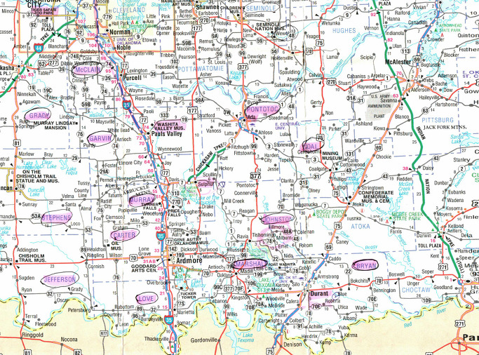  
치카샤 네이션의 현재 영역[표시 부분은 카운티 이름들]

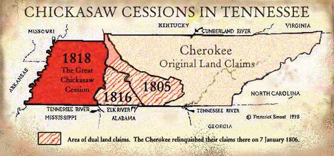  
테네시 주에 있던 치카샤 영역

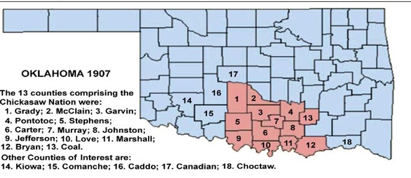  
오클라호마 주에서 치카샤가 차지하는 부분들과 카운티 이름들

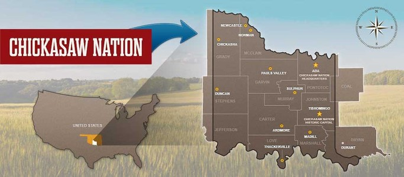  
치카샤 네이션 영역도

177번 하이웨이를 타고 내려가던 중 아이오와 인디언 네이션을 만났고, 그로부터 대략 두 시간 쯤 뒤 치카샤 인디언 네이션이 있는 폰타탁 카운티의 에이다(Ada) 시티에 도착했다. 원래는 스틸워터에서 직접 설퍼(Sulphur)로 달려가려 했으나, 네이션 본부 건물이 있는 에이다를 그냥 지나칠 수는 없었다. 이곳에는 현재 네이션 본부 건물들만 남아 있고, 그들의 실제 역사나 문화는 컬츄럴 센터가 있는 설퍼와 지난 날 이들의 수도였던 티쇼밍고(Tishomingo)에서 살펴볼 수 있었다.

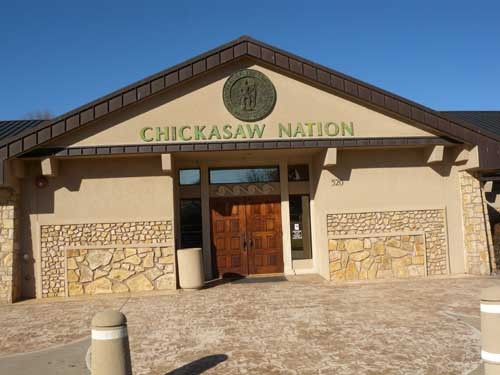  
에이다(Ada) 시티에 있는 치카사 네이션 건물의 일부

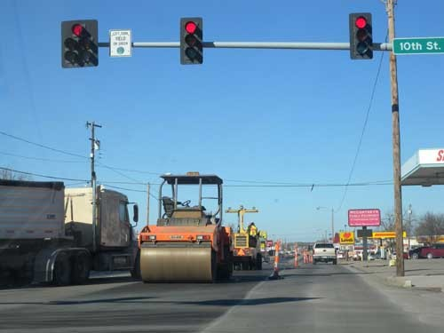  
번성한 에이다 시티의 다운타운[현재 도로공사중]

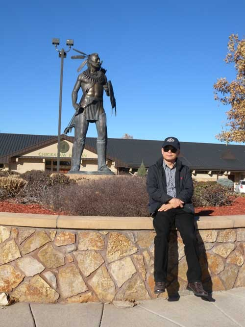  
에이다 시티 치카샤 네이션 앞뜰에 있는 전사[Warrior]상

에이다로부터 30분쯤 걸려 설퍼에 도착한 우리는 우선 치카샤 문화센터[Chickasaw Cultural Center]를 찾았고, 거기서 치카샤 족의 지식인 여성 큐레이터 들로리스(Deloris Jefferson)를 만났다. 마침 관람객이 없는 상황에서 우리는 그녀와 독대하여 치카샤 민족의 역사와 문화에 대한 설명을 비교적 상세하게 들을 수 있었고, 설퍼에서 하룻밤을 묵고 난 다음 날에 들른 티쇼밍고(Tishomingo)의 ‘치카샤 의회 박물관[Chickasaw Capitol Museum]’에서도 역시 지성적인 풍모의 여성 큐레이터 플로라 핑크(Flora Fink)로부터 다양한 콜렉션들에 얽힌 정치적•인류학적 설명을 들었다. 두 여성 모두 경제적으로 부강하고 문화적으로 생동감 넘치며 활기에 찬 주민들로 이루어진 것이 치카샤 네이션임을 강조하기에 바빴다. 치카샤 문화센터와 의회박물관 모두 치카샤가 이 땅에서 한 때 살다가 사라진 민족이 아니라, 지금도 왕성하게 확장되는 현재와 미래의 민족임을 보여주는 현장이었다. 치카샤의 여성 지식인들을 대표한다고 생각되는 두 사람으로부터 들은 설명을 요약하면 다음과 같다.

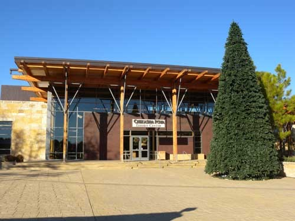  
설퍼(Sulphur)시티 치카샤 컬츄럴 센터 전시관의 세련된 모습

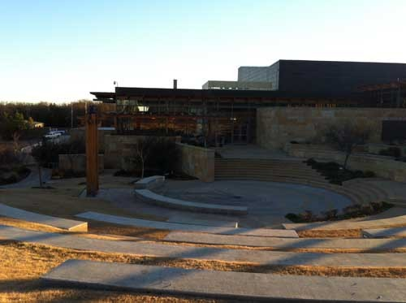  
건축미가 돋보이는 치카샤 컬츄럴 센터

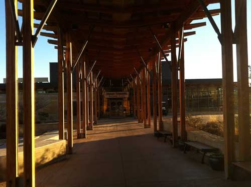  
치카샤 컬츄럴 센터의 세련된 모습

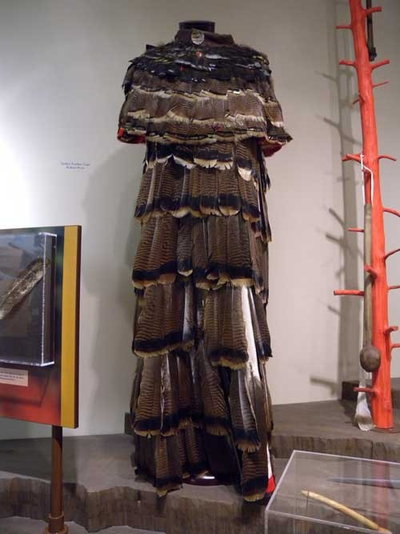  
치카샤 컬츄럴 센터의 전시물[독수리 깃털로 만든 추장의 옷]

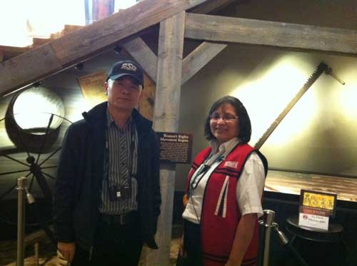  
치카샤 컬츄럴 센터에서 만난 큐레이터 Deloris Jefferson

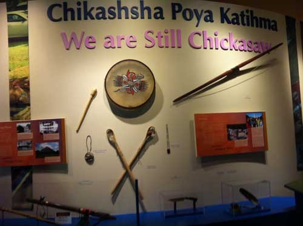  
치카샤 컬츄럴 센터 전시관의 생활사 자료들[치카샤의 자부심이 드러나 있음]

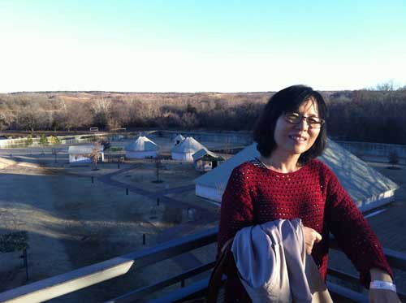  
치카샤 컬츄럴 센터 뒷편에 마련된 주거지 모형 위에서 멜라니

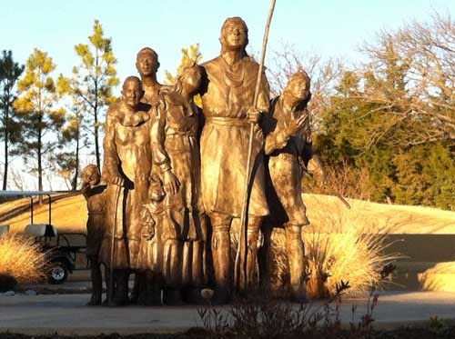  
치카샤 컬츄럴 센터 안뜰에 세운 가족상

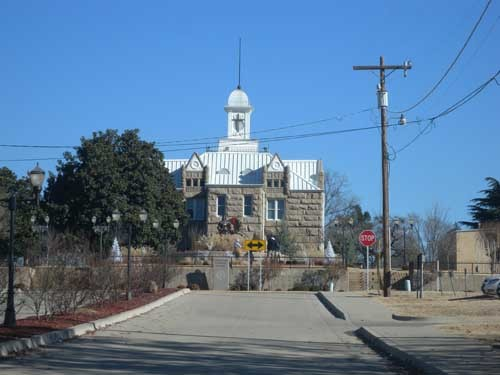  
티쇼밍고 시티의 치카샤 네이션 의사당 건물

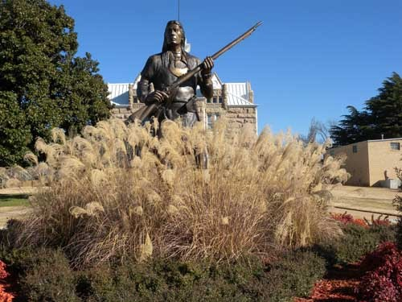  
치카샤 의사당 건물 앞에 세워진 전사 티쇼밍고 상

분명치는 않으나 치카샤 족은 원래 촉토(Choctaw) 족과 함께 오늘날의 멕시코에서 시작되어 북미 쪽으로 이주했다 한다. 그들은 미시시피 강 근처에 살고 있었으며, 일부는 남부 캐롤라이나 주의 사바나(Savannah) 타운에도 살고 있었다.

치카샤 족이 미시시피, 앨라배마, 테네시, 켄터키 등지의 사냥터들을 비롯한 큰 땅을 점유하고 있던 때는 다른 부족들에 비해 상대적으로 규모가 작은 시절이었다. 그들은 16세기 중반 스페인 사람 에르난도(Hernando de Soto)가 이끄는 탐험대와의 만남을 통해 세상에 알려지게 되었는데, 그들은 결국 과도한 요구를 하던 탐험대를 공격하여 패주시킴으로써 치카샤가 남동부 인디언 부족들 가운데 가장 무서운 존재라는 평판을 만들어 낸 계기가 되기도 했다. 

남북전쟁 이후 백인 이주자들이 서부로 이동하면서 치카샤 족의 땅이 서부 팽창을 위한 주요 타깃으로 부상되었고, 루이지애나 매입지에 있던 미시시피 강 서쪽 땅을 미국정부가 차지하면서 치카샤 족과 다른 동부 부족들을 서부로 이주시키기 위한 프로그램은 시작되었다. 그러다가 결국 1832년 이주 조약에 서명함으로써 치카샤 족은 미국 정부에 굴복했고, 그 조약은 1834년에 다시 협상될 수밖에 없었다. 새 인디언 구역 안의 미시시피 서쪽에 살만한 땅이 찾아질 때까지 정부의 이주요구를 받아들일 수 없다는, 그 조약 속의 주요 조항들 가운데 하나 때문이었다. 

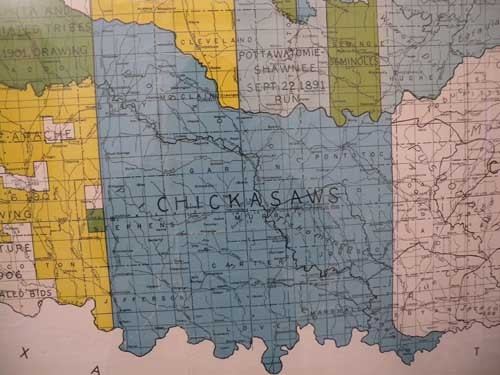  
1890년대의 치카샤 영역도

적절한 땅을 찾을 수 없었던 현실의 대안으로 선택된 것이 촉토 족과의 동거였다. 다시 말하여 치카샤 족은 새로운 인디언 구역 내 촉토 땅의 한 부분을 빌려 이주할 것을 강요당한 것이었다. 1937년의 조약이 바로 그것인데, 자신들의 정체성[identity]을 잃고 촉토 족의 한 부분으로 편입되었다는 것이 사실 그들에겐 가장 큰 문제였다. 촉토 족 의회에 대표를 파견하긴 했지만, 그로 인해 자신들이 촉토 네이션의 소수자가 되었다는 점을 깨달은 것이다. 그런 불평등과 불합리를 해소하기 위해 많은 노력과 투쟁을 기울인 결과 드디어 1837년 촉토 족으로부터 ‘완전한 자신들의 땅’을 매입하기로 조약을 맺는 데 성공했고, 1855년의 새로운 조약을 통해 그들은 자신들의 네이션을 다시 한 번 갖게 되었다. 이런 시대가 1907년까지 지속되었으나, 인디언 구역이 오클라호마 구역과 통합되면서 이 지역은 오클라호마 주의 한 부분이 되었다. 이렇게 치카샤 네이션이 종말을 고함에 따라 모든 치카샤 인들은 결국 미국인으로 통합될 수밖에 없었다.

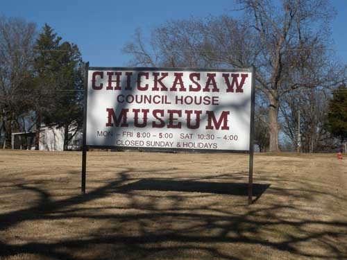  
치카샤 의회 박물관 간판

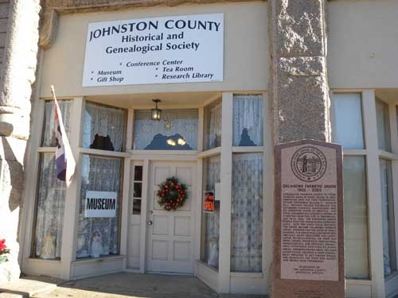  
치카샤 의회 박물관 입구

1907년부터 1980년대 초까지 치카샤의 혈통이나 연고를 계승한 비공식적 기구들 몇 개만 있었을 뿐, 치카샤 네이션은 사실상 존재하지 않았던 셈이다. 1856년의 치카샤 헌법에서 치카샤 인들은 부족의 추장이나 족장을 갖던 수준으로부터 선출된 ‘거버너(Governor)’를 갖는 수준으로의 문명화를 이룩했다. 그러나 실제로 미국정부에 대한 치카샤 인들의 권리나 땅 문제에 대한 협상 등 거버너가 수행해야 할 많은 일들을 미국의 대통령이 맡아서 처리하게 되었으므로, 이 시기가 치카샤 네이션에게는 사실상 ‘죽은 기간(Limbo Period)’이나 다름없었다. 그러나 1970년대에 인디언 운동가들이 거국적인 활동을 벌임으로써 인디언들의 권리가 새삼 사람들의 관심사로 떠오르게 되었고, 그 덕에 치카샤 족도 다시 깨어나기 시작했다. 1983년 치카샤 네이션이 만들어지고 새로운 헌법이 채택됨으로써 이 운동은 절정에 올랐으며, 결국 네이션은 오늘날의 모습으로 확대•발전되었다는 것이다.

사실 치카샤 족이 강제이주를 당하면서 먼저 이주한 촉토 족과 5년 간 힘든 협상을 계속했다. 그 결과로 1836년 땅을 사들이기로 합의한 뒤, 우선 53만 달러에 촉토의 서쪽 땅 대부분을 매입하여 1837년 상당수의 치카샤 인들을 이주시켰다는 점, 미시시피 강을 건너는 ‘눈물의 여정[Trails of Tears]에서 500명 이상이 이질이나 천연두로 죽어나간 고통을 감내하면서 결국 현재의 땅에 안착하여 보금자리를 꾸린 점 등은 치카샤 족을 범상하게 보아 넘길 수 없게 하는 역사적 사건들이다. 전체적으로 우수한 자질을 갖춘 데다가 티쇼밍고(Tishomingo)나 잔스턴(Douglas H. Johnston) 같은 걸출한 지도자들 덕에 그들은 자기 민족의 정체성을 지키면서 미합중국의 일원으로 안착할 수 있었던 것이다.

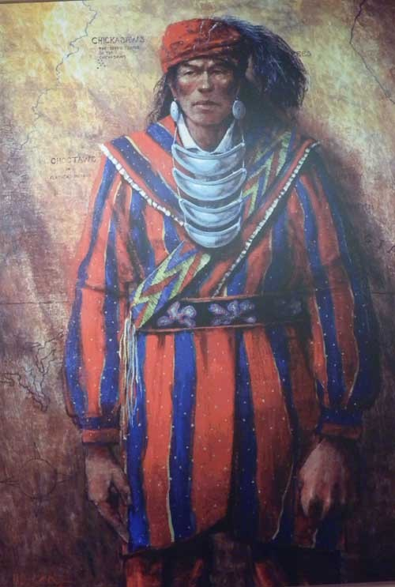  
전사 티쇼밍고(Tishomingo)의 모습

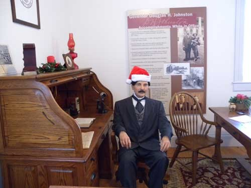  
초대 거버너 Douglas H. Johnston과 그의 집무실

모든 인디언 네이션들이 마찬가지이겠지만, 특히 우리가 찾은 치카샤 네이션은 가족과 민족 공동체, 역사 유산 등이 보존되고 확산되어온, 문화적 발효의 공간이었다. 국가가 부족의 독점적 운영권을 보장한 카지노들이 상당수의 인디언 부족들에서는 부족원들을 나태하고 해이하게 만드는 주범으로 지목되고 있지만, 이들은 그런 수입을 무의미하게 탕진하는 대신 2세 교육이나 산업에 대한 재투자를 통해 미래의 재원으로 만들어 나가고 있었다. 예컨대 자신들의 2세들이 돈 한 푼 내지 않고 대학을 다닐 수 있는 것도 바로 그런 투자의 좋은 사례임을 티쇼밍고 치카샤 뱅크 뮤지엄의 큐레이터는 적극 강조했다.

  
The Bank of the Chickasaw Nation 건물[현재는 박물관으로 쓰이고 있음]

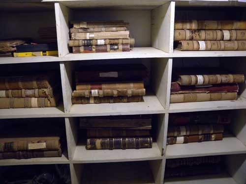  
뮤지엄 안의 각종 옛 서적 및 장부들

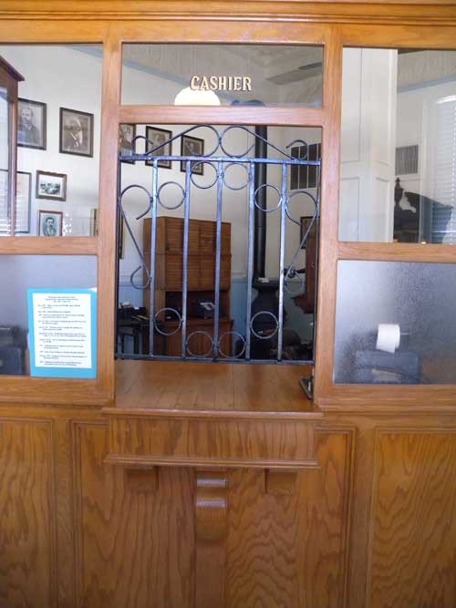  
뮤지엄 안의 캐쉬어 창구

  
뮤지엄에 소장된 당시 은행의 금고

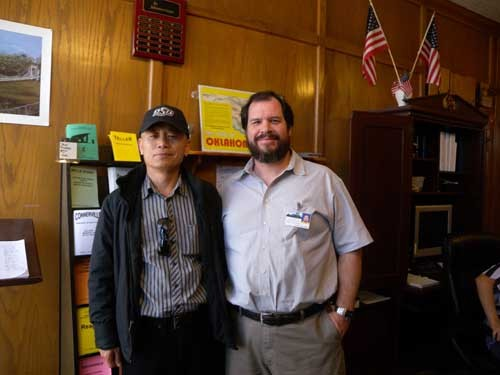  
뮤지엄의 큐레이터와 함께

티쇼밍고에서 30분 거리의 Chickasaw White House에서 읽어낸 그들의 정신도 그와 부합하는 것이었다. 1895년 오클라호마 밀번(Milburn)에 세워진 이 집은 1898년부터 1971년[이 해에 이 건물은 국가 등록 사적지로 지정되었음]까지 치카샤의 거버너 잔스턴(Douglas H. Johnston)과 그 후예들이 살던 저택이었다. 그런데, 왜 그들은 자신들의 거버너가 살던 집을 ‘White House’로 불렀을까. 백인 중심으로 꾸려가던 미합중국에 결코 꿇리지 않겠는다는 치카샤 나름의 민족적 자존심이 그런 이름으로 나타났을 것이다. 미국을 이끌고 나가는 백인들이 워싱턴에 ‘White House’를 갖고 있듯이 자신들도 이곳 오클라호마의 밀번에 자신들만의 ‘White House’를 갖고 있노라는 자존의식의 발로였을 것이다. 우리가 만난 치카샤 인들 모두 그런 자존심을 갖고 있었다.

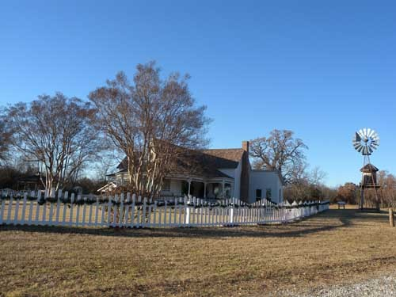  
Chickasaw White House

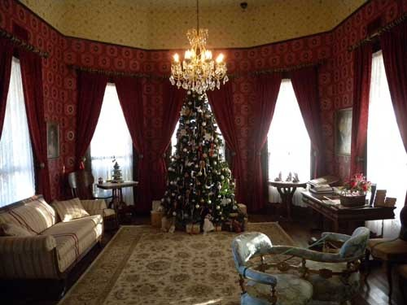  
화이트 하우스의 거실

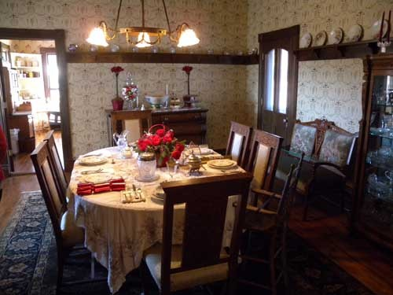  
화이트 하우스의 식당

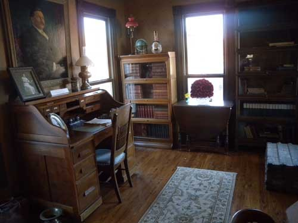  
화이트 하우스 주인의 서재

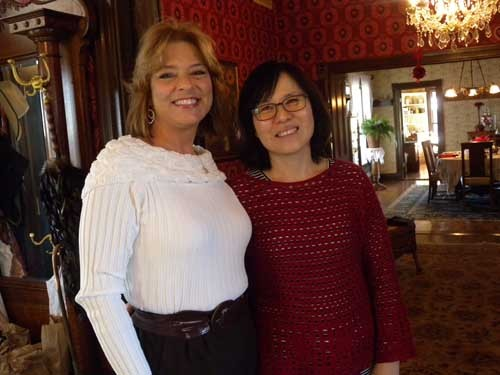  
화이트 하우스 안내원과 함께 한 멜라니

\*\*\*

우리는 밀번으로부터 한 시간 가량 달려 촉토 땅의 듀랭(Durant)이란 도시에 들어갔다. 우리의 관심은 이곳에 있는 ‘삼강 계곡 박물관[Three Valley Museum]’과 와쉬타 포트(Washita Fort)였다. ‘어쩌면 이곳에서 치카샤와 촉토의 겹치는 문화를 확인할 수 있지 않을까?’라는 기대를 안고, 도심의 작은 호텔에서 잠을 청했다.

\*치카샤 명칭 표기[Chickasaw/Chickasha]' 및 그 발음에 관한 문제

치카샤 컬츄럴 센터 큐레이터 들로리스(Deloris Jefferson)의 설명에 따르면, 치카샤 인들은 자신들의 명칭을 'Chickasha'로 적고 '치카샤'로 발음한다고 했다. 그러나 현재 미국의 공적인 문서들 대부분에는 'Chickasaw'로 적혀 있으며, '치카사' 혹은 '치카소'로 발음한다. 그러나 치카샤 인들은 미국식 보다는 자기들의 방식을 더 선호한다고 했다. 나는 'Chickasaw'라는 미국의 공식 표기를 존중하되, 치카샤 인들의 생각도 존중하여 실제 발음은 '치카샤'로 하고자 한다. 

\*\*치카샤 실[Seal, 문장(紋章)]에 대한 설명

원 안에 있는 치카샤 전사의 모습은 치카샤 인디언들이 예로부터 위대한 용기를 지닌 사람들임을 상징하고, 그가 들고 있는 두 개의 화살은 치카샤 부족사회의 두 분파를 의미한다. 그 전사는 동쪽에 있는 고향을 버리고 서쪽의 촉토 사람들의 땅으로 떠나기 전 마지막 추장 티쇼밍고다. 티쇼밍고는 치카샤 인들이 추앙하는 민족적 영웅이다. 티쇼밍고는 그의 부족원들과 함께 고향을 떠나 트레일 도중인 1838년에 죽었다. 치카샤 인들은 그들만의 네이션을 만들기 위해 1856년 촉토로부터 떨어져 나왔고, 네이션을 만들어 그 수도를 ‘티쇼밍고 시티’로 명명했으며, 문장(紋章)으로 그의 용기를 선양했다. 1867년 8월 16일, 새 치카샤 네이션의 헌법에 따라 만들어진 이 문장은 치카샤 네이션이 호클라호마 주에 편입, 해산될 때까지 모든 공식 서류들에 빠짐없이 첨부되어 왔다.

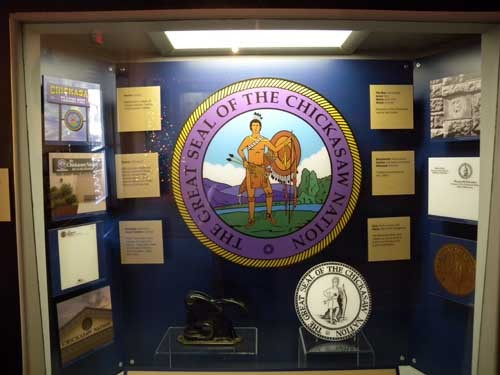  
치카샤 네이션 문장[紋章, seal]

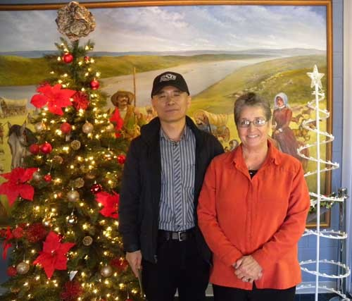  
Chickasaw Council Museum에서 컬렉션들을 일일이 설명해 준 큐레이터 Flora Fink

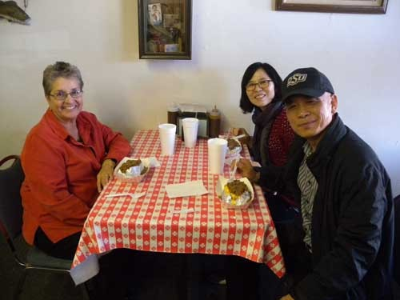  
다운타운의 치카샤 음식점에서 Flora Fink와 함께 한 점심

공유하기

게시글 관리

**백규서옥\_Blog ver.**