교육으로 일어선 촉토 족의 어제와 내일(1)

치카샤 땅인 티쇼밍고를 거쳐 촉토 땅인 듀랭(Durant)에 들어섰다. 이곳 사람들은 듀랭이 오클라호마 시티나 털사 이외의 지역들 가운데 가장 높은 성장률을 보이고 있으며, 미국에서 가장 빨리 성장하는 도시들 가운데 하나라는 자부심을 갖고 있었다. 특히 도심으로부터 겨우 10마일 이내에 미국 최대 인공호수들 중의 하나인 텍소마 호수(Lake Texom)가 있어 매년 8백만~1천만의 관광객이 몰리며, 해마다 메모리얼 데이에 이어 열리는 목련 축제에도 대규모의 관광객들이 밀려들 만큼 매력적인 도시라고 했다. 무엇보다 우리가 찾는 촉토 네이션의 본부[headquarter]가 있었으며, 규모 또한 촉토 네이션 안에서는 맥컬레스터[McAlester] 다음으로 큰 도시였다. 특이한 점은 주 의회에 의해 ‘오클라호마 목련의 수도’로 지정되었다는 점인데, 목련 축제 역시 그런 공식적인 인정에 의해 열리는 행사였다. 이곳에 있는 ‘남동부 오클라호마 주립대학[Southeastern Oklahoma State University]’의 캠퍼스는 ‘천 개의 목련꽃 캠퍼스[The Campus of a Thousand Magnolias]’라는 별칭을 얻을 정도로 이 도시는 오클라호마 주 안에서 목련꽃의 본고장인 셈이었다.

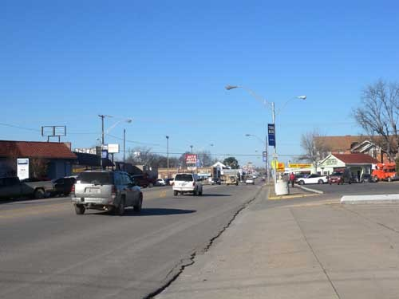  
듀랭의 다운타운

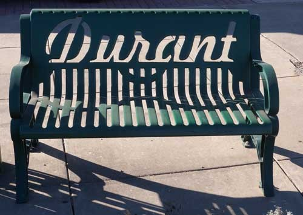  
듀랭 시가지에서 만난 의자. '듀랭'이란 글자를 아래쪽 햇살무늬와 어울리게 디자인한 점이 돋보임.

그러나 도시의 첫인상은 그리 밝거나 윤택하지 못했다. 한켠에 괴물처럼 서 있는 엄청난 규모의 회색 공장[정확한 것은 아니나 시멘트 공장 같은 느낌을 주었음]은 도시를 우중충하게 만들었으며, 다운타운의 상당수 비어있는 건물들도 기름기가 빠져 부분적으로 폐허와 같은 느낌을 주었다. 중소도시들의 경기가 나빠지자 사람들이 대도시로 이사 간 뒤 남겨진 집들을 처리하지 못한 까닭일 것이다. 관리되지 않는 빈 집은 도시 전체의 활력을 갉아먹고 있었다. 어떤 건물은 전통음식점으로 탈바꿈 되어 생명을 이어가는, 다행스런 모습도 보였으나, 전체 분위기를 추스르지는 못했다. 비교적 새로운 건물들이 들어서 있는 신시가지의 호텔에 잠자리를 정하고, 그 인근에서 저녁 한 끼를 해결한 우리는 이 도시에 큰 기대를 하지 않기로 했다. 아침 일찍 인근의 포트 와쉬타(Fort Washita)와 ‘삼강 계곡 박물관[The Three Valley Museum]’을 본 다음 다시 1박을 하게 될 아이다벨(Idabel)로 달려가기로 한 것이다.

사실 치카샤와 마찬기자로 촉토도 넓은 땅이었다. 원래의 면적을 반분하여 치카샤에게 넘겨 주고 남은 땅이었고, 평원뿐인 오클라호마 주에서 보기 드물게 산악[그렇다고 아주 높거나 험준하지 않은] 지역이 많다는 점 또한 특이했다. 대표적으로 Fort Washita와 Fort Towson 등의 군사기지들이 있을 만큼 고지대였고, 동북쪽으로 이어지는 산악을 따라 수많은 호수들, 계곡들을 기반으로 하는 주립공원들이 집중된 곳이 바로 촉토 네이션이었다. 촉토는 이런 지형을 가진 11개의 카운티[휴즈(Hughes)/코울(Coal)/아토카(Atoka)/브라이언(Bryan)/피츠버그(Pittsburg)/하스켈(Haskel)/래티머(Latimer)/푸쉬마타하(Pushmataha)/촉토(Chocktaw)/르 플로어(Le Flore)/맥커튼(McCurtain)]에 총 인구 256,598명, 29,594 km로, 치카샤에 비해 인구는 적으나 면적은 약간 큰 규모였다.

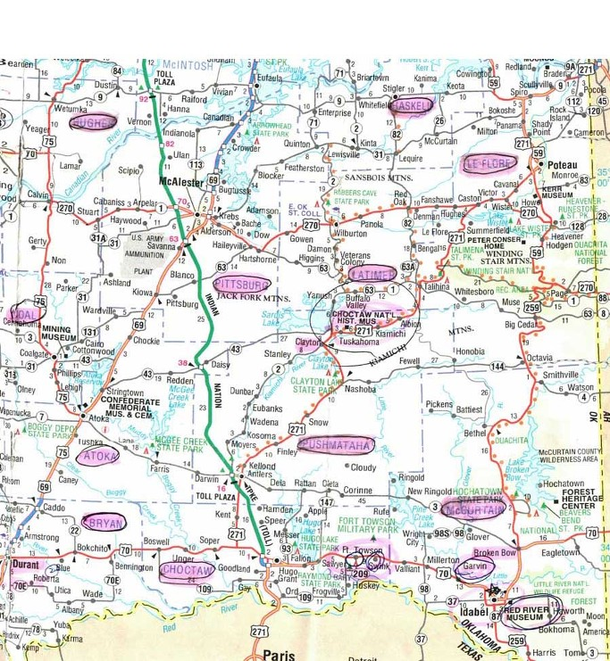  
최신 지도에 표시한 촉토 네이션 관내 카운티들

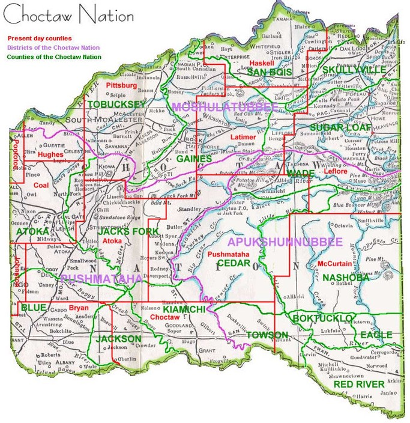  
촉토 네이션 내 각 카운티 분할도

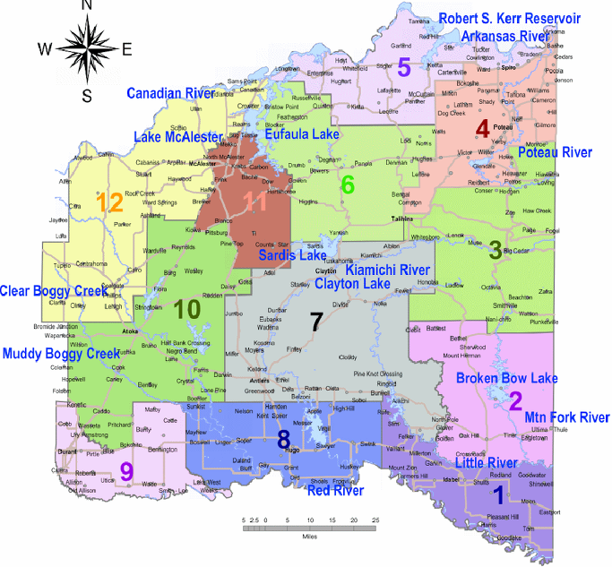  
촉토 네이션의 강, 호수. 도시 등이 표시된 지도

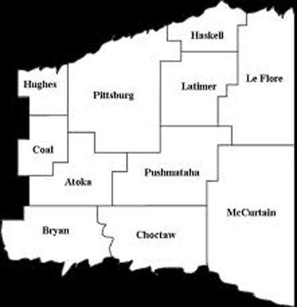  
촉토 네이션의 관내 카운티 표시 지도

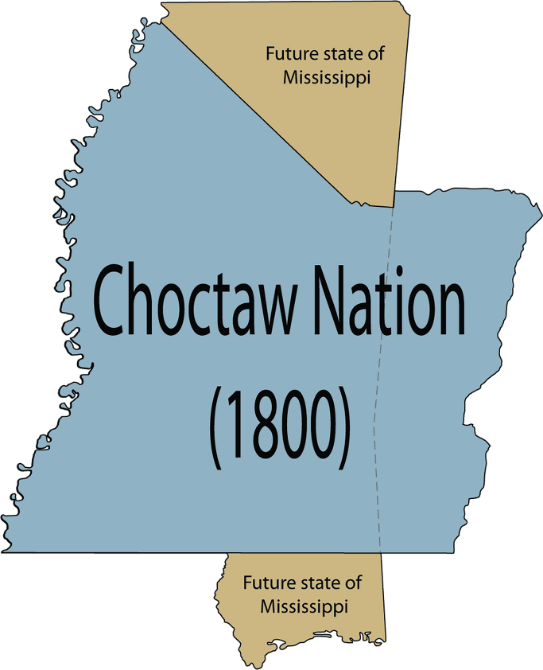  
1800년 당시 촉토 족 영역

\*\*\*

그렇다면 촉토 족은 어떤 사람들이었을까. 치카샤 지역에서 만난 어떤 지식인은 촉토 족이 원래는 자신들과 동조동근(同祖同根)이었다가 나중에 갈라졌다고 했으나, 나는 아직 문헌으로 확인하지 못했다. 그들은 무스코기 어족[Muskogean Linguistic Family]의 일원이고, 유럽에서 건너 온 백인들과 접촉하기 전까지 천년 이상을 미시시피 강에서 번성하던 ‘마운드 빌딩[mound-building, 무덤이나 흙 둔덕을 남긴 선사시대 북미 인디언 제 부족의 건축양식]’과 ‘옥수수 주식 기반[maized-based]’ 사회에 뿌리를 둔 부족이었다. 그들 역시 치카샤와 마찬가지로 에르난도(Hernando de Soto)가 이끄는 스페인 탐험대와 피나는 싸움을 벌이기도 했으나, 그로부터 2세기 뒤에는 유럽의 무역상들을 받아들여 거래하기 시작했다. 당시는 워싱턴 대통령이 인디언 부족들을 통합하여 유럽계 미국인 문화에 적응시키고자 했고, 많은 촉토인 들도 이미 백인들과 결혼하기 시작했으며, 기독교를 신봉하거나 백인들의 관습으로 전환하기도 했다. 이런 이유로 촉토는 체로키, 치카샤, 크리크, 세미놀 등과 함께 ‘문명화된 다섯 종족[Five Civilized Tribes]’으로 불리게 된 것이다.

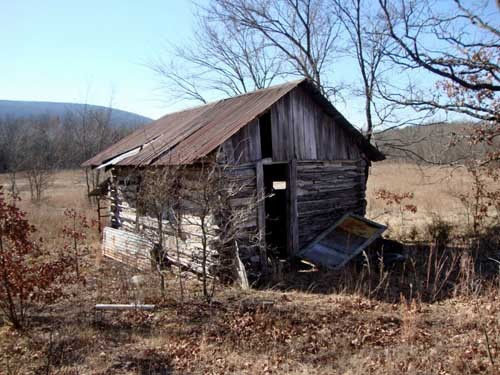  
당시 촉토족의 오두막집

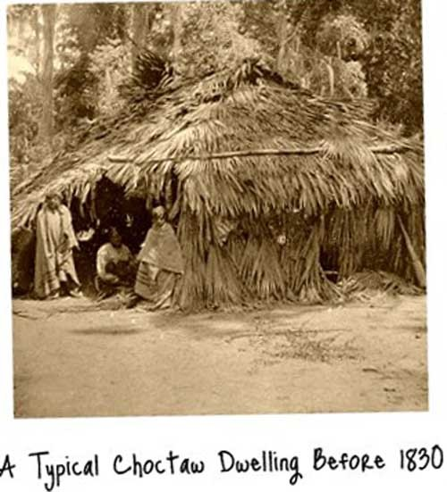  
1830년대 이전 촉토족의 움집

다른 부족들과 마찬가지로 이들 역시 ‘눈물의 여정[Trail of Tears]’을 겪었다. 촉토는 1786년 ‘호우프웰의 조약[Treaty of Hopewell]’을 시작으로 남북전쟁 이전 이미 미국정부와 9개의 조약을 맺은바 있었다. 물론 모두 미국과 촉토족 사이의 경계를 확정하거나 평화적인 관계를 수립하자는 것이 그 조약들의 공통된 목적이었다. 그러나 그 후 미국 정부는 촉토와의 경계선을 재조정하거나 심지어 촉토로 하여금 수백만 에이커의 땅을 포기하도록 강요하기도 했다. 결국 1830년 미국 정부는 조상 대대로 물려 내려온 촉토 땅을 빼앗고, 미시시피 강 서쪽 인디언 구역에 그들을 몰아넣고 말았다. 그곳으로 옮기는 과정이 바로 ‘눈물의 여정’이었고, 그 여정 중에 2,500여명이 죽었다. 그런 쓰라림을 겪은 그들이었지만, 그들의 심성은 모질지 않았다. 새로운 땅에서 필사적인 노력으로 생업을 일으켰고, 자신들의 새로운 헌법과 자치제도를 만들었다. 학교와 교회들을 세웠고, 감자 흉년으로 기근이 들었을 때에는 돈을 거두어 고통을 함께 하기도 했다.

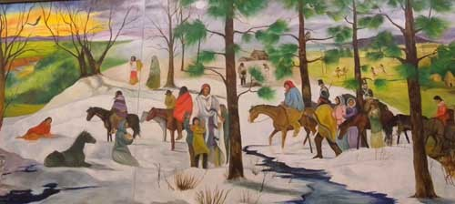  
촉토족이 겪었던 '눈물의 여정' 그림

그러나 무엇보다 중요한 것은 그들이 미국정부를 원망하지 않았다는 것이다. 결혼이나 교육을 통해 미국인이 되기 위해 노력했고, 제1차 세계대전에는 많은 부족의 젊은이들이 참전하여 큰 전공을 세웠으며, 한국전에도 많은 젊은이들이 참전하여 이들 중 전사한 사람도 16명이나 된다는 것이었다.[‘미국통신 41’ 참조] 특히 1차 세계대전에는 촉토어가 연합군의 암호로 채택됨으로써 암호 해독병으로 많은 젊은이들이 활약했으며, 그 중 다섯 명은 대통령의 훈장까지 받게 되었다고 한다.['미국통신 41' 참조]

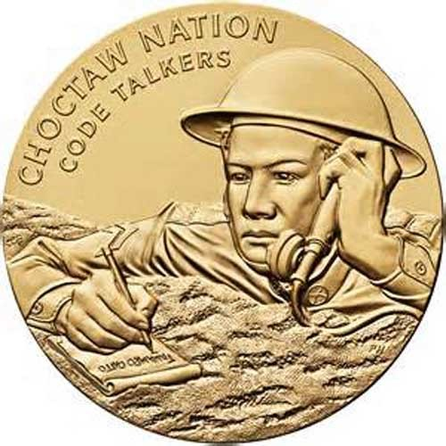  
1차대전에 참여하여 큰 공을 세운 촉토 족 암호해독병 기념 메달

\*\*\*

우리는 아침 일찍 포트 와쉬타(Fort Washita)를 찾아 이곳에서 같은 국민들이 편을 갈라 싸운 전쟁의 참화와 비극을 확인하기로 했다. 다운타운에서 진지까지 30분 정도 걸리는 길은 호수와 숲이 어우러진, 환상적인 경관의 연속이었다. 전적지 문을 들어서자 사방에 밑동만 남은 채 당시의 건축물들은 대부분 사라지고 없었다. 사무실로 들어가자 안내원이 남군과 북군으로 갈려 싸우던 당시의 상황을 특유의 남부 사투리로 실감나게 설명했다.

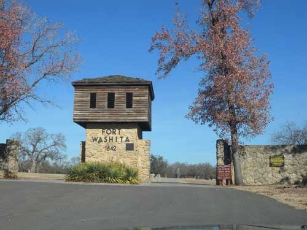  
포트 와쉬타 정문

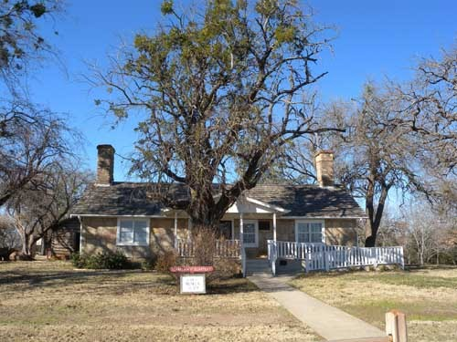  
포트 와쉬타 전시 및 행정실

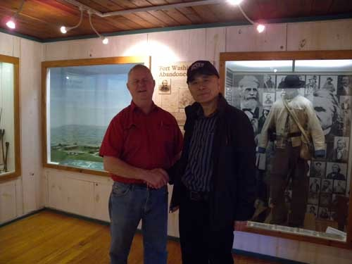  
안내원의 설명을 듣고나서

설명을 들은 후 우리는 전쟁의 폐허를 직접 만져 보기로 했다. 참호들, 중대 막사, 포대, 주방 등이 곳곳에 널려 있었고, 전몰자들을 묻은 공동묘지가 한켠에 있었다. 그리고 ‘골드 러쉬(Gold Rush)’ 당시 캘리포니아 행 열차가 이곳에서 출발했음을 알려주는 객차 한 량도 전시되어 있었다. 드넓은 황야에서 ‘돈을 캐러’ 몰려다니던 당시 백인들의 충혈된 눈동자가 폐허들 곳곳에 박혀 있는 듯 했다. 전쟁 당시 이곳 인디언들은 ‘남부 연합군’에 소속되어 있었고, 그들 가운데서 장군까지 배출되었다. 돈이 많고 대오(隊伍)가 정렬되어 있던 북군과 달리 옷도 장비도 시원치 않고 무엇보다 훈련이 제대로 되어 있지 않았을 남군의 초라한 모습이 벽면 가득 그려져 있었다. 이 진지에도 인디언의 흔적은 그렇게 남아 있었다.

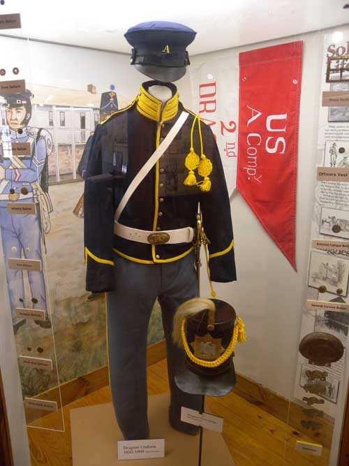  
남북전쟁 당시 북군의 복장

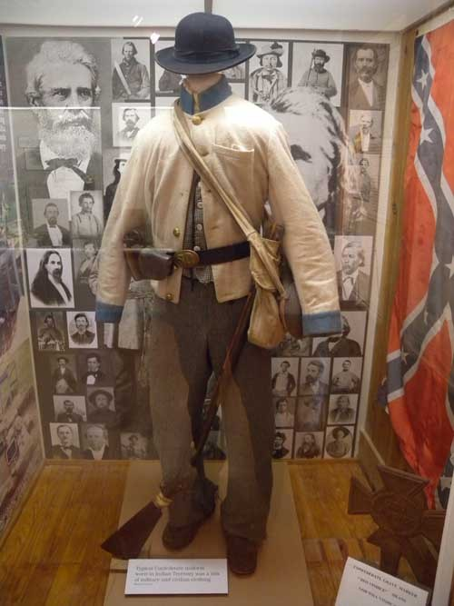  
남북전쟁 당시 남군의 복장

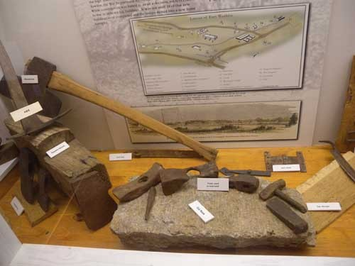  
유적지에서 나온 연장들

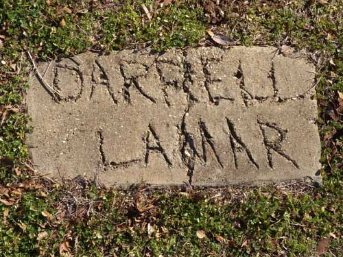  
남북전쟁에서 전사한 용사 Darrel Lamar의 묘

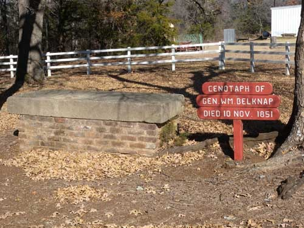  
남북전쟁에 참여한 벨크납(W.M. Belknap) 장군의 묘와 기념비

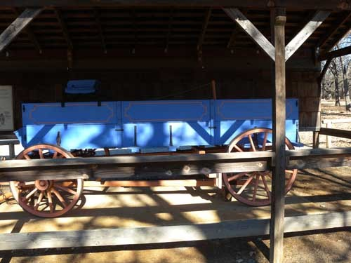  
골드러쉬 당시 캘리포니아로 떠나던 열차의 한 부분.

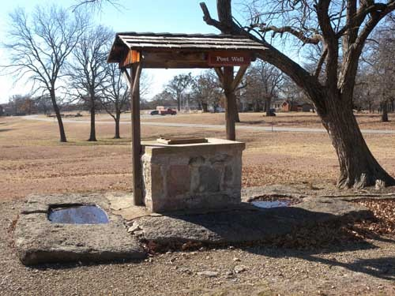  
전쟁 당시 사용하던 우물

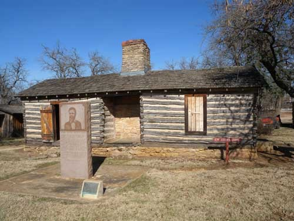  
남북전쟁 때 남부연합군의 더글러스(Douglas Hancock Cooper)장군이 기거하던 집

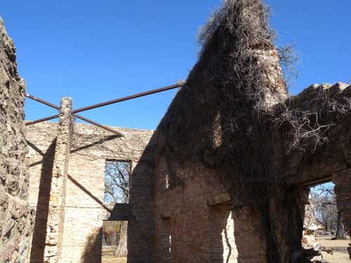  
남북전쟁 때 남군의 중대 막사

우리는 듀랭의 다운타운으로 귀환하여 앤틱 풍의 식당에서 이곳 전통음식으로 시장기를 지운 뒤 ‘삼강계곡 박물관[Three Valley Museum]’을 찾았다. 삼강(三江)이란 ‘Blue River, Red River, Washita River’ 등인데, 1976년 개관한 이 박물관의 이름은 듀랭에 관한 맥 크리어리(McCreary)의 책 “Queen of Three Valleys”에서 따왔다고 한다. 듀랭 역사학회에 의해 운영되는 이 박물관의 핵심 컬렉션은 생활사 자료들이었다. 1873년에 시작된 브라이언 카운티와 듀랭을 대표하는 박물관을 만드는 것이 이 학회의 목표로서, 이곳에 소장•전시된 모든 컬렉션들은 시민이나 관광객들, 연구자들이 모두 즐기고 참고할 수 있도록 하는데 초점을 맞추었다는 것이 안내원의 설명이었다. 그러나 안내원의 설명에 비해 실제 컬렉션들은 우리가 이미 보아 온 지역의 어느 박물관에 비하더라도 양적으로나 질적으로 낫다고 할 만한 것들이 없었다. 그런 실망감 속에 박물관을 떠나 촉토 네이션 본부와 다운타운을 둘러 본 다음 듀랭을 떠날 수밖에 없었다.<계속>

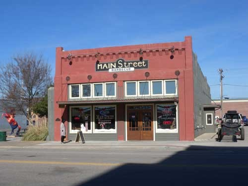  
듀랭의 다운타운에서 만난 이 도시의 전통음식점[Main Street Barbecue]

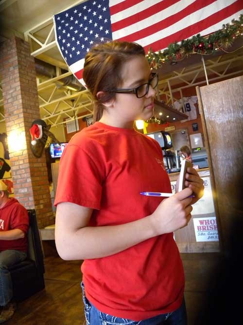  
Main Street Barbecue에서 주문을 받고 있는 종업원 Hailey양. 매우 친절하고 상냥하고 명랑했음.

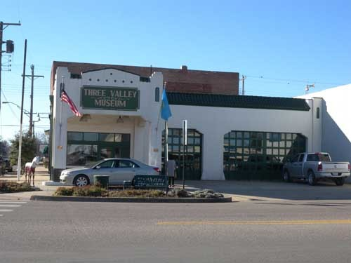  
듀랭 다운타운의 '삼강계곡 박물관'[Three Valley Museum]

  
박물관에 전시된 농기구

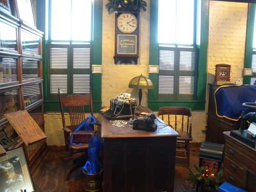  
박물관에 통째로 기증, 전시되고 있는 'J.R.Jarrell & Co.'사무실

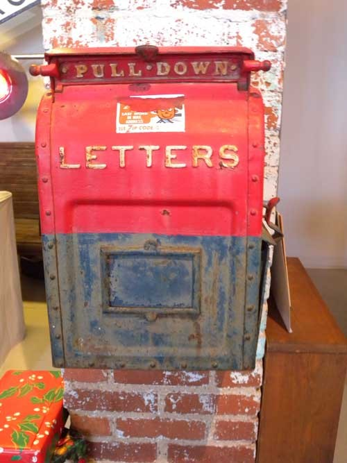  
박물관에 전시되고 있는 옛날 우체통

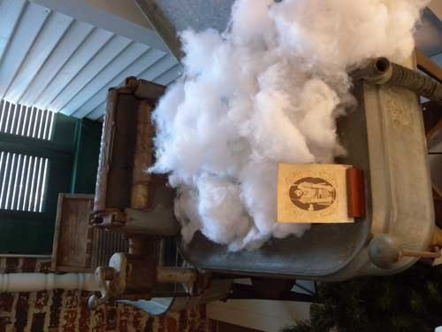  
박물관에 전시중인 옛날 솜틀기계

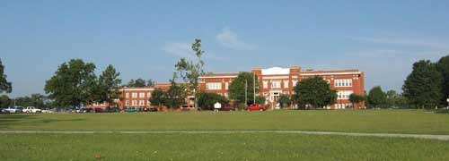  
듀랭에 있는 촉토 네이션 본부

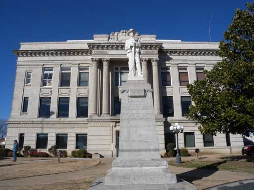  
듀랭에 있는 Bryan County 청사

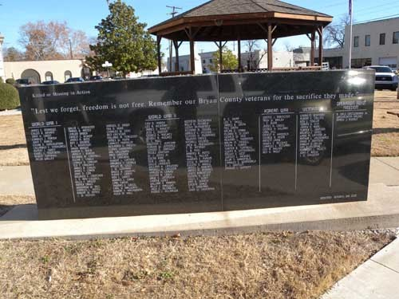  
전 세계의 전장에서 죽은 이 지역 군인들의 명단을 새겨 놓은 비석

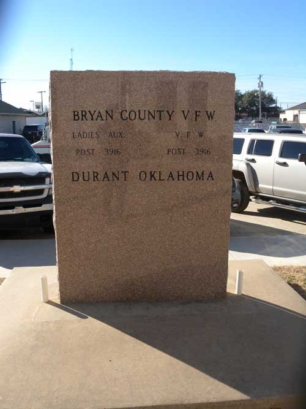  
전몰용사들을 추모하는 사업을 하고 있는 브라이언 카운티 재향군인회

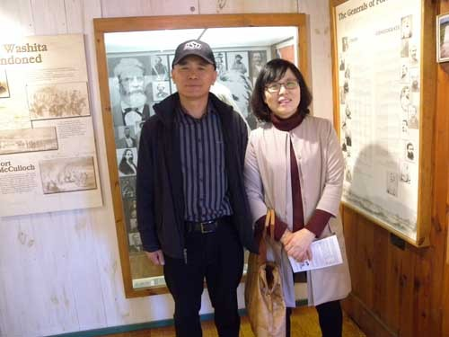  
포트 와쉬타 전시실에서

공유하기

게시글 관리

**백규서옥\_Blog ver.**