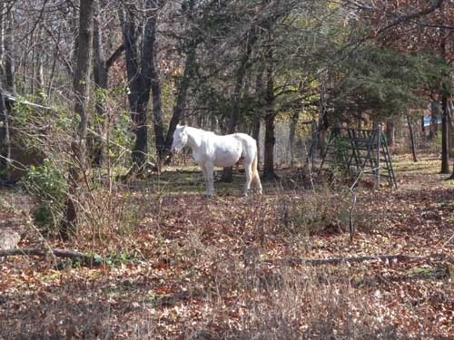

새해인사

계사년이 저물고, 대망의 갑오년이 밝았습니다.

미국의 이 지역은 한국에 비해 14시간이 늦은 관계로 이제야 새해인사를 올리게 되었습니다.

우선 사건도 많고 말도 많았던 지난해를 무탈하게 넘기시고 새해를 맞이하신 백규서옥 손님 여러분께 진심으로 큰 복을 빌어드리고 싶습니다.

요즘 들어 우리나라는 여러 면으로 복잡해지고, 그에 따라 개인들도 살아가기가 수월치 않은 게 사실인 것 같습니다. 제가 체류하고 있는 오클라호마 주의 반 밖에 안 되는 면적에 5천만의 인구가 살고 있으니, 많은 갈등과 다툼이 생겨날 것은 당연하겠습니다만. ‘원칙과 법치’, ‘양보와 신뢰’만이 그나마 우리의 혼란을 수습할 수 있는 묘책이라 생각하고 있습니다.

지난 한 해 제게도 좋은 일, 궂은 일 등 곡절이 적지 않았습니다. 재직하는 학교에서 그 학교의 첫 ‘아너 펠로우 교수(Honor Fellowship Professor)’로 선정된 일과 ‘풀브라이트(Fulbright) 지원 학자’로 선정되어 미국에서 연구와 재충전의 기회를 제공받은 일은 제 일생을 통해 가장 과분한 영예라 할 수 있습니다. 그 덕에 ‘도전과 힐링(healing)’이란 목표를 갖고 미국으로 건너 올 수 있었습니다. 그러나 예정 기간의 반 이상을 보낸 지금 그 목표가 얼마나 달성되었는지 반성하며 스스로 자책하고 있습니다. 그 반면에 약간 서운한 일도 물론 있었습니다. 인간 사이에서 오고가는 거짓이나 술수만큼 사악한 행위도 없을 것입니다. 뻔히 알면서도 겪은 경우는 올해가 처음입니다만. 그 모든 것들이 제 모자람에서 기인한 것이라 치부하고, 오히려 자신을 닦달하며 사랑으로 감싸 안으려 노력하는 중입니다. 그리고 그들도 결국 참회의 눈물을 보이며 돌아올 것으로 믿고 있습니다.

국가든 직장이든 개인이든, 새해엔 많은 시련과 도전에 직면하리라 생각합니다. 주변의 여건들이 결코 만만해 보이지 않는 요즈음입니다. 이런 때일수록 ‘중심을 잡는 일’이 가장 중요하다고 봅니다. 국가도, 직장도, 개인도, 중심이 없으면 허물어질 수밖에 없기 때문입니다. 학자로서의 중심을 다잡으려는 것이 올 한 해 견지하고자 하는 목표이자 과제입니다. 여러분께 많은 지도와 편달, 부탁드립니다.

모쪼록 여러분 모두 건강하시고, 가정에 평화와 행복이 가득하시길 빕니다.

2014년 새해 아침에

백규 올림

공유하기

게시글 관리

**백규서옥\_Blog ver.**