교육으로 일어선 촉토 족의 어제와 내일(2)

xml:namespace prefix = "o" /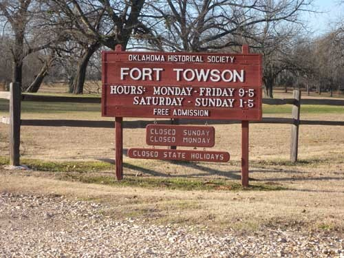  
                                                   포트 토우손 표지판

 

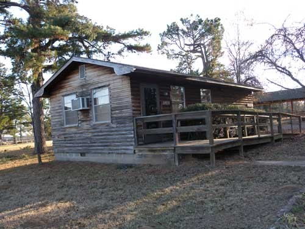  
                                  포트 토우손 관리 및 소 전시실

 

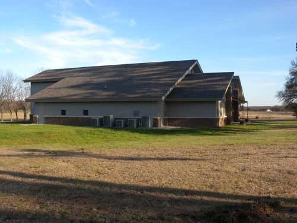  
                            포트 토우손 내 뮤지엄. 우리가 방문했을 때는 닫혀 있었음.

 

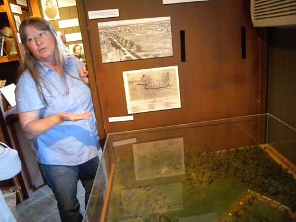  
                         포트 토우손의 역사를 설명하고 있는 안내원

 

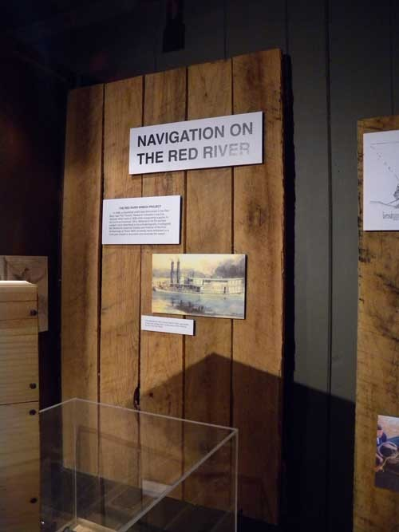  
     포트 토우손이 레드 리버에 배를 띄우던 출발점이었음을 나타내는 유물들

 

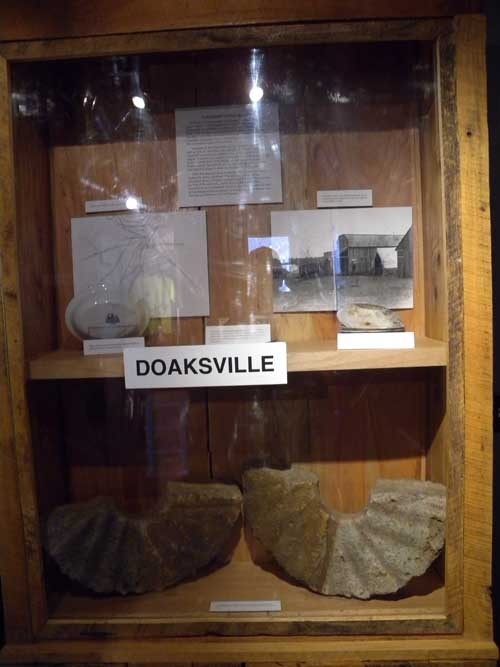  
                     남군이 북군에게 최종적으로 항복한 독스빌의 유물들

 

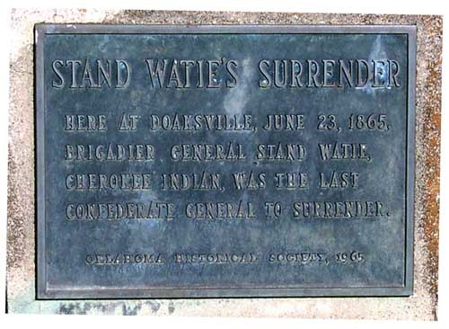  
남부연합군을 이끌던 체로키 인디언 출신의 스탠드 웨이티 준장이 항복한 사실을 기념한 동판 

 

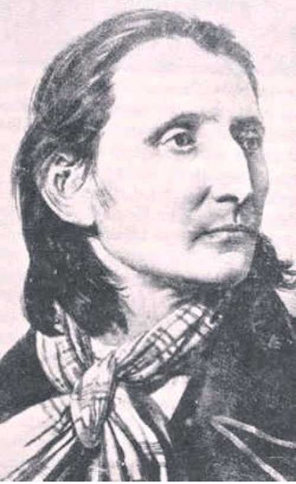  
                           Peter Pitchlynn, 당시 촉토 족 대표[Principal Chief]

 

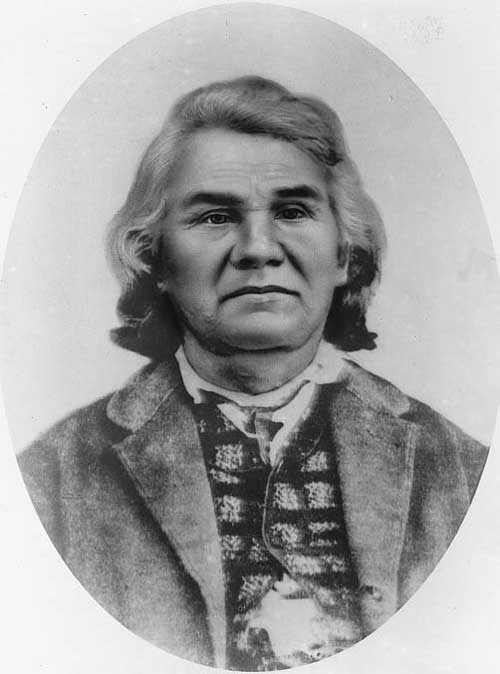  
                               당시 남부연합군을 이끌던, 체로키 족 출신의 Stand Watie 장군

 

듀랭을 떠난 우리는 70번 하이웨이를 타고 촉토 카운티를 지나 아이다벨(Idabel)로 향했고, 중간에 포트 토우손(Fort Towson)을 들렀다. 아이다벨에서 1박을 한 다음 날 다운타운 바깥의 레드 리버 뮤지엄(Museum of the Red River)과 브로컨 바우(Broken Bow), 휴고(Hugo)의 휠락아카데미(Wheelock Academy)를 거쳐 투스카호마(Tuskahoma)의 촉토 내셔널 뮤지엄(Choctaw National Museum)까지 가야 하는 대장정이 기다리고 있기 때문에 서두르지 않을 수 없었다. 다음날까지 촉토 장정을 마쳐야 느긋한 마음으로 위워카(Wewoka)에 있는 세미놀 내셔널 뮤지엄(Seminole National Museum)을 들를 수 있기 때문이었다.

포트 토우손은 휴고로부터 11마일쯤 동쪽으로 떨어진 곳에 있는 인구 600여명의 소도시로서 그 외곽에 옛날 진지의 흔적이 남아 있었다. 원래 이 진지는 남쪽에 있던 멕시코와 그 멕시코의 관할 하에 있던 텍사스로부터 인디언 구역의 경계선을 보호하기 위해 만들어졌으며, 그 지역에 인디언이 떠나고 촉토 족이 재정착한 후에는 1마일 서쪽의 독스빌(Doaksville)을 지키기 위해 이 진지는 다시 활성화 되었다.

그런데 역설적인 것은 독스빌이 남부연합군에 가담한 촉토 족들이 남북전쟁에서 패하고 북군에게 항복한 현장이라는 점이었다. 즉 1865년 6월 23일 남북전쟁 당시 마지막 남부연합군의 지상 전력이 항복한 현장이 바로 포트 토우손이었고, 당시 체로키 출신 지휘관이었던 스탠드 웨이티(Stand Watie) 준장이 휴전 및 항복 조건들에 합의한 다음 촉토 군 대대를 전장으로부터 빼냈다고 한다. 바로 그 현장에 우리가 간 것이었다. 촉토 족의 땅이었으면서도 남북전쟁에서 패배함으로써 촉토 전사들이 크게 수모를 당한 역사의 현장이었다는 점에서 매우 흥미로웠다. 그래서인지 진지에서 만난 안내원도 이곳에서 전투가 있었는지 여부에 대해서 잘 모르고 있었다. 말하자면 큰 전투는 없었고, 다만 전투가 마무리된 곳일 뿐이었다.

토우손을 거쳐 들어간 아이다벨은 비교적 넓고 큰 도시였으나, 쇠락한 다운타운이 도시 전체의 활력을 갉아먹고 있다는 점에서는 앞서 1박을 한 듀랭과 마찬가지였다. 다행히 도시 외곽에서 비교적 깨끗한 숙소를 찾았고, 저녁식사로 멕시칸 레스토랑에서 예상치 못한 미각을 맛보는 행운까지 누리게 되었다.

다음 날 이른 시각에 찾은 곳이 바로 ‘레드 리버 뮤지엄(Museum of the Red River)’. 멋진 외관의 단층 건물이었다. 일찍 도착한 까닭에 한참을 기다린 뒤 10시가 되어서야 입장할 수 있었다. 1975년 개관했다는 이 박물관은 특이하게도 선사시대부터 오늘날까지 여러 분야에 걸친 컬렉션들이 갖추어져 있었다. 눈에 띄는 컬렉션들은 이 지역 원주민인 캐도(Caddoan)공동체의 예술품들, 콜럼버스 시대 이전의 물건들, 원주민들의 민족지적(民族誌的) 작품들, 현대 원주민의 예술작품들, 미국 전역의 공예품들, 아프리카•동아시아•태평양 제도(諸島)의 대표적 예술품들 등등, 다양했다.

우리가 특별히 관심을 갖게 된 대상은 도자기 등 생활예술의 빼어난 수준을 보여주는 캐도 공동체의 존재였다. 캐도는 전통적으로 지금의 동 텍사스, 북 루이지애나, 남 아칸사와 오클라호마 등지의 원주민 종족 연합체를 말한다. 말하자면 ‘다종족 원주민 연합체’가 바로 캐도인 셈이다. 현재 오클라호마 캐도 네이션은 빙거(Binger)에 수도를 갖고 있는, 단일 연합체다. 우리가 얼마 후에 캐도 네이션을 답사할 예정으로 있지만, 아이다벨의 이 박물관에서 그들의 생활예술품들을 접한 것은 일종의 행운이었다. 색상이 밝고 디자인이 아름다웠으며, 실용성을 겸한 점이 우리의 전통예술과 비슷하다는 느낌을 주었다. 그러나 최근에 만든 작품들이 대부분이어서 그 역사성을 찾아보기에는 한계가 있었다. 캐도 예술품들 외에 다른 지역의 것들도 많았으나, 우리의 답사 목적이 주로 이 지역 원주민들의 삶과 역사인 만큼 이 박물관이 소장하고 있는 다른 나라나 지역의 것들은 우리의 관심 밖이었다. **(계속)**

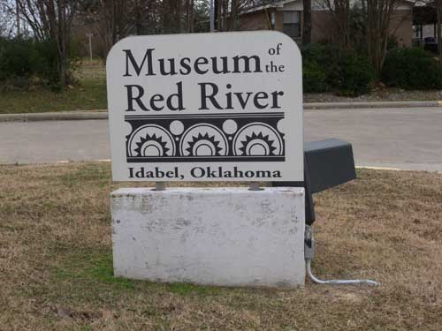  
레드 리버 뮤지엄 표지석

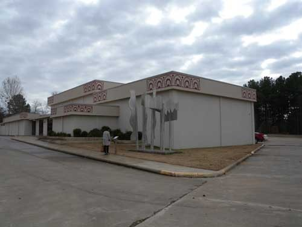  
레드 리버 뮤지엄 건물

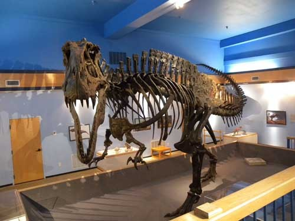  
티라노소러스 골격 모형(이 지역에서 발굴된 것을 복원, 모조한 것)

  
여성의 스커트[1957년 플로리다 거주 세미놀(Seminole) 족인 메리 카피지(Mary Coppedge)가  
만든 작품]

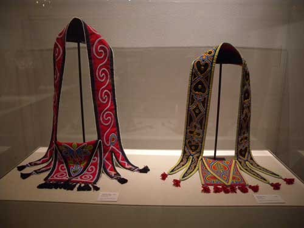  
숄더 백[1994년 크리크-세미뇰 족 출신 제이 맥거트(Jay McGirt)가 만든 작품]

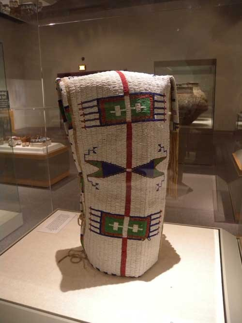  
플레인스 인디언 족의 부드러운 요람[1890년 경 수(Sioux) 족이 만들어 쓰던 것]

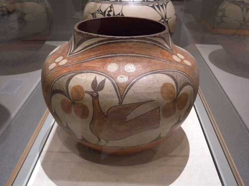  
1900~1930년경 뉴멕시코의 푸에블로 족이 만든 동이

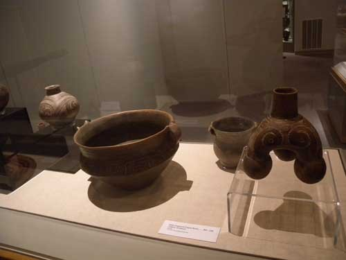  
무늬가 새겨진 세 발 달린 병[800~1200년 사이, 남동부 캐도 족의 생활용품]

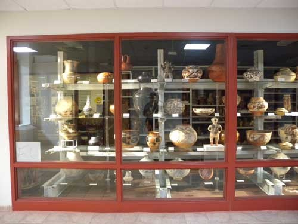  
캐도 족 등 이 지역 인디언들의 도기들

공유하기

게시글 관리

**백규서옥\_Blog ver.**