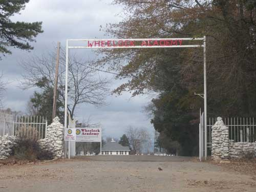  
휠락 아카데미 입구

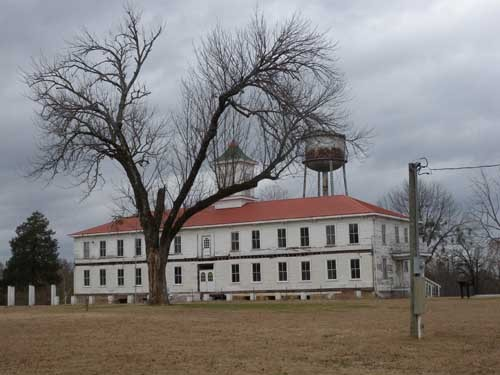  
휠락 아카데미의 관리동 건물[Administration Building]

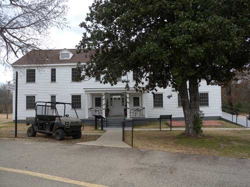  
휠락 아카데미 박물관(Wheelock Museum]

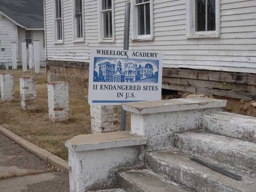  
미국에서 가장 위험한[붕괴의 위험이 높은] 11개의 건물에 포함된 휠락 아카데미

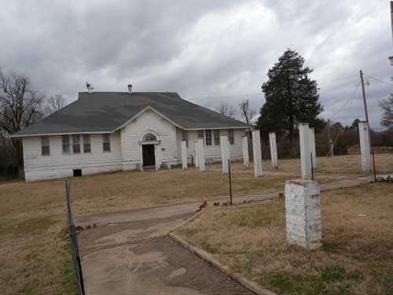  
휠락 아카데미의 한 부분

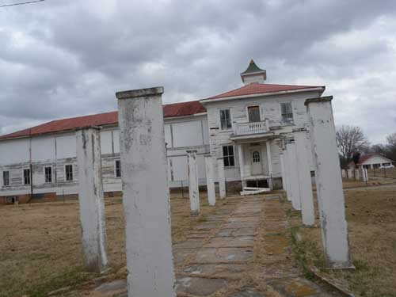  
휠락 아카데미의 기숙사(?)

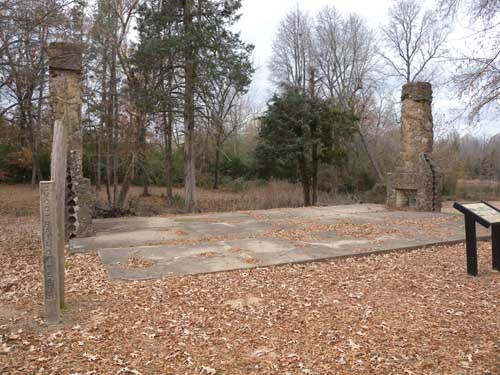  
손님들이 묵던 '객사' 터[Eagle Creek Guest Cottages]

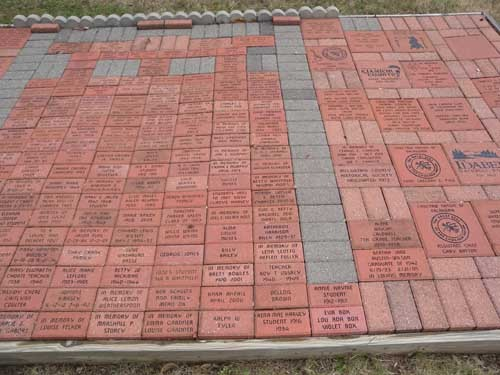  
휠락 아카데미 박물관 앞에 벽돌에 새겨 만든 기증자들 명단

교육으로 일어선 촉토 족의 어제와 내일(완)

레드 리버 뮤지엄 관람을 끝으로 아이다벨을 떠나 다시 70번 하이웨이를 타고 20분 정도 가니 맥커튼(McCurtain) 카운티의 밀러튼(Millerton)이란 작은 도시가 나왔고, 다운타운 직전에 오른쪽으로 빠져 나가 10분 정도 달리니 산 속 조용한 곳에 제법 큰 규모의 학교 휠락 아카데미(Wheelock Academy)가 나타났다. 촉토 족의 선진성과 교육열을 상징하는 교육기관이다. 들어가니 드넓은 언덕 위에 여러 채의 건물들이 서 있었는데, 대체로 낡아서 어떤 건물은 금방 무너질 것 같았다. 1832년에 건립되었고, 가장 이른 교육기관들 가운데 하나다. 우리가 거쳐 온 밀러튼의 북동쪽 1~1.5마일, 아이다벨의 북쪽으로 10~12 마일쯤 떨어진 곳에 있었다.

사실 이 학교는 어린 소녀들을 위한 미션 학교로 시작되었다. 무어(Moor)의 인디언 학교 설립자인 엘리저 휠락(Eleazar Wheelock) 목사의 이름을 교명으로 딴 것인데, 무어의 인디언 학교는 나중에 다트머스 칼리지(Dartmouth College)로 이름을 날리게 된다. 1839년에 기숙사에 입사하려는 학생들이 몰리자 캠퍼스 건물에 두 층의 기숙사가 증축되기도 했다. 1842년 촉토 네이션의 첫 아카데미가 된 이 학교는 다섯 문명화된 인디언 종족들에 의해 학교 시스템의 모범적 사례로 활용되곤 했다. 휠락의 교사들은 교육자이자 선교사 역할을 담당했다.

그들은 교과목[가정경제, 영어, 지리, 역사, 과학]은 물론 바이블을 가르치고 매사에 행동으로 모범을 보임으로써 학생들에게 큰 영향을 주었다고 한다. 오전 5시간 동안 이런 교과목들은 가르치고, 오후에는 4시간 동안 물레 돌리기, 베짜기, 뜨개질, 바느질, 재봉질 등 가사(家事)에 도움 되는 과목들을 가르쳤다 한다. 남북전쟁 때 폐쇄되었었고, 1869년 화재로 상당 부분이 소실되었으며, 그 뒤 많은 우여곡절들을 겪은 뒤, 현재 이 학교는 오클라호마 주에서 가장 위험에 처한 역사 자산의 리스트에 오르게 되었다.

참으로 놀라운 일이었다. 이들이 이른 시기에 풍광 좋은 곳에 기숙학교를 건립하고 2세 교육에 열을 올렸다는 것은 무엇을 의미하는가. 아메리카 인디언들이 ‘미개하다’는 우리의 편견을 송두리째 부정하는 증거가 아니고 무엇인가. 이주해온 백인들에게 무참하게 당하고 난 그들이 절실하게 깨달은 것은 2세 교육이었다. 지배자들을 넘어서기 위해서는 그들보다 월등하게 머리를 써야 한다는 사실을 알게 된 것이었다. 휠락 아카데미는 바로 그 생생한 증거였다.

\*\*\*

휠락 아카데미를 출발한 우리는 래티머(Latimer) 카운티, 투스카호마(Tuskahoma)의 촉토 내셔널 히스토리 뮤지엄(Choctaw National History Museum)으로 달렸다. 계속 이어지는 키아미치 산맥(Kiamichi Mountains)은 평원 일색인 오클라호마 주의 일반적인 모습과 전혀 달랐다. 산들은 높지 않았으나, 주변의 숲이 울창하고 왕래하는 차들도 없는 산길이 호젓했다. 하늘은 흐려오고, 바람도 슬슬 불기 시작했다. 일기예보를 보고 온 우리의 초조한 마음과 달리 한가하게 풀을 뜯고 있는 주변 목장의 소들이 부러웠다. 휠락으로부터 두 시간을 족히 달려 간신히 투스카호마의 뮤지엄에 도착하니, ‘날씨 때문에 일찍 퇴근한다’는 안내문이 출입문에 붙은 채 닫혀 있었다. 이 뮤지엄을 본 다음 세미뇰 네이션까지 가려던 계획에 차질이 생기기 시작한 것이다. 투스카호마에는 잘 곳도 없었다. 궁여지책으로 20분 거리의 클레이튼(Clayton)으로 이동, 마을에 하나밖에 없는 모텔에서 하루를 묵을 수밖에 없었다.

이튿날, 일찍 뮤지엄에 도착하니 직원들이 막 출근해 있었다. 겉모양처럼 뮤지엄의 내부도 아름답게 꾸며져 있었다. 촉토 인들의 생활사, 네이션의 지도자들, 군인들 특히 암호 해독병들의 활약상, 휠록 아카데미를 비롯한 교육의 현장, 민속자료, 예술작품 등등. 많은 컬렉션들이 촉토의 역사와 문화에 대한 설명으로 집중되어 있었다. 이곳에도 ‘눈물의 여정(Trail of Tears)’은 강조되어 있었다. 국가 권력에 의해 고향으로부터 쫓겨나 다른 지역에 강제로 정착했던 참담한 기억은 이들에게도 일종의 ‘집단적 트라우마’로 남은 듯 했다. 뮤지엄 건물 밖에도 볼 것들이 많았다. 그들이 숭상해오던 ‘붉은 전사(Red Warrior)’상, 부족의 지도자들, 전몰용사 추모비[그 가운데 6•데25 당시 희생자들의 추모비도 있었다. 미국통신 41 참조] 등이 있었다. 길 건너에는 촉토 족의 전통마을이 조성되어, 주거환경, 공동체 활동 등 그들의 옛날을 보여주고 있었다.

\*\*\*

현장에서 접한 촉토 족의 역사와 문화는 말 그대로 언제든지 뛰쳐나올 것 같은 ‘살아있는 화석’이었다. 그러나 그들의 자부심이나 자존심은 지금도 용광로처럼 펄펄 끓고 있었다. 맨 처음 고등교육기관을 설립한 그들의 꿈은 무엇이었을까. 2세를 가르치고 깨우쳐 주지 않으면 자신들의 미래가 없다는 것을 그들은 이미 깨닫고 있었던 것이다. 우리가 그들에 관해 갖고 있던 오만과 편견은 그들 앞에 서는 순간 눈 녹듯 사라져 버렸다. 그들의 상당수는 이미 미국의 주류사회에 편입되어 ‘미국인’으로 살고 있지만, 그들의 내부에서 약동하는 혈맥은 오롯이 촉토인의 그것임을, 드넓은 이곳 그들의 네이션에서 우리는 발견하게 되었다.

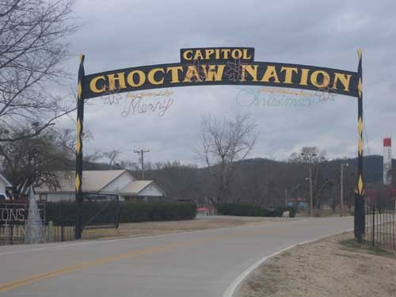  
촉토 네이션 입구의 아치

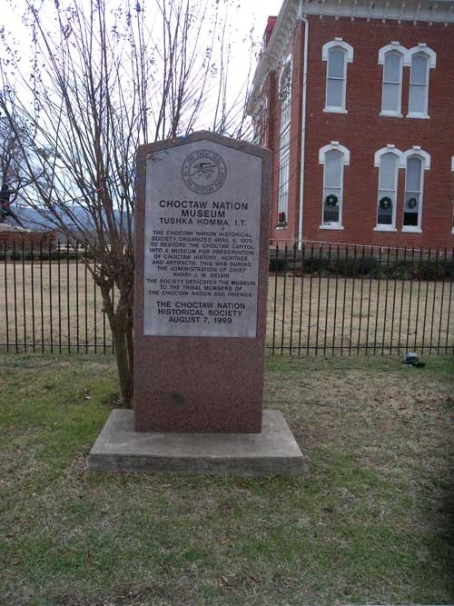  
촉토 네이션 뮤지엄의 표지 비석

  
촉토 내셔널 히스토리 뮤지엄(Choctaw National History Museum)의 모습

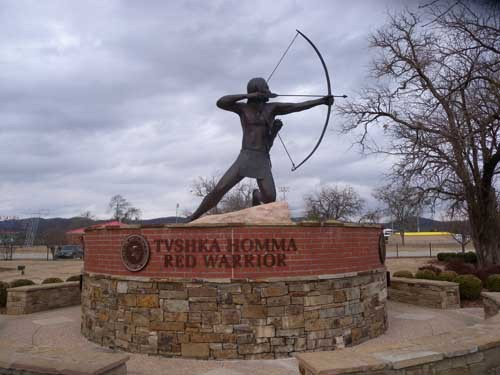  
뮤지엄 앞에 세워져 있는 붉은 전사의 상

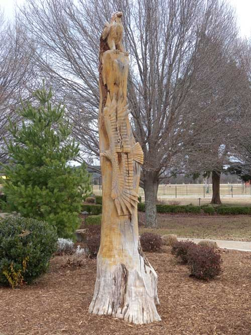  
뮤지엄 앞 뜰에 세워져 있는 독수리 푯대

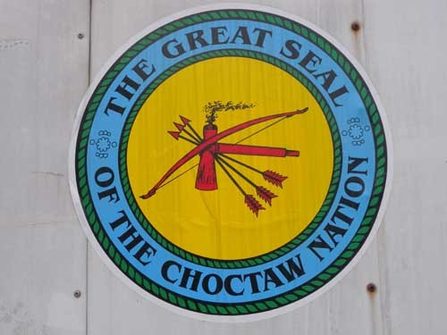  
촉토 네이션 문장[실(Seal), 紋章]

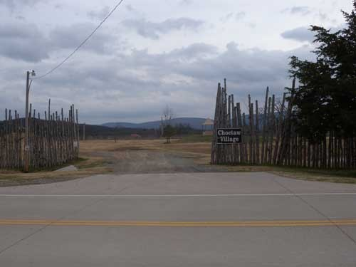  
뮤지엄 건너편에 만들어진 촉토 족 전통마을

공유하기

게시글 관리

**백규서옥\_Blog ver.**