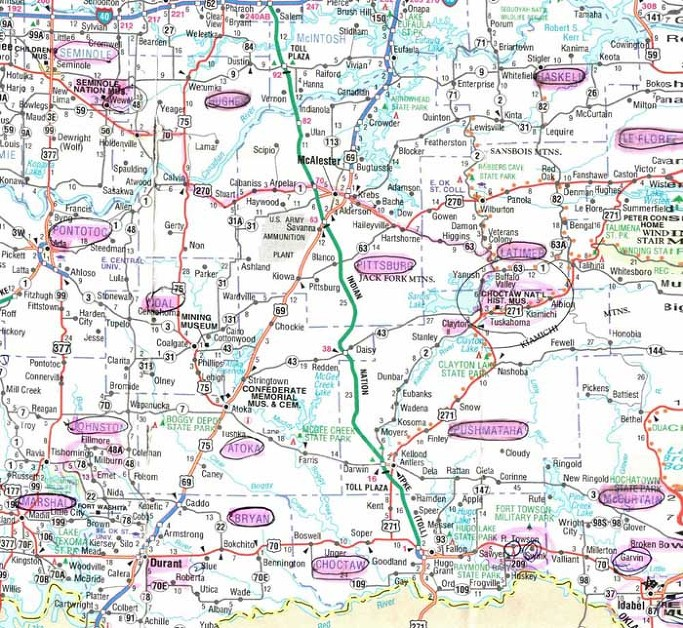
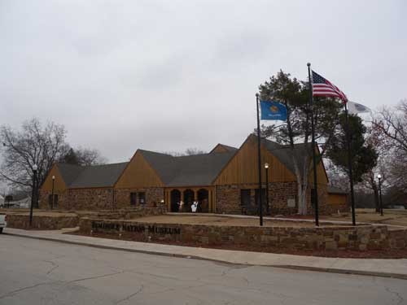
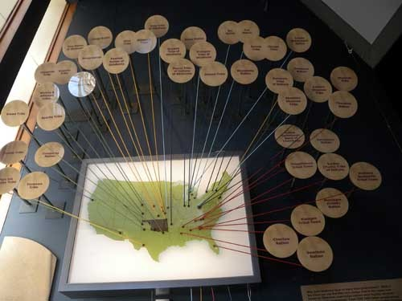
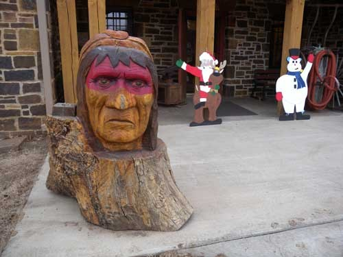
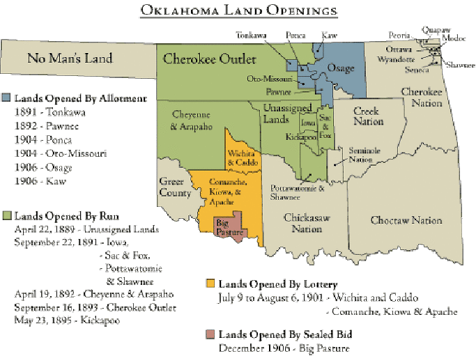
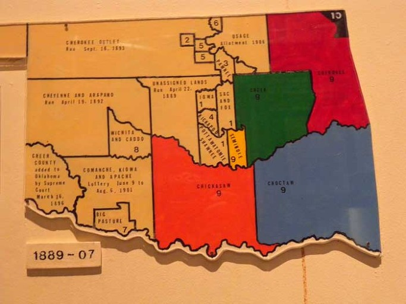
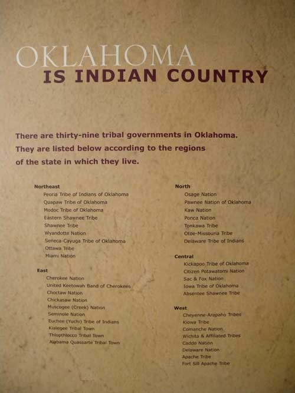

  
촉토 내셔널 히스토리 뮤지엄에서 63번과 270번 하이웨이를 번갈아 타며 두 시간 이상을 달려 세미놀 족의 본거지인 위워카에 도착했다.

  
세미놀 네이션 뮤지엄(Seminole Nation Museum)

  
오클라호마 주에 강제이주된 39개 인디언 종족의 고향들[세미놀 족의 고향은 플로리다였음]

  
세미놀 네이션 뮤지엄 문 앞에서 만난 세미놀 족 전사의 두상

놀라운 세미놀(Seminole) 인디언들(1)

세미놀 족을 만난 것은 참으로 우연이고 행운이었다. 브라이언 군의 졸업 축하 파티에 참석했을 때, 그의 미국인 친구 한 사람에게 고향을 물었더니 ‘세미뇰’이라 했다. ‘뇰’이란 발음에 혹시 스패니쉬 계통인가 하고 물었더니, ‘인디언 부족 이름’에서 온 것이라고 했다. 그날 밤으로 그것이 인디언 부족 이름이자 그 부족의 네이션이 있는 도시의 카운티 이름임을 확인하게 되었고, 스펠 ‘Seminole’을 ‘세미뇰’로 들은 것은 내 귀의 착각이었던 듯, 다른 미국인들에게 다시 물으니 모두 ‘세미놀’이라고 했다. 세미놀과의 만남은 그렇게 시작되었고, 치카샤와 촉토를 거쳐 드디어 그 실체를 육안으로 보게 되었다. 세미놀이 그동안 돌아 본 체로키•치카샤•촉토 등과, 앞으로 돌아 볼 크리크(Creek)와 함께 ‘개화된 다섯 종족[Five Civilized Tribes]’을 이룬다고 하니, 적잖은 호기심이 발동된 것도 사실이었다.

'촉토 내셔널 히스토리컬 뮤지엄(Choctaw National Historical Museum)'을 나선 우리는 키아미치 산간을 꿰뚫는 63번, 270번 하이웨이를 번갈아 타고 점심을 훌쩍 넘긴 무렵에서야 세미놀 카운티의 위워카(Wewoka) 시티에 도착했다. 뭔가 잔뜩 쏟아질 것만 같은 우중충한 날씨에 퇴락한 시가지의 모습이 겹치니 분위기가 음산했다. 다운타운엔 빈 상가들이 즐비했고, 페인트가 벗겨져 초라해 보이는 집들도 부지기수였다. 다른 지역의 상당수 중소도시들에서 이미 목격한 것처럼 이 도시도 기름기가 빠져 있었다. 아마도 원유의 고갈로 지역경기가 죽었기 때문일 것이다. 경기가 좋은 대도시로 사람들이 빠져나가 텅 빈 집들은 사람의 온기를 쏘이지 못한 채 삭아들고 있었다. 살아있는 레스토랑 한 군데를 간신히 찾아내 시장기를 지우고, ‘세미놀 네이션 뮤지엄(Seminole Nation Museum)’에 갔다. 아담하고 아름다운 건물. 세미놀 사람들의 미학이 느껴지는 건축이었다.

연방정부에 의해 인정된, 미국 전역의 세미놀 족 집거지는 세 군데로 알려져 있다. 오클라호마 주의 세미놀 네이션, 플로리다의 세미놀 트라이브, 플로리다의 미코수키(Miccosukee) 트라이브가 그것들이다. 물론 세미놀 족의 원 고향은 플로리다이며, 2차 세미놀 전쟁 이후 8백명의 흑인 세미놀 인들을 따라 플로리다에서 인디언 거주구역으로 강제 이주되어 온 3천명 세미놀 인들의 후예들이 호클라호마 주에 살고 있다. 따라서 오클라호마의 세미놀 네이션은 세 군데 집거지들 중 규모가 가장 크다. 우리가 찾아온 이곳 위워카 시티가 바로 오클라호마 세미놀 네이션의 본부가 있는 곳인데, 현재 등록 인원 18,800명 가운데 대략 13,500여명이 오클라호마 주에 거주하고 있으며, 세미놀 카운티에는 대략 5,300여명이 거주하고 있다. 1936년 인디언 재건법이 공표되면서 세미놀 족은 그들의 정부를 되살려 내기 시작했으며, 부족의 사법 관할지역 또한 그들의 다양한 자산들이 포함되어 있는 세미놀 카운티를 카버하게 되었다고 한다. 플로리다에 남아있던 수백 명의 세미놀 인들도 3차 세미놀 전쟁을 겪으면서도 미국 정부의 압박에 굴하지 않고 드디어 평화를 찾게 되었으며, 앞서 말한 바와 같이 그 후예들이 연방정부로부터 인정을 받는 두 개의 세미놀 트라이브를 형성하게 된 것이다. 결국 이들 조직된 세미놀 인들과 조직되지 않은 부족원들이 함께 1823년 미국 정부가 강제로 뺏어간 2천 4백만 에이커의 땅에 대하여 1976년 기준으로 1천 6백만 달러 가치의 정착지를 받아냄으로써 분쟁은 완결된 셈이다. 따라서 현재 세미놀 족이 오클라호마 한 군데와 플로리다 두 군데 등 세 지역으로 나뉘게 된 것도 그 때문이었다.

세미놀 큐레이터의 설명에 따르면, 세미놀 인들의 말은 무스코기 어[Muskogean Language]에 속하는데, 전통적으로 서로 통하지 않는 두 말, 즉 미카수키(Mikasuki)와 크리크(Creek)어를 동시에 사용해 왔다고 한다. 그러나 크리크가 정치•사회적 측면의 지배언어였으므로, 미카수기 어를 쓰는 사람들도 크리크 어를 배울 수밖에 없었다. 조사 결과 2000년대 초까지 부족원의 25% 정도가 크리크와 영어를 사용하고 있었으며, 나머지는 영어만 쓰는 것으로 밝혀졌다고 한다. 현재 오클라호마에 있는 네이션의 대부분 세미놀 인들은 영어를 제1언어로 쓰고 있으나, 부족 차원에서 전통적인 크리크 어를 살려내기 위해 애를 쓰고 있다 한다.

다른 인디언 종족들과 마찬가지로 이들에게도 사회구조로서 가장 기본적인 가족 바로 위에 ‘클랜(Clan)이란 단위가 있었다. 아주 오랜 옛날에 어떤 동물이나 초자연적 정령들과 스스로를 동일시하는 사람들이 서로 도우며 고난을 견뎌 낸 것은 어느 지역이나 마찬가지였다. 시간이 지나면서 혈통으로 연결되는 사람들이 특정 동물의 정령들과 연관을 맺게 된 것이다. 치카샤 네이션에서도 촉토 네이션에서도 누구나 특정 클랜에 속해 있고, 너구리•악어 등 어떤 동물이 자기 클랜의 상징동물인지 알고 있음을 확인할 수 있었는데, 그 점은 이곳에서도 마찬가지였다. 이런 불문(不文)의 제도 아래, 세미놀의 성인들은 자기네 부모가 속한 클랜들 밖에서 결혼상대를 찾아야 할 의무를 갖고 있었다. 말하자면 우리나라에서 동성동본 혼인금지와 같은 차원의 제도라고 할 수 있는데, 근친혼을 금함으로써 종족을 건강하고 우수하게 유지하려는 지혜의 발로라고 할 수 있었다.

\*\*\*

문을 열고 뮤지엄에 들어가니 실제 모습대로 전시된 세미놀 족의 전통 생활양식이 눈을 끌었다. 모닥불을 중심으로 주방과 거실이 함께 붙어 있었는데, 설명을 위해 그 옆에 붙여놓은 클레이(Clay MacCauley)의 말이 흥미로웠다.

“세미놀의 가정에 들어가면 누구나 사람들이 모이는 중심에 모닥불이 있는 것을 보게 된다. 그곳은 요리가 준비되는 장소이고, 가족과 그들의 친구들이 사교를 나누는 장소이며, 스토리가 만들어지고 이야기되는 장소다.”

지금까지 만나본 모든 인디언 부족들과 마찬가지로 세미놀 족도 ‘가족 간의 유대나 사랑’을 중시한다는 점과 모계사회라 할 정도로 여성의 발언권이나 힘이 절대적이라는 점을 알게 되었다. 모닥불 위에서 보글보글 끓고 있는 수프와 그 주위에 앉아 음식이 나오기를 기다리며 이야기를 나누는 가족들, 다 된 음식을 각자에게 덜어주는 주부 등 익히 보는 가족 공동체의 아름다운 모습이 뮤지엄의 첫 공간에 제시되어 있었다. 아마도 세미놀 인들은 끈끈한 가족공동체의 전통을 외부 손님들에게 보여주고 싶었으리라. 그 뿐 아니었다. 전통시대에서 현대에 이르기까지 다양한 생활사 자료들과 예술품 들이 적절하게 분류, 전시되고 있었다.

각 부족의 구역이 할당된 시기와 점유지의 성격

  
조정이 끝난 1907년까지 각 부족의 점유지 현황

  
세미놀의 문장(紋章)이 새겨진 초기 네이션 깃발

  
오클라호마 주 내 39개 인디언 부족의 분포 지역 리스트

공유하기

게시글 관리

**백규서옥\_Blog ver.**