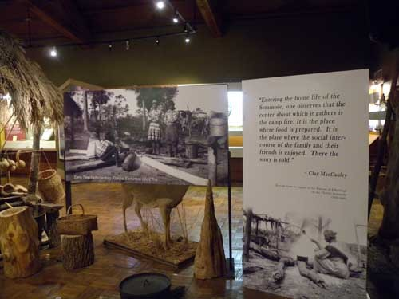  
세미놀의 초기 생활상(주방의 모습)

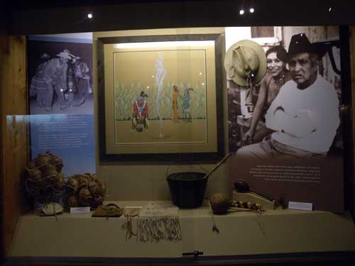  
세미놀 족 주술사 부녀(정면의 사진은 옥수수밭에서 의식을 행하는 장면)

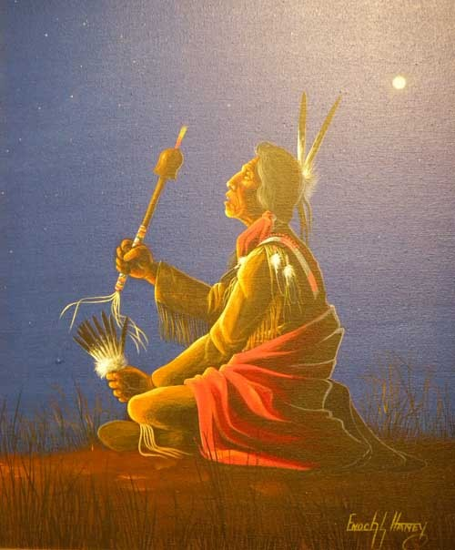  
주술사의 의식(儀式)

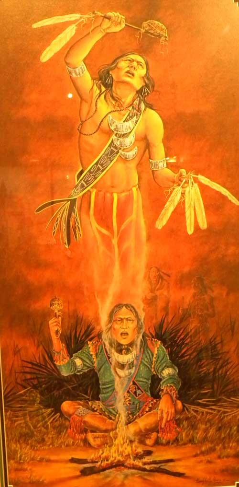  
주술의식을 행하고 있는 주술사

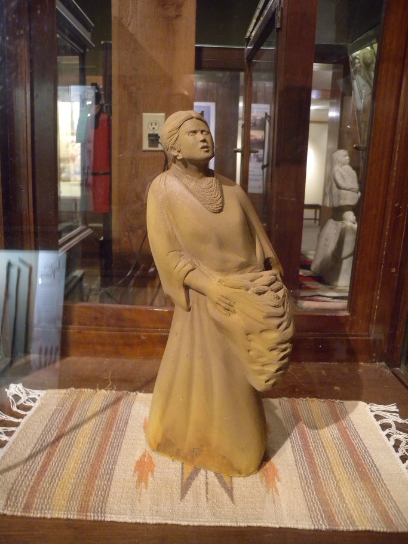  
세미놀 여인과 옥수수

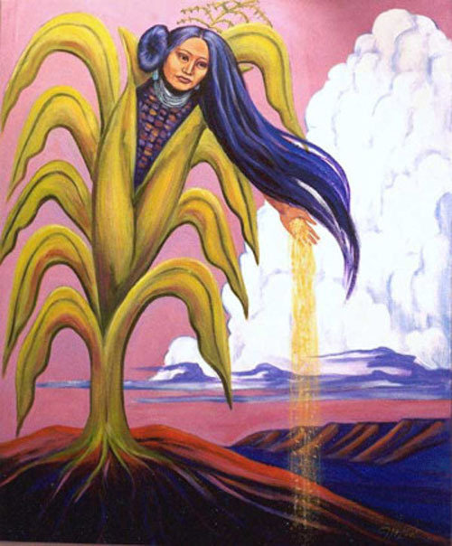  
옥수수의 정령

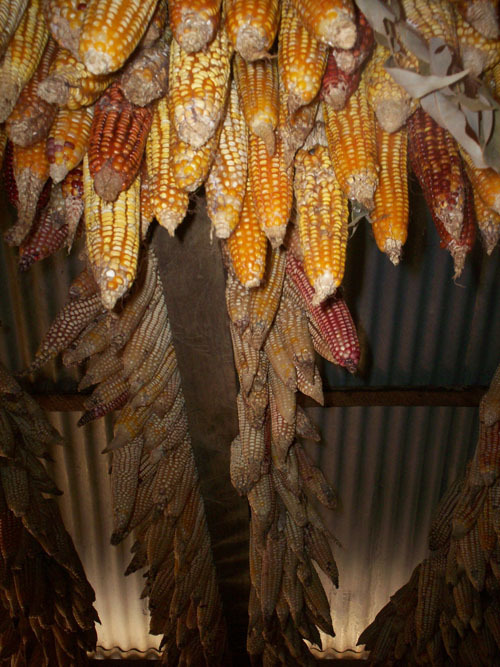  
집 안에 저장한 옥수수

  
옥수수의 정령

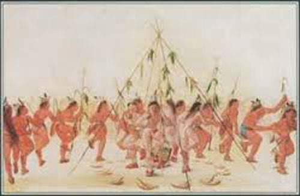  
플로리다 세미놀 족에 남아있는 Green Corn Dance

  
세미놀 족 처녀와 거북이

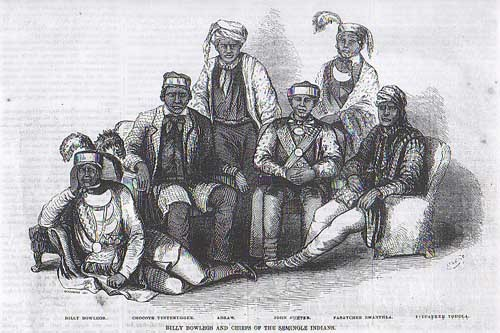  
추장을 중심으로 앉아있는 세미놀 족 남자들

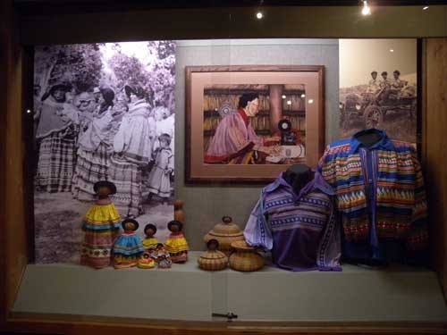  
세미놀 족 여인들의 삶과 전통복장

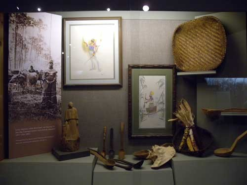  
세미놀 족 부엌도구들과 주식인 옥수수

  
세미놀 족 메디신 맨(Medicine Man)이 사용하던 주구(呪具)

놀라운 세미놀(Seminole) 인디언들(완)

세미놀 족이 전통시대에 풍요를 기원하던 의식들은 사진이나 그림으로 다양하게 제시되어 있었다. 주술의식을 통해 인간과 신을 매개하던 현존 주술사의 주술의례는 전시되어 있었으나, 기대했던 그린 콘 댄스•리본 댄스•버팔로 댄스•페더 댄스 등 다양한 의미가 함축된 군무(群舞)들의 모습은 보이지 않았다.

물론 어렴풋이나마 자연물들에 정령(spirit)이 있다고 믿어온 그들의 전통신앙이 그림으로, 실제 행위로 구현된 모습을 전시실에서 확인할 수 있었다. 무엇보다 주술사가 그들의 주식(主食)이었던 옥수수 밭에서 정령의 존재를 불러오는 듯한 그들의 의식이 아주 흥미로웠다. ‘먹는 것’ 속에 자신들의 안위나 세계질서를 좌우할 힘이 내재되어 있다고 믿고, 그것을 소중히 대하여 온 그들의 태도는 매우 합리적인 면을 지니고 있었다. 삶을 유지하는 데 곡식이 가장 중요한 요소라면, 곡식을 관장하는 초월적 존재나 힘이야말로 가장 높은 곳에서 인간사의 모든 면을 관장하는 권능을 지녔다고 생각한 것으로 추정할 수 있었다. 그린 콘 댄스(Green Corn Dance)는 그런 생각이 극적으로 표출된 집단예술이다.

전통시대의 북미 인디언 종족들은 자신들이 옥수수와 동질적 존재라는 의식을 갖고 있었다. 그들 모두에게 파종 축제, 수확 축제와 그린 콘 세리머니 등 옥수수에 관한 축제들이 있는 점이 그 방증이었다. 옥수수가 익어갈 무렵, 혹은 수확 전 몇 주일에 걸쳐 계속되는 것이 그린 콘 세리머니이며 그 축제의 중심이 바로 그린 콘 댄스였다. 그들은 그린 콘 댄스가 열릴 때까지 새로 익은 옥수수를 먹거나 손을 대는 일은 신을 모독하는 죄라고 생각했다. 흡사 우리나라에서 ‘천신(薦新)’의례를 마친 다음 본격 수확을 시작하는 것과 같은 의미이리라. 인디언 사회에서 플로리다의 세미놀 인디언들만이 아직도 5월의 그린 콘 댄스를 연다고 하는데, 희미하게나마 그 전통의 흔적을 찾아볼 수 있는 곳이 바로 이곳 오클라호마 세미놀 네이션 아닐까. 그런 점에서 그 시대의 주술사도, 평범한 인간들도, 정령을 불러내어 풍요와 자신들의 안위를 호소한 행위들에서 그 시대 나름의 보편적 합목적성을 찾아 볼 수 있을 것이다. 

뿐만 아니라 세미놀의 역사나 의례 등 전통적인 삶을 묘사한 현대 예술가들의 그림들이 독립된 공간에 전시되어 있었는데, 그 속에 흥미로운 그림 하나가 있고, ‘뱀으로 변한 아우’라는 제목이 합당할 법한 설화 한 편이 적혀 있었다. 독자들의 흥미를 위해 그 설화의 서사적 골자를 들기로 한다.

“세미놀 형제가 마을을 위해 사냥하러 나갔다/다음날 하루 종일 비가 내려 사냥을 못하다가 오후 늦게 개자 형은 사냥을 포기하고, 가지고 있던 사슴고기로 요리를 시작했다./밖으로 나갔던 동생은 두 마리의 큰 물고기 배스를 잡아왔다./그는 설명하기를, ‘이 물고기들이 근처 호수에서 길바닥으로 튀어 올라와서 잡았다’고 했다./형이 그 물고기들을 놓아주고 오라 하자, 동생은 펄쩍 뛰며 요리를 해 먹었다./한밤중 동생은 소리를 지르며 형을 불렀다./동생의 모기장으로 가자 동생은 형에게 ‘내가 뱀이 되고 있어. 형이 먹지 말라고 하는데도 먹었더니, 이것 좀 봐!’라고 놀라며 소리쳤다./형이 불을 켜고 자세히 보자 동생의 다리들은 이미 뱀의 꼬리가 되어 있었다./동생이 형에게 ‘내일 가족들을 데리고 호수 가의 큰 통나무로 와서 태양이 중천에 오르거든 통나무를 네 번 쳐. 그렇게 하면 나를 볼 수 있으니, 그렇게 해줘. 나는 그들을 만나 할 이야기가 있어.’라고 했다/다음 날 형은 그의 가족들을 데리고 호수로 와서 둥근 달 아래 캠프를 하며 다음 날 해 뜨기만을 고대했다./다음 날 해가 중천에 오르자 가족들을 데리고 통나무로 가서 동생의 말대로 통나무를 네 번 두드렸다./그가 네 번 두드리자 호수 밑에서 거품이 올라오고 큰 뱀의 머리가 올라왔다./아이들이 무서워하자 어른들은 그들에게 조용히 하라고 말한 다음, 뱀이 하는 말을 듣고자 했다./뱀이 호수 표면으로 떠올라 그의 가족들이 서 있는 호숫가로 주르르 미끄러져 왔다./뱀은 천천히 그들에게 움직여 가며 ‘가까이 오세요. 이게 나예요. 말씀드릴 게 있어요. 잘 들으세요. 이후로 나는 다시는 말을 할 수 없어요. 내가 물고기들을 닦고 요리하여 먹은 것이 잘못된 일이었어요. 나는 뭐가 더 좋은지 알고 있었지만, 우리 문중 어른들의 금지법을 위반했어요. 나는 지금 그 벌을 받은 거예요. 여러분이 떠난 후에도 나는 우리 가족이 나에 관하여 나쁘게 생각하지 않기를 바라요. 장래를 생각하고 여러분의 삶을 살아가세요. 나는 결코 돌아갈 수 없어요. 이 호수는 나의 집이 될 거예요. 나는 이 물 속에서 죽을 때까지 살아갈 거예요. 여러분 모두 돌아가거든, 결코 이 호수에는 돌아오지 마세요. 일단 여러분 모두 떠나면, 내 모든 기억들은 사라져서 여러분을 전혀 알아보지 못할 거예요. 나는 사악해져서 여러분을 해칠 거예요. 그것이 내가 살아갈 뱀의 삶이예요. 다만 좋았던 일들만을 기억하고 나를 용서하세요.’라고 말하고 나서 그의 형에게 머리를 돌리고 ‘나는 형이 우리 가족을 도와주시고 그들에게 고기를 나눠주시기를 바라요. 내 아들들이 형처럼 좋은 사냥꾼이 되도록 가르쳐 주세요. 그 아이들이 제 어미를 돌보도록 해주세요.’라고 말했다./그 사냥꾼의 친구[\*brother가 이곳에서는 friend로 바뀌어 있음. 착오로 보임-인용자 주]가 그렇게 하겠다고 약속했다./그 뱀이 ‘이제 나는 저 위로 올라가니 여러분은 내 몸 전체를 잘 보세요.’라고 말했다./그가 그렇게 하자, 모든 사람들은 그가 아주 크고, 큰 카누보다 더 길다는 것을 알게 되었다./갑자기, 뱀은 그가 떠올라 온 물속으로 들어가 호수 가운데로 들어가기 시작했다./뱀은 그의 꼬리를 물 밖으로 내밀고 그들에게 흔들었다./그런 다음 그 뱀은 깊이깊이 큰 호수의 검은 물속으로 내려갔다./슬픔을 느끼며 그의 가족들은 큰 호수를 떠나 집으로 돌아갔고, 다시는 그곳에 오지 않았다.”

보는 사람에 따라 이 설화의 주지(主旨)는 달라지겠지만, 물고기 배스를 잡아먹은 행위가 어른들의 ‘금단법(禁斷法)[Forbidden Law]’을 어긴 것이라는 말로 미루어, 아마도 ‘배스’는 그가 속한 문중, 즉 클랜(Clan)의 상징 동물이었을 것이다. 당시 인디언 사회에서 클랜의 상징동물을 신성하게 여기는 것은 반드시 지켜야 할 불문율이었다. 따라서 상징동물을 해치면 하늘의 벌을 받게 되어 있다는 것을 2세들에게 교육할 필요가 있었고, 그런 의도에서 이런 설화는 나왔을 것이다.

이 외에도 진기한 컬렉션들이 많았다. 예컨대, ‘Military Corner’에서 만난 한국전 관련 컬렉션들은, 한국전을 바라보는 현재의 관점과 한국인들을 바라보는 당시 그들의 관점이 매우 따스하고 긍정적이라는 점에서 감동적이었다.[미국통신 41 참조] 자기 민족의 젊은이들을 낯선 나라의 전쟁터에 보내면서 얼마나 걱정이 많았을까. 그들이 만들어 자국 병사들의 교육에 썼을 그 자료들에는 그런 걱정들이 가득 담겨 있었다. 자식에 대한 정이 지극한 우리네 부모들과 그들의 정서가 동질적임을 충분히 확인할 수 있었다.

\*\*\*

애당초 플로리다에 살던 세미놀 족의 일부가 오클라호마까지 오기까지 많은 고통이 따랐을 것이다. ‘눈물의 여정[Trail of Tears]’은 다른 부족들과 마찬가지로 이들도 끔찍하게 겪은 고난의 행군이었다. 그럼에도 이들이 오클라호마 인디언 구역 내에서도 소수자로서 기를 펴지 못하고 살았지만, 그들 나름의 화려한 문화와 내면세계, 혹은 역사에 대한 자부심만은 확실하게 지닌 채 살아 온 것으로 보인다. 결국 미국의 체제에 순응하여 그들의 일원으로 정착했고, 그들의 생활양식에 동화되어 오긴 했지만, 아직도 언어와 문화를 중심으로 자신들만의 정체성을 지켜 가려는 노력은 계속되고 있었다. 무엇보다 소수 부족이면서도 개명(開明)된 다섯 종족 가운데 하나로 당당하게 자리 잡고 있는 그들의 위치와 현실적인 활동이 바로 이런 점을 보여준다고 생각한다.

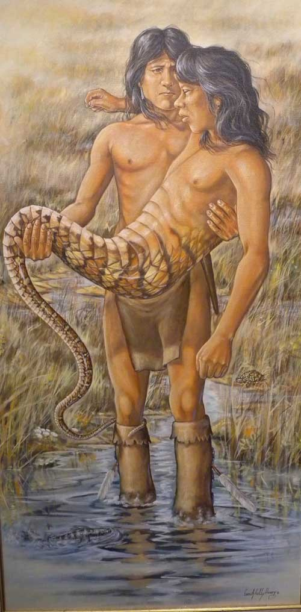  
물고기 배스를 삶아먹은 죄로 뱀이 되고 있는 동생을 안고 있는 형

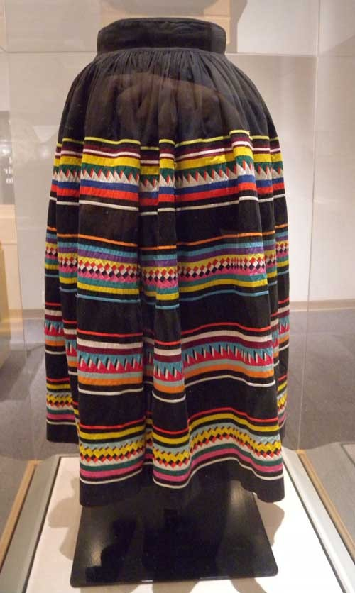  
세미놀 족 여인들의 전통문양 치마

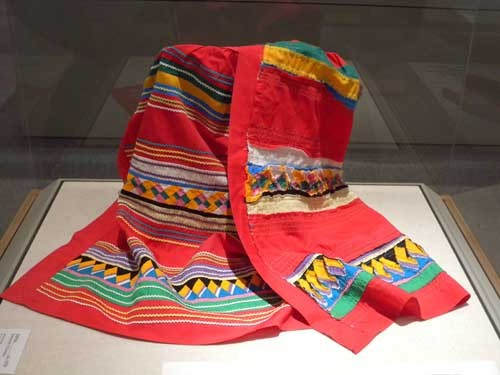  
세미놀 족의 전통문양

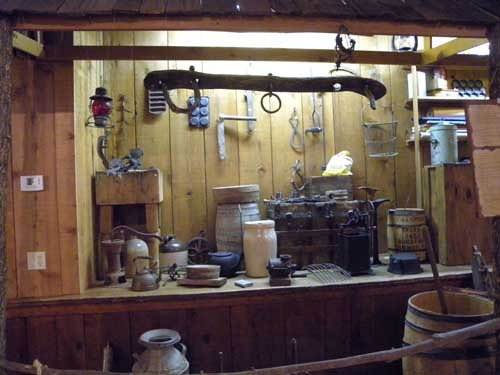  
세미놀 족의 집안 살림들

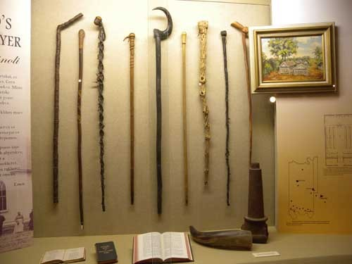  
세미놀 족 전통 가옥의 생활사 자료들

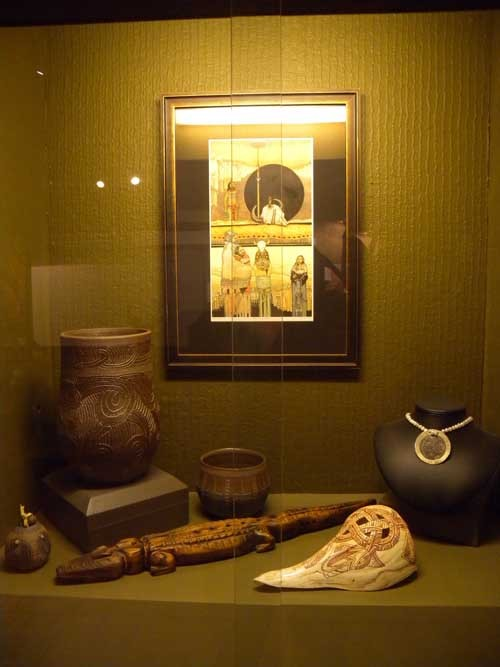  
세미놀 족 전통 생활예술 자료들

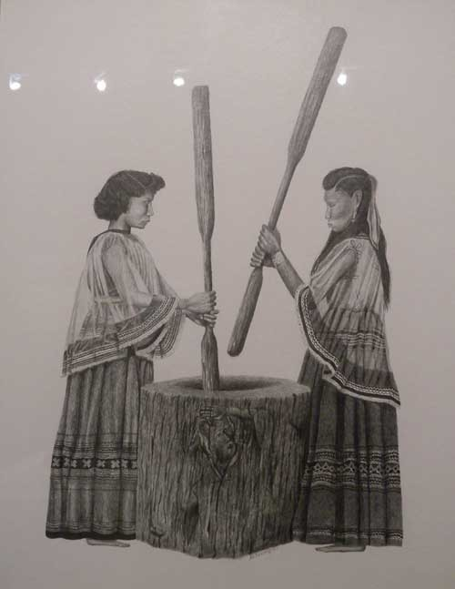  
함께 방아를 찧고 있는 세미놀 족 여인들

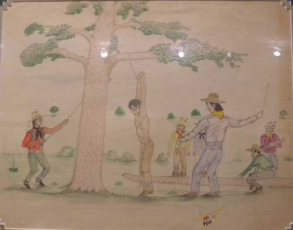  
매 나무[Wheeping Tree)에 죄인을 매달고 회초리형을 가하고 있는 세미놀 족 관리들

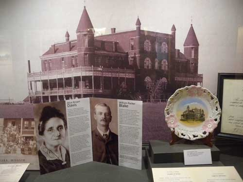  
세미놀의 대표적 고등교육기관인 에마하카 아카데미(Emahaka Academy)와 두 명의 교육 공로자  
[왼쪽이 교육자 앨리스 브라운(Alice Brown), 오른쪽이 윌리엄 패커 블레이크(William Packer Blake) 목사]

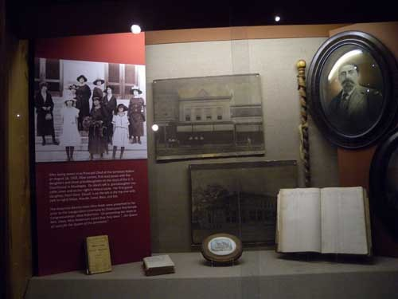  
왼쪽의 사진은 세미놀 네이션의 대표이자 오클라호마 주 의회의 첫 여성 의원이었던   
앨리스 로버츤(Alice Robertson)과 그녀의 다섯 딸 및 세 손녀들

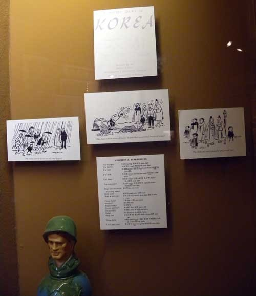  
Military Corner에 전시되어 있던 한국전쟁 관련 자료들  
[한국 및 한국인들에 관한 소개의 그림이나 필수 회화 내용]

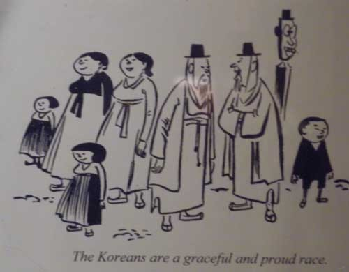  
한국전에 나가는 세미놀 족 병사들의 교육에 쓰인 것으로 짐작되는 한국인들의 캐리커츄어  
['한국인들은 우아하고 자부심 강한 사람들'이란 설명이 인상적임]

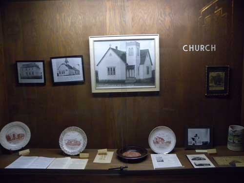  
세미놀 족 관련 교회 자료들

  
위 사진 속에 들어 있는 위워카 지역 감리교회의 모습

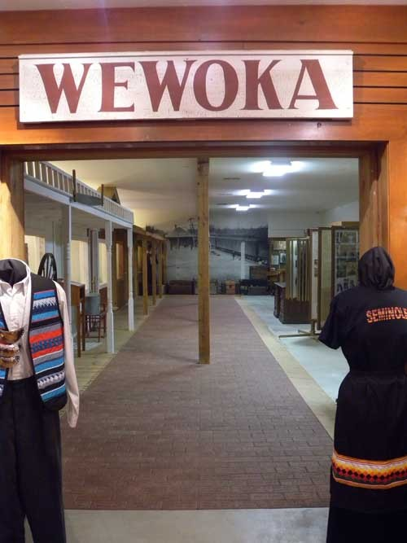  
위워카의 시가지를 재구해 놓은 모습

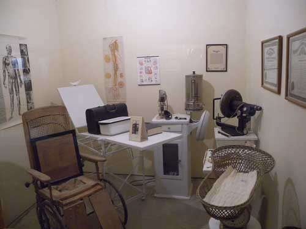  
당시 의원의 진찰실을 송두리째 기증받아 전시하고 있는 모습

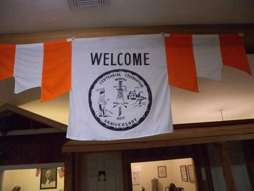  
1966년의 세미놀 네이션 창립[1866] 백주년 기념식

공유하기

게시글 관리

**백규서옥\_Blog ver.**