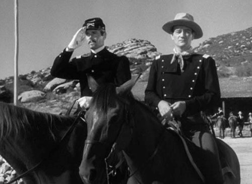
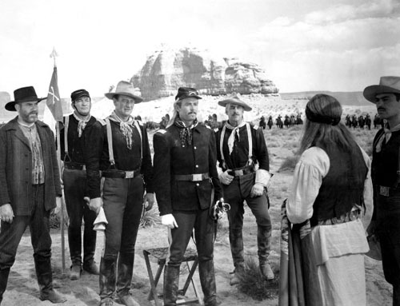
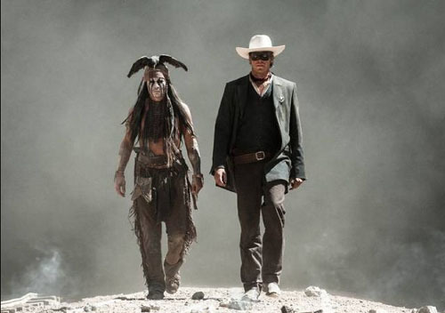
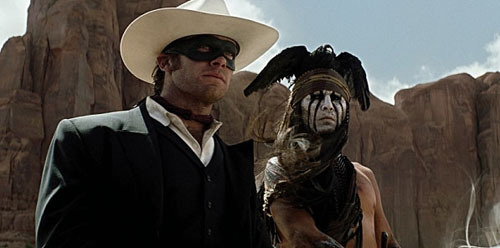
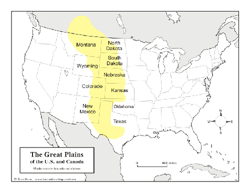
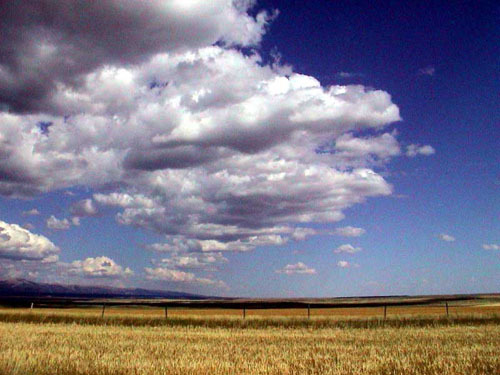
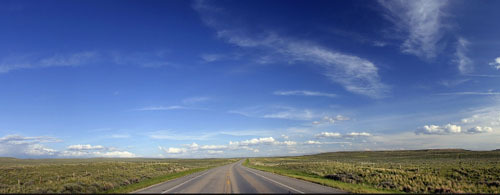
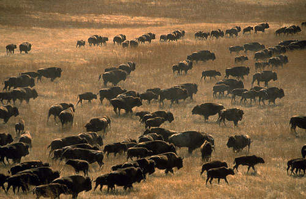
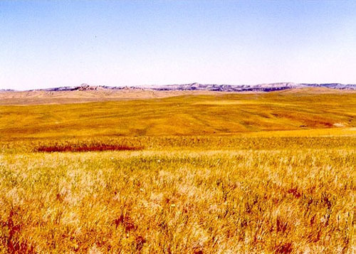
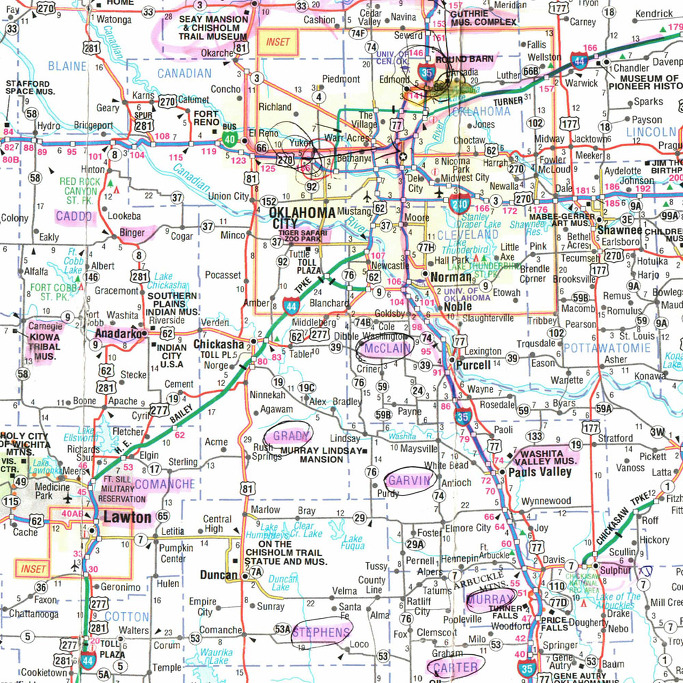

  
영화 <아파치 요새>의 포스터

  
영화 <론 레인저>의 포스터

  
<아파치 요새>에서 좌측이 헨리 폰다(Henry Fonda), 우측이 죤 웨인(John Wayne)

  
<아파치 요새>의 한 장면

  
영화<론 레인저>의 한 장면. 왼쪽이 쟈니 뎁(Johnny Depp), 오른쪽이 아미 해머(Armie Hammer)

  
<론 레인저>의 한 장면

서부지역 인디언들과 대평원[The Great Plains]

하이틴 시절부터 이 나이까지 영화를 그리 많이 접하지는 못했지만, 그나마 그 가운데 기억나는 것들은 헐리웃에서 만들어진 서부영화들이다. 이름을 다 기억할 수 없는, 비슷비슷한 내용들이었으나, 관통하는 서사구조는 단 하나 ‘선악의 대결’이었고 주제는 미국 판 ‘권선징악’이었다. 선을 대표하는 백인들은 늘 당당하고 정의로우며 멋있었던 반면, 악을 대표하던 인디언들은 늘 무지(無知)•무명(無明)•무뢰(無賴)의 저급한 무리들이었다. 미국 인디언들에 대한 세계인의 편견과 무지는 이처럼 대부분 서부영화들로부터 나온 것이었다.

넓고 아름다운 땅에서 평화롭게 살던 그들을, 어느 날 ‘웬놈들’이 밖에서 뛰어 들어와 채찍을 휘두르며 한 구석으로 몰아넣고, 그들의 땅을 차지해 버린 것이다. 그것만으로도 천추만대 원한에 사무칠 일인데, 전 세계의 코흘리개들도 다 보는 영화에 가해자인 백인들은 정의의 사도로, 피해자인 자신들은 몹쓸 불한당(不汗黨)으로 그려냈으니, 그 통탄스러움을 어떻게 표현해야 할까.

내 기억으로는 2005년 5월에서야 미국의 상원은 ‘인디언 6천만 학살’에 대한 사과를 추진한 것으로 알고 있다. 그들의 죄가 어찌 ‘사람 죽인 일’ 뿐일까. 당시로서는 ‘몹쓸 땅’에 그들을 짐승처럼 몰아넣은 점까지 계산하면, 그 죄가 하늘에 닿고도 남을 백인들이었다. 나찌 독일이 죽인 이스라엘 사람들이나 왜인들이 전쟁터로 광산으로 징발하거나 허물을 뒤집어 씌워 죽인 우리 민족의 숫자도 엄청나지만, 당시 총인구 5천만~1억을 헤아리던 인디언들 가운데 살해된 비율이 80~90%라니, 아무리 컴퓨터가 발달했다 한들 미국 백인들의 끔찍한 죄악을 어떻게 계산해낼 수 있단 말인가.

그럼에도 그런 사건으로부터 무려 2백년이나 지나서야 ‘이제 사과나 해볼까?’하고 궁시렁 거리며 나섰고, 그로부터 5년의 세월이 더 흐른 2010년에 이르러서야 공식적으로 사과하기에 이르렀으니, 만시지탄(晩時之歎)도 이만저만이 아니다. 워싱턴 D.C. 의회 묘지에서, 체로키•촉토•무스코기•포니•시스턴•와페톤•오야테 등 5개 부족대표가 참석한 가운데 캔자스 출신의 공화당 상원 샘 브라운백 의원이 사과결의문을 낭독함으로써 의회 차원의 공식적인 사과를 했다. 그 전 해 11월에도 오바마 대통령은 564개 부족대표들이 참석한 가운데 인디언들에 대한 그동안의 횡포와 잘못된 정책에 대하여 사과하고 그들로 하여금 ‘아메리칸 드림’을 이룰 수 있게 하겠다고 약속한 바 있다. 그러나 과거에도 정부로부터 무수한 약속을 받았으나 그 약속이 한 번도 지켜진 적이 없음을 잘 알고 있는 인디언들로서는 이번에도 큰 기대는 하지 않고 있을 것이다.

나는 이 글에서 미국 정부가 인디언들에게 진작 공식적으로 사과를 했어야 한다는 점을 강조하려는 게 아니고, 사과를 늦게 한 데 대하여 문제 삼으려는 것도 아니다. 그렇게 억울한 세월을 보내고 있는 인디언들을 눈곱만큼이라도 배려했다면, 각종 매체에 등장하는 그들의 이미지라도 진실에 가깝게 만들거나 긍정적으로 묘사했어야 하건만, 서부영화 같은 매체들에서 보듯이 그들의 모습은 스테레오 타입이라 할 정도로 왜곡되어 온 게 사실이다. 그 점이 제삼자인 내가 보기에도 지나치다는 말을 하고 싶었던 것이다. 미국에는 현재 나바호(Navajo), 체로키, 수(Sioux) 등 규모가 큰 종족들을 포함, 총 564개 종족에 3백만 이상의 인디언들이 살고 있다. 그 가운데 비교적 소수부족으로서 서부영화들에 단골로 등장한 종족이 아파치(Apache)와 코만치(Comanche)다.

대부분의 독자 여러분은 <아파치 요새(Fort Apache)>라는 영화를 보신 적이 있을 것이다. 1948년 죤 포드(John Ford) 감독이 만들었고, 죤 웨인(John Wayne) 및 헨리 폰다(Henry Fonda) 등 명 배우들이 출연한 영화인데, 인디언에 대하여 비교적 따스한 관점으로 만들었다는 점에서 일반적인 서부영화들과 구별된다고 한다. 감독은 주인공인 요크 중령[죤 웨인]을 통해 아메리카 인디언 특히 아파치 족에 대한 인간적 관점을 드러내는 데 중점을 둔 것으로 보인다. 말하자면 이 영화는 종래 ‘사납고 공격적이며 대화가 통하지 않는’ 아파치를 동정적•포용적 관점에서 바라 본 사례로 볼 수 있다는 것이다. 오래 전의 영화임에도 불구하고 인디언을 바라보는 시선이 비교적 긍정적인데, 많은 사람들이 끊임없이 이 영화를 보는 이유도 바로 여기에 있을 것이다.

또 하나. 미국으로 떠나오기 직전인 작년 7월 하순 경, 한국에서는 ‘론 레인저(The Lone Ranger)’란 영화가 상영되고 있었다. 쟈니 뎁(Johnny Depp)이 열연한 주인공 톤토(Tonto)는 바로 코만치 인디언이었고, 영화의 배경은 캘리포니아•유타•콜로라도• 애리조나•뉴멕시코 등이었는데, 이 가운데 콜로라도와 뉴멕시코는 그레이트 플레인즈에 포함되는 공간이었다. 악령을 몰아내는 능력을 지닌 톤토는 죽기 직전의 ‘외로운 레인저’ 존 레이드(John Reid)를 살려냄으로써 결국 그들은 환상의 콤비를 이루게 된다. 거칠 것 없는 드넓은 황야에서 그들이 보여주는 현란한 액션들은 코만치 인디언인 톤토와 백인 레인저 존 사이에 교감되는 우정의 깊이를 보여주면서 동시에 백인들과 인디언들이 ‘함께 살아갈 수 있다는’ 가능성을 보여주기도 한다. 코만치 추장 빅베어(Big Bear)의 말[‘우리 시대는 사라졌네. 백인들은 그걸 발전이라 부르는 모양이네만.’]이 추가되면서 그간 스테레오 타입으로 고착된 백인과 인디언의 이미지 혹은 양자관계의 패러다임을 바꾸어야 한다는 반성이나 의식 또한 새롭게 제기된 것으로 해석될 수도 있으리라.

\*\*\*

인디언을 찾아다니기 몇 달 만에 대평원의 주인공 아파치와 코만치, 그리고 카이오와를 만나게 되었다. 이들이 바로 대평원의 주인들이었다. 오클라호마 동북쪽에 '대초원[Tall Grass Prairie]'이 있다면, 서남쪽에는 '대평원[The Great Plains]'이 있다. 그렇다면 대평원은 어떤 공간인가. 알버타(Alberta), 새스캐치원(Saskatchewan), 매니토바(Manitoba) 등 캐나다 남부를 포함, 몬태나(Montana)•노쓰 다코타(North Dakota)•사우쓰 다코타(South Dakota)•와이오밍(Wyoming)•네브라스카(Nebraska)• 콜로라도(Colorado)•캔자스(Kansas)•뉴멕시코(New Mexico)•오클라호마(Oklahoma)•텍사스(Texas) 등, 로키산맥(Rocky Mountains)과 미시시피강(Mississippi) 사이의 미국 땅이 모두 여기에 속한다. 남북 간 길이는 3,200 km, 동서의 폭은 800 km, 면적은 1,300,000 ㎢이니, 남한 면적[99,538 ㎢]의 13배에 달하는 거대한 공간이다. 오클라호마의 경우 대평원은 주 전체 면적의 60%나 차지할 만큼 거대하다. 그 안에 카이오와, 아파치, 코만치 등의 집단 거주지가 있었다. **<다음에 계속>**

  
워싱턴 D.C.의 미 의회 묘지

  
캐나다에서 미국 남부까지 걸치는 대평원(The Great Plains)

  
대평원의 한 부분

  
대평원 한 가운데를 달리는 하이웨이

  
대평원의 바이슨 무리

  
대평원의 한 부분

  
카이오와, 아파치, 코만치의 집단 거주지를 찾아.

공유하기

게시글 관리

**백규서옥\_Blog ver.**