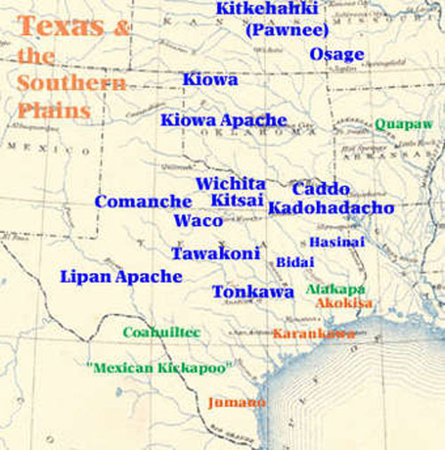  
남부 대평원의 인디언 부족들

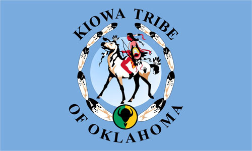  
카이오와 네이션의 문장(紋章)

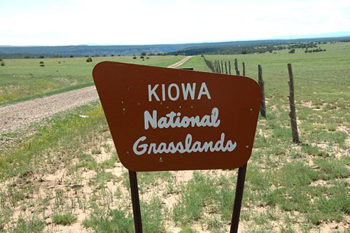  
카이오와 네이션의 초지

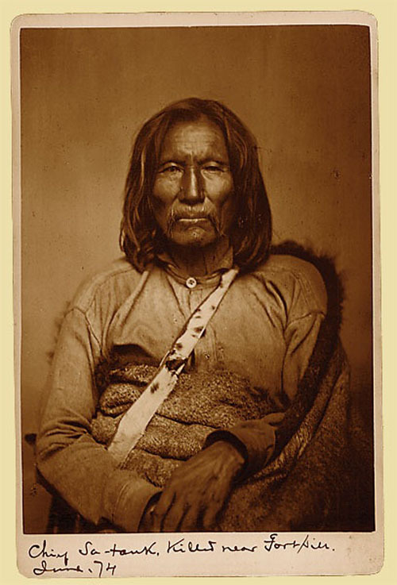  
카이오와 족 전사이자 치료 주술사[medicine man]였던 시팅 베어(Sitting Bear).  
1800년경 캔자스에서 태어나 1871년 살해되었음.

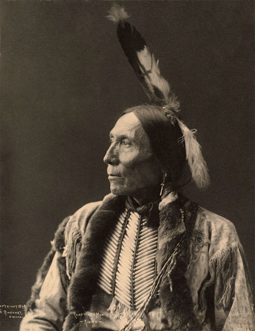  
카이오와 족 추장 화이트맨(White Man)의 1898년 모습

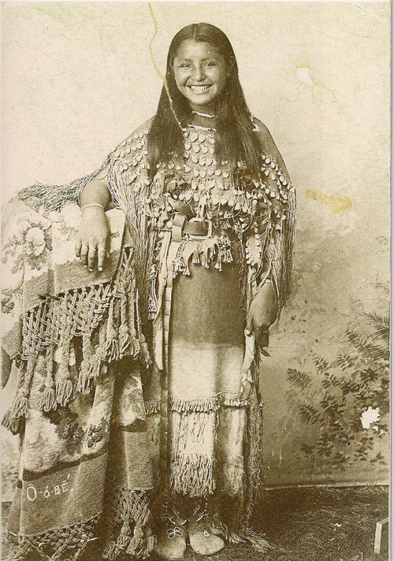  
 1894년 경 카이오와 족 소녀의 아름다운 미소

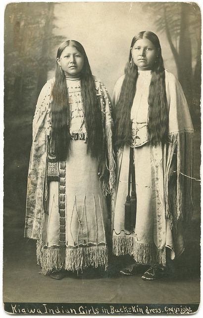  
사슴가죽 옷을 입은 카이오와 소녀들

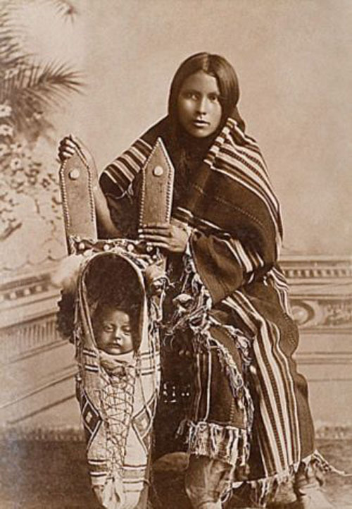  
전통시대 카이오와족 어머니와 아이

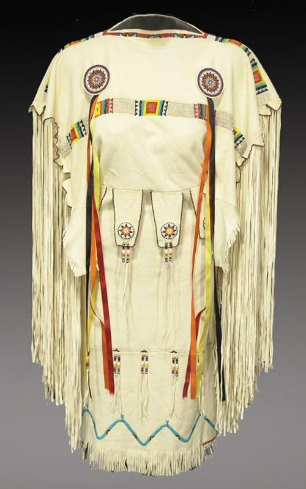  
남부 대평원[Southern Plains]의 사슴가죽 의상[Buckskin Dress]

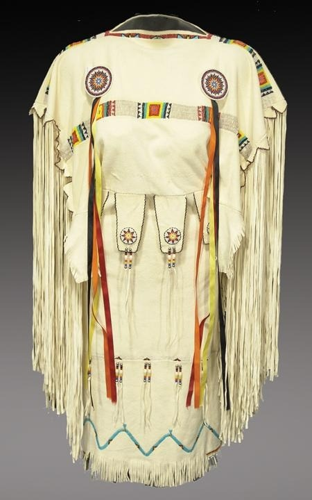  
남부 대평원의 구슬장식 의상

카이오와(Kiowa), 아파치(Apache), 코만치(Comanche), 그리고 대평원[Great Plains]의 서사시(2)

카이오와(Kiowa)족의 삶과 예술

마음이 급한 나머지 작년 12월 말에 캐도(Caddo) 네이션이 있는 빙거(Binger) 시티를 찾았다가 모든 공공기관의 문들이 닫혀 있는 바람에 허탕을 쳤고, 그로부터 4일 후인 새해 초에 카이오와•아파치•코만치를 찾아 아나다르코(Anadarko)•아파치(Apache)•로턴(Lawton) 등을 방문했다. 그러나 동쪽에 있는 치카샤•촉토•세미놀•체로키 등과 달리 이 지역의 경우 닫혀 있는 곳이 적지 않았고, 설사 열려 있다 해도 자기네 콜렉션들에 대한 소개 자료가 미흡하거나 사진을 못 찍게 하는 등 외부인들의 접근을 경계하는 듯한 느낌을 강하게 받았다.

그러나 아나다르코 시티 초입의 ‘국립 아메리칸 인디언 명사 명예의 전당(National Hall of Fame for Famous American Indians)’에서 만난 책임자 칼(Carl Jennings)은 오클라호마 내 39개 인디언 부족들에 대한 설명을 친절하고 명료하게 해주었다. 특히 촉토 족인 자신과 카이오와 출신의 유명 공예가이자 자신의 부인인 바네사(Vanessa Pau Keigope Jennings)의 결합을 설명하면서 인디언 유명 인사들에 대한 자부심을 내비치기도 했다.

그렇다면, 이 지역의 중심 부족인 카이오와는 어떤 사람들이었을까. 많은 설들이 있지만, 카이오와 인들이 캐나다 국경과 인접한 미국 몬태나 주 ‘글래시어 국립공원[Glacier National Park]’의 동쪽 가장자리 부분을 ‘카이오와 산맥’이라 부르는데, 그곳을 통해 이동한 뒤부터 이들을 카이오와로 불렀다는 설이 가장 유력하다고 칼 씨는 설명했다. 카이오와 말은 ‘카이오와-타노안 어족’의 하나이며, 애당초 그들이 학교에 가서야 비로소 영어를 배우기 시작했을 정도로 카이오와 말은 비교적 온전하게 유지되어 왔다고 할 수 있다.

원래 그들은 유목과 정착의 중간쯤에 속하는 거주 구조를 갖고 있었으며, 족장 중심의 가부장적 부족 및 가족체제를 갖고 있었다. 주로 수렵과 채취에 의존한 그들의 생업을 생각하면, 곡물을 심기에 충분할 정도로 한 곳에 머물지 않았음을 알 수 있다. 따라서 곡물을 심어 먹던 정착 부족들과 무역을 할 수밖에 없었다. 특히 그들은 미국의 들소인 바이슨(bison)과 함께 이동했는데, 영양(羚羊)•사슴•야생 딸기 및 과일•칠면조를 포함한 다양한 사냥물들과 함께 바이슨은 이들에게 주요 식품 공급원이었다.

이들은 스페인 사람들이 운영하던 목장들로부터 말을 얻게 되면서 일종의 ‘산업혁명’을 경험하게 되는데, 그 덕분으로 ‘대평원’에 등장했을 때 이들은 이미 ‘말을 탄(기동력을 갖춘) 전사(戰士) 족’이 되어 있었다. 대평원으로 나오면서 이들은 아파치 족과 공존하게 되었다. 즉 남서 콜로라도의 아칸사 강과 서부 캔자스, 텍사스와 오클라호마 팬 핸들(Panhandle) 지역의 레드 리버 유역 등과 인접한 남서 평원 지역에 카이오와와 아파치의 고향이 자리 잡게 된 것이었다. 우리가 방문한 이 도시, 아나다르코가 그들 삶의 중심공간이었다.

카이오와 부족은 북부 대평원에 속하는 대부분의 부족들과 마찬가지로 잘 짜인 정부조직을 갖고 있었다. 매년 ‘선 댄스(Sun Dance)’라는 집단 축제가 열렸고, 전 부족의 상징적 지도자인 최고 족장을 직접 선출하기도 했다. 이처럼 전사 집단과 종교집단이 합쳐진 공동체로서의 카이오와 사회는 족장을 선출하여 정부를 구성한다는 점에서 매우 민주적이었다. 그런데 전투에서의 과감성과 용맹성, 지혜, 관대함, 경험, 소통 기술 및 타인에 대한 친절도 등에 기반을 두고 족장의 자질을 평가했다는 점에서 이들의 합리성을 엿볼 수 있다.

카이오와 족은 두려움을 모르는 젊은 전사의 정신을 이상적 자질로 꼽는다고 한다. 전체 부족은 바로 이런 자질을 지닌 사람을 중심으로 단합하는데, 그 전사는 젊은이들이 갈망하는 이상적 인간상이기도 했다. 카이오와 족이 남부 대평원의 역사에 가장 중요한 종족으로 기록될 수 있었던 것도 바로 이런 이유 때문이었다.

그렇다면, 카이오와 족 여성은 어땠을까. 칼 선생에 따르면, 그의 카이오와 족 부인 바네사(Vanessa Paukeigope Jennings)는 미국의 유명 인사였다. ‘카이오와 족 전통예술의 거장’이란 공식직함을 갖고 있는 그녀는 의례 의상 제작자[Kiowa-Apache-Gila River Pima regalia maker]이자 의상 디자이너였으며, 크레이들 보드의 제작자이자 비드(bead) 아티스트를 겸한 인물이었다.

그녀가 물론 뛰어난 예술성을 발휘한 것은 사실이지만, 알고 보면 카이오와 여성들의 전통을 바탕으로 했기에 그녀의 예술도 가능했다고 할 수 있다. 카이오와 여성들은 남편이나 아들, 아버지 등의 공적을 통해 간접적으로 명성을 얻거나, 그녀들 스스로의 예술적 성취를 통해 인정을 받는 것이 일반적이었다. 카이오와 여성들은 소가죽을 무두질하거나 꿰매고, 각종 모피에 기하학적인 문양을 그렸으며, 나중에는 구슬공예를 발전시키기도 하였다. 칼 선생의 부인 바네사도 이런 카이오와 여성들의 전통적인 생활예술을 이어받아 현대적인 미학으로 확장시킨 인물이었다. 카이오와 여성들은 남자들이 사냥을 떠나거나 전쟁에 나갔을 때 캠프를 돌보았고, 겨울 동안 먹을 양식을 모으거나 준비했으며, 각종 행사에도 참여했다. 카이오와 남성들은 처갓집 가족들과 살았고, 가족들이 늘어나면 일종의 친척이라 할 수 있는 밴드(band)를 이루었으며, 한 명의 추장이 각각의 밴드를 다스렸다고 한다.

\*\*\*

강인하고 용감한 남성들과 자립심 강하고 예술적인 여성들이 모여 형성된 것이 카이오와 족이었다. 남부 평원지역에서 그들이 토대를 구축한 아나다르코 인구의 60%가 카이오와 족이라는 칼 선생의 설명을 듣고 나서 다른 도시들보다 윤택해 보이는 시가지의 분위기를 돌아보니 카이오와 족이 매우 창조적이며 지혜로운 부족으로서 그들 앞에 희망적인 미래가 펼쳐져 있음을 알 수 있었다.

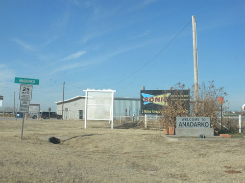  
아나다르코 시티 초입의 모습

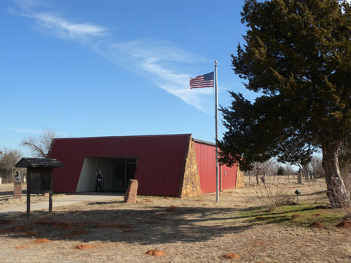  
국립 아메리칸 인디언 명사 명예의 전당

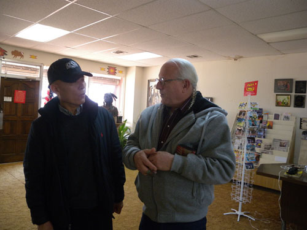  
관리자 칼 제닝스(Carl Jennings)씨와 대화를 나누며

                                                                         

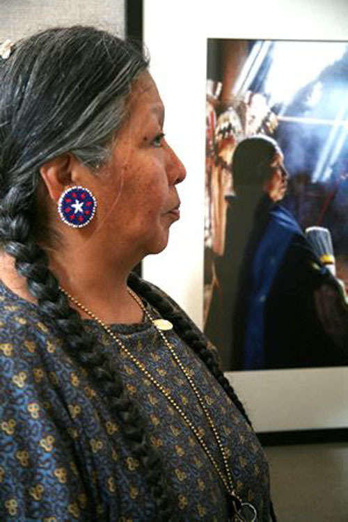  
칼 제닝스 씨의 부인이자 카이와 족 전통예술의 거장 바네사(Vanessa Paukeigope Jennings) 씨

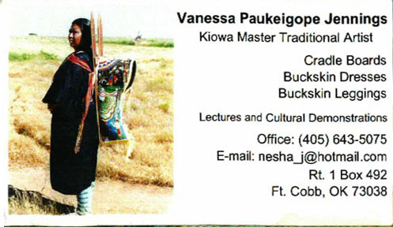  
바네사의 명함. 사진은 자신이 만든 크레이들을 지고 있는 모습.

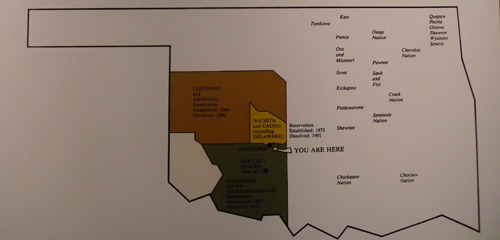  
아나다르코에서 확인한 오클라호마 주 내 인디언 부족들의 분포상

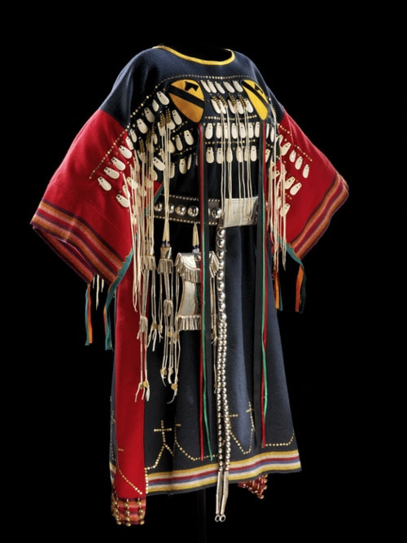  
카이오와 족 여성들의 전투복. 카이오와 족 전사들의 여성 친척들이 입었음.

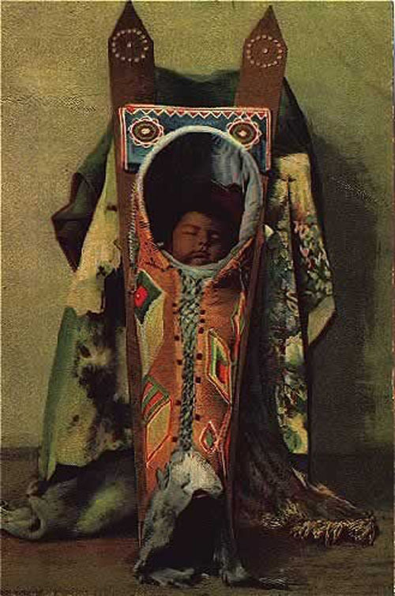  
크레이들보드에서 잠들어 있는 카이오와 아기. 바네사의 작품.

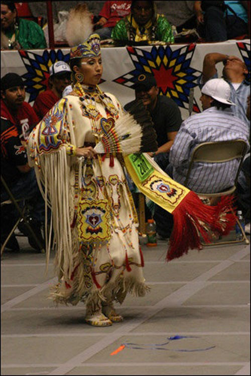  
구슬장식 의상을 입고 있는 카이오와의 여성. 바네사의 작품.

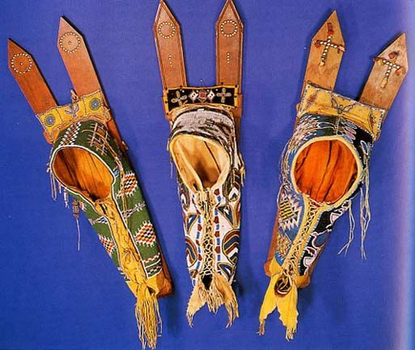  
구슬장식을 한 크레이들 보드. 바네사의 작품.

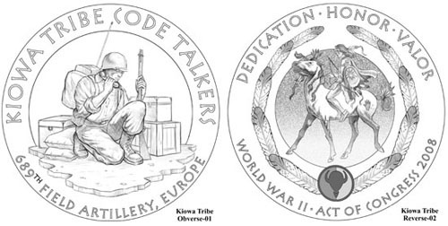  
2차대전에 참여하여 공을 세운 카이오와 족 암호해독병

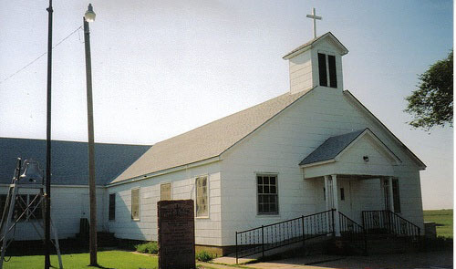  
레이니 마운틴(Rainy Mt.)에 있는 인디언 침례교회[Indian Baptist Church]

공유하기

게시글 관리

**백규서옥\_Blog ver.**