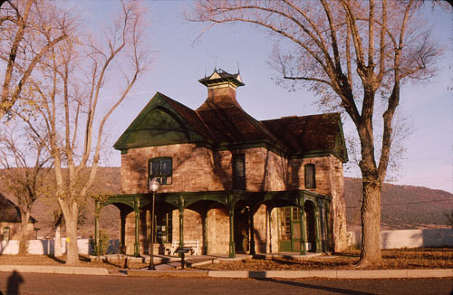  
아파치 네이션 본부

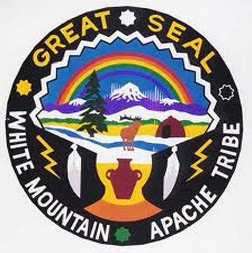  
화이트 마운틴 아파치족 문장(紋章)

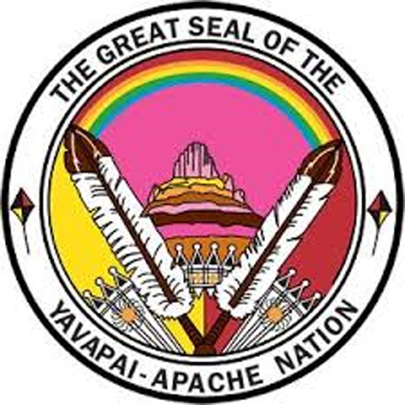  
야바파이 아파치 네이션 문장

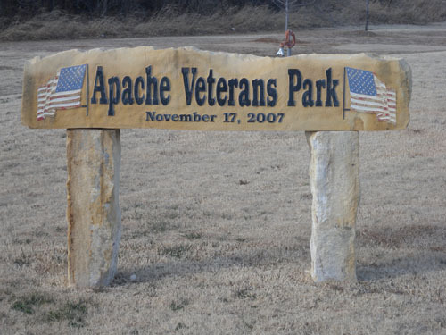  
아파치 시내 입구 아파치 파크 안에 마련된 '아파치 참전용사 공원'

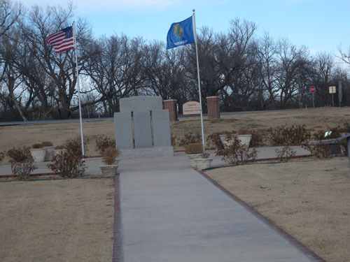  
아파치 시내 입구 아파치 파크 안에 마련된 '아파치 참전용사 공원' 추모비

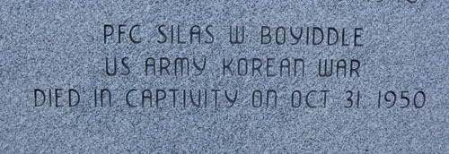  
추모비의 아래쪽에 '미 육군 일병 **실라스 W. 보이들**, 한국전에서 1950년 10월 31일   
적에게 잡혀 죽었다'고 쓰여 있다.

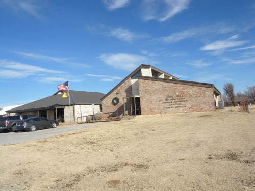  
포트실 치리카화 웜스프링스 아파치족 사무소  
(Fort Sill Chiricahua Warm Springs Apache Tribal Office)

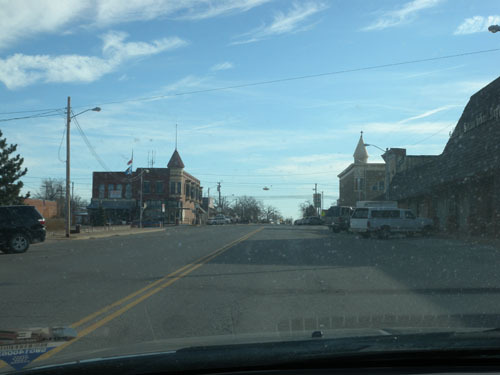  
차창으로 내다 본 아파치 시가지

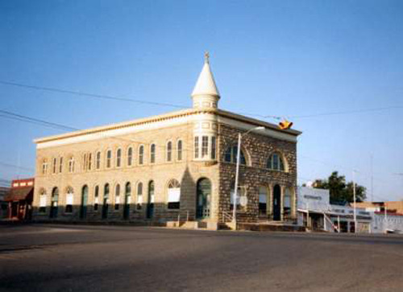  
아파치 역사 박물관[Apache Historical Society Museum]

카이오와(Kiowa), 아파치(Apache), 코만치(Comanche), 그리고 대평원[Great Plains]의 서사시(3)

아파치 정신을 찾아 대평원으로!

아나다르코의 카이오와로부터 아파치와 코만치를 찾아 남쪽으로 떠났다. 가도 가도 끝이 없는 벌판 위엔 누렇게 마른 풀이 지천으로 깔려 있고, 검정색 소들만 주인행세를 하는 듯 늘어서서 게으르게 움직이고 있었다. 말 탄 아파치의 전사들처럼 바람은 사정없이 달려와 나그네의 뺨을 찌르는데, 지평선은 망망하여 지고 뜨는 해의 방향을 분간할 수 없었다. 일직선으로 곧게 뻗은 길가에는 물어볼 사람도 집도 없었다. 불안한 마음으로 수십 분을 더 달리니 벌판 위에 ‘포트 실 치리카화 웜 스프링스 아파치 족 사무소[Fort Sill Chricahua Warmsprings Apache Tribal Office]’라는 글자들을 벽에 달고 있는 건물들이 눈에 띄었다. 포트실 아파치 족은 연방으로부터 인정받은 오클라호마 내의 미국 원주민 종족이니, 이곳 아파치가 미국 내 전체 아파치 족을 대표하는 셈이다. 그러나 사무소에 들어가니 전체적으로 썰렁했다. 내부는 공사 중이어서 어수선했으나, 자리를 지키고 있던 인디언 아가씨는 친절했고 설명 또한 구체적이었다. 그녀가 알려준 대로 20마일쯤 달려가니 아파치 시티가 나왔고, 그 입구에 아파치 시티 팍(Apache City Park)이 있었으며, 그 한쪽에 ‘참전용사들의 공원[Veterans Park]’이 있었다. 아파치 족 출신인지 알 수는 없었으나 한국전에서 포로가 되었다가 죽은 젊은 군인의 이름도 비석에는 올라 있었다. 어딜 가도 한국전 전몰용사들이 자랑스러운 모습으로 부각되어 있는 곳이 미국이었다. 적어도 미국에서만큼은 6•25가 잊혀진 전쟁이 아니었음을 알게 되었고, 아파치 인디언들의 본고장에서 그 점을 확인했다는 것이 감동적이었다. 주변을 둘러보니 생활 형편들이 괜찮은지 다운타운으로 들어가는 연도의 주택들에는 남부지역 도시로서는 드물게도 윤기가 흘렀다.

이 지역의 아파치 인디언들은 원래 알래스카 지방이나 캐나다, 미국 서부 등지에서 온 사람들이었다. 아마 오랜 옛날 아시아와 미주가 연결되었을 때 알라스카와 캐나다로 건너온 아시아계 사람들이 그들이었으리라. 그들이 로키 산맥을 따라 캘리포니아 등 미국의 서부 지역으로 내려왔고, 다시 그로부터 동쪽 혹은 남부의 대평원 지역으로 옮겨왔을 것이다. 따라서 아파치는 한 지역에서 결코 오래 정착해본 적이 없고, 원래 정착할 수도 없었다는 점에서 전형적인 ‘노마드(Nomad)’였다. 그처럼 수시로 이동하기 위해서는 말이 필수적이었다. 그들이 말을 타거나 활용하는 방법을 익힌 첫 부족들 가운데 하나라고 보는 것도 그 때문이다.

1700년경 캔자스 평원으로 이동한 아파치 부족원의 다수는 그곳에 살면서 농사를 짓고자 했으나, 농사일에 익숙지 않았다. 어쩔 수 없이 수박, 콩, 옥수수 등 농작물들을 재배하는 과정에서 많은 고생을 했던 것으로 보인다. 결국 그런 약점 때문에 나중에 코만치 족에게 지배를 당하고 땅도 빼앗겼으며, 뉴멕시코나 애리조나 등지로 옮겨가게 되었다. 그리고 어떤 사람들은 텍사스와 멕시코 쪽으로도 들어가게 되었다. 그러자 자연스럽게 그곳을 지배하던 스페인 사람들과 싸우게 되었다. 즉 1730년대 아파치 인들은 스페인 사람들과 피나는 전쟁을 시작했고, 1743년이나 되어서야 스페인의 지도자가 텍사스 일부 지역을 이들에게 살 수 있도록 양보하면서 땅을 두고 벌어졌던 싸움은 사그라지기 시작했다. 1749년의 한 의식(儀式)에서 아파치 추장은 싸움이 끝났다는 것을 보여주기 위해 손도끼를 땅에 묻었는데, 그 이후로 오늘날도 ‘손도끼를 땅에 묻다’는 말은 전쟁이 끝났다는 것을 상징하게 되었다고 하니, 재미있는 일이다.

원래 ‘아파치(Apache)’란 말은 문화적으로 관련 있는 미국 남서부 원주민들의 그룹을 지칭하던 집단 명사였다. 원래 아파치 사람들은 동부 애리조나, 멕시코 북부, 뉴멕시코, 텍사스 서부 및 남서부, 콜로라도 남부 등지에 걸쳐 살았고, 그 지역은 고산 지대, 물이 풍부한 계곡지대, 크고 깊숙한 협곡, 사막, 남부의 대평원 등으로 이루어져 있었다. 아파치 족의 하부그룹들은 약간의 정치색을 띤 몇 개의 부류로 나뉘는데, 이 가운데 규모가 큰 일곱 개의 그룹들은 각각 다른 언어를 사용하고 각자의 독특한 문화를 경쟁적으로 발달시켰다. 나바호(Navajo), 서부 아파치(Western Apache), 치리카화(Chiricahua), 메스칼레로(Mescalero), 지카릴라(Jicarilla), 리판(Lipan), 대평원 아파치(Plains Apache) 등이 현재 확인할 수 있는 그룹들이다. 현재 이런 아파치 족들 대부분은 오클라호마와 텍사스에 살고 있고, 애리조나와 뉴멕시코의 보호구역들에도 살고 있다. 이들 외에 일부 아파치 인들은 대도시 지역으로 이주하기도 했는데, 큰 규모의 도시지역 공동체로는 오클라호마 시티, 캔자스 시티, 피닉스(Phoenix), 덴버(Denver), 샌디에고(San Diego), 로스앤젤레스(Los Angeles) 등이 꼽힌다.

서부영화들에 단골로 등장하는 것처럼, 아파치 족은 역사적으로 매우 강하고 전략적인 민족으로 인정을 받아왔는데, 몇 세기 동안 스페인과 멕시코 사람들에게 대항하는 과정에서 얻게 된 명성이었다. 미국 육군 역시 19세기에 들어와 그들과 몇 번 대결해 보고 나서는 아파치가 강한 전사들이자 기술적인 전략가들임을 알게 되었다고 한다. 이처럼 아파치족은 미국과 40여 년 간 쉬지 않고 전쟁을 벌였으며, 심지어 남북전쟁 때 북부군과 남부군이 서로 싸우는 처지에서도 양자 모두 아파치와의 전쟁을 지속했다니, 그들의 용맹성을 이보다 더 분명히 입증해주는 자료는 없을 것이다.

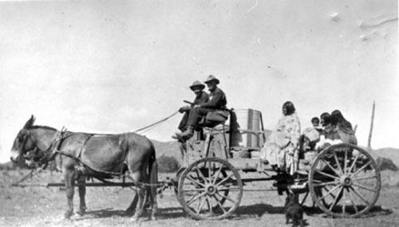  
수레를 타고 가는 아파치 가족

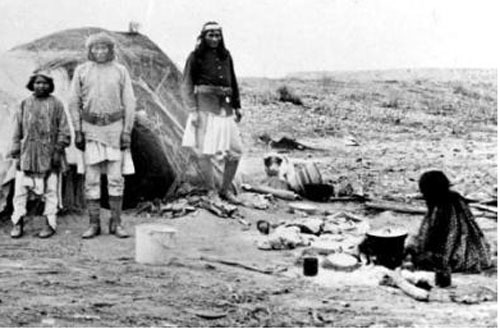  
떠돌이 생활을 하는 아파치족

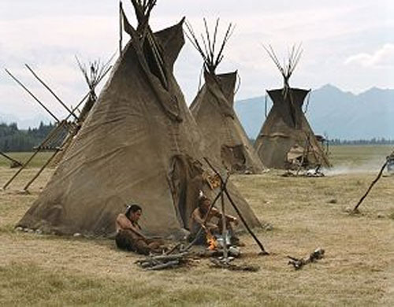  
아파치족의 전통가옥인 티피(Tipi)

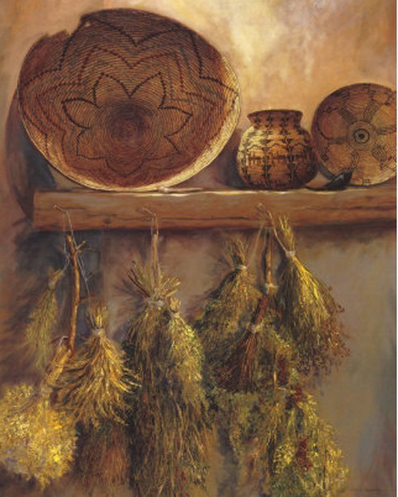  
아파치족의 바구니들과 약초들

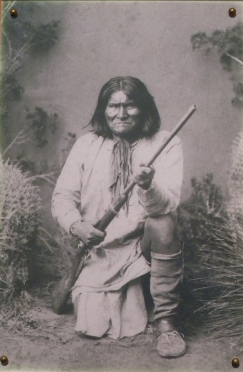  
치리카후아 아파치족의 주술사이자, 아파치 전쟁 중 멕시코와 미국을 상대로 투쟁했던   
아파치족의 걸출한 지도자 제로니모. 1909년 2월 17일 포트실 감옥에서 80세를 일기로 사망했음.

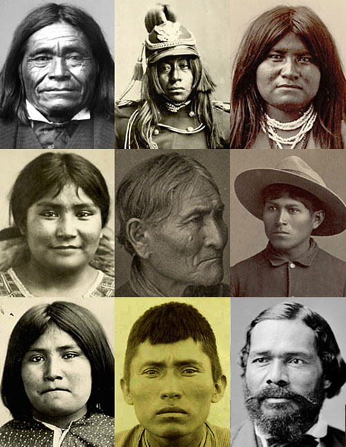  
아파치족의 다양한 모습들

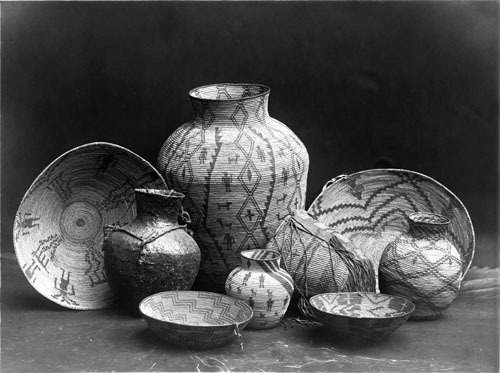  
아파치족의 각종 전통그릇들

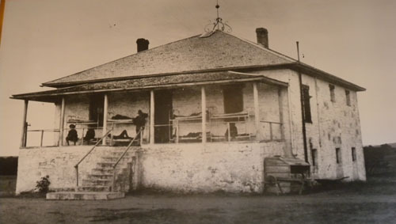  
포스트 가드하우스(Post Guardhouse)의 당시 모습.   
현재는 박물관(Fort Sill Historic Landmark & Museum)으로 쓰이고 있음.

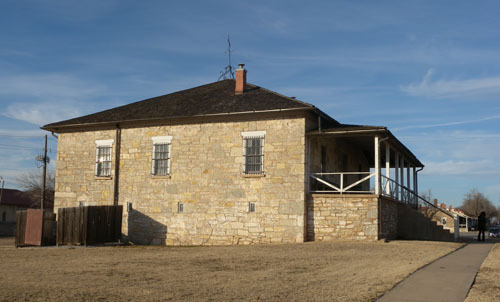  
포트실 역사 박물관(Fort Sill Historic Landmark & Museum)

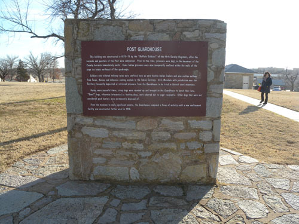  
포트실 역사박물관의 유래를 설명하는 글

대부분의 아파치 인들도 다른 부족들처럼 네이션이나 보호구역의 범주 안에 거주하고 있으며, 그것들 가운데 연방정부에 의해 공인된 것만 해도 아홉 개나 된다. ‘오클라호마의 아파치 족[Apache Tribe of Oklahoma]/애리조나 주 포트 맥도웰의 야바파이 네이션[Fort McDowell Yavapai Nation, Arizona]/오클라호마 주 포트 실의 아파치 족[Fort Sill Apache Tribe of Oklahoma]/뉴멕시코 주의 지카릴라 아파치 네이션[Jicarilla Apache Nation, New Mexico]/애리조나 주 산 카를로스 보호구역의 산 카를로스 아파치 족[San Carlos Apache Tribe of the San Carlos Reservation, Arizona]/애리조나 주 톤토 아파치 족[Tonto Apache Tribe of Arizona]/애리조나 주 포트 아파치 보호구역의 화이트 마운틴 아파치 족[White Mountain Apache Tribe of the Fort Apache Reservation, Arizona]/애리조나 주 캠프 버디 인디언 보호구역의 야바파이 아파치 네이션[Yavapai-Apache Nation of the Camp Verde Indian Reservation, Arizona]’ 등으로 다른 부족들에 비해 수가 많은 편이다.

지금 우리가 찾아다니는 오클라호마의 아파치는 ‘대평원의 아파치’로서 아나다르코(Anadarko) 근처에 본거지를 두고 있으며, 위에 제시한 바와 같이 연방정부에 의해 오클라호마 아파치로 인정된 그룹이었다.

그런 아파치족의 역사와 문화를 현지에서 만난다고 생각하니 가슴이 뛰었다. 아파치 시내에서 만난 ‘아파치 히스토리컬 서사이어티 뮤지엄(Apache Historical Society Museum)’은 예상대로 많은 생활문화사 자료들을 갖추고 있었다. 가정생활, 산업, 학교, 운송, 의료기구, 의상, 가구, 서적, 사진, 초창기 은행 시설, 회화, 아파치 시민들의 개인 기념물 등 모든 분야의 콜렉션들을 풍부하게 보유한 점에서 아파치족의 역사와 문화를 압축적으로 보여주는 현장이었다. 1901~1902에 2층으로 세워진 이 석조 건물에는 애당초 아파치 주립은행 사무실과 다른 업종들이 입주해 있었다. 그러나 이 건물은 1976년부터 박물관으로 사용되기 시작했다. 그 후 40년 가까이 모은 다양한 생활사 자료들을 통해 아파치족이 근대에 이룬 ‘문명화’의 자취를 파악할 수 있었다.

이 박물관을 떠나 10분 정도 달린 끝에 도착한 곳이 바로 ‘포트 실 군사 보호 구역[Fort Sill Military Reservation]’ 안에 있는 ‘포트 실 국립 역사 랜드마크 박물관[Fort　Sill National Historic Landmark & Museum]’이었다. 이곳이 현재 사용되고 있는 미 육군의 군사기지인 만큼 출입문을 통과할 때부터 현역 군인의 검문을 받아야 했다. 드넓은 부지 한 군데에 오래 된 2층 벽돌집이 있고, 그곳이 바로 이 지역의 ‘랜드마크’이자 박물관이었다. 안에 들어가니 지키는 사람도 없이 자동으로 음성 설명이 나오도록 되어 있었다. 주로 죄를 지은 아파치 인디언들을 구금하고 처형하던 형무소가 원래 이 건물의 용도였고, 박물관으로 변신한 지금 당시의 구조를 그대로 유지하면서 아파치 인디언들이 겪어온 고난과 질곡의 세월을 보여주고 있었다. 죄를 지었기 때문에 구금되고 형을 받았겠지만, 백인이 다스리는 세상에서 저지른 죄와 받은 형벌이 과연 얼마나 공정했는지는 알 길이 없었다.

\*\*\*

아파치는 아직도 살아 있었다. 다른 어느 부족들의 땅보다 넓고 다양한 지역에서 각 그룹마다 자신들만의 독자적인 세계를 구축해가고 있었다. 미국 정부에 가장 길고 끈질기게 저항했던 ‘용맹한 전사들’이 바로 아파치족이었다. 그러면서도 대평원의 주인이자 맹장으로서 주변 부족들을 상대로 투쟁과 화해의 전술을 다양하게 구사해 온 탁월한 전략가의 면모를 보여주기도 했다. 그 과정에서 만들고 보존해온 생활사의 다양한 자료들이 박물관에 전시되어 있었다. 그러나 그들의 타고난 성품 탓인지 모르지만, 이들 영역의 어느 박물관을 가도 촬영을 허락하지 않았다. 각종 인터넷 사이트에도 다른 부족에 비해 자신들의 박물관 소장품에 대한 소개나 설명은 거의 없었다. 그 점은 그들의 폐쇄성에 대한 근거로 들 수도 있지만, 역설적으로 자부심과 자신감의 발로일 수도 있었다. 서부영화에 ‘용맹한 부족’으로 약방의 감초 격으로 등장해 온 아파치족. 이들의 거친 정신은 바야흐로 미국의 핵으로 떠오르고 있는 서부문화를 대표한다고 볼 수 있다. 약간은 거칠지만, 개척자로서의 미국정신에 자극을 줌으로써 미국의 국제적 리더십의 형성에 한 몫 거들었다고 한다면, 과언일까.<다음에 계속>

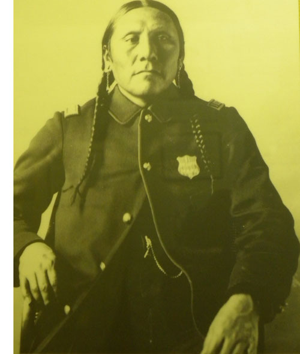  
가드하우스의 인디언 경찰 수장인 코만치족 출신의 아르코(Arko).   
군인 자켓을 입고 있는 1884년 모습.

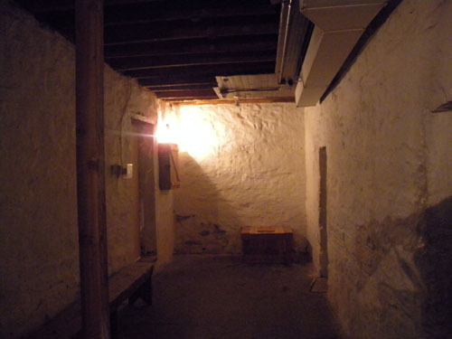  
가드하우스 지하 감방의 복도

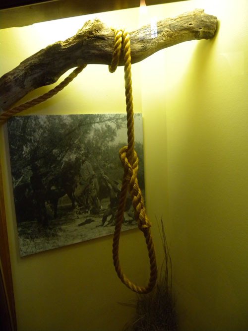  
가드하우스 밖에 있는 나무에 걸고 교수형을 집행하던 목줄

  
당시 나뭇가지에 목줄을 걸어 교수형을 집행하던 광경

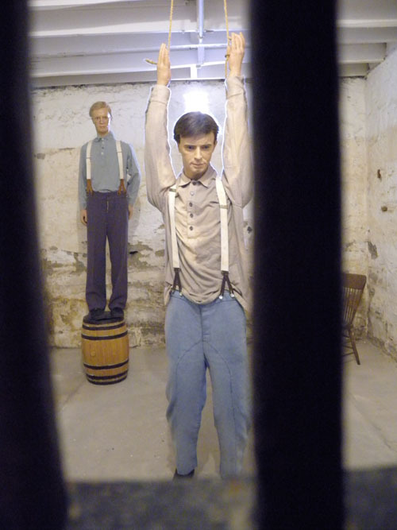  
죄수들에게 벌을 주던 징벌방의 모습

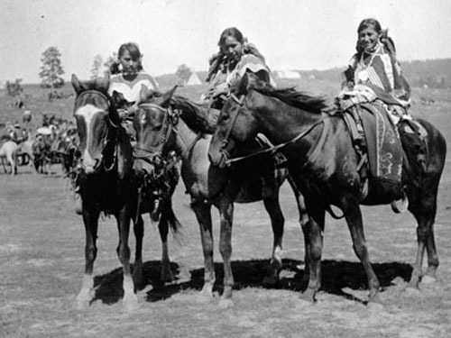  
아파치족 소녀들

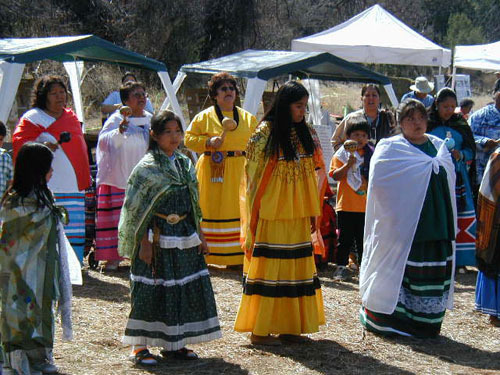  
야바파이 아파치족 여성 합창단

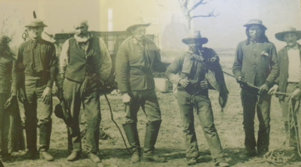  
1880년경 죄를 지은 Boomer들을 잡은 군인들과 인디언 경찰들

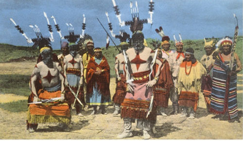  
아파치족 데블 댄서(Devil Dancer)들

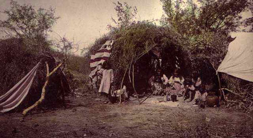  
치리카화 아파치족 주술사[Chiricahua medicine man]

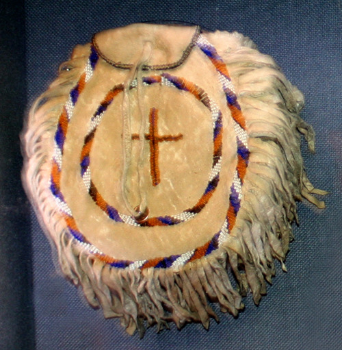  
아파치족의 구슬장식 공예품

공유하기

게시글 관리

**백규서옥\_Blog ver.**