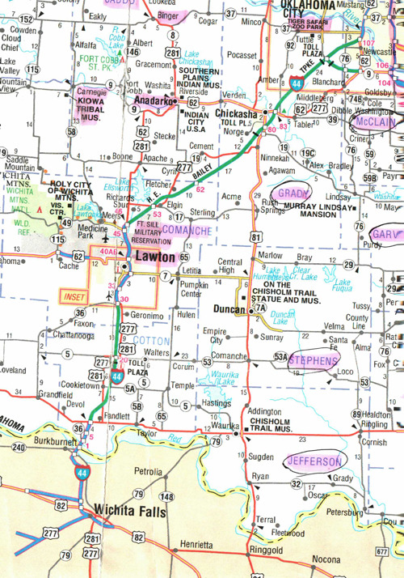  
코만치의 수도 로턴을 중심으로 이어진 각 도시들

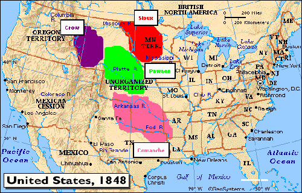  
1848년의 미국 지도

  
코만치 네이션의 깃발

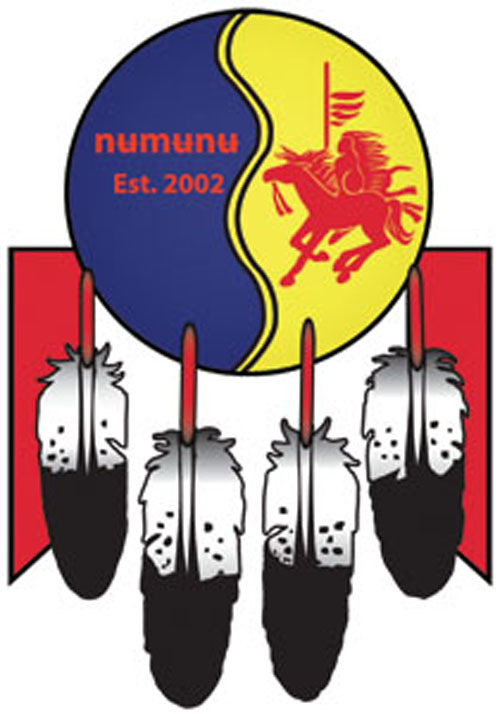  
코만치 민족대학[Comanche Nation College]의 상징

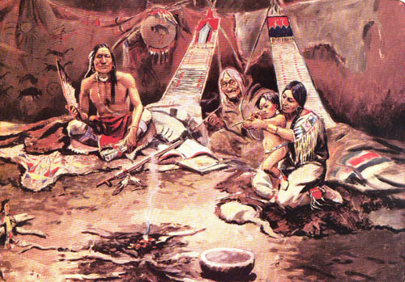  
티피 안에서 행복하게 살아가는 코만치 가족 3대

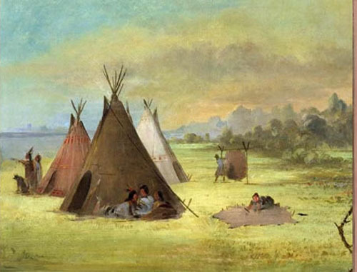  
대평원의 티피

  
티피를 재현해 놓은 모습

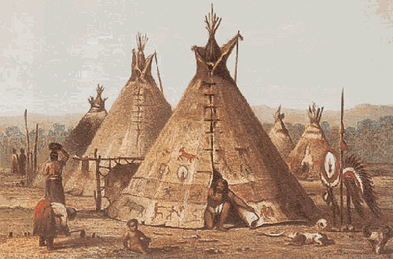  
옛날 코만치족 티피의 모습

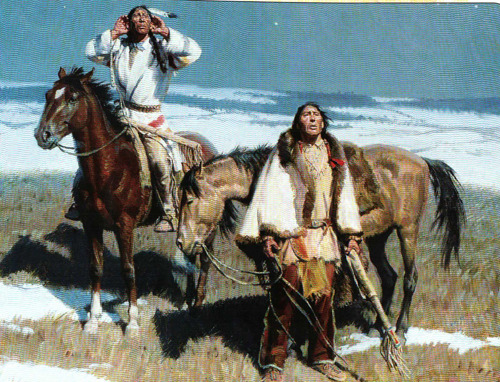  
멀리서 들려오는 신호음을 듣고 있는 인디언 전사들

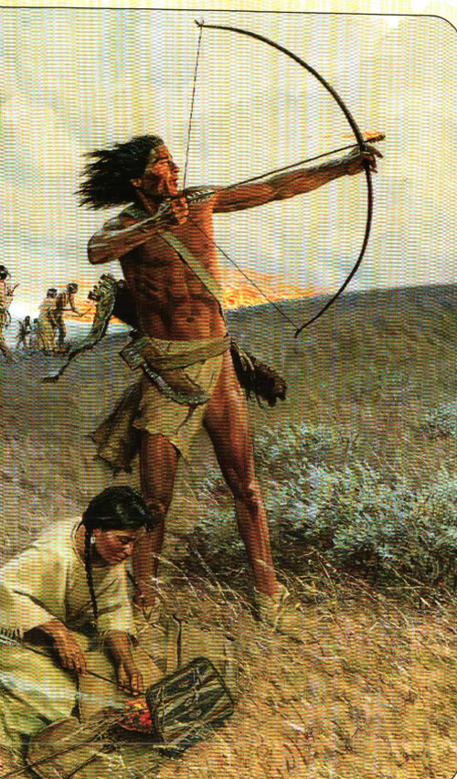  
불 붙인 풀을 화살에 붙여 쏘아 버팔로들을 언덕 위로 몰고 있는 인디언들

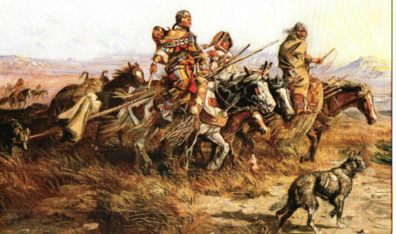  
가재도구를 끌고 말을 탄 채 이동하는 인디언 가족

카이오와(Kiowa), 아파치(Apache), 코만치(Comanche), 그리고 대평원[Great Plains]의 서사시(4)

무서운 코만치에서 상식의 미국인으로!(1)

포트실을 떠나 5분쯤 달렸을까. 코만치의 수도 로턴(Lawton)에 진입했다. 서부영화에서 접한 코만치 전사들의 ‘무시무시함’이 기억에 남아서였을까, 운전대를 잡고서도 무의식적으로 시내 좌우를 두리번거리게 되었다. 어느 골목으로부터 말을 타고 예의 그 화살을 겨누며 쫓아 나올지 모르기 때문이었다.^^ 그러나 시가지는 잘 정비되어 있었고, 깨끗하며 조용했다. 여느 도시들 못지않게 주택들엔 윤기가 흘렀다. 펄펄 살아 날뛰던 코만치의 정기는 이미 죽었는지, 아니면 어느 구석에 잠복해 있는지, 고요하기만 했다.

그들이 처음으로 외부인들에게 발견되었을 때, 그들은 수렵과 채취를 업으로 삼고 기마술 같은 특유의 ‘말 문화[horse culture]’를 보유한 부족이었다. 그들의 인구는 18세기 후반이 되자 이미 45,000 명 이상으로 늘어 있었다. 그들은 이곳 남부 대평원을 지배하던 부족으로서 가끔 다른 부족과의 전쟁에서 포로들을 잡아다가 스페인 사람들이나 멕시코 정착민들에게 노예로 팔아먹기도 하던 ‘무서운’ 사람들이었다. 그 뿐 아니다. 수천 명의 스페인 사람들, 멕시코 사람들, 심지어 미국 정착민들까지도 포로로 잡아다가 국경지역에 묶어 두고 백인인 그들과의 강제결혼을 통해 혼혈의 후손들을 만들어내기도 했는데, 그들이 바로 그 유명한 메스티조(Mestizo) 혼혈인들이다. 코만치가 그 메스티조의 확장과 전개에 큰 공헌을 한 셈이고, 그것은 결국 인종의 개량이라는 긍정적 결과를 낳게 된 셈이었다. 이처럼 40년 이상 미국과의 전쟁을 계속하면서 그들을 질겁하게 만든 아파치보다도 오히려 무서운 것이 코만치였다.

현재 코만치 네이션에 등록된 인구는 15,000여 명이고, 그 중 7,700여 명이 로턴•포트실과 그 주변지역 등 오클라호마 주 남서부 지역에, 나머지는 전국에 각각 흩어져 살고 있다 한다. 그러나 매년 6월 중순, 오클라호마 주 월터스(Walters) 시티에서 열리는 ‘홈커밍 파우와우(Homecoming Powwow)’ 행사에는 대부분의 코만치 인들이 모인다고 한다. ‘파우와우’는 병의 회복이나 사냥의 성공 등을 비는 집단의식이다.

코만치 네이션의 본부는 로턴에 있는데, 카도(Caddo)•코만치(Comanche)•카튼(Cotton)•그래디(Grady)•제퍼슨(Jefferson)•카이오와(Kiowa)•스티븐스(Stephens)•틸만(Tillman) 카운티 등이 그들의 사법권이 미치는 지역이다. 8분의 1 즉 대략 13% 정도의 코만치 피를 갖고 있으면 부족원의 자격이 있다고 하니, 증조부모 가운데 한 사람만 코만치 인이면 네이션에 등록할 수 있는 것이다. 코만치족은 대평원의 인디언 부족으로서 그들이 차지한 영역은 뉴멕시코 동부, 콜로라도 남동부, 캔자스 남서부, 오클라호마 서부, 텍사스 북서부 등으로 이루어져 있다. 미국 정부가 인정한 코만치 네이션의 본부는 현재 로턴에 있다.

코만치가 뚜렷한 부족으로 떠오른 것은 1,700년 직전 즉 그들이 쇼쇼니(Shoshone) 부족으로부터 떨어져 나왔을 때였다. 당시 쇼쇼니 부족은 와이오밍 주 플랫 강(Platte River) 상류를 따라 살아가고 있었다. 그런데, 코만치족은 말[馬]을 얻음으로써 큰 변화의 계기를 맞이했다. 1680년 푸에블로(Pueblo) 족이 반란을 일으킨 후 푸에블로 인디언들로부터 말을 얻게 되었고, 쇼쇼니로부터 분리해 나온 이후 말을 이용함으로써 더 좋은 사냥터를 찾을 수 있는 기동성을 확보하게 되었다. 말하자면 역사상 교통수단의 발달이 혁명이라 할 정도로 산업을 발전시킨 것과 같은 이치라 할 수 있다. 이처럼 코만치 문화의 등장과 말은 불가분의 관계를 갖는다. 사실 그들이 쇼쇼니와 결별하고 남쪽으로 이동한 목적도 새로운 바이슨 떼를 찾아내기 위한 데 있었던 것이 아니고, 스페인 식민지의 정착자들로부터 새로운 말들을 구하기 위한 데 있었다고 할 정도였다. 상당수의 서부영화들에 묘사된 것처럼 코만치 인디언들의 마술(馬術)은 신기(神技)에 가깝다는 평들이 있어왔다. 다시 말하면 코만치족은 말을 그들의 문화에 도입했을 뿐 아니라 다른 부족들에게 소개한 대평원의 첫 부족이었다는 것이다.

그들은 남부 대평원으로 이동하면서 아칸사 강으로부터 텍사스 중부로까지 영역을 넓혔고, 1,700년에는 뉴멕시코와 텍사스 주 상단 즉 오늘날의 오클라호마 주 팬핸들(Panhandle)에까지 이를 정도였다. 많은 전투를 거치면서 결국 1777년 싸움의 상대였던 리판 아파치(Lipan Apache)는 리오 그란데(Rio Grande) 강까지, 메스칼레로 아파치(Mescalero Apache)는 코아휠라(Coahuila)까지 각각 퇴각하게 되었다. 그 사이에 코만치는 들소인 바이슨의 증식을 통해 식량이나 옷을 확보하게 되었고, 쇼쇼니 이주자들이 유입되었으며, 라이벌 그룹들로부터 포로로 잡아온 여인들과 아이들을 자신의 주민으로 받아들임으로써 인구가 급격하게 불어났다. 그러나 코만치는 단일민족으로 응집하지 못하고, 십여 개의 자치그룹으로 분할되었는데, 그들은 그것들을 ‘밴드(band)’라 불렀다. 이 밴드들은 언어와 문화를 공유하고, 좀처럼 서로 싸우지 않았다.

그들은 19세기 중반쯤 프랑스와 미국의 무역업자나 정착자들에게 말을 공급했고, 나중에는 캘리포니아 골드러쉬에 참여하기 위해 캘리포니아 로드를 따라 자기네 영역을 통과하는 이주자들에게도 말을 공급하게 되었으니, 코만치족이야말로 말을 이용하여 전쟁에도 이기고 부도 이룬 셈이었다. 그 뿐 아니다. 그 때까지 야만적인 성향을 버리지 못하고, 말의 수요가 늘어나면서 공급이 달리자 다른 부족들과 정착자들의 말을 훔치는 일이 다반사가 되었다. 그래서 그들은 ‘무서운 말 도둑’이란 악명을 얻게 되었고, 나중에는 가축까지 훔치게 되었다. 스페인 사람들이나 미국인 정착자들에게서 가축을 자꾸 훔치다가 전쟁이 터지는 수도 있었다**.<다음에 계속>**

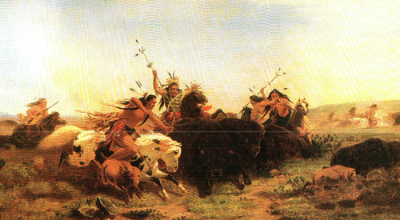  
버팔로를 몰아 함께 사냥하는 인디언들

  
풀을 뜯고 있는 대평원의 버팔로

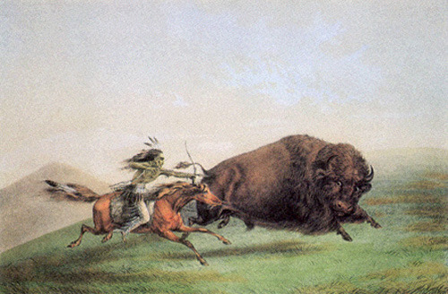  
혼자서 말을 타고 버팔로를 사냥하고 있는 인디언

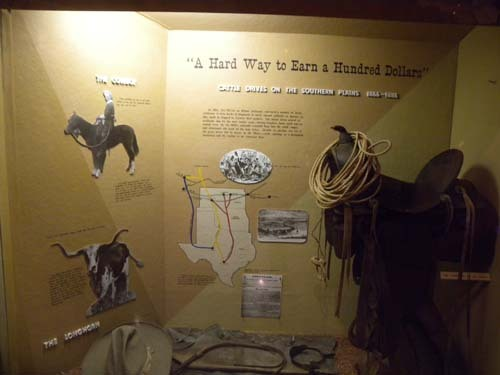  
가축떼를 몰고 이동시키는 일의 어려움

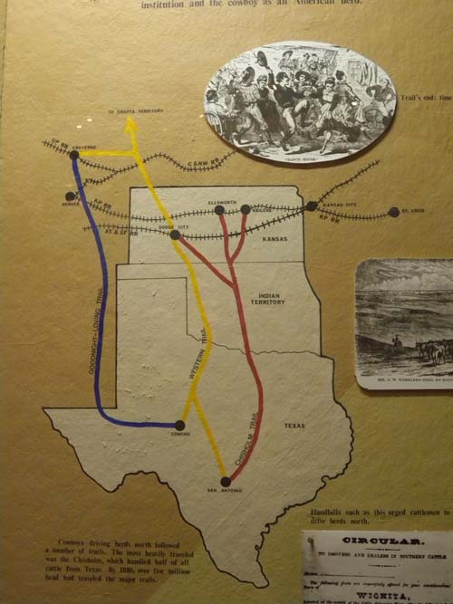  
가축떼를 몰고 이동하던 통로들

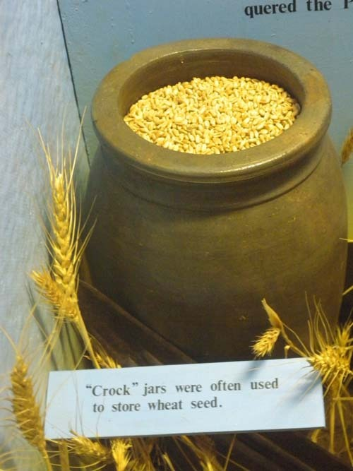  
밀 씨앗을 보관하던 옹기

  
밀의 무게를 재던 저울

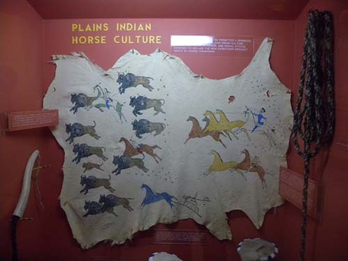  
대평원 인디언들의 말 문화

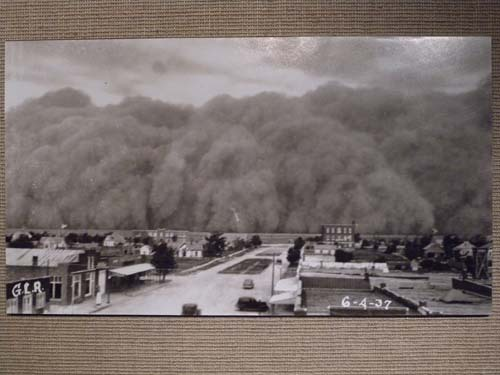  
1930년대 캐나다의 평원과 미국의 곡창지대에 큰 피해를 준 먼지 폭풍. 1930년대 내내 심각한   
가뭄과 바람에 의해 심한 고통을 겪었음.   

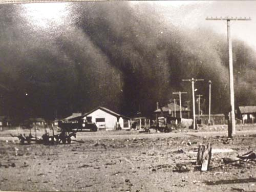  
Dust Bowl의 다른 모습

공유하기

게시글 관리

**백규서옥\_Blog ver.**