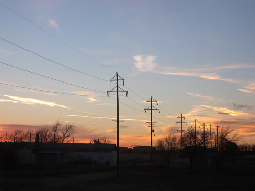  
로턴의 호텔방에서 내다 본 석양 모습

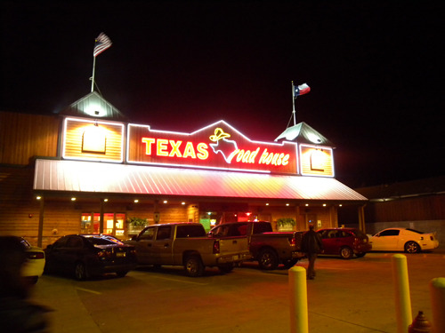  
로턴시내의 색다른 스테이크 하우스 '텍사스 로드 하우스'

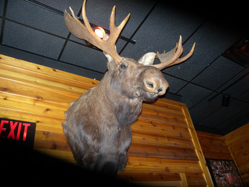  
식당 문에 매달린 엘크

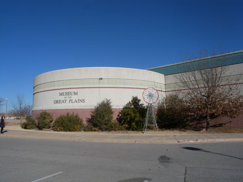  
대평원 뮤지엄[Museum of the Great Plains]

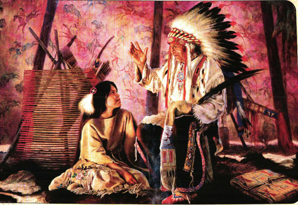  
부족의 경험과 전설을 젊은이에게 이야기해 주고 있는 인디언 노인

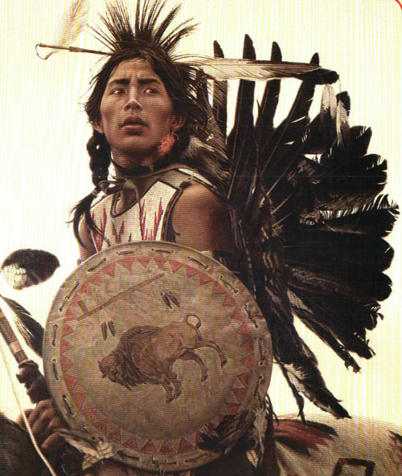  
전장에 나가고 있는 인디언 전사

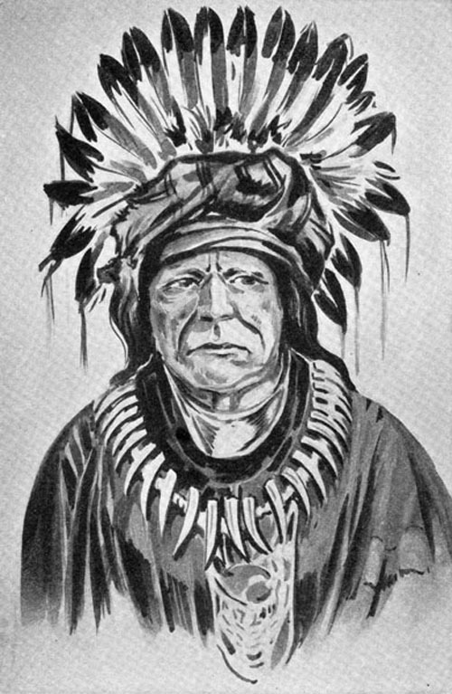  
소크족[Sauk Tribe] 인디언 추장

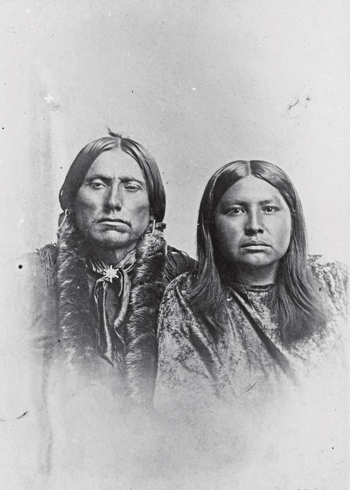  
소크족 인디언 부부

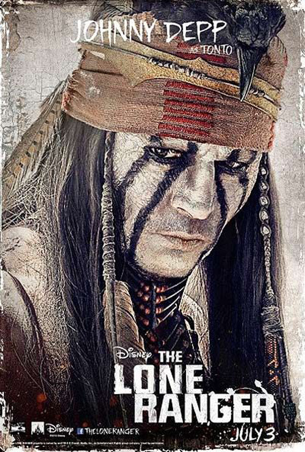  
코만치 인디언 톤토 역을 맡은 죠니 뎁

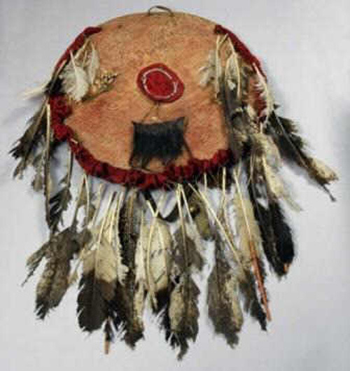  
코만치 족의 방패

  
1990에 발행된 코만치 시리즈의 미국우표

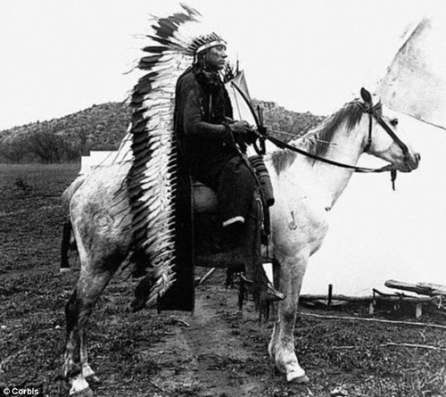  
인디언 추장

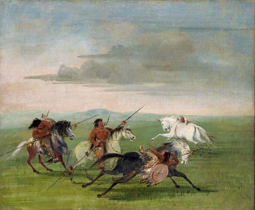  
코만치족의 기마전술

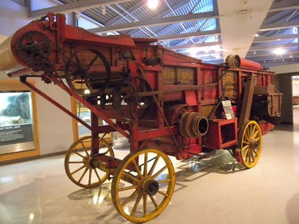  
대평원 박물관에 전시된 농기구

카이오와(Kiowa), 아파치(Apache), 코만치(Comanche), 그리고 대평원[Great Plains]의 서사시(완)

무서운 코만치에서 상식의 미국인으로!(완)

말에 미치다시피 한 코만치족은 코만치 영역 주변에서 대략 2백만 마리에 달하는 방대한 수의 야생마들을 이용하기도 했다. 18세기 후반과 19세기 초반에 코만치족은 오늘날의 ‘마이 카(my car)’ 개념처럼 각자 한 마리씩의 말을 소유했다. 물론 전사들은 여러 마리의 말들을 갖고 있기도 했지만. 대략 3만~4만의 인구가 몇 배의 말떼를 소유하다 보니, 코만치 족은 추가로 9만~12만의 말들을 갖게 되었다.

말은 전쟁의 결정적인 수단이었다. 싸움은 코만치족 삶의 가장 중요한 부분이었으며, 코만치족은 말을 타고 각종 전통 무기들을 쓸 줄 알았으며, 그런 전술을 발전시킨 사람들이었다. 코만치족이 멕시코 인들을 침략할 때면 예외없이 달밝은 밤을 택했는데, 그들은 밤중에도 말을 타고 상대방을 보면서 싸울 수 있는 기술을 갖고 있기 때문이었다. ‘코만치 문(Comanche Moon)’이란 바로 거기서 나온 말이었다.

현재 코만치족은 주택청[Housing Authority]을 운영하고, 코만치 인들에게 자동차 택(tag)도 발행해주고 있었다. 뿐만 아니라 그들 자체의 고등교육부[Department of Higher Education]를 통해 부족원들의 대학교육을 위한 장학금이나 여타 재정적 지원 등을 제공하고 있었는데, 그 재원은 주로 자신들이 운영하는 담배 판매업과 네 개의 카지노 수입 등으로 조달한다고 한다. 그들은 또한 로턴에 2년제 민족 대학인 ‘코만치 네이션 칼리지(Comanche Nation College)’를 설립, 운영하고 있었다. 이것 역시 2세 교육에 재원을 투자함으로써 전통시대의 수준과 의식에서 벗어나려는 몸부림이었다.

로턴 시내 한 구석에는 상당수의 유명호텔들이 모여 있었고, 우리는 그 가운데 저렴하면서도 깨끗한 호텔을 구할 수 있었다. 깨끗한 호텔들이 제법 모여 있다는 것은 이 도시를 찾는 여행객들이 적지 않음을 보여주는 증거라 할 수 있는데, 그 여행객들의 상당수는 코만치의 역사와 문화에 대한 탐방을 주목적으로 하고 있는 듯 했다. 호텔에서 1박을 한 다음 우리는 ‘그레이트 플레인 뮤지엄(Museum of the Great Plains)’과 ‘코만치족 뮤지엄과 문화센터(Comanche National Museum and Cultural Center)[이하 코만치 뮤지엄으로 약칭]’에 들렀다. 그레이트 플레인 뮤지엄에는 오클라호마 주 전체의 인디언 역사와 문화를 보여주기 위한 콜렉션들이 전시되어 있었고, 코만치 뮤지엄에는 오직 코만치족의 역사와 문화에 관한 컬렉션만 전시되어 있었다. 

그레이트 플레인 뮤지엄은 여느 박물관과는 달리 ‘탐험, 발견, 경험, 교육’ 등 폭넓은 목적을 상정하고 만들어진 공간이었다. 그곳에는 인디언의 역사와 문화를 보여주는 컬렉션들의 진수가 모여 있었고, 배열 또한 정교하여 그것들의 내용이나 의미를 이해하기가 편했다. 말하자면 갖가지 콜렉션들을 통해 로턴의 역사를 재인식하게 하고, 원주민들이 그레이트 플레인스에 어떻게 정착했는가를 탐구하여 그 의미를 찾아낼 수 있도록 하는 데 초점을 맞춘 것이 이 박물관의 컨셉이었다. 1층은 컬렉션들을 일목요연하게 배열•전시해 놓은 관람 공간으로, 2층은 인디언들의 생활 자료를 직접 만들어 보는 체험학습장으로 각각 달리 꾸며놓은 것도 그 때문일 것이다. 그래서 이 박물관은 일반인, 학생, 학자 등 모든 분야의 사람들이 찾아와 대평원의 원주민들이 남긴 역사와 문화를 즐기면서 이해할 수 있도록 꾸며진 것 같았다.  

남부 대평원의 중요 지역인 오클라호마에 인디언들이 들어와 살게 된 과정과 경위 및 분포양상 등을 일목요연하게 설명한 코너, 농기계 등 농업관련 코너, 더스트 보울(Dust Bowl)이나 랜드런(Land run) 등 오클라호마가 겪은 역사적 시련들을 보여주는 사진 코너, 각 인디언 부족들의 생활자료 코너, 출토된 화석자료를 통한 대평원 지역의 자연사 자료 코너, 인디언 작가들의 그림이나 인디언들의 삶을 그린 작품 코너 등등. 이 박물관을 한 바퀴만 돌면 이 지역의 역사와 인디언의 정착 및 생활사를 소상히 알 수 있도록 안배된 점이 두드러졌다.

이 가운데 압권은 오클라호마의 인디언 정착 과정을 4단계[1830-55/1855-66/1866-89/1889-07]로 나누어 그림과 글로 설명한 코너였다. “문명화된 다섯 부족들은 공식적으로 재배치된 첫 케이스였다. 1830년 ‘Dancing Rabbit Creek’ 조약은 촉토, 치카샤, 체로키, 크릭, 세미놀 등의 부족이 새로운 인디언 구역의 땅을 받기 위해 미시시피 강 동쪽에 있는 그들의 땅을 포기했다는 내용으로 되어 있고, 그 시기를 기점으로 정치적 이주가 시작되었음을 의미한다. 이동하는 도중 긴 거리의 행렬을 군인들이 몰아대기도 했는데, 그 때 많은 사람들이 길에서 죽기도 했다.”는 간략한 설명과 함께 총천연색 지도를 통해 오클라호마의 각지에 어떤 인디언들이 정착하고 있었는지를 보여주었다. 다른 부분도 마찬가지였는데, 이 분야에 대한 몇 권의 책을 읽는 것보다 관람객들로 하여금 분명히 이해할 수 있게 하는 효과를 발휘하고 있었다. 

박물관 밖에 설치된 열차박물관과 코만치 빌리지 또한 매우 중요한 의미를 지닌 공간들이었다. 마지막으로 운행되던 ‘락 아일랜드(Rock Island)’ 노선의 거대한 기관차가 놓여있고, 역사(驛舍) 및 열차관련 컬렉션들로 박물관은 그득했다. 그 옆 벌판에 만들어진 코만치 빌리지 역시 대평원에 살던 코만치의 삶을 상상하기에 충분하도록 만들어져 있었다. 그 다음으로 들어간 곳이 코만치 뮤지엄이었다. 건물의 멋진 외관에 비해 컬렉션의 양과 질이 빈약하고 폐쇄적이라는 점에서 앞서 아파치 시티의 ‘아파치 히스토리컬 서사이어티 뮤지엄’과 유사했다. 현대 예술가들의 작품들을 제외한 대부분의 컬렉션들이 다른 박물관들의 소장품과 겹치고 그 양 또한 많지 않다는 점에서 이 박물관의 한계는 분명했다. 말하자면 아직 완성되지 못한 박물관인 셈이었다. 

코만치족 역시 여타 부족들과 마찬가지로 어려운 삶의 고비들을 겪어 왔다. 그러나 오랜 동안 다른 부족들에게 ‘무섭다’는 인상을 주었을 정도로 호전적이고 야만적인 성향을 지녀온 것이 사실이다. 물론 이것은 다른 부족들과의 생존경쟁에서 우위를 점할 수 있게 한, 그들만의 장점이었을 수도 있다. 그러나 최근까지 서부영화들에 연속적으로 나타나는 그들의 이미지는 ‘도둑놈’, ‘싸움꾼’ 혹은 ‘잔인한 전략가’에 머물러 있는데, 타고난 전투력으로 다른 부족들을 정복하고 그들을 잡아다 노예로 파는 등 비인간적 행태를 지속해 온 역사적 사실이 그대로 반영된 결과일 것이다. 그 과정에서 그들은 말들을 활용하여 많은 이득을 보았고, 그것이 자신들의 세력 확장과 부흥에 큰 기여를 했지만, 현재와 미래의 삶에 의미 있는 바탕이 되었다고 할 수는 없다.

코만치족의 수도라 할 수 있는 로턴에서 코만치족의 정체성을 짐작할만한 아무것도 발견하지 못한 것은 이곳이 이미 문명화된 미국의 한복판이기 때문이리라. 잔인함과 야만성은 문명에 용해되어 새로운 모습의 시대정신으로 나타날 수도 있었으련만, 아직 의미 있는 징후를 발견하지 못한 것은 그 결정적 시기가 도래하지 않아서인가, 아니면 아예 코만치 정신이 죽어버려서인가. 스쳐 지나가는 나그네의 짧은 안목으로 쉽게 알 수 있는 일은 아니었다. 

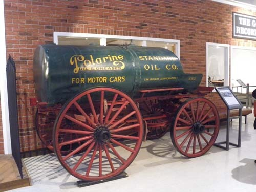  
Standard Oil Company의 Tank Wagon[당시 유전에서 생산된 오일을 실어 나르던 탱크]

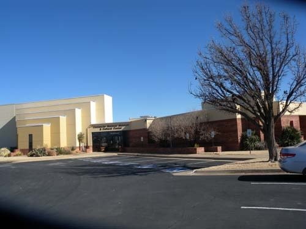  
코만치족 뮤지엄과 문화센터(Comanche National Museum and Cultural Center)

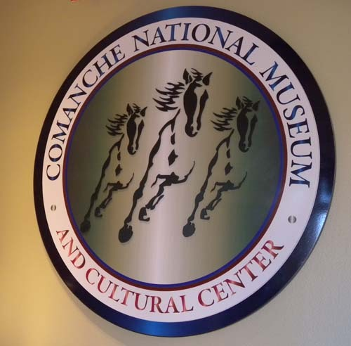  
코만치족 뮤지엄 휘장

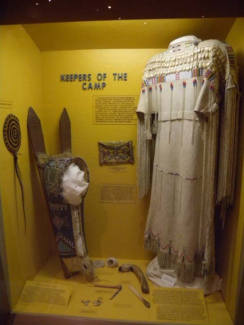  
남자들이 사냥이나 전투에 나갔을 때 티피에 남아 있던 엄마의 위장복과 아기의 크레이들

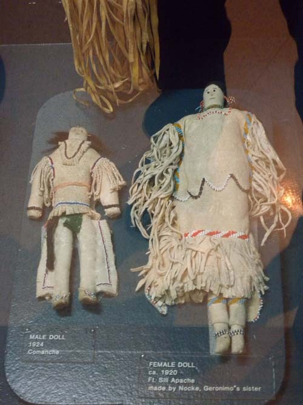  
코만치족의 남자 인형과 아파치족의 여자 인형

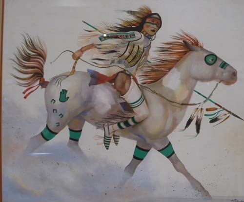  
인디언 전사 그림

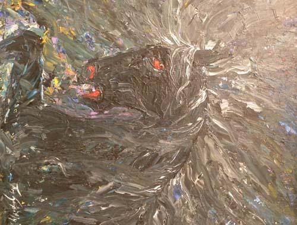  
인디언족 말을 그린 현대 미술

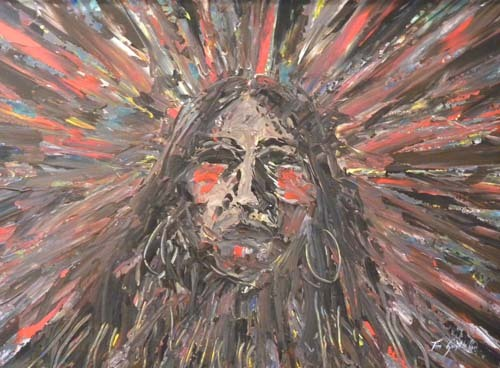  
인디언 전사 그림

  
인디언 추장의 모습

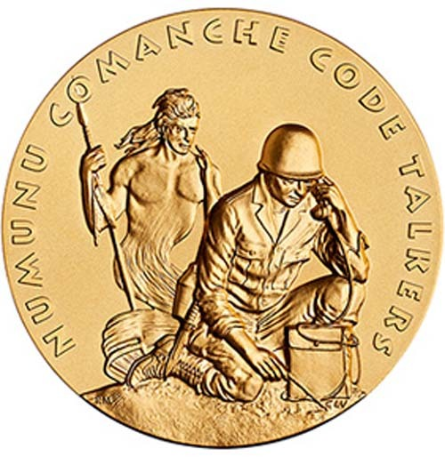  
2차대전에 참전했던 코만치족 암호해독병 기념메달

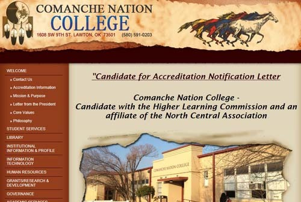  
코만치 민족대학 홈페이지

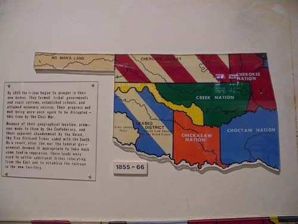  
1855~1866 오클라호마 주 인디언 분포도

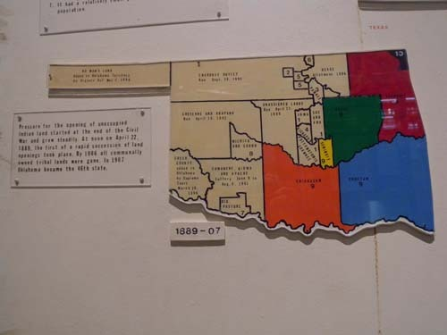  
1889~1907년 오클라호마 주 인디언 분포도

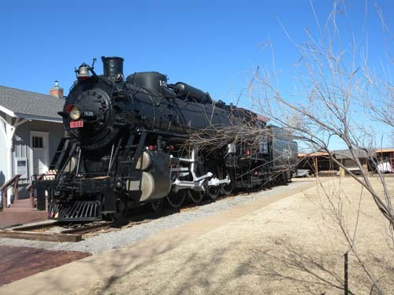  
대평원 박물관 곁의 통합운송박물관 뜰에 전시된 Rock Island 노선의 마지막 기관차

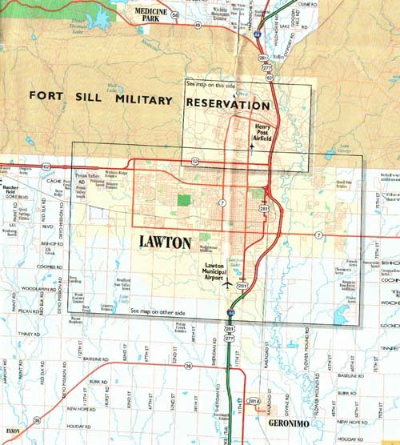  
로턴 시가지 지도

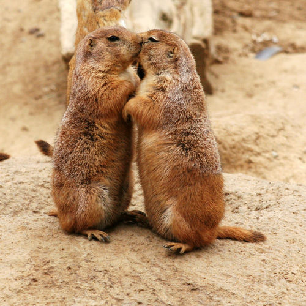  
대평원 박물관 앞 공원에서 만난 한 쌍의 프레어리 독(Pairie Dog)

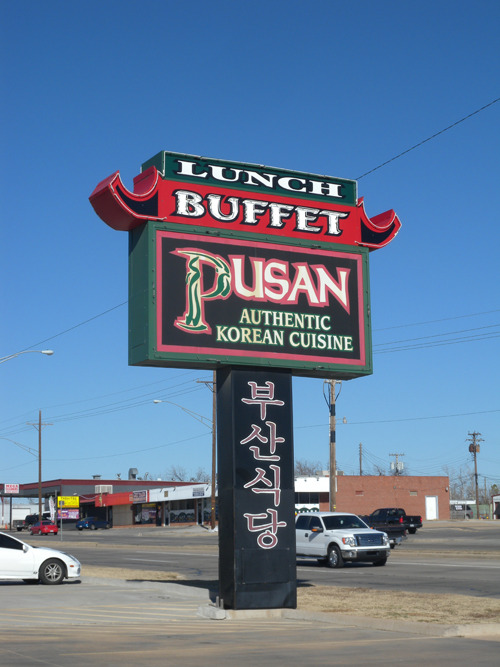  
로턴에서 만난 한국음식점 '부산식당'. 맛있는 한 끼의 점심을 즐겼음.

공유하기

게시글 관리

**백규서옥\_Blog ver.**